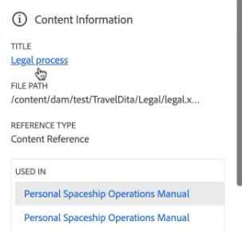
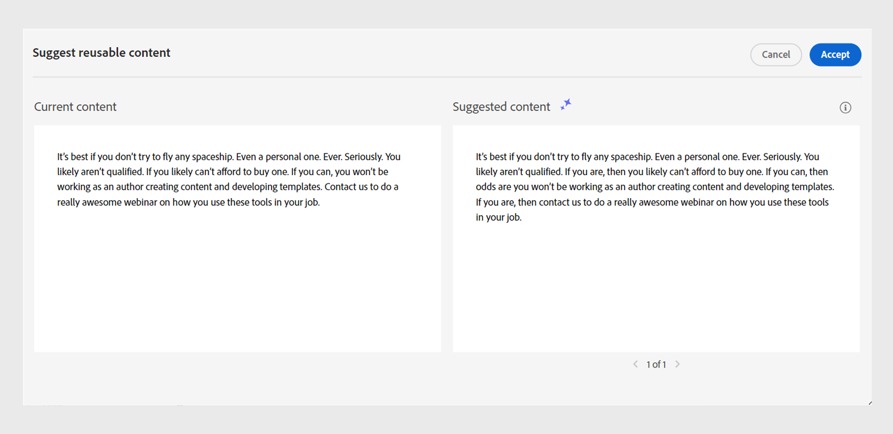

# AIを活用したスマートな提案によりコンテンツを作成

Experience Manager Guidesには、一貫性のある正確なコンテンツを作成するのに役立つスマートな提案が用意されています。

コンテンツの作成中に、AI アシスタント ツールの&#x200B;**再利用可能なコンテンツを提案**&#x200B;機能を使用すると、AIを使用して検索し、コンテンツとセマンティックに類似した既存のコンテンツを表示できます。 次に、現在のトピックに含める最適なマッチングコンテンツを参照として選択できます。

これにより、ドキュメントリポジトリの既存のコンテンツを再利用し、一貫性のあるコンテンツを作成できます。 例えば、**Adobe**&#x200B;に関する情報と&#x200B;**Adobe Firefly**&#x200B;に関する段落を含む文書を作成するとします。 その場合、同じ段落を含む&#x200B;**Adobe Photoshop**&#x200B;のように、別のトピックからコンテンツ参照をすばやく表示して追加できます。
>[!NOTE]
>
> [ グローバルまたはフォルダーレベルのプロファイル ](/help/product-guide/cs-install-guide/conf-folder-level.md#conf-ai-smart-suggestions)で、管理者は、スマート提案のインデックスを作成するファイルまたはフォルダー、提案を表示するために入力する必要がある最小文字数、およびリストで表示できる提案の最大数を定義する必要があります。

次の手順を実行して、トピックに適切なコンテンツ参照を追加するためのスマート提案を表示します。

1. トピック内のコンテンツを選択して、関連する提案を表示します。 コンテンツの文字長が、コンテンツの候補を表示するために管理者がフォルダープロファイルで設定した文字長を超えていることを確認します。
1. AI アシスタントパネルから、**再利用可能なコンテンツの提案** を選択します。

1. タグを選択して、現在のタグのオーサリング候補を表示します。  インデックス付きファイルからコンテンツ参照を表示および追加するための提案は、現在のタグ内のコンテンツに基づいて表示されます。 複数のタグを選択することもできます。

1. すべてのタグを選択して、ドキュメント全体に含まれるコンテンツに基づいた提案を表示します。  **再利用可能なコンテンツを提案** が、適切な一致が見つかったコンテンツの横に表示されます。

   >[!NOTE]
   >
   > 現在のビューポート（画面に表示されるコンテンツ）の候補のみを表示できます。 ドキュメント内の他のコンテンツの提案を表示するには、上または下にスクロールしてビューポートに表示し、**再利用可能なコンテンツを提案** を提案を選択します。

1. スマート提案は、提案パネルで表示できます。  Experience Manager Guidesは、コンテキストが似ているか、同じ意味を持つ提案コンテンツを提供します。 例えば、「リリースバージョン 2023.03.12」のように、正確なバージョン番号を含むトピックを検索できます。 また、「Adobeはカリフォルニア州サンノゼに本社を置いています」と検索し、「サンノゼにはAdobeのような多くのソフトウェア企業の四半期があります」と同様のコンテンツを検索することもできます。
1. **コンテンツ情報** を選択して、詳細を表示します。

   {width="300" align="left"}

   *コンテンツ参照に関する詳細情報を表示します。*

   1. コンテンツ参照を含むトピックのタイトルがハイパーリンクとして表示されます。
   1. コンテンツ参照を含むファイルのパス。
   1. コンテンツが参照される参照のタイプ。
   1. トピックが参照されるDITA ファイルの名前は、ハイパーリンクとして表示されます。
1. 現在のコンテンツと提案されたコンテンツを比較するには、**プレビュー** を選択します。 これにより、相違点を比較し、提案されたコンテンツのコンテンツ参照を追加して、現在のコンテンツを維持または一貫性を保つかどうかを判断できます。

   

   *現在のコンテンツと提案されたコンテンツの比較をプレビューします。*

1. **同意**&#x200B;をクリックして、**再利用可能なコンテンツを提案** プレビューで提案されたコンテンツ参照を追加します。
1. 適切な推奨事項を表示するには、提案パネルで「**同意**」または「**却下**」を選択することもできます。

このインテリジェントな機能は利便性が高く、手作業によるコンテンツ検索の労力を最小限に抑えることができるため、新しいコンテンツの制作に専念できます。 また、チームの共同作業を促進し、さまざまな制作者が作成したコンテンツの一貫性を維持するのに役立ちます。

>[!NOTE]
>
>スマートな提案で現在のセッションを超えるデータを保持することはありません。 回答の場合、スマート提案は、内部データベース内のコンテンツで作成されたインデックスのみに依存します。 外部のAI ツールは使用されないため、データがシステム内に残ります。
