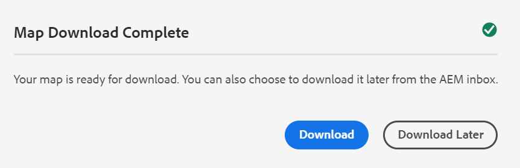

# ファイルをダウンロード {#id216MC0H0BE8}

DITAおよびDITA以外のファイルを含むアセットをダウンロードできます。 アセットをダウンロードする方法は複数あり、一部の方法はAEMがネイティブで、その他の方法はAEM Guidesでサポートされています。 ネイティブのAEM アセットのダウンロードについて詳しくは、AEM ドキュメントの「[Adobe Experience Managerからアセットをダウンロードする](https://experienceleague.adobe.com/docs/experience-manager-cloud-service/assets/manage/download-assets-from-aem.html)」を参照してください。 次の節では、AEM GuidesのDITA マップコンソールを使用してファイルをダウンロードする仕組みについて説明します。

## DITA マップファイルの書き出し

DITA マップファイルをAEM リポジトリに保存したら、そのマップファイルを依存関係とともにダウンロードできます。 これにより、オフライン編集、検証、レビュー、またはバックアップの作成のために完全なマップファイルを柔軟に共有できます。

DITA マップファイルとその依存ファイルをダウンロードするには、次の手順を実行します。

1. Assets UIで、ダウンロードするDITA マップに移動します。

1. DITA マップをクリックして、DITA マップコンソールで開きます。

1. 「**トピック**」タブを選択して、DITA マップで使用可能なトピックのリストを表示します。

1. メインツールバーで、**マップをダウンロード**&#x200B;をクリックします。

   マップをダウンロード ダイアログが表示されます。

   {width="300"}

1. 「**ダウンロード**」をクリックします。 マップをダウンロード ダイアログで、次のオプションを選択できます。

   - **ベースラインを使用**: DITA マップ用に作成されたベースラインのリストを取得するには、このオプションを選択します。 特定のベースラインに基づいてマップファイルとその内容をダウンロードする場合は、ドロップダウンリストから「ベースライン」を選択します。 ベースラインの操作について詳しくは、[ ベースラインの操作](generate-output-use-baseline-for-publishing.md#)を参照してください。
   - **ファイル階層を統合**：参照されているすべてのトピックとメディアファイルを1つのフォルダーに保存するには、このオプションを選択します。
   >[!NOTE]
   >
   > オプションを選択せずにマップファイルをダウンロードすることもできます。 この場合、参照されたトピックとメディアファイルの最後の永続バージョンがダウンロードされます。

1. 「**ダウンロード**」ボタンをクリックすると、マップのダウンロードリクエストがキューに入れられます。 マップをダウンロードする準備ができたら、次の通知が届きます。

   {width="550"}

   - 「**ダウンロード**」をクリックして、マップファイルを.zip形式でダウンロードします。

   - 後でマップファイルをダウンロードするには、**後でダウンロード**&#x200B;をクリックします。 ダウンロードリンクには、AEM通知の受信トレイからアクセスできます。 インボックスで生成されたマップ通知をクリックして、マップを.zip形式でダウンロードします。

   >[!NOTE]
   >
   > デフォルトでは、ダウンロードされたマップはAEM通知インボックスに5日間残ります。

{width="300"}

マップをダウンロードしたら、マップを選択し、上部の「開く」アイコンを使用して、選択したレポートを開くことができます。

**親トピック：**[ コンテンツの管理](authoring.md)
