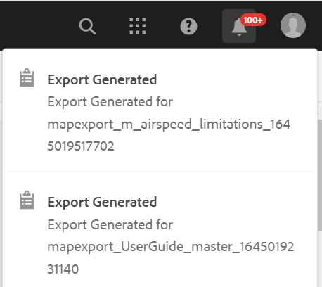

# ファイルをダウンロード {#id216MC0H0BE8}

DITA ファイルと非 DITA ファイルを含むアセットをダウンロードできます。 アセットをダウンロードする方法は複数あります。AEMにネイティブな方法もあれば、AEM Guidesでサポートされている方法もあります。 AEMのネイティブアセットのダウンロード情報については、AEM ドキュメントの [Adobe Experience Managerからのアセットのダウンロード &#x200B;](https://experienceleague.adobe.com/docs/experience-manager-cloud-service/assets/manage/download-assets-from-aem.html?lang=ja) を参照してください。 次の節では、AEM Guidesで DITA マップコンソールを使用してファイルをダウンロードする仕組みについて説明します。

## DITA マップファイルのエクスポート

DITA マップファイルをAEM リポジトリに格納したら、マップファイルとその依存ファイルをダウンロードできます。 これにより、オフラインでの編集、検証、レビュー、または単にバックアップを作成するために、完全なマップ ファイルを柔軟に共有できます。

次の手順を実行して、DITA マップファイルとその依存ファイルをダウンロードします。

1. Assets UI で、ダウンロードする DITA マップに移動します。

1. DITA マップをクリックして、DITA マップコンソールで開きます。

1. 「**トピック**」タブを選択して、DITA マップで使用可能なトピックのリストを表示します。

1. メインツールバーで、「**マップをダウンロード**」をクリックします。

   マップをダウンロード ダイアログが表示されます。

   {width="300" align="left"}

1. 「**ダウンロード**」をクリックします。マップをダウンロード ダイアログでは、次のオプションを選択できます。

   - **ベースラインを使用**:DITA マップ用に作成されたベースラインのリストを取得するには、このオプションを選択します。 特定のベースラインに基づいてマップ・ファイルとそのコンテンツをダウンロードする場合は、ドロップダウン・リストから「ベースライン」を選択します。 ベースラインの操作の詳細については、「[&#x200B; ベースラインの操作 &#x200B;](generate-output-use-baseline-for-publishing.md#)」を参照してください。
   - **ファイル階層を統合**：参照されるすべてのトピックおよびメディアファイルを 1 つのフォルダーに保存するには、このオプションを選択します。

   >[!NOTE]
   >
   > オプションを選択せずにマップ ファイルをダウンロードすることもできます。 その場合、参照されるトピックおよびメディア ファイルの最後の永続バージョンがダウンロードされます。

1. 「**ダウンロード**」ボタンをクリックすると、マップダウンロードリクエストはキューに入れられます。 マップをダウンロードする準備が整うと、次の通知が届きます。

   {width="550" align="left"}

   - **ダウンロード** をクリックして、マップファイルを.zip 形式でダウンロードします。

   - 後でマップ ファイルをダウンロードするには、[**後でダウンロード**] をクリックします。 ダウンロードリンクには、AEM通知インボックスからアクセスできます。 インボックスで生成されたマップ通知をクリックして、.zip 形式でマップをダウンロードします。

   >[!NOTE]
   >
   > デフォルトでは、ダウンロードされたマップはAEMの通知インボックスに 5 日間残ります。

{width="300" align="left"}

マップがダウンロードされたら、マップを選択し、上部の「開く」アイコンを使用して、選択したレポートを開くことができます。

**親トピック：**&#x200B;[&#x200B; コンテンツの管理 &#x200B;](authoring.md)
