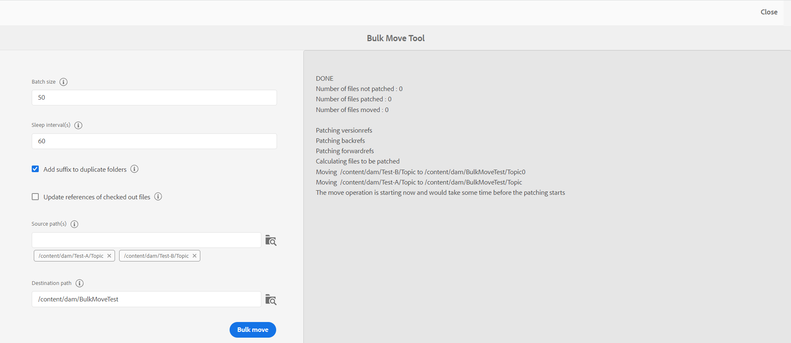
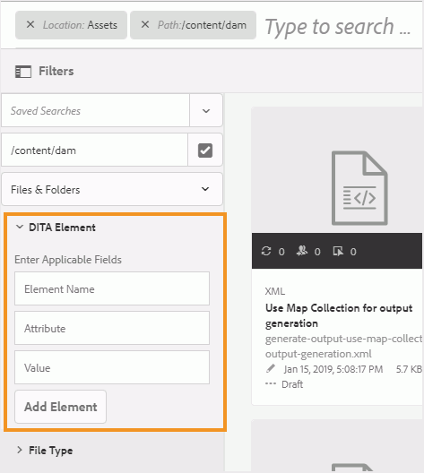
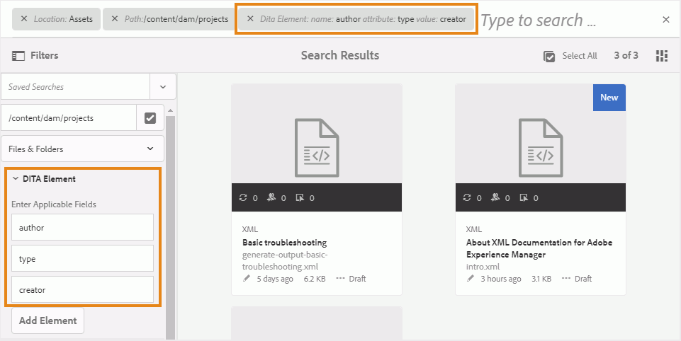

# ファイルとフォルダーの管理 {#id2116G0L08XA}

この節では、AEM Guidesでファイルのコピー、貼り付け、ドラッグ&amp;ドロップ、削除などの基本的なファイル操作を処理する方法について説明します。 次のシナリオが可能です。

## ファイルのコピーとペースト

**ファイルに人間が読み取れるファイル名がある場合**

- *同じ名前のファイルが保存先フォルダー*&#x200B;に存在しない場合：ファイルの新しいコピーが作成され、UUIDも割り当てられます。 ここでは、ファイル名は元のファイル名と同じです。
- *同じ名前のファイルが宛先フォルダー*&#x200B;に既に存在する場合：ファイルの新しいコピーがサフィックス \（filename0.extension\）を付けて作成されます。 新しく作成したファイルにもUUIDが割り当てられます。

**ファイル名がUUID パターンに基づいている場合**

- *同じ名前のファイルが保存先フォルダー*&#x200B;に存在しない場合：ファイルの新しいコピーが作成され、新しいUUIDも新しい場所に割り当てられます。 ここでは、ファイル名はUUIDと同じです。
- *同じ名前のファイルが宛先フォルダー*&#x200B;に既に存在する場合：ファイルの新しいコピーが作成され、新しいUUIDも割り当てられます。 ファイル名はUUIDと同じです。

## フォルダーのコピーとペースト

**同じ場所にフォルダーをコピーして貼り付ける**

- *フォルダーには、人間が読み取り可能なファイル名を持つファイルがあります*: フォルダーの新しいコピーが、接尾辞\（foldername0\）を付けて作成されます。 新しいUUIDは、フォルダー内のファイルにも割り当てられます。 ただし、ファイル名に変更はありません。

- *フォルダーには、UUID パターン*&#x200B;に基づくファイル名が付いたファイルがあります。フォルダーの新しいコピーは、接尾辞\（foldername0\）を付けて作成されます。 新しいUUIDは、新しいフォルダー内のすべてのファイルにも割り当てられます。 ファイル名も変更されます。ファイル名は新しいUUIDと同じです。

**Copy and paste folder at different location**

- *The folder has files with human readable filenames*: A new copy of the folder is created and a new UUID is also assigned to all files within the folder at the new location. Here, there is no change in the folder or file names.

- *The folder has files with filenames based on a UUID pattern*: A new copy of the folder is created with the same name as the original folder. 新しいUUIDは、新しいフォルダー内のすべてのファイルにも割り当てられます。 ファイル名も変更されます。ファイル名は新しいUUIDと同じです。

## Drag-and-drop files

**Drag-and-drop with human readable filenames**

- *Drag-and-drop at the same location*: You are given the options to **Overwrite Existing File\(s\)**, **Keep Both File\(s\)**, and an option to create a version of the existing working copy.

  {width="650" align="center"}

  If you choose the **Overwrite Existing File\(s\)** option, then the file that is being uploaded replaces the current working version of the existing file at the original location. The UUID is not created or changed.

  If you choose the **Keep Both File\(s\)** option, a new copy of the file is created with a suffix \(like filename0.extension\). A new UUID is also assigned to the newly copied file.

  With Overwrite existing file\(s\) option, if you choose the option to create a version from the existing working copy, then a new version from the working copy of the document is also created.

  >[!NOTE]
  >
  > **Create new Version for Uploaded File** feature must be enabled by your administrator. If this feature is enabled, a new version for the uploaded file is created. If the option is deselected, then a version of the uploaded file is not created. For more details, see *Create New Version for Uploaded File* section in the Install and configure Adobe Experience Manager Guides as a Cloud Service.

  If a file is already checked out for edits by another user, and you attempt to upload and overwrite the existing file, then it fails and displays an error.

  >[!NOTE]
  >
  >The **Overwrite Checked out File on Upload** feature must be disabled by your administrator. If this feature is enabled, you can overwrite checked-out files. If the feature is not enabled, then a checked out file is prevented from being overwritten. For more details, see *Overwrite Checked out File on Upload* section in the Install and configure Adobe Experience Manager Guides as a Cloud Service.

- *Drag-and-drop files at different location*: A new copy of the file is created and a new UUID is also assigned to it at the new location. ここでは、ファイル名は元のファイル名と同じです。

**UUID パターンに基づくファイル名をドラッグ&amp;ドロップ**

*同じ場所にファイルをドラッグ&amp;ドロップ*：既存の作業コピーのバージョンを作成するオプションと共に、**既存のファイルを上書き**&#x200B;するオプションが与えられます。

{width="650" align="center"}

ファイルが上書きされた場合、ファイル名またはそのUUIDに変更はありません。

「既存の作業コピー&#x200B;**のバージョンを作成」オプションを選択すると、ドキュメントの作業コピーから新しいバージョンが作成され、新しいファイルがアップロードされ、ファイルの新しいバージョンも作成され、ドキュメントの作業コピーとして作成されます。**

**アップロードされたファイルの新しいバージョンを作成**&#x200B;機能は、管理者が有効にする必要があります。 この機能が有効になっている場合は、アップロードしたファイルの新しいバージョンが作成されます。 オプションの選択を解除すると、アップロードしたファイルのバージョンは作成されません。 詳しくは、「Adobe Experience Manager Guides as a Cloud Serviceのインストールと設定」の「*アップロード済みファイルの新しいバージョンの作成*」セクションを参照してください。

*別の場所にあるファイルをドラッグ&amp;ドロップ*：既存のファイルを&#x200B;**上書き**、**ファイルを新しい場所**&#x200B;に移動するオプションと、既存の作業コピーのバージョンを作成するオプションが与えられます。

{width="650" align="center"}

「**既存のファイルを上書き**」オプションを選択すると、アップロード中のファイルが元の場所の既存のファイルに置き換わります。 UUIDが作成または変更されていません。

「**ファイルを新しい場所**&#x200B;に移動」オプションを選択した場合、既存のファイルは現在の場所に移動され、アップロードされたファイルで上書きされます。 ファイルを新しい場所に移動しても、ファイルとの間の既存の参照が壊れることはありません。

ファイルを置換または移動する場合、既存のコピーからバージョンを作成するオプションを選択すると、ドキュメントの作業コピーから新しいバージョンが作成されます。新しいファイルは、既存の場所で置換されるか、新しい場所に移動されます。

## ファイルを一括移動 {#move-files-bulk}

AEM Guidesには一括移動ツールが付属しており、管理者は多数のファイルを持つフォルダーを別の場所に移動できます。 このツールを使用すると、1つまたは複数のフォルダー内のファイルを、AEM リポジトリー内の別のフォルダーに簡単に移動できます。 このツールの主な機能の1つは、多数のファイルを移動するだけでなく、移動するファイルとの間の参照を維持することです。 オーサリングタスクと公開タスクを妨げることなく、一括で移動できるファイルの数を調整できます。

>[!NOTE]
>
> 一括移動ツールは、フォルダーレベルでのみ機能します。 個々のトピックファイルまたはマップファイルを移動する場合は、AEMのAssets UIから通常の移動ツールを使用します。

一括移動ツールの機能の一部を以下に示します。

- 各バッチで処理するファイルの数を調整できます。 そのためには、システムが容易に処理できる最適な数値に達する前に、いくつかのテストを実施する必要がある場合があります。
- オーサリングサービスと公開サービスは、移動操作を中断することなくスムーズに実行できます。
- 後続の\（実行の\）バッチプロセス間の時間間隔を完全に制御できます。 この時間間隔は、次のファイルのバッチを開始する前に、後処理操作が完了することを保証します。

- 同じ名前のフォルダーの自動処理。 この機能により、同じ名前のフォルダーが移動されていても、それらのフォルダーが上書きされなくなります。

- 移動するファイルとの間の参照を自動処理します。

バッチプロセスを実行する前に、次の点を考慮する必要があります。

- 現在レビュー中のトピックを移動する場合は、移動する前にそのすべてのトピックのレビュープロセスを終了する必要があります。 レビュータスクを閉じないと、レビュープロセスが壊れます。
- You must run only a single bulk move operation on the system at any time. これにより、移動するトピックとの間の参照を適切に処理できます。

ファイルを一括で移動するには、次の手順を実行します。

1. 上部のAdobe Experience Manager リンクをクリックし、**ツール**&#x200B;を選択します。
1. ツールのリストから「**ガイド**」を選択します。
1. **一括移動ツール** タイルをクリックします。
1. 一括移動ツール ページは、設定に基づいて表示されます。 **一括移動ツール** ページに次の詳細を入力します。

   

   
 クラウドサービスとオンプレミス UUID ベースのファイルシステム 

   {width="650" align="center"}

   >[!TIP]
   >
   > 選択    その詳細を確認できます。

   - **重複フォルダーにサフィックスを追加**：同じ名前のフォルダーを移動する場合は、このオプションを選択する必要があります。 例えば、前のスクリーンショットでは、**Source path**&#x200B;に移動するフォルダーの名前が含まれています。 topicという名前のフォルダーは、test-Aとtest-Bの2つの異なる場所に存在します。このオプションを選択すると、フォルダーが正常に移動します。 最初に移動されたフォルダーにはtopicという名前が付けられ、2番目のフォルダーにはtopic0という名前が付けられます。 移動操作では、同じ名前のフォルダーに連続した系列\（0、1、2など\）の接尾辞が追加されます。

     このオプションを選択せずに同じ名前のフォルダーを移動する場合、操作はメッセージで中止されます。

   - **Source path\（s\）**：移動するフォルダーの場所を指定します。

      - Select  **Browse Folder**      to open the browse file dialog. Select the folders you want to move and click **Select** to complete the process.

      - You can also type or copy and paste the source location. Press Enter to add the folder to the list.

        The selected folders are listed along with their path. Hover over the folder tag to view the complete path.
      - You can also remove any folder by clicking **Remove**  near the folder.

   - **Destination path**: Specify the location where you want to move the source folders.

      - Select  **Browse Folder**  to open the browse file dialog. Select the location where you want to move the source folders. and click Select to complete the process.
      - You can also type or copy and paste the destination path.

     The selected folder is displayed along with its path in the text box.

   - Click **Bulk move**.

     The system starts moving files from the source to destination location. Once the process completes, a summary of the move process is shown at the right of the page.

     {width="650" align="center"}

   

   

   
 On-premise non-UUID-based file system 

   {width="650" align="center"}

   >[!TIP]
   >
   > 選択    near any field  to view more details about it.

   - **Batch size**: Specify the number of files to move in a single batch. The default values if 50 files.
   - **Sleep interval (seconds)**: Specify the time in seconds that the process will wait before starting the next batch. During this sleep time interval, the system fixes the references to and from the moved files. デフォルトのスリープ間隔は60秒です。

   - **重複フォルダーにサフィックスを追加**：同じ名前のフォルダーを移動する場合は、このオプションを選択する必要があります。 例えば、前のスクリーンショットでは、**Source Path**&#x200B;に移動するフォルダーの名前が含まれています。 topicという名前のフォルダーは、test-Aとtest-Bの2つの異なる場所に存在します。このオプションを選択すると、フォルダーが正常に移動します。 最初に移動されたフォルダーにはtopicという名前が付けられ、2番目のフォルダーにはtopic0という名前が付けられます。 移動操作では、同じ名前のフォルダーに連続した系列\（0、1、2など\）の接尾辞が追加されます。

     このオプションを選択せずに同じ名前のフォルダーを移動する場合、操作はメッセージで中止されます。

   - **チェックアウト済みファイルの参照を更新**：チェックアウト済みファイルを含むフォルダーを移動する場合は、このオプションを選択することをお勧めします。 このオプションを選択すると、チェックアウトされたすべてのファイルが保存され、新しいリビジョンでチェックインされます。 次に、この新しいリビジョンを移動先の場所に移動します。

     このオプションを選択しない場合、チェックアウトされたファイルは、同じチェックアウト済みステータスで宛先フォルダーに移動されます。 しかし、この移行プロセスではデータが失われる可能性があります。

   - **Source path\（s\）**：移動するフォルダーの場所を指定します。

      - **フォルダーを参照**&#x200B;を選択      ファイルを参照ダイアログを開きます。 移動するフォルダーを選択し、**選択**&#x200B;をクリックしてプロセスを完了します。

      - ソースの場所を入力またはコピーして貼り付けることもできます。 Enter キーを押して、フォルダーをリストに追加します。

        選択したフォルダーがパスと共に一覧表示されます。 フォルダタグにカーソルを合わせると、パス全体が表示されます。
      - **削除**&#x200B;をクリックして、任意のフォルダーを削除することもできます フォルダーの近くの。

   - **宛先パス**：ソースフォルダーを移動する場所を指定します。

      - **フォルダーを参照**&#x200B;を選択 でファイルを参照ダイアログを開きます。 ソースフォルダーを移動する場所を選択します。 「選択」をクリックしてプロセスを完了します。
      - また、コピー先のパスを入力またはコピーして貼り付けることもできます。

        選択したフォルダーが、テキストボックスにパスとともに表示されます。

   - **一括移動**&#x200B;をクリックします。

     システムは、ソースから宛先の場所へのファイルの移動を開始します。 プロセスが完了すると、移動プロセスの概要がページの右側に表示されます。
     {width="650" align="center"}

## DITA コンテンツの検索

デフォルトでは、AEMはDITA コンテンツを認識しないため、リポジトリ内のDITA コンテンツを検索する仕組みは提供されません。 AEM Guidesでは、AEMの上にレイヤーが追加され、AEMでDITA コンテンツを理解および処理できるようになります。 AEM GuidesのDITA コンテンツ検索機能を使用すると、AEM リポジトリ内でDITA コンテンツを検索できます。

>[!NOTE]
>
>システム管理者は&#x200B;**DITA Element**&#x200B;検索コンポーネントを設定し、AEM Assets UIからこの機能を使用できます。 詳しくは、「*Adobe Experience Manager Guides UIにDITA Element検索コンポーネントを追加する*」の「Assets as a Cloud Serviceをインストールして設定する」セクションを参照してください。

検索機能を使用すると、次のことが可能になります。

- エレメント値に基づいてDITA コンテンツを検索します。例：`author`= xml
- 属性値に基づいてDITA コンテンツを検索します。例：`@platform`= windows
- DITA要素と属性値を組み合わせて使用します。例：`author`= xml `AND` `@platform`= windows

AEM リポジトリ内でDITA コンテンツを検索するには、次の手順を実行します。

1. Assets UIを開きます。

1. 左側のパネルで、「**フィルター**」を選択します。

   {width="450" align="center"}

   コンテンツフィルタリングオプションは、左側のパネルに表示されます。 また、フィルタリングオプション（DITA コンテンツのフィルタリングに使用されるDITA エレメント）もあります。

   {width="450" align="center"}

1. *\（Optional\）* 「**検索ディレクトリを選択**」フィールドで、検索する場所を参照します。

1. **DITA要素** フィルターで、**要素名**、**属性**、および検索する値を指定します。 例えば、`@type`作成者の`author`要素を持つドキュメントを検索するには、次のスクリーンショットに示すように、情報を提供する必要があります。

   {width="650" align="center"}

   **DITA要素** フィルターに入力された検索条件は、検索バーの上部に表示されます。 検索条件に一致するファイルは、**検索結果**&#x200B;領域に表示されます。

   検索条件を指定する際には、次の点を考慮してください。

   - 正確なフレーズを検索するには、引用符`"` フレーズ検索`"`内の「値」フィールドにフレーズを入力します。
   - DITA エレメントの検索条件は、最大3つまで追加できます。
   - 複数の検索条件を指定した場合は、そのすべてがAND ロジックを使用して組み合わされます。
   - 検索条件にワイルドカード文字を使用することはできません。 例えば、Windowsの値を持つplatform \（attribute\）を検索する場合、\*formまたはWindows?sを指定することはできません。

**検索時のチェックアウト状態フィルター**

DITA エレメントフィルターに加えて、AEM Guidesでは、チェックアウトステータスに基づいてコンテンツを検索することもできます。 これは、現在チェックアウトされているファイルをすばやく除外し、再びチェックインする場合に便利です。

チェックアウトステータスに基づいてファイルを検索するには、次の手順を実行します。

1. Assets UIを開きます。

1. 左側のパネルで「**フィルター**」をクリックします。
1. 検索バーに検索キーワードを入力します。
1. 左側のパネルから必要なフィルターを適用します。

   例えば、**チェックアウトステータス** フィルターを適用して、チェックアウト済みまたはチェックイン済みのトピックを表示できます。 チェックアウト別リストからユーザーまたはグループを選択して、このリストをさらに絞り込むことができます。

   検索結果が表示されます。

## ファイルの削除

AEM リポジトリからのファイルの削除は、システム管理者が制御する制限付き機能です。 設定に基づいて、次のような場合にファイルの削除を制限することができます。

- チェックアウト
- 受信または送信の参照がある

また、ファイルを削除する権限を持つ特定のユーザーグループに属している場合にのみ、ファイルを削除することもできます。

>[!NOTE]
>
> For more details on the configurations on file management, see *Prevent deletion of checked out files* and *Prevent deletion of referenced files* sections in the Install and configure Adobe Experience Manager Guides as a Cloud Service.

If your administrator has given the file delete permission to all user, then the following message is displayed when you delete files containing references:

{width="650" align="center"}

In this scenario, you can forcefully delete files without removing the incoming or outgoing references from the files.

If the delete permissions are given to a specific user group, then also the above message will appear for users belonging to that group. However, for other users, the following message is displayed:

{width="650" align="center"}

In this scenario, users won&#39;t be allowed to delete files until all incoming and outgoing references have been removed.

## Work with media files

Media files like images and videos are an integral part of your content. While you upload and manage your content, you might also work with media files.

If your media file has undergone any changes, you can find and preview the files in the **Version History**.To find out changes in the different versions of a media file:

1. Access the file in **Assets UI**.
1. Select the file for which you want to view the version history.
1. In the left rail, click **Version History** and select a version.
1. You can also see the thumbnails of the different versions under Version History.

   {width="800" align="center"}

1. From the listed versions, select the one that you want to use as the base version and click **Preview Version**. The preview of the selected version is shown in the Version Preview window.

   {width="650" align="center"}

**Parent topic:**[ Manage content](authoring.md)
