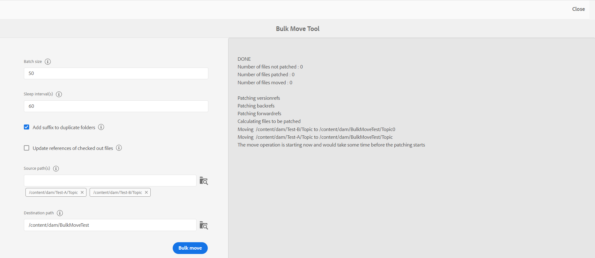
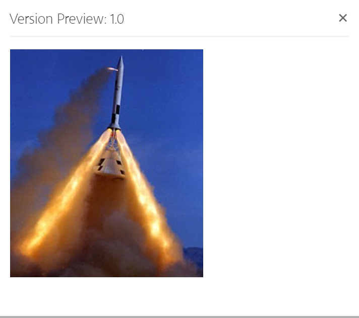

# ファイルとフォルダーの管理 {#id2116G0L08XA}

ここでは、ファイルのコピー、貼り付け、ドラッグ&amp;ドロップ、削除などの基本的なファイル操作をAEM Guidesがどのように処理するかについて説明します。 次のシナリオが考えられます。

## ファイルをコピー&amp;ペースト

**ファイル名が人間が判読できる場合**

- *宛先フォルダーに同じ名前のファイルが存在しない場合*：ファイルの新しいコピーが作成され、UUID も割り当てられます。 ここで、ファイル名は元のファイル名と同じです。
- *宛先フォルダーに同じ名前のファイルが既に存在する場合*：サフィックス \（filename0.extension\など）が付いた新しいファイルコピーが作成されます。 また、新しく作成したファイルには UUID も割り当てられます。

**ファイル名が UUID パターンに基づいている場合**

- *宛先フォルダーに同じ名前のファイルが存在しない場合*：ファイルの新しいコピーが作成され、新しい場所に新しい UUID も割り当てられます。 ここで、ファイル名は UUID と同じです。
- *同じ名前のファイルが既に保存先フォルダーに存在する場合*：ファイルの新しいコピーが作成され、新しい UUID も割り当てられます。 ファイル名は UUID と同じです。

## フォルダーのコピー&amp;ペースト

**フォルダーを同じ場所にコピー&amp;ペースト**

- *フォルダーには、人間が判読できるファイル名のファイルが含まれています*：フォルダーの新しいコピーは、サフィックス \（foldername0\など）で作成されます。 また、新しい UUID がフォルダー内のファイルに割り当てられます。 ただし、ファイル名は変更されません。

- *フォルダーには、UUID パターンに基づいたファイル名を持つファイルが含まれています*：フォルダーの新しいコピーは、サフィックス \（foldername0\など）で作成されます。 また、新しいフォルダー内のすべてのファイルに新しい UUID が割り当てられます。 ファイル名も変更されます。ファイル名は新しい UUID と同じです。

**フォルダーを別の場所にコピー&amp;ペースト**

- *フォルダーには、人間が判読できるファイル名のファイルが含まれています*：フォルダーの新しいコピーが作成され、新しい UUID も新しい場所にあるフォルダー内のすべてのファイルに割り当てられます。 ここでは、フォルダー名やファイル名は変更されません。

- *フォルダーには、UUID パターンに基づいたファイル名を持つファイルがあります*：フォルダーの新しいコピーが、元のフォルダーと同じ名前で作成されます。 また、新しいフォルダー内のすべてのファイルに新しい UUID が割り当てられます。 ファイル名も変更されます。ファイル名は新しい UUID と同じです。

## ファイルのドラッグ&amp;ドロップ

**人間が読み取れるファイル名を使用したドラッグ&amp;ドロップ**

- *同じ場所にドラッグ&amp;ドロップ*:**既存のファイルを上書き\（s\）**、**両方のファイルを保持\（s\）** のオプションと、既存の作業コピーのバージョンを作成するオプションが提供されます。

  {width="650" align="center"}

  「**既存のファイルを上書き\（s\）**」オプションを選択した場合、元の場所にある既存のファイルの現在の作業バージョンが、アップロードされるファイルに置き換えられます。 UUID は作成も変更もされません。

  「**両方のファイルを保持\（s\）**」オプションを選択した場合、ファイルの新しいコピーは接尾辞\（filename0.extension\など）で作成されます。 新しくコピーしたファイルには、新しい UUID も割り当てられます。

  「既存のファイルを上書き」（Overwrite existing file\（s\）） オプションを使用して、既存の作業コピーからバージョンを作成するオプションを選択した場合、ドキュメントの作業コピーから新しいバージョンも作成されます。

  >[!NOTE]
  >
  > **アップロードしたファイルの新しいバージョンを作成** 機能は、管理者が有効にする必要があります。 この機能が有効な場合、アップロードされたファイルの新しいバージョンが作成されます。 このオプションの選択が解除されている場合、アップロードされたファイルのバージョンは作成されません。 詳しくは、「Adobe Experience Manager Guides as a Cloud Serviceのインストールと設定」の *アップロードされたファイルの新しいバージョンを作成* 節を参照してください。

  ファイルが別のユーザーによって編集のために既にチェックアウトされていて、既存のファイルをアップロードして上書きしようとすると、失敗してエラーが表示されます。

  >[!NOTE]
  >
  >**アップロード時にチェックアウトしたファイルを上書き** 機能は、管理者が無効にする必要があります。 この機能を有効にすると、チェックアウトされたファイルを上書きできます。 この機能が有効になっていない場合、チェックアウトされたファイルは上書きされません。 詳しくは、『Adobe Experience Manager Guides as a Cloud Serviceのインストールと設定 *の「アップロード時にチェックアウトされたファイルを上書き* 節を参照してください。

- *ファイルを別の場所にドラッグ&amp;ドロップ*：ファイルの新しいコピーが作成され、新しい場所に新しい UUID も割り当てられます。 ここで、ファイル名は元のファイル名と同じです。

**UUID パターンに基づいたファイル名でドラッグ&amp;ドロップ**

*ファイルを同じ場所にドラッグ&amp;ドロップ*:**既存のファイルを上書き\（s\）** するオプションと、既存の作業コピーのバージョンを作成するオプションが表示されます。

{width="650" align="center"}

ファイルを上書きしても、ファイル名や UUID は変更されません。

「**既存の作業用コピーのバージョンを作成**」オプションを選択すると、ドキュメントの作業用コピーから新しいバージョンが作成されます。新しいファイルがアップロードされると、ファイルの新しいバージョンも作成され、ドキュメントの作業用コピーとして作成されます。

**アップロードしたファイルの新しいバージョンを作成** 機能は、管理者が有効にする必要があります。 この機能が有効な場合、アップロードされたファイルの新しいバージョンが作成されます。 このオプションの選択が解除されている場合、アップロードされたファイルのバージョンは作成されません。 詳しくは、「Adobe Experience Manager Guides as a Cloud Serviceのインストールと設定」の *アップロードされたファイルの新しいバージョンを作成* 節を参照してください。

*ファイルを別の場所にドラッグ&amp;ドロップ*:**既存のファイル\（s\）を上書き**、**ファイル\（s\）を新しい場所に移動** するオプションと、既存の作業コピーのバージョンを作成するオプションが提供されます。

{width="650" align="center"}

「**既存のファイルを上書き\（s\）**」オプションを選択した場合、アップロードされるファイルは元の場所にある既存のファイルを置き換えます。 UUID は作成も変更もされません。

「**ファイルを新しい場所に移動**」オプションを選択すると、既存のファイルは現在の場所に移動され、アップロード中のファイルで上書きされます。 新しい場所にファイルを移動しても、ファイルの既存の参照は失われません。

ファイルを置換または移動する場合、既存のコピーからバージョンを作成するオプションを選択すると、ドキュメントの作業コピーから新しいバージョンが作成されます。新しいファイルは、既存の場所で置換されるか、新しい場所に移動されます。

## ファイルの一括移動 {#move-files-bulk}

AEM Guidesには一括移動ツールが付属しており、管理者が多数のファイルを含むフォルダーを別の場所に移動する際に役立ちます。 このツールを使用すると、1 つ以上のフォルダー内のファイルを、AEM リポジトリ内の別のフォルダーに簡単に移動できます。 このツールの主な特徴の一つは、多数のファイルを移動するだけでなく、移動するファイルへの参照と移動するファイルからの参照を保持することです。 オーサリングや公開のタスクを妨げることなく、バッチで移動できるファイルの数を調整できます。

>[!NOTE]
>
> 一括移動ツールは、フォルダーレベルでのみ機能します。 個々のトピックまたはマップファイルを移動する場合は、AEMのAssets UI から通常の移動ツールを使用します。

一括移動ツールには、次のような機能があります。

- 各バッチで処理するファイルの数を調整できます。 場合によっては、システムで簡単に処理できる最適な数を決定する前に、いくつかのテストを実行する必要があります。
- オーサリングサービスとパブリッシュサービスは、移動操作を中断することなくスムーズに実行されます。
- 後続の\（実行中の\）バッチプロセスの間の時間間隔を完全に制御できる。 この時間間隔により、次のファイルのバッチが開始される前に後処理操作が確実に完了します。

- 同じ名前のフォルダーの自動処理。 この機能により、同じ名前のフォルダーが移動されても、上書きされずに済みます。

- 移動するファイルへの参照とファイルからの参照の自動処理。

バッチ処理を実行する前に、次の点を考慮する必要があります。

- 現在確認中のトピックを移動する場合は、移動する前に、これらすべてのトピックの確認プロセスをクローズする必要があります。 レビュータスクを閉じないと、レビュープロセスが中断されます。
- システム上で一度に実行する必要がある一括移動操作は 1 つだけです。 これにより、移動するトピックへの参照とトピックからの参照が適切に処理されます。

ファイルを一括で移動するには、次の手順を実行します。

1. 上部の「Adobe Experience Manager」リンクをクリックし、「**ツール**」を選択します。
1. ツールのリストから **ガイド** を選択します。
1. **一括移動ツール** タイルをクリックします。
1. 設定に応じて、一括移動ツールページが表示されます。 **一括移動ツール** ページで次の詳細を入力します。

   

   
 Cloud Services とオンプレミス UUID ベースのファイルシステム 

   {width="650" align="center"}

   >[!TIP]
   >
   > 選択    フィールドの近くに移動すると、そのフィールドの詳細を表示できます。

   - **重複フォルダーにサフィックスを追加**：同じ名前のフォルダーを移動する場合は、このオプションを選択する必要があります。 例えば、前のスクリーンショットでは、**Sourceパス** には、移動するフォルダーの名前が含まれています。 topic という名前のフォルダーは、test-A と test-B という 2 つの異なる場所に存在します。このオプションを選択すると、フォルダーは正常に移動します。 最初に移動したフォルダーの名前は topic になり、2 番目のフォルダーの名前は topic0 になります。 移動操作では、一連の\（0、1、2 など\）のサフィックスが同じ名前のフォルダーに追加されます。

     このオプションを選択せずに同じ名前のフォルダーを移動すると、操作は中止され、メッセージが表示されます。

   - **Sourceのパス\（s\）**：移動するフォルダーの場所を指定します。

      - **フォルダーを参照** を選択します。      をクリックして、ファイルを参照ダイアログを開きます。 移動するフォルダーを選択し、「**選択**」をクリックしてプロセスを完了します。

      - ソースの場所を入力またはコピーして貼り付けることもできます。 Enter キーを押して、フォルダーをリストに追加します。

        選択したフォルダーがパスと共に表示されます。 フォルダータグにカーソルを合わせると、完全なパスが表示されます。
      - **削除** をクリックしてフォルダーを削除することもできます フォルダーの近くを  きます。

   - **宛先パス**：ソースフォルダーを移動する場所を指定します。

      - **フォルダーを参照** を選択します。 ファイルを参照ダイアログを開くには、 をクリックします。 ソースフォルダーを移動する場所を選択します。 「選択」をクリックしてプロセスを完了します。
      - 宛先パスを入力またはコピーして貼り付けることもできます。

     選択したフォルダーが、そのパスと共にテキストボックスに表示されます。

   - **一括移動** をクリックします。

     ソースからターゲットの場所へのファイルの移動が開始されます。 プロセスが完了すると、移動プロセスの概要がページの右側に表示されます。

     {width="650" align="center"}

   

   

   
 オンプレミスの非 UUID ベースのファイルシステム 

   {width="650" align="center"}

   >[!TIP]
   >
   > 選択    フィールドの近くに移動すると、そのフィールドの詳細を表示できます。

   - **バッチサイズ**:1 つのバッチで移動するファイルの数を指定します。 デフォルト値（ファイル数が 50 の場合）。
   - **スリープ間隔（秒）**：次のバッチを開始するまでにプロセスを待機する時間を秒単位で指定します。 このスリープ時間間隔中、システムは移動されたファイルへの参照と移動されたファイルからの参照を修正します。 デフォルトのスリープ間隔は 60 秒です。

   - **重複フォルダーにサフィックスを追加**：同じ名前のフォルダーを移動する場合は、このオプションを選択する必要があります。 例えば、前のスクリーンショットでは、**Source Path** には、移動するフォルダーの名前が含まれています。 topic という名前のフォルダーは、test-A と test-B という 2 つの異なる場所に存在します。このオプションを選択すると、フォルダーは正常に移動します。 最初に移動したフォルダーの名前は topic になり、2 番目のフォルダーの名前は topic0 になります。 移動操作では、一連の\（0、1、2 など\）のサフィックスが同じ名前のフォルダーに追加されます。

     このオプションを選択せずに同じ名前のフォルダーを移動すると、操作は中止され、メッセージが表示されます。

   - **チェックアウトされたファイルの参照を更新**：チェックアウトされたファイルを含むフォルダーを移動する場合は、このオプションを選択することをお勧めします。 このオプションを選択すると、チェックアウトされたすべてのファイルが保存され、新しいリビジョンでチェックインされます。 この新しいリビジョンは、移動先に移動されます。

     このオプションを選択しない場合、チェックアウトされたファイルは、同じチェックアウト済みステータスで保存先フォルダに移動されます。 ただし、この移動プロセスによりデータが一部失われる可能性があります。

   - **Sourceのパス\（s\）**：移動するフォルダーの場所を指定します。

      - **フォルダーを参照** を選択します。      をクリックして、ファイルを参照ダイアログを開きます。 移動するフォルダーを選択し、「**選択**」をクリックしてプロセスを完了します。

      - ソースの場所を入力またはコピーして貼り付けることもできます。 Enter キーを押して、フォルダーをリストに追加します。

        選択したフォルダーがパスと共に表示されます。 フォルダータグにカーソルを合わせると、完全なパスが表示されます。
      - **削除** をクリックしてフォルダーを削除することもできます フォルダーの近くを  きます。

   - **宛先パス**：ソースフォルダーを移動する場所を指定します。

      - **フォルダーを参照** を選択します。 ファイルを参照ダイアログを開くには、 をクリックします。 ソースフォルダーを移動する場所を選択します。 「選択」をクリックしてプロセスを完了します。
      - 宛先パスを入力またはコピーして貼り付けることもできます。

        選択したフォルダーが、そのパスと共にテキストボックスに表示されます。

   - **一括移動** をクリックします。

     ソースからターゲットの場所へのファイルの移動が開始されます。 プロセスが完了すると、移動プロセスの概要がページの右側に表示されます。
     {width="650" align="center"}

## DITA コンテンツの検索

デフォルトでは、AEMは DITA コンテンツを認識しないので、リポジトリ内で DITA コンテンツを検索するメカニズムは提供されません。 AEM Guidesは、AEMの上にレイヤーを追加します。これにより、AEMは DITA コンテンツを理解して処理できます。 AEM Guidesの DITA コンテンツの検索機能を使用すると、AEM リポジトリ内で DITA コンテンツを検索できます。

>[!NOTE]
>
>システム管理者が **DITA Element** 検索コンポーネントを設定し、AEM Assets UI から機能を使用できます。 詳しくは、「Adobe Experience Manager Guides as a Cloud Serviceのインストールと設定」の *Assets UI での DITA Element 検索コンポーネントの追加* を参照してください。

検索機能を使用すると、次のことができます。

- エレメント値に基づいて DITA コンテンツを検索します。例：`author`= xml
- 属性値に基づいて DITA コンテンツを検索します。例：`@platform`= windows
- DITA 要素と属性値の組み合わせを使用します。例：`author`= xml `AND` `@platform`= windows

AEM リポジトリ内で DITA コンテンツを検索するには、次の手順を実行します。

1. Assets UI を開きます。

1. 左パネルで「**フィルター**」を選択します。

   {width="450" align="center"}

   左側のパネルには、コンテンツフィルタリングオプションが表示されます。 フィルタリングオプション「DITA エレメント」も表示されます。このオプションは、DITA コンテンツのフィルタに使用されます。

   {width="450" align="center"}

1. *\（オプション\）* **検索ディレクトリを選択** フィールドで、検索場所を参照します。

1. **DITA エレメント** フィルタで、検索する **エレメント名**、**属性**、および値を指定します。 例えば、作成者の要素を持つドキュメント `author` 検索するには `@type` 次のスクリーンショットに示すように情報を指定する必要があります。

   {width="650" align="center"}

   **DITA Element** フィルターに入力した検索条件が検索バーの上部に表示されます。 検索条件に一致するファイルが「**検索結果** 領域に表示されます。

   検索条件を指定する際は、次の点を考慮してください。

   - 完全に一致するフレーズを検索するには、「値」フィールドにフレーズを引用符で囲んで入力します `"` フレーズ検索 `"`。
   - 最大 3 つの DITA エレメント検索基準を追加できます。
   - 複数の検索条件を指定した場合、AND ロジックを使用してそれらがすべて組み合わせられます。
   - 検索条件にワイルドカード文字を使用することはできません。 たとえば、Windows の値を持つプラットフォーム \（attribute\）を検索するには、\*form または Windows?s を指定できません。

**検索のチェックアウトステータスフィルター**

DITA エレメントフィルターに加えて、AEM Guidesでは、チェックアウトステータスに基づいてコンテンツを検索することもできます。 これは、現在自分がチェックアウトしているファイルをすばやく除外し、そのファイルをチェックインする場合に便利です。

チェックアウトステータスに基づいてファイルを検索するには、次の手順を実行します。

1. Assets UI を開きます。

1. 左側のパネルで **フィルター** をクリックします。
1. 検索バーに検索キーワードを入力します。
1. 左パネルから必要なフィルターを適用します。

   例えば、**チェックアウトステータス** フィルターを適用して、チェックアウト済みまたはチェックイン済みのトピックを表示できます。 このリストをさらに絞り込むには、[ チェックアウトの条件 ] リストからユーザーまたはグループを選択します。

   検索結果が表示されます。

## ファイルの削除

AEM リポジトリからのファイルの削除は制限された機能であり、システム管理者によって制御されます。 設定に応じて、次のような場合にファイルの削除が制限される場合があります。

- チェックアウト
- 着信参照または発信参照がある

また、ファイルを削除する権限を持つ特定のユーザーグループに属する場合にのみ、ファイルを削除することもできます。

>[!NOTE]
>
> ファイル管理の設定について詳しくは、Adobe Experience Manager Guides as a Cloud Serviceのインストールと設定の *チェックアウトされたファイルの削除を防ぐ* および *参照ファイルの削除を防ぐ* の節を参照してください。

管理者がすべてのユーザーにファイルの削除権限を付与している場合、参照を含むファイルを削除すると、次のメッセージが表示されます。

{width="650" align="center"}

このシナリオでは、ファイルの外部参照または着信参照を削除せずに、ファイルを強制的に削除できます。

削除権限が特定のユーザーグループに付与されている場合、そのグループに属するユーザーに対しても上記のメッセージが表示されます。 ただし、他のユーザーの場合は、次のメッセージが表示されます。

{width="650" align="center"}

このシナリオでは、すべての入力参照と出力参照が削除されるまで、ユーザーはファイルを削除できません。

## メディアファイルの操作

画像やビデオなどのメディアファイルは、コンテンツの不可欠な要素です。 コンテンツをアップロードおよび管理する際に、メディアファイルを使用することもできます。

メディアファイルに変更が加えられている場合は、**バージョン履歴** でそのファイルを見つけてプレビューします。メディアファイルの異なるバージョンの変更を見つけるには：

1. **Assets UI** のファイルにアクセスします。
1. バージョン履歴を表示するファイルを選択します。
1. 左側のパネルで **バージョン履歴** をクリックし、バージョンを選択します。
1. また、バージョン履歴の下に様々なバージョンのサムネールが表示されます。

   {width="800" align="center"}

1. リストに表示されたバージョンから、ベースバージョンとして使用するバージョンを選択し、「**バージョンをプレビュー**」をクリックします。 選択したバージョンのプレビューがバージョンのプレビューウィンドウに表示されます。

   {width="650" align="center"}

**親トピック：**&#x200B;[&#x200B; コンテンツの管理 &#x200B;](authoring.md)
