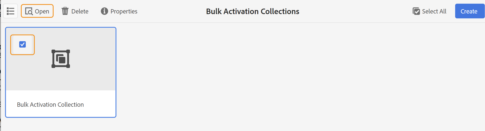

# 出力をアクティブ化 {#id214GGF00V5U}

一括アクティベーション用のマップコレクションを作成したら、次のステップとしてパブリッシングインスタンスでコンテンツをアクティベートします。 コンテンツをアクティベートするには、次の手順を実行します。

1. ツールのリストから「**ガイド**」を選択します。

1. 上部のAdobe Experience Manager リンクをクリックし、**ツール**&#x200B;を選択します。

1. **一括公開ダッシュボード** タイルをクリックします。

   一括アクティベーションマップコレクションのリストが表示されます。

1. 公開するコレクションを選択し、**開く**&#x200B;をクリックします。

   {width="800" align="left"}

1. \（*オプション*\）左側のパネルから必要なフィルターを適用して、変更された\（status\）、出力プリセット、または言語に基づいてマップをフィルタリングします。

   >[!NOTE]
   >
   >マップ コレクションで出力プリセットをアクティブ化する前に、出力プリセットを使用してマップの出力を生成します。

設定に基づいて、コレクションをアクティベートする様々な方法を表示します。

 クラウドサービス 

{width="650" align="left"}

**プレビュー**&#x200B;または&#x200B;**公開** インスタンスへの出力をアクティブ化できます。

**プレビュー**

* 選択したマップの出力をアクティブにするには、事前生成されたマップ出力を選択し、**公開先**/**プレビュー**&#x200B;を選択します。
* すべてのDITA マップの出力を設定されたプリセットでアクティベートするには、**Map**&#x200B;列の横にあるチェックボックスを選択し、**Publish to** > **Publish**&#x200B;を選択します。

**公開**

* 選択したマップの出力をアクティブにするには、事前生成されたマップ出力を選択し、**公開先**/**公開**&#x200B;を選択します。

* すべてのDITA マップの出力を設定されたプリセットでアクティベートするには、マップ（列）の横にあるチェックボックスを選択し、**公開先** > **公開**&#x200B;を選択します。

>[!NOTE]
> 
> マップ出力のチェックボックスは、マップの出力を生成した場合にのみ有効になります。

マップ出力が公開用にキューに入れられると、成功メッセージが表示されます。

選択したマップファイルの出力がアクティブ化されると、「監査履歴」タブが更新され、最新のアクティブ化された出力が上部に表示されます。 **公開済み**&#x200B;列が、公開日時で更新されます。

    

  オンプレミスソフトウェア 

次のいずれかの操作を行います。

* 選択したマップの出力をアクティブにするには、事前生成されたマップ出力を選択し、**クイック公開**&#x200B;を選択します。
* すべてのDITA マップの出力を設定されたプリセットでアクティベートするには、マップ（列）の横にあるチェックボックスを選択し、**クイック公開を選択します。**
  {width="650" align="left"}

  >[!NOTE]
  > 
  >マップ出力のチェックボックスは、マップの出力を生成した場合にのみ有効になります。

マップ出力が公開用にキューに入れられると、成功メッセージが表示されます。

選択したマップファイルの出力がアクティブ化されると、「監査履歴」タブが更新され、最新のアクティブ化された出力が上部に表示されます。 **公開済み**&#x200B;列が、公開日時で更新されます。

**&#x200B; 親トピック：**&#x200B;[公開されたコンテンツの一括アクティベーション &#x200B;](conf-bulk-activation.md)
