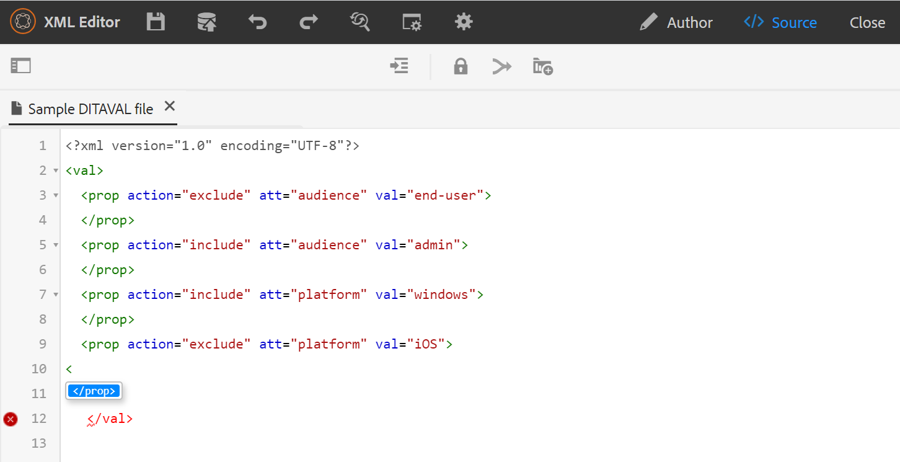

# DITAVAL エディター {#ditaval-editor}

DITAVAL ファイルは、条件付き出力の生成に使用されます。 単一のトピックで、要素の属性を使用してコンテンツの条件を設定する条件を追加できます。 次に、DITAVAL ファイルを作成します。このファイルでは、コンテンツを生成するために取得する必要がある条件と、最終的な出力から除外する必要がある条件を指定します。

AEM Guidesでは、DITAVAL エディタを使用して DITAVAL ファイルを簡単に作成および編集できます。 DITAVAL エディタは、システムで定義されている属性\（またはタグ\）を取得し、それらを使用して DITAVAL ファイルを作成または編集できます。 AEMでのタグの作成および管理について詳しくは、AEM ドキュメントの [ タグの管理 ](https://experienceleague.adobe.com/docs/experience-manager-cloud-service/sites/authoring/features/tags.html?lang=ja) の節を参照してください。

## DITAVAL ファイルの作成

DITAVAL ファイルを作成するには、以下の手順を実行します。

1. Assets UI で、DITAVAL ファイルを作成する場所に移動します。

1. **作成** \> **DITA トピック** をクリックします。

1. ブループリントページで、「DITAVAL」ファイルテンプレートを選択し、「**次へ**」をクリックします。

1. プロパティ ページで、DITAVAL ファイルの **タイトル** と **名前** を指定します。

   >[!NOTE]
   >
   > ファイルのタイトルに基づいて、名前が自動的に提案されます。 ファイル名を手動で指定する場合は、名前にスペース、アポストロフィ、または中括弧が含まれず、.ditaval で終わっていることを確認してください。

1. 「**作成**」をクリックします。 「トピックを作成しました」のメッセージが表示されます。

   DITAVAL エディタで編集するために DITAVAL ファイルを開くか、またはAEM リポジトリにトピック ファイルを保存するかを選択できます。

## DITAVAL ファイルの編集

DITAVAL ファイルを編集するには、以下の手順を実行します。

1. Assets UI で、編集する DITAVAL ファイルに移動します。

1. ファイルを排他ロックするには、ファイルを選択して **チェックアウト** をクリックします。

1. ファイルを選択し、**編集** をクリックして、AEM Guides DITAVAL エディターでファイルを開きます。

   DITAVAL エディタでは、次のタスクを実行できます。

   A：左パネルを切り替え
左側のパネルビューを切り替えます。 DITA マップを使用して DITAVAL ファイルを開いた場合、マップとリポジトリがこのパネルに表示されます。 DITA マップを使用してファイルを開く方法については、[DITA マップを使用したトピックの編集 ](map-editor-advanced-map-editor.md#id17ACJ0F0FHS) を参照してください。

   B：保存
ファイルへの変更を保存します。 すべての変更は、ファイルの現在のバージョンに保存されます。

   C: プロパティの追加
DITAVAL ファイルに 1 つのプロパティを追加します。

   

   最初のドロップダウンには、DITAVAL ファイルで使用できる DITA 属性が表示されます。 サポートされている属性は、`audience`、`platform`、`product`、`props` および `otherprops` の 5 つです。

   2 つ目のドロップダウンリストには、選択した属性に設定された値が表示されます。 次に、選択した属性に対して設定できるアクションが次のドロップダウンリストに表示されます。 アクションドロップダウンで使用できる値は、`include`、`exclude`、`passthrough`、`flag` です。 これらの値について詳しくは、OASIS DITA ドキュメントの [prop](http://docs.oasis-open.org/dita/dita/v1.3/errata01/os/complete/part3-all-inclusive/langRef/ditaval/ditaval-prop.html#ditaval-prop) 要素の定義を参照してください

   D：すべてのプロパティを追加
システム内で定義されているすべての条件付きプロパティまたは属性を 1 回のクリックで追加する場合は、「すべてのプロパティを追加」機能を使用します。

   >[!NOTE]
   >
   > 定義済みの条件付きプロパティがすべて DITAVAL ファイルに存在する場合、プロパティを追加することはできません。 このシナリオでは、エラーメッセージが表示されます。

   

1. DITAVAL ファイルの編集が完了したら、「**保存**」をクリックします。

   >[!NOTE]
   >
   > 保存せずにファイルを閉じると、変更内容は失われます。 変更内容をAEM リポジトリにコミットしない場合は、「**未保存の変更内容** ダイアログで「**&#x200B;** 閉じる **」をクリックし、「保存せずに閉じる** をクリックします。

## DITAVAL エディタ ビュー

AEM Guidesの DITAVAL Editor では、次の 2 つの異なるモードまたはビューでの DITAVAL ファイルの表示がサポートされています。

**オーサー**:   これは、DITAVAL エディタの What You See が What You Get \（WYSISYG\） ビューを表示する典型的なものです。 プロパティ、値、アクションをドロップダウンリストに表示するシンプルなユーザーインターフェイスを使用して、プロパティを追加または削除できます。 オーサービューには、個々のプロパティを挿入し、1 回のクリックですべてのプロパティを挿入するオプションがあります。

また、ファイル名の上にカーソルを置くと、現在作業中の DITAVAL ファイルのバージョンを見つけることができます。

**Source**:   Source ビューには、DITAVAL ファイルを構成する基になる XML が表示されます。 作成者は、このビューで通常のテキスト編集を行うだけでなく、スマートカタログを使用してプロパティを追加または編集することもできます。

スマートカタログを呼び出すには、任意のプロパティ定義の末尾にカーソルを置いて、「&lt;」と入力します。 エディターには、その場所に挿入できるすべての有効な XML 要素のリストが表示されます。

