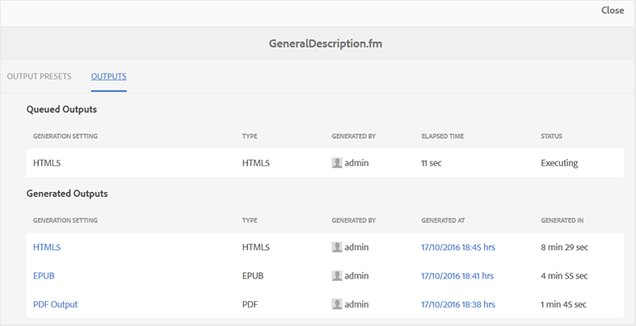

# 出力生成タスクのステータスの表示 {#viewing_output_history}

FrameMaker ドキュメントの出力生成タスクを開始すると、AEM Guidesはこのタスクを出力生成キューに送信します。 このキューはリアルタイムで更新され、キュー内の各出力生成タスクのステータスが表示されます。

出力生成キューを表示するには、次の手順を実行します。

1. Assets UIで、出力生成ステータスを確認するFrameMaker ドキュメントに移動してクリックします。

1. 「出力」をクリックします。

   {width="800" align="left"}

1. 出力ページは、次の2つの部分に分かれています。

   - **キューに入れた出力：**

     生成待ち、または生成処理中の出力を一覧表示します。 また、キューに入れられたタスクに使用される出力生成設定またはプリセット、タイプ、タスクを開始したユーザー、タスクがキューに入れてからの時間、および現在のステータスを確認することもできます。

   - **生成された出力**

     完了した出力タスクが一覧表示されます。 繰り返しますが、ここに示されている情報はキュー出力セクションと似ていますが、出力生成時間の違いだけです。

     このリストでは、正常に実行されたタスクまたは失敗したタスクがある場合があります。 正常に完了したタスクに対して、公開プロセスによってログファイル \（logs.txt\）が作成されます。このログファイルには、「生成時」列のリンクをクリックしてアクセスできます。

**親トピック：**&#x200B;[&#x200B; FrameMaker ドキュメントの出力を生成](fm-output-generatation.md)
