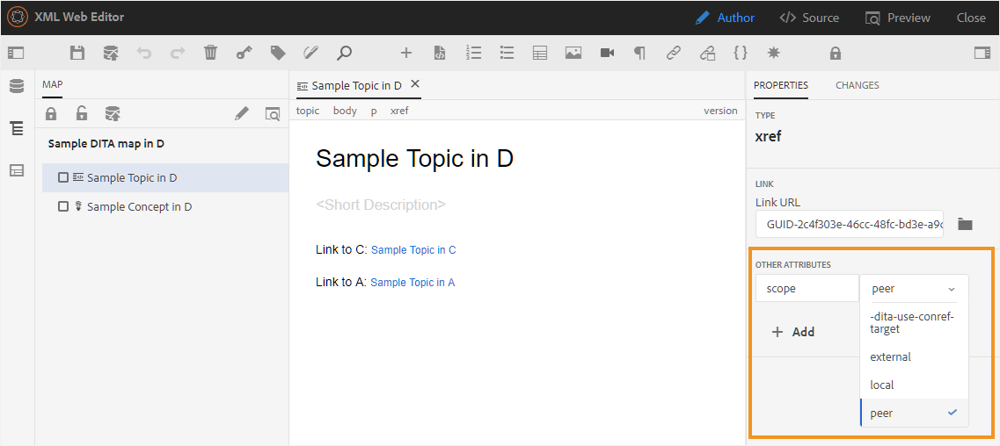
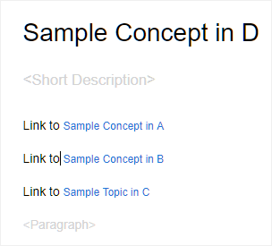
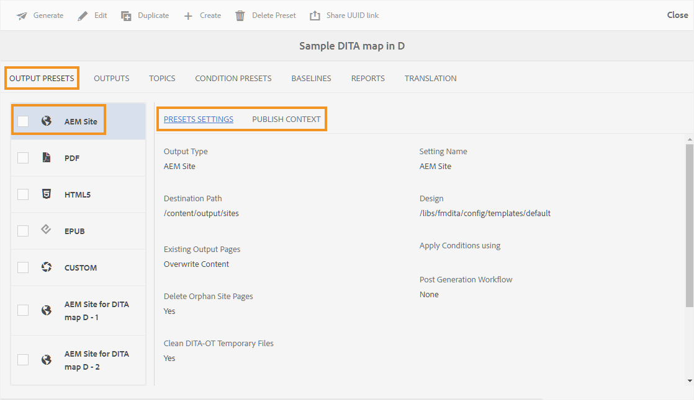
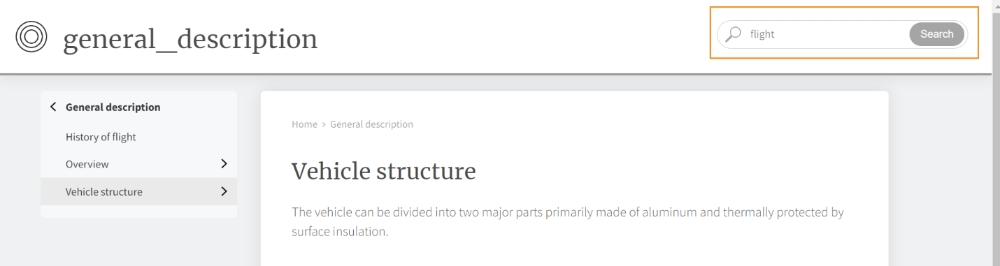

# マップダッシュボード上のAEM Sites プリセット {#id205BE3008SW}

マップダッシュボードからAEM Sites プリセットを作成し、AEM Sites出力を生成するように設定できます。

AEM Sites出力には、次のオプションがあります。

| AEM Sitesオプション | 説明 |
| --- | --- |
| 出力タイプ | 生成する出力のタイプ。 レスポンシブ AEM Sites出力を生成するには、「AEM Sites」オプションを選択します。 |
| 設定名 | 作成するAEM Sites設定にわかりやすい名前を付けます。 例えば、*社内ユーザー出力*&#x200B;または&#x200B;*エンドユーザー出力*&#x200B;を指定できます。 |
| サイト名 | 出力がAEM リポジトリに保存されるサイト名。  AEM リポジトリ内のノードは、ここで指定した名前で作成されます。 サイト名を指定しない場合、サイトノードはDITA マップファイル名で作成されます。  ここで指定したサイト名は、ブラウザータブのタイトルとしても使用されます。   サイト名の設定時に変数を使用することもできます。 変数の使用について詳しくは、[宛先パス、サイト名、またはファイル名のオプションを設定するための変数の使用](generate-output-use-variables.md#id18BUG70K05Z)を参照してください。 |
| デザイン | 出力の生成に使用するデザインテンプレートを選択します。   カスタムデザインテンプレートを使用して出力を生成する方法について詳しくは、公開管理者にお問い合わせください。 |
| 宛先のパス | 出力が保存されるAEM リポジトリ内のパス。 最終的な出力を生成する際に、サイト名と宛先パスが結合されます。 例えば、サイト名を`user-guide`、宛先パスを`/content/output/aem-guides`として指定した場合、最終的な出力は`/content/output/aem-guides/user-guide` ノードの下に生成されます。  宛先パスの設定時に変数を使用することもできます。 変数の使用について詳しくは、[宛先パス、サイト名、またはファイル名のオプションを設定するための変数の使用](generate-output-use-variables.md#id18BUG70K05Z)を参照してください。 |
| を使用した条件の適用 | 次のいずれかのオプションを選択します。  **適用なし**：公開された出力に条件を適用しない場合は、このオプションを選択します。 **DITAVal ファイル**：条件付きコンテンツを生成するには、DITAVal ファイルを選択します。 参照ダイアログまたはファイルパスを入力して、複数のDITAVal ファイルを選択できます。 ファイル名の近くにある十字アイコンを使用して削除します。 DITAVal ファイルは指定された順序で評価されるので、最初のファイルで指定された条件は、後のファイルで指定された一致する条件よりも優先されます。 ファイルを追加または削除することで、ファイルの順序を維持できます。 DITAVal ファイルが別の場所に移動されたり、削除されたりした場合、マップダッシュボードから自動的に削除されることはありません。 ファイルが移動または削除された場合は、場所を更新する必要があります。 ファイル名にカーソルを合わせると、ファイルが保存されているAEM リポジトリ内のパスを確認できます。 DITAVal ファイルのみを選択でき、他のファイルタイプを選択した場合はエラーが表示されます。 **条件プリセット**：出力の公開中に条件を適用するには、ドロップダウンから条件プリセットを選択します。 このオプションは、DITA マップファイルの条件を追加した場合に表示されます。 条件設定は、DITA マップコンソールの「条件プリセット」タブで使用できます。 条件プリセットについて詳しくは、[条件プリセットの使用](generate-output-use-condition-presets.md#id1825FL004PN)を参照してください。 |
| 既存の出力ページ | 既存のページのコンテンツを上書きするには、「**コンテンツを上書き**」オプションを選択します。 このオプションは、ページのコンテンツノードとヘッドノードの下にあるコンテンツのみを上書きします。 このオプションを使用すると、コンテンツのブレンド公開が有効になります。 このオプションを選択すると、公開された出力から孤立したページを削除するオプションが表示されます。 これは、AEM Sites出力を作成するための&#x200B;*default* オプションでもあります。  公開中に既存のページを強制的に削除するには、**削除および作成** オプションを選択します。 このオプションは、ページノードとそのコンテンツおよびその下のすべての子ページを削除します。 出力プリセットのデザインテンプレートを変更した場合、または出力先に既に存在する追加ページを削除する場合は、このオプションを使用します。 |
| 孤立したサイトページの削除 | **既存の出力ページ**&#x200B;設定の&#x200B;**コンテンツの上書き**&#x200B;を選択すると、このオプションが表示されます。 このオプションを選択すると、公開されたAEM サイトからすべての孤立ページが削除されます。 この機能を正常に実行するには、DITA マップ全体を公開し、増分公開を使用しない必要があります。   トピック a.dita、b.dita、c.ditaを含むDITA マップを公開したとします。 マップを再度公開する前に、マップからb.dita トピックを削除しました。 これで、このオプションを選択した場合、b.ditaに関連するすべてのコンテンツがAEM Sites出力から削除され、a.ditaとc.ditaのみが公開されます。  この機能は、公開された子マップを削除しません。 例えば、親マップに子マップが含まれており、子マップ全体を削除した場合、子マップコンテンツは公開された出力から削除されません。 ただし、子マップからトピックを削除して再公開すると、削除されたトピックのコンテンツがサイト出力から削除されます。  また、参照コンテンツがあり、再公開前にそのコンテンツが削除された場合、参照コンテンツのデータは削除されません。  **注意**：削除された孤立ページに関する情報も出力生成ログに取り込まれます。 ログファイルへのアクセスについて詳しくは、[ ログファイルの表示と確認](generate-output-basic-troubleshooting.md#id1821I0Y0G0A__id1822G0P0CHS)を参照してください。 |
| 一時ファイルの保持 | DITA-OTで生成された一時ファイルを保持するには、このオプションを選択します。 DITA-OTを使用して出力を生成する際にエラーが発生した場合は、一時ファイルを保持するためにこのオプションを選択します。 その後、これらのファイルを使用して、出力生成エラーのトラブルシューティングを行うことができます。   出力を生成したら、**一時ファイルをダウンロード**  アイコンを選択して、一時ファイルを含むZIP フォルダーをダウンロードします。   **メモ**: ファイルのプロパティが生成中に追加された場合、出力された一時ファイルには、それらのプロパティを含む&#x200B;*metadata.xml* ファイルも含まれます。 |
| トピックごとに個別のPDFを生成 | 選択すると、DITA マップ内のすべてのトピックに対してPDFも作成されます。 このオプションを選択すると、新しい「PDFパスを分割」オプションが表示されます。  PDFパスを分割フィールドで、各トピック用に生成されたPDFを保存するパスを指定します。  **注意**: AEM Guidesは、DITA-OT プラグイン pdfxを使用して、各トピック用にPDFを生成します。 このプラグインは、標準装備のDITA-OT パッケージにバンドルされています。 このプラグインをカスタマイズして、必要に応じてPDFを生成できます。 カスタム DITA-OT プラグインを使用する場合は、トピックレベルのPDF生成機能を備えるために、pdfx プラグインを必ず統合してください。 |
| 生成後のワークフローの実行 | このオプションを選択すると、AEMで設定されたすべてのワークフローを含む新しいポストジェネレーションワークフローのドロップダウンリストが表示されます。 出力生成ワークフローの完了後に実行するワークフローを選択する必要があります。 |
| ベースラインを使用 | 選択したDITA マップのベースラインを作成した場合は、このオプションを選択して、公開するバージョンを指定します。  **重要**: AEM サイトの増分出力を生成する場合、出力は添付されたベースラインではなく、現在のバージョンのファイルを使用して作成されます。  詳しくは、[ ベースライン ](generate-output-use-baseline-for-publishing.md#id1825FI0J0PF)の操作を参照してください。 |
| プロパティ | メタデータとして処理するプロパティを選択します。 これらのプロパティは、DITA マップまたはブックマップファイルのプロパティページから設定します。 ドロップダウンリストから選択したプロパティは、**ファイルプロパティ** フィールドの下に表示されます。 プロパティの横にある十字アイコンを選択して削除します。   **注意**: メタデータのプロパティでは大文字と小文字が区別されます。  *ベースラインを選択した場合、プロパティの値は、選択したベースラインのバージョンに基づきます。 * ベースラインを選択していない場合、プロパティの値は最新バージョンに基づいています。  DITA-OT パブリッシングを使用して、メタデータを出力に渡すこともできます。 For more details see, [Pass on the metadata to the output using DITA-OT](pass-metadata-dita-ot.md#id21BJ00QD0XA).  **Note**: If you have not defined the `cq:tags` in the Properties option, then the values for `cq:tags` are picked from the current working copy even if you have selected a Baseline for publishing. |
| Use map properties as default | 選択すると、マップファイルに定義されたプロパティも、プロパティが定義されていないトピックにコピーされます。 Consider the following points while using this option:  *Only String, Date, or Long (singe and multi-valued) properties can be passed on to the AEM Sites pages. * 文字列型プロパティのメタデータ値は、特殊文字（`@, #, " "`など）をサポートしていません。 *このオプションは、`Properties` オプションと共に使用する必要があります。 |

## Additional note on AEM Sites

### Generate article-based output from the Web Editor

You can generate the AEM Sites output for one or more topics, or the entire DITA map from the Web Editor. You need to create output presets for your DITA map and then you can easily generate the AEM Sites output for your map. If you have updated a few topics in your map, you can also generate the AEM Sites output only for those topics from the Web Editor. 詳しくは、[Web エディターからの記事ベースの公開](web-editor-article-publishing.md#id218CK0U019I)を参照してください。

### Generate output of linking topics from other maps

It is a very common scenario to have a large set of documentation spread across multiple folders and DITA maps. It becomes extremely complex to publish content that is linked from various places. By default, all links `<xref>` are created with the `local` `@scope`. Publishing such topics does not involve any challenge, as it uses direct link to the topic. In case the topic is outside the current DITA map, the link does not show the linked content.

Another way of linking content is to create a link using the `peer` `@scope`. For such content, the link is resolved at run-time by picking the file&#39;s title and the configured context for the linked topic from the DITA map&#39;s publishing context. 次のスクリーンショットは、`peer` `@scope`を持つリンクのプロパティパネルを示しています。

{width="800" align="left"}

複雑なマップやトピックを簡単に公開し、他のマップ内の他のトピックにリンクできるように、AEM Guidesでは、出力プリセットごとに公開コンテキストを設定できます。

公開コンテキストを使用すると、特定の出力を公開するために、どのマップからどのトピックを使用するかを指定できます。 サンプル a、サンプル b、サンプル c、サンプル dの4つのフォルダーがあるとします。 各フォルダーには、DITA マップ A、DITA マップ B、DITA マップ C、およびDITA マップ DのDITA マップが含まれます。DITA マップ AのトピックがDITA マップ B、C、Dのトピックにリンクすると、クロスマップリンクが実行されます。次のスクリーンショットでは、サンプルコンセプトトピックに、他のDITA マップの一部であるファイルへのリンク \（または参照\）が含まれています。

{width="350" align="left"}

これで、このトピックを含むマップファイルのAEM Sites パブリッシュ設定を行う際に、公開中にリンクされたコンテンツに使用するパブリッシュコンテキストを選択できるようになりました。 公開コンテキストは、DITA マップとその出力プリセットを組み合わせたものです。 出力プリセットには、特定のバージョンのコンテンツとコンディショナルプリセットが含まれます。 DITA マップ、出力プリセット、\（files\）バージョンおよび条件の組み合わせは、リンクされたマップの公開コンテキストを定義します。

次の手順を実行して、相互リンクされたファイルの公開コンテキストを指定します。

1. 公開するDITA マップの&#x200B;**出力プリセット** タブを開きます。

1. **AEM Site**&#x200B;出力プリセットを選択します。

   「AEM プリセット設定」タブと「公開コンテキスト」タブを使用します。

   {width="800" align="left"}

1. 「**公開コンテキスト**」タブを開きます。

   依存トピックのリストが表示されます。 これらは、現在のマップの一部のトピックからリンクされているトピックですが、他のDITA マップでも使用できます。

   >[!NOTE]
   >
   > 「公開コンテキスト」タブには、`peer` `@scope`のみを使用してリンクされているトピックが表示されます。 `local` `@scope`のリンクの場合、公開コンテキストを指定する必要はありません。

   デフォルトでは、リンクされたすべてのトピックで、最新の出力プリセットとマップが選択されています。

   {width="800" align="left"}

1. DITA マップとプリセットのデフォルトの選択を変更するには、「**編集** \（メインツールバーの\）」をクリックします。

1. マップ内の各依存ファイルの最近公開された出力を使用する場合は、**すべての依存トピックに対して最近生成された公開コンテキストを使用**&#x200B;を選択します。

1. **親マップ** ドロップダウンリストで、現在のマップの出力をリンクする出力を含むマップファイルを選択します。

   マップファイルを選択すると、マップのUUIDが「親マップ UUID」列に表示されます。 選択したマップに関連付けられている出力プリセットは、親マップのプリセットリストにリストされます。

1. **親マップのプリセット** ドロップダウンリストで、現在のマップの出力をリンクする出力プリセットを選択します。

1. Select the required map and its output preset for all dependent topics and click **Done**.

   The context for the dependent topics is now set. You can generate the output for the current map. For more information about generating output, see [Generate output for a DITA map from the map console](generate-output-for-a-dita-map.md#).

### Blended publishing

AEM Guides supports publishing DITA content within your existing AEM site. For example, if you have an existing site, you can use the AEM Sites output to publish only the DITA content on that site. In this process, the existing non-DITA content is not modified by the publishing process. For more information about setting up your site to publish only DITA content, contact your publishing administrator.

### 公開 `conref`

If you are using `conref` in your content, then it is published as normal or embedded content along with the content in the source \(or referring\) topic. The `conref` content is rendered along with the main content and no separate site page is created for the same. When you search for the content that is referred in the `conref`, then only the main topic or page containing the `conref` content is shown in the search results.

>[!NOTE]
>
>If you have generated separate pages for the `conref` content using AEM Guides version 3.5 or earlier, then it is recommended to clean/delete those pages by using the [Delete Orphan Site Pages](#delete-orphan-page-aem-site) option.

### Search a string within the content

You can search for a string in the AEM Sites output. By default, you can search for the string in the titles only. To search for the string in the content or the body of the AEM Sites output, contact your system administrator to enable the flattening.enabled property.

{width="650" align="left"}

For more details see *Configure flattening of AEM Site node structure* section in the Install and configure Adobe Experience Manager Guides guide.

**親トピック：**[&#x200B;出力プリセットについて](generate-output-understand-presets.md)
