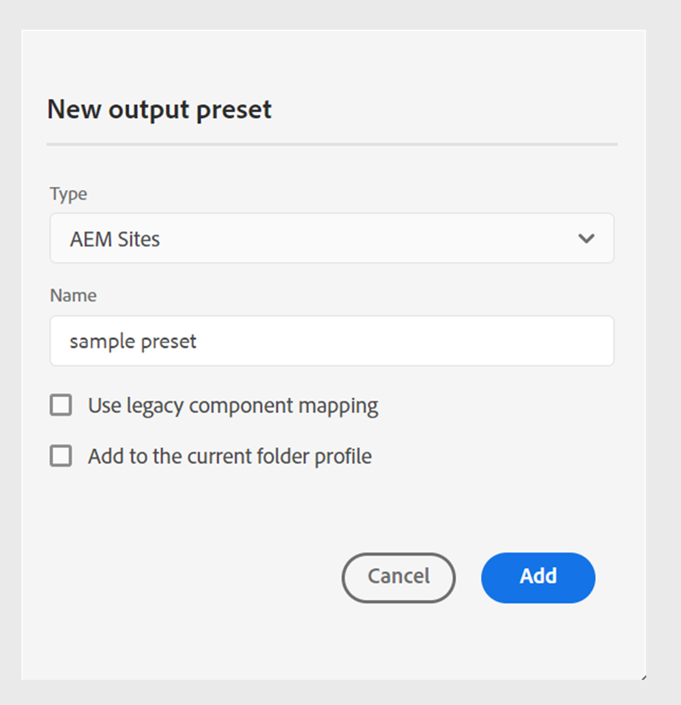

# Web エディターでのAEM Sites プリセット

Web エディターからAEM Sites プリセットを作成し、AEM Sites出力を生成するように設定できます。 AEM Sites出力は、`guides-components`と共に複合コンポーネントマッピングに基づいているため、効率的なコンテンツの作成と管理が容易になります。

Experience Manager Guidesには、AEM Sitesを作成するための定義済みテンプレートが用意されています。 これらのプリセットは、コンテンツのレイアウトと構造の一貫性を確保するのに役立ちます。
- これらの定義済みテンプレートに基づいて[ ホームページ ](/help/product-guide/cs-install-guide/download-install-aem-sites-templates-cs.md#create-a-home-page-using-the-template)を作成します。
- [ トピックテンプレート ](/help/product-guide/cs-install-guide/download-install-aem-sites-templates-cs.md#package-installation)を編集し、要件に応じてスタイルを適用できます。
- また、既存のAEM Sites テンプレートを[ カスタマイズすることもできます](/help/product-guide/cs-install-guide/download-install-aem-sites-templates-cs.md#customize-existing-aem-sites-templates)。

## AEM Sites プリセットの作成

Web エディターからAEM Sites プリセットを作成するには、次の手順を実行します。

1. リポジトリーパネルで、マップビューでDITA マップファイルを開きます。
1. 「**出力**」タブで、「+」アイコンを選択して、出力プリセットを作成します。
1. **新しい出力プリセット** ダイアログボックスの&#x200B;**Type** ドロップダウンから&#x200B;**AEM Sites**&#x200B;を選択します。
1. **新しい出力プリセット** ダイアログボックスから「**レガシーコンポーネントマッピングを使用**」オプションの選択を解除します。

>[!NOTE]
>
>Experience Manager Guides用のAEM Sites プリセットを設定する前に、管理者はテンプレートを使用してAEM Sites構造を作成する必要があります。
- **オンプレミスソフトウェア**: オンプレミスソフトウェア用のAEM Sites テンプレート ](/help/product-guide/install-guide/download-install-aem-sites-templates.md)を[ ダウンロードしてインストールする方法について詳しく説明します。
- **Cloud Service**: [Cloud Service用AEM Sites テンプレート ](/help/product-guide/cs-install-guide/download-install-aem-sites-templates-cs.md)をダウンロードしてインストールする方法について詳しく説明します。

### 現在のフォルダープロファイルにプリセットを追加

Experience Manager Guidesでは、管理者として、グローバルプロファイルとフォルダープロファイルの出力プリセットを作成および管理できます。 現在のフォルダープロファイルの出力プリセットを作成するには、**新規出力プリセット** ダイアログボックスから「**現在のフォルダープロファイルに追加**」オプションを選択します。  アイコンは、フォルダープロファイルレベルのプリセットを示します。  [ グローバルおよびフォルダープロファイル出力プリセットの管理](./web-editor-manage-output-presets.md)の詳細をご覧ください。

### 従来のコンポーネントマッピングに基づくAEM Sites プリセット

また、従来のコンポーネントマッピングを使用してAEM Sites プリセットを作成することもできます。 従来のコンポーネントマッピングに基づいてAEM Sites プリセットを作成するには、**新しい出力プリセット** ダイアログボックスで「**従来のコンポーネントマッピングを使用**」オプションを選択します。

一部のオプションは、従来のコンポーネントマッピングを使用するプリセットで異なる場合があります。

## AEM Sites プリセットの設定

設定は、**一般**、**コンテンツ**、**トピックリスト**、**クロスマップ参照**&#x200B;のタブの下に整理されます。

**一般**

「**一般**」タブには、出力の生成に関連する次の設定が含まれています。

- サイトパスを使用
- サイトパス
- サイト
- パスを公開
- トピックページテンプレート
- に基づいたページ名の生成
   - トピックファイル名
   - トピックタイトル
- 以前に生成したページのクリーンアップ
   - マップから削除されたトピックの以前に生成されたページの削除
   - このパスで他のソースによって作成されたすべてのページを削除：
- 生成後のワークフロー

**コンテンツ**

「**コンテンツ**」タブには、次の設定が含まれています。

- ベースラインを使用
- 条件フィルタリング
- 追加のDITA-OT コマンドライン引数
- メタデータ
   - ファイル（Assets）のプロパティ
   - マッププロパティをフォールバックとして使用

詳しくは、[AEM Sites設定](#aem_sites_config)を参照してください。

**トピックリスト**

**トピックリスト**&#x200B;には、DITA マップの現在の作業コピーに存在するトピックのリストが表示されます。 デフォルトでは、すべてのトピックが含まれています。 特定のトピックを選択し、そのトピックに対してのみAEM Sites出力を生成できます。 例えば、一部のトピックを更新して、DITA マップ全体を公開するのではなく、それらのトピックのみを公開できるようにします。

**トピックリスト** タブは、従来のマッピングに基づいて作成されていないAEM プリセットにあります。

**クロスマップ参照**
このリストには、`scope ="peer"`とのクロスマップ参照を含むトピックが含まれています。 他のDITA マップで使用可能なトピックに`scope="peer"`を含むクロスマップ参照のリストに対して、公開コンテキストを指定できます。 このタブは、Experience Manager Guides（UUID）バージョンを使用している場合に表示されます。

リンクされたトピックを[公開](#publish-linked-topics)する方法について詳しくは、こちらを参照してください。

## AEM Sites設定 {#aem_sites_config}

AEM Sites出力には、次のオプションがあります。

| AEM Sitesオプション | 説明 |
| --- | --- |
| サイトパスを使用 | Experience Manager サイトにコンテンツを公開するには、このオプションを使用します。 出力を公開するサイト パスが正確にわかっている場合は、このオプションを選択します。 また、「サイトパス」フィールドでフルパスについても説明します。 |
| サイトパス | このオプションは、**サイトパスを使用** オプションを選択した場合に表示されます。 出力を公開するExperience Manager サイトのパスを正確に参照します。 |
| サイト | コンテンツを公開するExperience Manager Sitesの名前。 ドロップダウンのオプションは、AEM Sitesで使用可能なサイトのリストに基づいて設定されます。   「**更新** 」を選択して、オプションの新しいリストを取得し、更新されたデータを反映します。 |
| パスを公開 | 出力が保存されるAEM リポジトリ内のパス。 公開パスには、ホームページ テンプレートに基づいて作成されたページを含むすべてのパスが入力されます。 DITA マップのAEM Sites出力は、このパスの下に生成されます。  例えば、サイトを`AEMG-Docs`に、公開パスを`aemg-docs-en/docs/product-abc.`に指定した場合、AEM Sites出力は`crx/de`の`aemg-docs-en/docs/product-abc/` ノードの下に生成されます。 |
| トピックページテンプレート | 複数のドキュメントをまたいで一貫性のあるコンテンツを整理するために使用できる構造コンポーネントです。 これらのテンプレートは、Adobe Experience Manager サイトテンプレートで事前に定義されています。 オプションには、選択したサイトで使用可能なすべてのトピックページテンプレートが入力されます。 すべての出力トピックに適用するテンプレートを選択します。 |
| に基づいたページ名の生成 | **トピックファイル名**: DITA トピックのファイル名を使用して、サイト URLを作成します。  **トピックタイトル**: DITA トピックのタイトルを使用して、Experience Manager サイト名を作成します。 |
| 以前に生成したページのクリーンアップ | - **マップから削除されたトピックの以前に生成されたページを削除**: DTIA マップの構造が変更された場合、このオプションを使用して、削除されたトピックの以前に生成されたページを削除できます。 この機能は、完全なマップ公開でのみ使用できます。   トピック a.dita、b.dita、およびc.ditaを含むDITA マップを公開したとします。 マップを再度公開する前に、マップからb.dita トピックを削除しました。 これで、このオプションを選択すると、b.ditaに関連するすべてのコンテンツがAEM Sites出力から削除され、a.ditaとc.ditaのみが公開されます。  **注意**：削除されたページに関する情報も出力生成ログに取り込まれます。 ログファイルへのアクセスについて詳しくは、[ ログファイルを表示して確認してください](generate-output-basic-troubleshooting.md#id1821I0Y0G0A__id1822G0P0CHS)。   **注意**：トピックを削除すると、公開されたサイトからページを使用できなくなります。 トピックが削除される前に、警告が表示されます。 これらのページを削除するには、確認する必要があります。  - **このパスで他のソースによって作成されたすべてのページを削除**：このオプションを選択すると、他のマップ、個々のトピック、またはその他のソースからこのパスに公開されたすべてのページが削除されます。 ページは、公開されたサイトからも利用できなくなります。 トピックが削除される前に、警告が表示されます。 削除することを確認してください。 |
| 生成後のワークフロー | このオプションを選択すると、AEMで設定されたすべてのワークフローを含む新しいポストジェネレーションワークフローのドロップダウンリストが表示されます。 出力生成ワークフローの完了後に実行するワークフローを選択する必要があります。 |
| ベースラインを使用 | 選択したDITA マップのベースラインを作成した場合は、このオプションを選択して、公開するバージョンを指定します。  **重要**: AEM サイトの増分出力を生成する場合、出力は添付されたベースラインではなく、現在のバージョンのファイルを使用して作成されます。  詳細は、[ ベースライン ](generate-output-use-baseline-for-publishing.md#id1825FI0J0PF)を参照してください。 |
| 条件付きフィルタリング | 次のいずれかのオプションを選択します。  **なし**：公開された出力に条件を適用しない場合は、このオプションを選択します。 **DITAVALの使用**：条件付きコンテンツを生成するには、DITAVAL ファイルを選択します。 参照ダイアログまたはファイルパスを入力して、複数のDITAVal ファイルを選択できます。 ファイル名の近くにある十字アイコンを使用して削除します。 DITAVal ファイルは指定された順序で評価されるので、最初のファイルで指定された条件は、後のファイルで指定された一致する条件よりも優先されます。 ファイルを追加または削除することで、ファイルの順序を維持できます。 DITAVal ファイルが別の場所に移動されたり、削除されたりした場合、マップダッシュボードから自動的に削除されることはありません。 ファイルが移動または削除された場合は、場所を更新する必要があります。 ファイル名にカーソルを合わせると、ファイルが保存されているAEM リポジトリ内のパスを表示できます。 DITAVal ファイルのみを選択でき、他のファイルタイプを選択した場合はエラーが表示されます。 **条件プリセット**：出力の公開中に条件を適用するには、ドロップダウンから条件プリセットを選択します。 このオプションは、DITA マップファイルの条件を追加した場合に表示されます。 条件設定は、DITA マップコンソールの「条件プリセット」タブで使用できます。 条件プリセットについて詳しくは、[条件プリセットの使用](generate-output-use-condition-presets.md#id1825FL004PN)を参照してください。 |
| 追加のDITA-OT コマンドライン引数 | 出力の生成時にDITA-OTで処理する追加の引数を指定します。 DITA-OTでサポートされているコマンドライン引数について詳しくは、[DITA-OT ドキュメント ](https://www.dita-ot.org/)を参照してください。 |
| メタデータ     ファイル（Assets）のプロパティ | メタデータとして処理するプロパティを選択します。 これらのプロパティは、DITA マップまたはブックマップファイルのプロパティページから設定します。 ドロップダウンリストから選択したプロパティは、**ファイルプロパティ** フィールドの下に表示されます。 プロパティの横にある十字アイコンを選択して削除します。   **注意**: メタデータのプロパティでは大文字と小文字が区別されます。  *ベースラインを選択した場合、プロパティの値は、選択したベースラインのバージョンに基づきます。 * ベースラインを選択していない場合、プロパティの値は最新バージョンに基づいています。  DITA-OT パブリッシングを使用して、メタデータを出力に渡すこともできます。 詳細については、[DITA-OT](pass-metadata-dita-ot.md#id21BJ00QD0XA)を使用してメタデータを出力に渡します。  **注**:「プロパティ」オプションで「`cq:tags`」を定義していない場合、公開用にベースラインを選択した場合でも、`cq:tags`」の値が現在の作業コピーから選択されます。 |
| メタデータ     マッププロパティをフォールバックとして使用 | 選択すると、マップファイルに定義されたプロパティも、プロパティが定義されていないトピックにコピーされます。 このオプションを使用する際は、次の点を考慮してください。  *文字列、日付、または長い（1つの値と複数値の）プロパティのみをAEM サイトページに渡すことができます。 * 文字列型プロパティのメタデータ値は、特殊文字（`@, #, " "`など）をサポートしていません。 *このオプションは、`Properties` オプションと共に使用する必要があります。 |
| 一時ファイルの保持 | DITA-OTで生成された一時ファイルを保持するには、このオプションを選択します。 DITA-OTを使用して出力を生成する際にエラーが発生した場合は、一時ファイルを保持するためにこのオプションを選択します。 その後、これらのファイルを使用して、出力生成エラーのトラブルシューティングを行うことができます。   出力を生成したら、**一時ファイルをダウンロード**  アイコンを選択して、一時ファイルを含むZIP フォルダーをダウンロードします。   **メモ**: ファイルのプロパティが生成中に追加された場合、出力された一時ファイルには、それらのプロパティを含む&#x200B;*metadata.xml* ファイルも含まれます。 |

### テンプレートを使用したAEM Sites出力の生成

Experience Manager Guidesでは、すぐに使えるテンプレートを使用するか、独自のAEM Sitesテンプレートを追加できます。

AEM Sites プリセットを設定する前に、必ずテンプレートを使用してAEM Sites構造を作成してください。\
詳しくは、[AEM Sites テンプレートのダウンロードとインストール ](/help/product-guide/install-guide/download-install-aem-sites-templates.md)を参照してください。

AEM Sites プリセットを作成して設定するには、次の手順を実行します。
1. 公開するDITA マップの&#x200B;**出力プリセット** タブを開きます。
1. **AEM Sites**&#x200B;出力プリセットを選択します。
1. （オプション）「**レガシーコンポーネントマッピングを使用**」オプションのチェックを外して、レガシー以外のAEM Sites プリセットを作成します。
1. 「**追加**」をクリックします。 AEM Sitesのプリセットが作成されます。
1. すぐに使用できるサイトテンプレートは、次の2つの方法で設定できます。
   1. **サイト**&#x200B;を選択し、入力されたオプションから公開パスとトピックページテンプレートを選択します。
      1. サイトを選択します。
      1. **サイト**&#x200B;を選択します。 例えば、`AEMG Docs` のように指定します。
      1. **公開パス**&#x200B;と&#x200B;**トピックページテンプレート**&#x200B;のオプションは、ドロップダウンで自動的に設定されます。 オプションも選択できます。 例えば、`AEMG-Docs-Site/en/docs/product1`と`Topic page`はそれぞれ設定されます。
   1. 完全なサイトパスを選択します。
      1. 「**サイトパスを使用**」オプションを選択します。
      1. 完全なサイトパスを選択します。 例えば、`/content/AEMG-Docs-Site/en/docs/product1` のように指定します。
      1. 「トピックページテンプレート」は自動的に`Topic Page`に設定されます。

1. 変更をプリセットに保存します。
1. 「**生成**」オプションを選択します。
1. 対応するマップのAEM Sitesを生成します。 例えば、`/content/AEMG-Docs-Site/en/docs/product` のように指定します。

   >[!NOTE]
   >
   > 初めてAEM サイトにコンテンツを公開する場合は、サイトレベルでページを公開することをお勧めします。 これにより、出力が&#x200B;**Publish** インスタンスでCSSの中断を受けることなく正しく表示されるようになります。

### リンクされたトピックの公開

Experience Manager Guidesでは、`peer @scope`を使用してトピック参照を作成できるため、複雑なドキュメントを簡単に公開できます。 次に、AEM Sites プリセットからこれらの参照の公開コンテキストを定義し、リンクされたトピックの出力を最終的に生成できます。
詳細については、[他のマップからトピックをリンクする出力を生成](../user-guide/generate-output-aem-site.md#generate-output-linking-topics-from-other-maps)を参照してください。

次の手順を実行して、相互リンクされたファイルの公開コンテキストを指定します。
1. 公開するDITA マップの&#x200B;**出力プリセット** タブを開きます。
1. **AEM Sites**&#x200B;出力プリセットを選択します。

   **一般**、**コンテンツ**、**トピックリスト**&#x200B;および&#x200B;**クロスマップ参照**&#x200B;のタブを表示できます。 Experience Manager Guides（UUID）版を使用すると、**クロスマップ参照** タブが表示されます。

   次の場合、クロスマップリンクを表示できません。
   - 4.6 リリースより前に作成されたプリセット。 「相互参照」タブが無効になり、ツールヒントが表示されます。「マップダッシュボードを参照」を参照してください。
   - マップダッシュボードから作成されたプリセットの場合。 「ダッシュボードツールヒントのマップ」を参照してください。
   - OOTB プリセットについては、「ダッシュボードのマップツールヒントが表示される」を参照してください。
   - グローバルプリセットの場合は、このグローバルプリセットのローカルコピーを作成して、クロスマップ参照を設定します。
Web エディターからAEM Sites プリセットを使用する場合は、新しいプリセットを作成するか、既存のプリセットを複製します。

1. 「**クロスマップ参照**」タブを開きます。

   トピックとその参照のリストが表示されます。 `scope="peer"`を含む他のDITA マップで使用可能なトピックへのクロスマップ参照のリストに対して、公開コンテキストを指定できます。

   Web エディターからクロスマップ参照パネルを使用するには、`<xrefs>`に一意のIDが必要です。 `<xrefs>`の一意のIDは、IDがない場合、古いコンテンツの編集または保存時に自動的に生成されます。

   >[!NOTE]
   >
   >「**クロスマップ参照**」タブには、`scope="peer"`のみを使用してリンクされているトピックが表示されます。 `scope="local"`のリンクの場合、公開コンテキストを指定する必要はありません。

   リンクされたすべてのトピックには、最新の出力プリセットとマップがデフォルトで選択されています。 リンクされたすべてのトピックの公開コンテキストは、デフォルトで`<Most recently generated>` マップに設定されています。

   

1. マップ内の各依存ファイルの最近公開された出力を使用する場合は、**すべての依存トピックに対して最近生成された**公開コンテキストを使用するを選択します。
リンクされたトピックを含むマップを公開する前に、親マップとして選択したマップを公開する必要があります。 リンクされたトピックを含むマップが公開されていない場合、リンクはAEM Sites出力にハイパーリンクではなく通常のテキストとして表示されます。
リンクされたトピックに対して、同じ種類のAEM Sites プリセットを選択する必要があります。 例えば、現在のAEM Sites プリセットで従来のコンポーネントマッピングを使用している場合は、リンクされたトピックの同様のAEM Sites プリセットを選択します。
1. 親マップ ドロップダウンリストで、現在のマップの出力をリンクする出力を含むマップファイルを選択します。
マップファイルを選択すると、親マップ UUID列にマップのUUIDが表示されます。 選択したマップに関連付けられている出力プリセットは、親マップのプリセットリストにリストされます。 例えば、マップ Aのトピック 1には、トピック 2への参照が含まれています。 トピック 2は、単一または複数のマップで使用できます。 親マップと、各リンクに対して特定のプリセットまたは最近公開された出力を選択できます。

1. 同じトピックがファイル内で複数回参照される場合は、各インスタンスに対して異なる公開コンテキストを追加できます。 これにより、コンテンツに対する柔軟性と制御が向上します。 例えば、トピック 3はマップ Bとマップ Cの両方に存在します。トピック 1には、トピック 3への2つの参照が含まれています。 最初のリンクの親マップとしてマップ Bを選択し、2番目のリンクの親としてマップ Cを選択できます。

1. 親マップのプリセット ドロップダウンリストで、現在のマップの出力をリンクする出力プリセットを選択します。
   >[!NOTE]
   >
   > 現在のマップの様々なAEM Sites プリセットがドロップダウンリストに表示されます。 プリセットを選択しないと、警告アイコンが表示され、出力生成が失敗します。
1. すべてのソーストピックに必要なマップとその出力プリセットを選択し、**生成**&#x200B;を選択します。

**親トピック：** [出力プリセットについて](generate-output-understand-presets.md)
