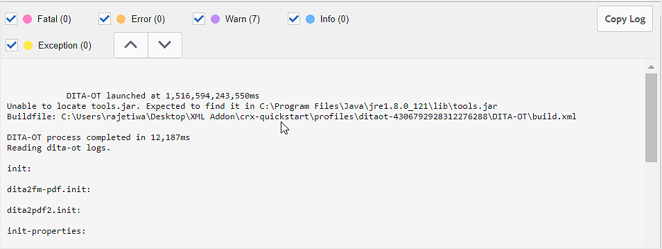

# 基本的なトラブルシューティング {#id1821I0Y0G0A}

AEM Guidesの操作中に、ドキュメントを公開または開く際にエラーが発生する場合があります。 このようなエラーは、DITA マップ、トピック、またはAEM Guides プロセス自体に発生する可能性があります。 この節では、出力生成ログファイルの情報にアクセスして解析する方法について説明します。 また、DITA トピックが大きすぎる場合は、JSP コンパイルエラーが発生することがあります。 この節では、JSP コンパイルエラーの解決方法についても説明します。

## ログファイルの表示と確認 {#id1822G0P0CHS}

次の手順を実行して、出力生成ログファイルを表示して確認します。

1. 出力生成プロセスを開始したら、DITA マップコンソールで **出力** をクリックします。

   **生成された出力** の **一般** 列には、出力生成の成功または失敗に関するキューを視覚的に提供するアイコンが表示されます。

   {width="300" align="left"}

   上のスクリーンショットでは、最初と 3 番目のアイコンが失敗した出力の生成を示しています。 2 つ目のアイコンは、正常な出力生成を示していますが、メッセージも含まれています。 最後の 1 つは、メッセージを含まない正常な出力生成です。

1. ジョブが完了したら、「**生成日**」列のリンクをクリックします。

   ログファイルが新しいタブで開きます。

   {width="800" align="left"}

1. 次のフィルターを適用して、ログファイル内のテキストをハイライト表示します。
   - Fatal: ログファイル内の致命的なエラーをピンク色でハイライトします。
   - エラー：ログファイル内のエラーをオレンジ色でハイライトします。
   - 警告：ログファイル内の警告を紫色でハイライト表示します。
   - 情報：ログファイル内の情報メッセージを青色でハイライトします。
   - 例外：ログファイル内の例外を黄色でハイライトします。
1. 上下のナビゲーションボタンを使用して、ログファイル内のハイライトされたテキストにジャンプします。

   または、ログファイルをスクロールしてメッセージを確認します。

## テキストエディターでログファイルをコピーして確認する

次の手順を実行して、テキストエディターで出力生成ログファイルをコピーして確認します。

1. 出力生成プロセスを開始したら、DITA マップコンソールで **出力** をクリックします。

1. ジョブが完了したら、「**生成日**」列のリンクをクリックします。

   ログファイルが新しいタブで開きます。

1. 「**ログをコピー**」ボタンをクリックします。 ログファイルがクリップボードにコピーされます。
1. テキストエディターを開き、ログファイルをエディターに貼り付けます。

1. ログファイルをスクロールして、メッセージを確認します。

   次の情報は、DITA ファイルまたはAEM Guides プロセスでエラーが発生したかどうかを判断する際に役立ちます。

   - *DITA マップファイル関連エラー*: DITA マップファイルまたは DITA マップに含まれるその他のファイルにエラーが見つかった場合、ログファイルには「BUILD FAILED」という文字列が含まれます。 ログファイルに記録される情報を確認することで、エラーのあるファイルを特定し、問題を修正することができます。

   次のサンプルログファイルスニペットでは、`BUILD FAILED` メッセージとエラーの理由を確認できます。

   {width="650" align="left"}

   - *AEM Guides関連のエラー*: ログファイルで特定できるその他のタイプのエラーは、AEM Guides プロセス自体に関連しています。 この場合、DITA マップファイルは正常に解析されますが、AEM Guidesの内部エラーが原因で出力生成プロセスが失敗します。 このようなエラーが発生した場合は、テクニカルサポートチームにサポートを求める必要があります。

   次のサンプルログファイルスニペットでは、`BUILD SUCCESSFUL` メッセージが表示され、その他の技術的なエラーが表示されています。

   {width="650" align="left"}

## JSP コンパイルエラーを解決

DITA トピックが大きすぎる場合は、JSP コンパイルエラー\（`org.apache.sling.api.request.TooManyCallsException`\）がブラウザーに表示されることがあります。 このエラーは、編集、レビュー、または発行のためにトピックを開いたときに表示される場合があります。

この問題を解決するには、次の手順を実行します。

1. グローバルナビゲーションから「ツール」を選択し、「操作」 \> 「Web コンソール」を選択します。

   Adobe Experience Manager Web コンソール設定ページが表示されます。

1. *Apache Sling Main Servlet* コンポーネントを検索してクリックします。

   Apache Sling Main Servlet の設定可能なオプションが表示されます。

1. 必要に応じて、「*リクエストあたりの呼び出し数* パラメーターの値を増やします。

**親トピック：**&#x200B;[ 出力生成 ](generate-output.md)
