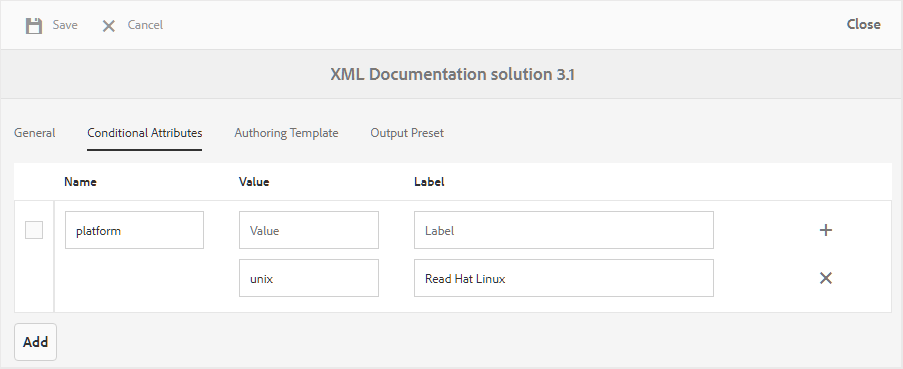

# 条件付き属性プロファイル {#id1843I0HN0Y4}

エンタープライズレベルでは、標準のタグ付けシステムを確実に導入することが非常に重要です。 タグまたは条件属性は、リポジトリ内のデジタルアセットに関連付けることができます。これにより、選択した条件に基づいて出力を公開できます。 例えば、Windows およびMac コンテンツ用の条件属性を作成できます。 次に、これらの属性をトピック内の関連するコンテンツに追加します。 コンテンツの公開時に、Windows コンテンツを公開するか、Macのみのコンテンツを公開するかを選択できます。

AEM Guidesでは、関連する DITA 属性を使用して、条件属性を簡単に作成し、関連付けることができます。 条件属性は、グローバルレベルまたはフォルダーレベルで定義できます。 グローバルに定義された条件は、すべてのプロジェクトで表示され、フォルダー固有の条件は、指定したフォルダー内で作成されたプロジェクトでのみ表示されます。 コンテンツ作成者は、これらの条件付き属性を使用して、作成または使用する DITA トピックまたはマップのコンテンツに条件を付けることができます。 パブリッシャーはこれらの条件を使用して、条件プリセットを作成できます。 公開者は、条件付きプリセットを使用して、公開された出力に含める条件と除外する条件を決定できます。

>[!NOTE]
>
> アクセス権のあるフォルダープロファイルで、条件属性を作成または編集できます。 システム管理者からフォルダープロファイルへのアクセス権が付与されていない場合、フォルダープロファイルで条件属性を作成または編集することはできません。

条件属性を定義するには、次の手順を実行します。

1. 上部の「Adobe Experience Manager」リンクをクリックし、「**ツール**」を選択します。

1. ツールのリストから **ガイド** を選択します。

1. **フォルダープロファイル** タイルをクリックし、フォルダープロファイルを選択します。

   >[!NOTE]
   >
   > グローバルプロファイルは編集できません。

1. 「**条件付き属性**」タブをクリックし、「**編集**」をクリックします。

   条件属性テーブルが表示されています。

1. 「**追加**」をクリックします。

1. 属性の **名前**、**値**、**ラベル** を入力します。

   属性名のみを持つプロファイルを保存できます。 ただし、属性は、値が指定されている場合にのみ使用できます。 属性に – value と label の両方を指定した場合でも、web エディターには属性の値のみが表示されます。 このラベルは、条件付きプリセットの作成時に公開管理者に表示されます。

   次のスクリーンショットは、値が `unix` でラベルが `Red Hat Linux` の `platform` 属性の定義を示しています。

   {width="800" align="left"}

1. 同じ属性に対してさらに値を追加する場合は、「**+**」アイコンをクリックし、追加の値とラベルを入力します。

1. さらに属性を追加する場合は、「**追加**」をクリックします。

1. 「**保存**」をクリックして、変更を保存します。

`platform` 属性はシステムに保存されます。 作成者がフォルダ内の DITA トピックで `platform` 属性を使用する場合、Web エディタの「プロパティ」タブに値が表示されます。

{width="350" align="left"}

**親トピック：**[ 出力生成 ](generate-output.md)
