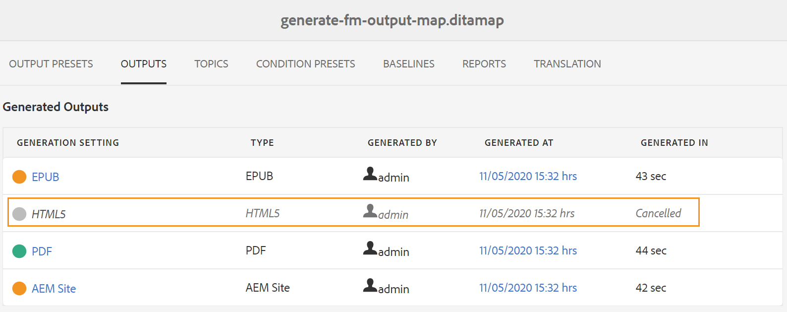

# 公開ダッシュボードを使用した公開タスクの管理 {#id205CC08305Z}

システム上で多数のパブリッシングタスクを実行している場合、各 DITA マップを個別にチェックしてパブリッシングタスクを監視することは事実上不可能になります。 AEM Guidesでは、管理者とパブリッシャーは、システム内で実行されるすべてのパブリッシュタスクを 1 つの統一されたビューで確認できます。 すべてのアクティブな公開タスクのリストが、公開ダッシュボードに表示されます。

公開ダッシュボードには、システムで現在実行中のすべての公開タスクの完全な概要が表示されます。

{width="800" align="left"}

公開ダッシュボードには、次の詳細が含まれます。

- **マップのタイトル** – 現在公開中の、または公開キューに入っているマップファイルのタイトル。

- **File Name** - DITA マップのファイル名。

- **出力プリセット** – 出力の生成に使用する出力プリセットの名前。

- **開始者** – 公開タスクを開始したユーザーのユーザー名。

- **開始日** – 公開タスクが開始された日時。

- **経過時間** - システムで公開タスクが実行されてからの経過時間。

- **削除アイコン** – 公開タスクをキャンセルまたは終了します。

パブリッシュダッシュボードの左側のパネルには、次のフィルタリングオプションがあります。

- **出力プリセット** – 現在アクティブな公開タスクを表示する 1 つ以上の出力プリセットを選択します。 次のスクリーンショットでは、公開タスクがフィルタリングされ、AEM サイト出力プリセットを使用するタスクのみが表示されます。

  {width="800" align="left"}

- **開始者** - リストからユーザー名を選択して、選択したユーザーによって開始された公開タスクを表示します。

- **マップ** - リストからマップ ファイルを選択し、選択したマップに対して実行されているパブリッシュ タスクを表示します。

## 公開ダッシュボードへのアクセス {#id205CC100DY4}

次の手順を実行して、公開ダッシュボードにアクセスします。

>[!NOTE]
>
> パブリッシュダッシュボードにアクセスできるのは、管理者または公開者のみです。

1. 上部の「Adobe Experience Manager」リンクをクリックし、「**ツール**」を選択します。

1. ツールのリストから **ガイド** を選択します。

1. **ダッシュボードを公開** タイルをクリックします。

   パブリッシュダッシュボードが開き、システム内のすべてのアクティブな公開タスクのリストが表示されます。

   「ファイル名」 リンクをクリックすると、選択したマップの DITA マップコンソールが表示されます。

   {width="800" align="left"}

>[!NOTE]
>
> マップダッシュボードから出力を生成する際に、「出力」タブからパブリッシュダッシュボードにアクセスすることもできます。 詳しくは、[&#x200B; 出力生成タスクのステータスの表示 &#x200B;](generate-output-for-a-dita-map.md#viewing_output_history) を参照してください。

## 公開タスクのキャンセル

次の手順を実行して、パブリッシュダッシュボードから出力生成タスクをキャンセルします。

1. [&#x200B; パブリッシュダッシュボードにアクセスします &#x200B;](#id205CC100DY4)。

1. アクティブな公開タスクのリストで、キャンセルするタスクの削除アイコンをクリックします。

   {width="800" align="left"}

1. キャンセルを確認するメッセージのプロンプトで **はい** をクリックします。

   キャンセル コマンドは受け入れられ、タスクがアクティブである限りキャンセルが試行されます。 タスクが正常に終了されると、現在アクティブなタスクリストから削除されます。 タスクのステータスは、DITA マップコンソールでも「キャンセル」として更新されます。 次のスクリーンショットでは、*HTML5* タスクがパブリッシュダッシュボードからキャンセルされ、そのステータスも DITA マップコンソールで変更されています。

   {width="800" align="left"}

**親トピック：**&#x200B;[&#x200B; 出力生成 &#x200B;](generate-output.md)
