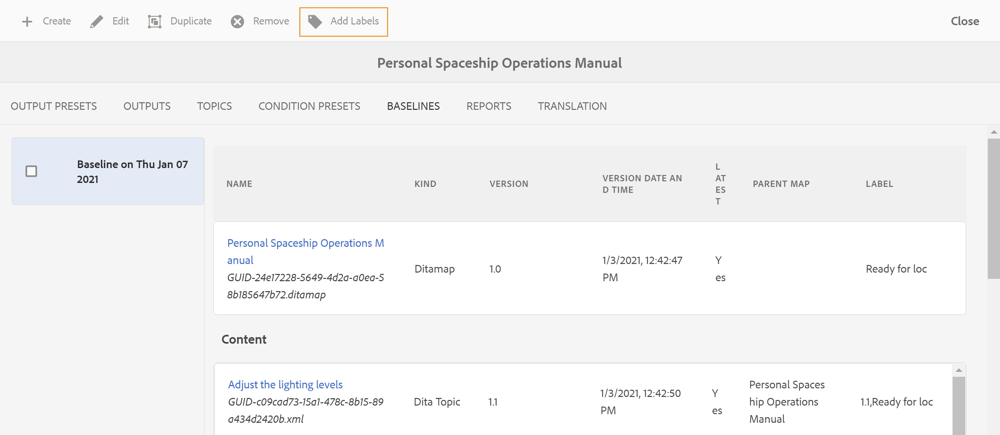
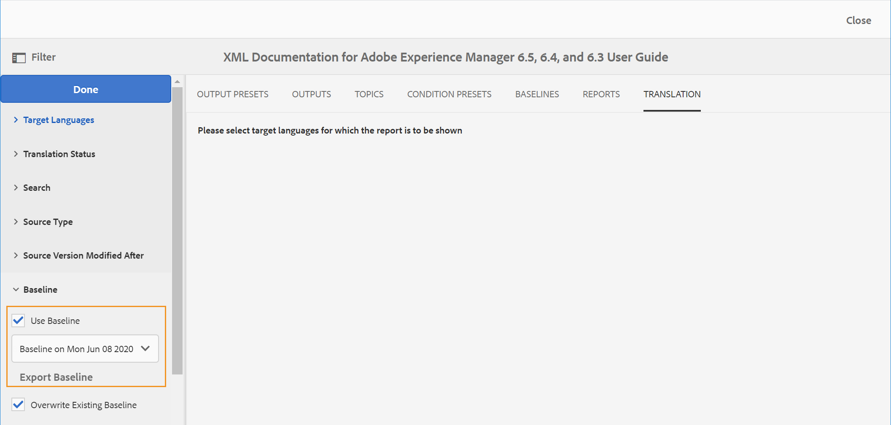

# ベースラインの操作 {#id1825FI0J0PF}

ベースライン機能を使用すると、トピックとアセットのバージョンを作成し、公開または翻訳に使用できます。 例えば、DITA マップに`topicA`と`imageA`がある場合、ベースラインを作成して、3番目のバージョンの`topicA`を使用し、4番目のバージョンの`ImageA`を使用できます。 ベースラインを設定したら、ワンクリックでさまざまなバージョンのトピックを公開または翻訳できます。

出力プリセットでは、ベースラインの選択はオプションであり、DITA マップには複数のベースラインを含めることができます。 ただし、DITA マップ内の各出力プリセットは、1つのベースラインにのみ関連付けることができます。 公開時にベースラインが指定されていない場合、出力は最新バージョンのコンテンツを使用して公開されます。

同様に、コンテンツを翻訳するベースラインの選択はオプションです。 ただし、ベースラインを使用してコンテンツを翻訳する場合は、ベースラインのコンテンツも翻訳されたコピーとともに保存されます。 その後、翻訳されたベースラインを使用して、外部パブリッシャーとの共有やアーカイブなど、さらに操作を実行できます。 翻訳済みベースラインの書き出しについて詳しくは、[翻訳済みベースラインの書き出し](#id196SE600GHS)を参照してください。

>[!TIP]
>
> ベースラインの操作に関するベストプラクティスについては、ベストプラクティスガイドの「*ベースライン*」セクションを参照してください。

管理者は、マップダッシュボードの「ベースライン」タブを設定できます。 詳しくは、『インストールおよび設定ガイド』の「DITA マップダッシュボード *」セクションの「* ベースラインの設定」タブを参照してください。

ベースライン機能にアクセスするには、次の手順を実行します。

1. Assets UIで、DITA マップファイルに移動してクリックします。
1. 「**ベースライン**」タブに移動します。

「ベースライン」タブでは、次のアクションを実行できます。

- [ベースラインの作成](#id195FI0I0MUQ)
- [ベースラインのコンテンツの表示](#id195FI0I0TLN)
- [ベースラインの編集、複製、削除](#id195FI0I0YJL)
- [ベースラインへのラベルの追加](#id184KD0T305Z)

## ベースラインの作成 {#id195FI0I0MUQ}

特定の日時に利用可能なトピックと参照コンテンツの特定のバージョンを含むベースラインを作成したり、トピックのバージョンに対して定義されたラベルを使用して作成したりできます。 ベースラインで選択したトピックのバージョンを個別に指定して、公開または翻訳ワークフローでベースラインを適用するたびに、選択したトピックとそれに対応するバージョンを出力生成または翻訳用に含めることができます。

ベースラインを作成するには、次の手順を実行します。

1. ベースラインページで、**作成**&#x200B;をクリックします。
1. ベースラインの名前を&#x200B;**ベースライン名**&#x200B;に入力します。
   {width="800"}
1. **に基づいてバージョンを設定**&#x200B;で、次のいずれかのオプションを選択します。

   - **ラベル**：適用されたラベルに従ってトピックを選択するには、このオプションを選択します。 入力した文字列に基づいてリストをフィルタリングするラベルを入力します。 フィルター済みリストからラベルを選択して、指定したラベルを持つトピックやその他のアセットを選択できます。

   **ラベル**&#x200B;を選択すると、指定したラベルが適用されていない最新バージョンのトピックを使用するための追加オプションも表示されます。 このオプションを選択せず、指定したラベルを持たないトピックまたはメディアファイルがある場合、ベースライン作成プロセスは失敗します。 ラベルの追加について詳しくは、[&#x200B; ラベルの使用](web-editor-use-label.md#)を参照してください。

   - **上のバージョン** &lt;*タイムスタンプ*\>：指定した日時のトピックのバージョンを選択します。 ここで指定する時間は、AEM サーバーのタイムゾーンに対応します。 サーバーのタイムゾーンが異なる場合、トピックはローカルタイムゾーンではなく、サーバーのタイムゾーンに従ってピックアップされます。

   日付としてラベルまたはバージョンを選択すると、マップ内のすべての参照トピックとメディアファイルが適切に選択されます。 このトピックの選択は、ユーザーインターフェイスには表示されませんが、バックエンドに保存されます。

   >[!NOTE]
   >
   >ベースラインの作成時には、**すべてのトピックを参照** リンクを使用しないことをお勧めします。

1. 「**保存**」をクリックします。

## ベースラインのコンテンツの表示 {#id195FI0I0TLN}

「ベースライン」タブをクリックし、リストから目的のベースラインバージョンを選択すると、既存のベースラインのコンテンツを表示できます。 ベースラインページは、DITA マップファイル、マップの内容またはトピック、参照コンテンツの3つの部分に分かれています。 マップにサブマップが含まれている場合、サブマップから参照されるトピックもコンテンツセクションに表示されます。 ベースラインページの様々な列について以下に説明します。

- **名前**: DITA マップまたはトピックのタイトル、またはアセットの名前（画像のファイル名など）を一覧表示します。

- **種類**: DITA マップ、DITA トピック、画像形式など、マップ内のアセットの種類またはタイプを一覧表示します。

- **バージョン**: ベースラインで使用可能なアセットのバージョンを一覧表示します。

- **バージョン日時**：選択したバージョンのアセットの作成日時を一覧表示します。

- **最新**: ベースラインでアセットの最新バージョンが使用されているかどうかを一覧表示します。

- **親マップ**: マップファイルにサブマップが含まれている場合、この列にはトピックが参照されるマップの名前が含まれます。

- **ラベル**: トピックのバージョンに適用されているラベル\（s\）を一覧表示します。

- **参照元**：この列は、参照されたコンテンツでのみ使用できます。 参照先アセットの親トピックを示します。 アセットが複数のトピックで参照される場合、トピックはコンマで区切られます。

## ベースラインの編集、複製、削除 {#id195FI0I0YJL}

**ベースラインの編集**

既存のベースラインを編集するには、次の手順を実行します。

1. ベースラインを選択し、**編集**&#x200B;をクリックします。
1. ベースラインに必要な変更を加えます。 トピックまたは参照コンテンツの名前とバージョンを変更できます。
1. 1つ以上のトピックに別のバージョンを使用する場合は、これらのトピックを手動で選択して使用できます。 「**トピックを参照**」をクリックし、別のバージョンを使用するトピックを選択します。 選択したトピックの「バージョンを選択」ドロップダウンリストから、ベースラインで使用するトピックのバージョンを選択し、**OK**&#x200B;をクリックします。

   {width="800"}

   トピックと選択したバージョンに関する情報は、バックエンドに保存されます。 この手順を繰り返して、複数のトピックに対して選択したバージョンを変更できます。

1. DITA マップから参照されているすべてのトピックとメディアファイルを読み込むには、**すべてのトピックを参照** リンクをクリックします。 トピックとメディアファイルのUUIDは、トピックタイトルまたは\（media\）ファイル名の下にも表示されます。

   >[!NOTE]
   >
   > DITA マップにネストされたマップとトピックを含む非常に大きなファイルセットがある場合、「すべてのトピックを参照」をクリックすると、すべてのファイルを読み込むのに時間がかかる場合があります。

   マップの内容は、マップファイル、コンテンツ \（トピック参照\）、参照コンテンツ \（ネストされたトピック、マップ、その他のアセット\）の3つのセクションに表示されます。 参照コンテンツがすべて使用可能になったら、ベースラインで使用するトピックのバージョンを個別に選択できます。

   「**バージョン**」ドロップダウンリストには、トピックまたは参照コンテンツの使用可能なバージョンが表示されます。 参照されたコンテンツの場合は、バージョンを自動的に選択するオプションがあります。

   参照されたコンテンツに「**自動的に選択**」を選択すると、システムは、参照されているコンテンツのバージョンに対応する参照されたコンテンツのバージョンを自動的に選択します。 例えば、トピック Aが画像Bを参照しているとします。トピック Aのバージョン 1.5が作成された場合、画像Bのバージョンはリポジトリ内で1.2でした。 これで、画像Bを&#x200B;**自動的に選択**&#x200B;に設定したトピック Aのバージョン 1.5でベースラインが作成されると、システムは画像Bのバージョン 1.2を自動的に選択します。

   ラベルを使用してベースラインを作成すると、**自動的に選択**&#x200B;がすべての参照コンテンツのバージョンに適用されます。

   参照されたコンテンツまたはアセット \（トピック、サブマップ、画像、ビデオ\）がバージョン管理\（新しくアップロードされたコンテンツ\）されていない場合、ベースラインを作成すると、そのようなファイルのバージョンが作成されます。 ただし、ファイルがバージョン管理されている場合、それらのファイルに対する増分バージョンは作成されません。 この動作は、デフォルトで有効になっているバージョンの自動作成の設定によって制御されます。 これは、翻訳プロセスがすべてのファイルにバージョンがあることを期待するコンテンツの翻訳にも必要です。

   >[!NOTE]
   >
   > 特定のリソースに別のバージョンを指定する場合は、**バージョン** ドロップダウンリストから目的のバージョンを選択します。
1. 「**保存**」をクリックします。

**ベースラインの重複**

ベースラインを選択し、**複製**&#x200B;をクリックして、既存のベースラインのコピーを作成します。 ベースラインに別の名前を指定し、トピックと参照コンテンツのバージョン番号を選択して、**保存**&#x200B;をクリックします。

**ベースラインの削除**

ベースラインのバージョンを選択し、**削除**&#x200B;をクリックしてベースラインを削除します。

## ベースラインへのラベルの追加 {#id184KD0T305Z}

各トピックにラベルを追加するには、時間がかかります。 AEM Guidesでは、DITA マップ内の複数のトピックと参照コンテンツにラベルを追加するシングルクリックメカニズムを提供しています。

DITA マップ内の複数のトピックと参照コンテンツにラベルを追加するには、次の手順を実行します。

1. ベースライン ページで、ラベルを追加するトピックと参照コンテンツを含むベースラインを選択します。

   >[!NOTE]
   >
   > ベースラインに最新バージョンのトピックまたはアセットがないことを確認します。 ラベルは、バージョン管理されたトピックまたはアセットにのみ追加できます。

1. 「**ラベルを追加**」をクリックします。

   {width="800"}

1. **ラベルを追加** ダイアログで、このベースラインに関連付ける一意のラベルを指定します。

   管理者が定義済みのラベルを設定している場合、そのラベルはドロップダウンリストに表示されます。 リストからラベルを選択する必要があります。

1. サブマップから参照されるトピックにラベルを適用する場合は、「**子マップと依存関係にラベルを適用**」オプションを選択します。

   - 「**追加**」をクリックします。
指定したラベルがDITA マップと参照トピックおよびコンテンツに追加されます。

     {width="650"}

## 翻訳済みベースラインの書き出し {#id196SE600GHS}

コンテンツの翻訳にはベースラインを使用できます。 例えば、フランス語で翻訳可能なバージョン 1.1のベースラインを作成できます。 「翻訳」タブで、「ベースライン」を使用してコンテンツをフィルタリングし、コンテンツのバージョン 1.1のベースラインを選択する必要があります。 コンテンツの翻訳にBaselineを使用すると、コンテンツの管理が簡単になります。

コンテンツが翻訳されたら、翻訳されたベースラインを書き出してアーカイブしたり、組織内の別のチームと共有したりできます。 翻訳されたベースラインを書き出す前に、次の点を考慮する必要があります。

- ベースラインの書き出しは、ベースライン内のコンテンツが翻訳された後でのみ可能です。 翻訳が開始されていないか完了していないベースラインを書き出そうとすると、エラーが発生します。
- 既に翻訳済みのバージョンのベースラインのみを転送できます。 例えば、コンテンツのバージョン 1.1のベースラインを作成し、同じベースラインを翻訳した場合、このベースラインを書き出すことができます。 ただし、翻訳されていないバージョン 1.2のベースラインを作成した場合、このベースラインを書き出すことはできません。
- ベースラインが既に書き出されている場合は、書き出し中に「*既存のベースラインを上書き*」オプションを選択して、既存のベースラインを上書きできます。

翻訳されたベースラインを書き出すには、次の手順を実行します。

1. 翻訳されたベースラインを含むDITA マップを開きます。

1. 「**翻訳**」タブで、左側のパネルにある「**ベースライン**」オプションを展開します。

   {width="800"}

1. 「**ベースラインを使用**」オプションを選択し、書き出すベースラインを選択します。

1. 「**ベースラインの書き出し**」をクリックします。

   書き出しステータスが表示されます。 プロセスが成功すると、ベースラインを書き出す言語を示すメッセージが表示されます。 障害の場合は、障害の原因が表示されます。

   既に書き出されているベースラインを書き出そうとすると、ベースライン作成の失敗メッセージも表示されます。

1. \（オプション\）既に書き出されているベースラインを書き出すには、**既存のベースラインを上書き**&#x200B;を選択し、**ベースラインを書き出し**&#x200B;をクリックします。

**親トピック：**&#x200B;[&#x200B;出力生成](generate-output.md)
