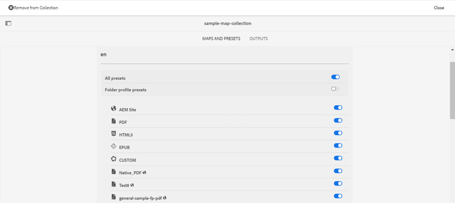

# 出力生成にマップコレクションを使用 {#id1723F20G0HS}

あらゆる組織において、製品には複数の種類のドキュメントが含まれます。 パブリッシングスペシャリストは、どのドキュメントに対してどのような出力を生成するかを制御したいと考えます。 また、ワンクリックで複数のドキュメントを一括公開する方法もあります。

AEM Guidesでは、Map Collectionというダッシュボードを使用して、公開用のコンテンツを整理できます。 マップコレクションを使用すると、すべての異なるタイプのドキュメントを1つのユニットに組み立てることができます。 マップコレクションの各ドキュメントに対して生成する出力のタイプを選択できます。 さらに、出力を生成し、公開ダッシュボードから出力生成の進行状況を確認することもできます。

マップコレクションでは、最後に公開された出力からマップに変更があるかどうかを表示するオプションを提供します。 マップコレクションの「マップとプリセット」タブで詳細を表示し、必要に応じて出力を再公開できます。 詳しくは、マップコレクションへのマップの追加を参照してください。

## マップコレクションの作成とDITA マップの追加

マップコレクションを作成し、DITA マップをコレクションに追加するには、次の手順を実行します。

1. Assets UIで、「**コレクションをマップ**」をクリックします。

   「マップコレクション」リンクが使用できない場合は、左側のパネルで「**ナビゲーション**」オプションを選択し、「**マップコレクション**」をクリックします。

   {width="350"}

1. マップコレクションのタイトルを入力します。
1. 「**作成**」をクリックします。

   マップコレクションの作成時に成功メッセージが表示されます。

1. 成功メッセージの&#x200B;**閉じる**&#x200B;をクリックします。

   新しく作成したマップファイルがマップコレクションページに表示されます。

1. 編集するコレクションのタイルにあるグレーのボックスをクリックします。
1. 「**編集**」をクリックし、「**マップを追加**」をクリックします。
1. マップコレクションに追加するDITA マップを探して追加します。

   デフォルトでは、マップに関連付けられたすべてのプリセットとロケールが自動的に追加されます。

1. スライディングボタンをオンまたはオフにして、目的の出力を選択します。
1. 「**完了**」をクリックします。

   DITA マップファイルがマップコレクションに追加されます。

   {width="800"}

次のフィルタリングオプションとマップの詳細がコレクションページに表示されます。

- **フィルター：**&#x200B;最新のパネルには、次のフィルターが表示されます。
   - **変更**:「はい」または「いいえ」を選択できます。 「はい」を選択すると、変更されたDITA マップのみがマップとプリセット テーブルに表示されます。
   - **プリセット**: マップファイルを除外するプリセットを選択します。 例えば、*AEM サイト* プリセットを選択した場合、*AEM サイト*&#x200B;出力プリセットが設定されているマップのみが表示されます。
   - **言語**：使用可能な言語コードのいずれかを選択し、選択した言語のみをマップとプリセット テーブルに表示できます。
- **マップとプリセット** テーブル：マップとプリセット テーブルには、次の列の情報が表示されます。
   - **Map**: DITA マップファイルのタイトルを表示します。
   - **Filename**: DITA マップのファイル名を表示します。
   - **言語**: DITA マップの言語を表示します。
   - **プリセット**: マップファイルで設定された出力プリセットタイプを表示します。
   - **ベースライン**：出力プリセットで使用されるベースラインを表示します。  ベースラインが使用されていない場合は、ハイフン「 – 」が表示されます
   - **変更済み**: DITA マップが最後の公開後に更新されるかどうかを示します。 この情報に基づいて、このDITA マップの出力を再公開するかどうかを決定できます。
   - **最終生成日時**：最後に生成された出力の日時を表示します。

## マップコレクションを使用した出力の設定と生成

マップコレクションを使用して出力を設定および生成するには、次の手順を実行します。

1. マップコレクションを開きます。AEM サイト、PDF（ネイティブPDFを含む）、HTML 5、EPUB、カスタムプリセットなど、様々な出力プリセットを表示できます。 管理者が作成したグローバルおよびフォルダープロファイルプリセットを表示することもできます。

    アイコンは、フォルダープロファイルレベルのプリセットを示します。
1. \（オプション\）要件に応じて次のいずれかの操作を行います。
   - 左側のパネルから「フィルター」を適用して、変更されたマップ、出力プリセット、または言語をフィルタリングします。
   - 必要に応じて、**編集**&#x200B;をクリックし、スライドボタンをオンまたはオフにして、目的の出力を変更します。

     >[!NOTE]
     >  
     > デフォルトでは、新しいプリセットはすべて無効になっています。

1. DITA マップのプリセットは、次の方法で有効にできます。

   - 任意の個々のプリセットを有効にします。
   - DITA マップの&#x200B;**すべてのプリセット**&#x200B;を有効にして、すべてのプリセットを1回で選択します。 このオプションはデフォルトでは無効です。
   - DITA マップの&#x200B;**フォルダープロファイルプリセット**&#x200B;を有効にして、そのフォルダープロファイルプリセットをすべて選択します。 このオプションはデフォルトでは無効です。
     {width="800"}

1. 次のいずれかの操作を行います。

   - 選択したマップの出力を生成するには、マップファイルを選択し、**選択したマップを生成**&#x200B;をクリックします。
   - すべてのDITA マップの出力を設定されたプリセットで生成するには、**すべて生成**&#x200B;をクリックします。

   >[!IMPORTANT]
   >
   > プリセットまたはDITA マップの出力生成プロセスがキュー内または処理中の場合、同じプリセットまたはマップに対して別の出力生成タスクを開始することはできません。

## メタデータプロパティの設定

マップコレクションでは、DITA マップのメタデータプロパティを一括設定できます。 「**メタデータを設定**」を選択して、**アセットメタデータ** ページを開きます。 **アセットメタデータ** ページでは、コレクションに存在するすべてのマップが左側に一覧表示されます。

{width="800"}

メタデータプロパティを設定するには、次の手順を実行します。

1. メタデータを更新するマップを選択できます。 デフォルトでは、存在するすべてのDITA マップが選択されます。

1. DITA マップを選択すると、メタデータ、スケジュール（非アクティブ化）、参照、ドキュメント状態などのプロパティを表示できます。

1. メタデータプロパティを更新します。

1. 上部の&#x200B;**保存して閉じる**&#x200B;をクリックして、更新を保存します。
1. （オプション）タグを更新する場合、**保存して閉じる** ドロップダウンで「追加」を選択して、新しいタグを既存のリストに追加することもできます。
1. 「**保存して閉じる**」ドロップダウンから「**送信**」をクリックします。
メタデータプロパティは、マップコレクションから一括で選択したDITA マップに対して更新されます。

>[!NOTE]
> 
>**文書状態** ドロップダウンでは、選択したすべてのDITA マップに共通で許可されている文書状態のみを選択できます。 詳しくは、[**ドキュメントの状態**](./web-editor-document-states.md)&#x200B;を参照してください。

メタデータプロパティはファイルプロパティと同期しています。 更新したら、Web エディターの&#x200B;**ファイルのプロパティ** パネルから表示できます。

## マップコレクションまたはDITA マップをマップコレクションから削除する

- マップコレクションを削除するには、マップコレクションページでコレクションを選択し、**削除**&#x200B;をクリックします。
- マップコレクションからDITA マップを削除するには、マップコレクションを編集モードで開き、DITA マップファイルを選択して、**コレクションから削除**&#x200B;をクリックします。

これにより、DITA マップに関連付けられているプリセットまたはロケールもマップコレクションから削除されます。

## マップコレクションからの出力生成タスクのキャンセル

[DITA マップコンソール &#x200B;](generate-output-for-a-dita-map.md#id2061H100T5Z)または[公開ダッシュボード &#x200B;](generate-output-publish-dashboard.md#)から出力生成タスクをキャンセルする方法と同様に、マップコレクションから出力生成タスクをキャンセルできます。 マップコレクションの「出力」タブにアクセスし、キャンセルする公開タスクに移動し、「**このジョブをキャンセル**」アイコンをクリックして公開タスクをキャンセルします。

{width="800"}

**親トピック：**&#x200B;[&#x200B;出力生成](generate-output.md)
