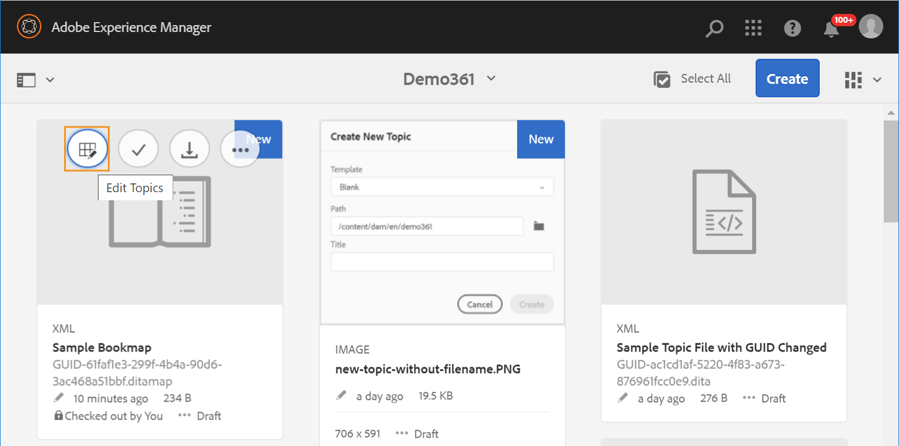
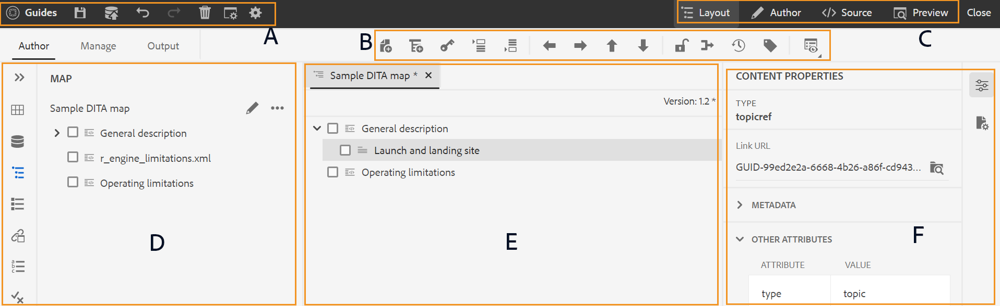
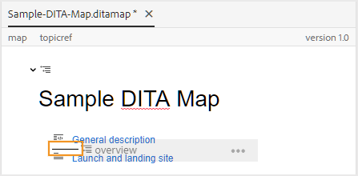
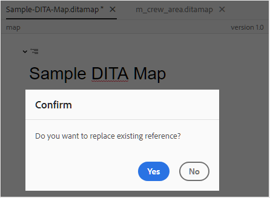
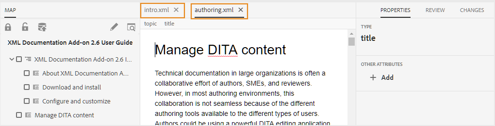
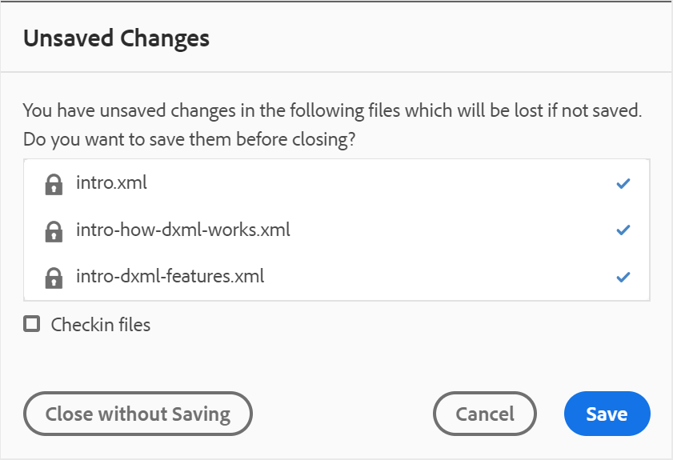
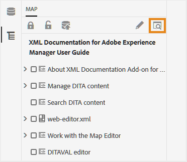

# 高度なマップエディターの操作 {#id1942D0S0IHS}

高度なマップエディターは直感的なユーザーインターフェイスを備えており、Web エディターと似ています。 Web エディターでマップファイルを開くと、高度なマップエディターインターフェイスを使用してマップファイルを編集するオプションが表示されます。 高度なマップエディターを使用すると、トピック参照、キー参照、コンテンツの構造などを追加できます。

Web エディターからマップファイルを直接編集するだけでなく、Web エディターを編集するためにマップ内のトピックファイルを開くこともできます。 このトピックでは、高度なマップエディターの機能と、Web エディターでDITA マップ内のファイルを開いて編集する方法について説明します。

## マップファイルへのトピックの追加

詳細マップエディターを使用してマップファイルを作成するには、次の手順を実行します。

1. Assets UIで、編集するマップファイルに移動します。

   >[!NOTE]
   >
   > アセットの選択モードが有効になっていないことを確認します。

1. マップファイルの排他的ロックを取得するには、マップファイルを選択し、**チェックアウト**&#x200B;をクリックします。

   >[!NOTE]
   >
   > マップファイルに排他的ロックを設定すると、他のユーザーはマップを編集できなくなります。 ただし、マップファイル内のトピックに関する作業は可能です。 管理者が編集前にファイルをチェックアウトするようにWeb エディターを設定している場合、チェックアウトするまでファイルを編集できません。 同様に、設定されている場合、チェックアウトしたファイルを閉じる前にチェックインするように求められます

1. マップファイルを選択した状態で、**トピックの編集**&#x200B;をクリックします。

   {width="800" align="left"}

   または、マップファイルのアクションメニューから「**トピックを編集**」オプションを選択することもできます。

   {width="800" align="left"}

   マップファイルは、Web エディターでで編集するために開きます。

1. **編集**&#x200B;アイコンをクリックします。

   {width="550" align="left"}

   マップは、高度なマップエディターインターフェイスで開きます。 新しいマップファイルを開いた場合、マップのタイトルのみがエディターに表示されます。

   {width="800" align="left"}

   - **A** - \（*メインツールバー*\）：これは、Web エディターのメインツールバーに似ています。 詳しくは、Web エディターの[ メインツールバー](web-editor-features.md#id2051EA0G05Z)を参照してください。

   - **B** - \（*セカンダリツールバー*\）これは、マップファイルを操作できるセカンダリツールバーです。 セカンダリのツールバーで使用できる機能について詳しくは、[高度なマップエディターのツールバーで使用できる機能](#id205DEC0005Z)を参照してください。

   - **C** - \（*マップビュー*\）: マップエディターをレイアウト、作成者、Source、プレビューの間で切り替えることができます。 **レイアウト** ビューを使用すると、DITA マップ内のトピックを整理できます。 これにより、マップのツリーまたは階層ビューが表示されます。 **作成者** ビューでは、マップエディターでトピックを編集できます。 これにより、マップファイルのWYSIWYG ビューも表示されます。 **Source** ビューでは、マップファイルの基になるXMLを操作できます。 プレビューでは、マップファイル内のすべてのトピックとサブマップの統合ビューが表示されます。 **閉じる** リンクは、マップファイルを閉じます。

   - **D** - \（*左パネル*\）：左パネルにアクセスし、お気に入り、リポジトリ、マップ、アウトライン、その他の機能にアクセスできます。 サイドバーを展開アイコン \（\）をクリックして、展開または折りたたむことができます。 左側のパネルで使用できる機能について詳しくは、Web エディターの[左側のパネル ](web-editor-features.md#id2051EA0M0HS)を参照してください。

   - **E** - \（*中間領域*\）: コンテンツ編集領域をマップ化します。

   - **F** - \（*右パネル*\）: プロパティ パネルへのアクセス権を付与します。 選択したトピックまたはマップのコンテンツプロパティとマッププロパティを表示できます。 このパネルで使用できる機能について詳しくは、Web エディターの[右側のパネル ](web-editor-features.md#id2051EB003YK)を参照してください。

1. 左側のパネルで、**リポジトリビュー**&#x200B;に切り替えます。

1. AEM リポジトリで、追加するトピックまたはサブマップを含むフォルダーに移動します。

1. **リポジトリービュー**&#x200B;でトピックまたはマップファイルを選択し、\（middle\）マップコンテンツ編集領域にドラッグ&amp;ドロップします。

   トピックがマップに追加されます。

   {width="800" align="left"}

1. 後続のトピックまたはサブマップを追加するには、トピックまたはサブマップをマップ内の必要な場所にドラッグ&amp;ドロップします。

   マップファイルを作成する際には、次の点を考慮してください。

   - ファイルは、マップ編集領域の水平バーが表示される場所に追加されます。 次のスクリーンショットでは、*一般説明*&#x200B;と&#x200B;*ローンチおよびランディングサイト*&#x200B;のトピックの間に&#x200B;*概要* トピックが追加されます。

     {width="350" align="left"}

   - トピックを置き換えるには、置き換えるトピックの上、左、または右にトピックを置きます。 トピックの左または右にある縦棒は、そのトピックがドロップされているトピックに置き換えられることを示します。

     {width="550" align="left"}

     ただし、トピックを置き換える前に、確認プロンプトが表示されます。 トピックは、確認を行った後にのみ置き換えられます。

     {width="300" align="left"}

   - サブマップをDITA マップに追加すると、サブマップはDITA マップ内のリンクとして表示されます。 サブマップのすべてのトピックを表示するには、Crtl+サブマップリンクをクリックします。 サブマップの内容が新しいタブに表示されます。 同様に、DITA マップからトピックを開くには、Crtl キーを押しながらトピックリンクをクリックすると、新しいタブが開きます。

   - ショートカットキーCTRL+ZおよびCTRL+Yまたはツールバーのそれぞれのアイコンを使用して、マップ内の変更を元に戻したり、やり直したりできます。

   - トピックの位置を変更するには、トピック \（トピックアイコンをクリックして）を選択し、マップファイルの目的の場所にドラッグ&amp;ドロップします。 トピックを配置する場所に水平バーが表示されていることを確認します。 次のスクリーンショットでは、*概要* トピックの後にトピック *起動とランディングサイト*&#x200B;が移動されています。

     {width="350" align="left"}

   - マップファイルのプロパティを確認するには、マップ編集領域の任意の場所を右クリックし、コンテキストメニューから「**プロパティ**」を選択します。 AEMのバージョンにもとづいて、メタデータ、スケジュール\（de\）アクティベーション、参照、ドキュメントの状態などのプロパティを確認できます。

1. 「**保存**」をクリックします。

## 高度なマップエディターのツールバーで使用できる機能 {#id205DEC0005Z}

詳細マップエディターのツールバーは、トピックのWeb エディターと似ています。 左パネルの切り替え、マップの保存、新しいバージョンのマップの作成、最後の操作の取り消しややり直し、選択した要素の削除などの基本的な操作は、両方のエディターで共通しています。 これらの操作の仕組みについて詳しくは、「[Web エディター機能の詳細](web-editor-features.md#)」を参照してください。

次のマップ固有の操作は、レイアウトビューと作成者ビューのツールバーでも使用できます。

## レイアウトビュー {#id205DEC0005Z_layout_view}

マップを編集するために開くと、マップエディターのレイアウトビューが開きます。レイアウトビューでは、マップ階層がツリービューに表示され、マップ内のトピックを整理できます。

>[!NOTE]
>
> レイアウトビューには、マップに存在する参照のみが表示されます。 参照が破損している場合は、参照の左側に小さな十字の記号が表示されます

レイアウトビューでは、次のタスクを実行できます。

**トピック参照を挿入** - 

トピック検索ダイアログを表示します。 挿入するトピック/マップファイルに移動し、「選択」をクリックしてマップに追加します。
{width="800" align="left"}

**トピックグループを挿入** - 

`topicgroup`要素を挿入します。 トピックのグループ化について詳しくは、OASIS DITA言語仕様の[topicgroup](https://docs.oasis-open.org/dita/v1.0/langspec/topicgroup.html) ドキュメントを参照してください。

**キー定義を挿入** - 

キーデフを挿入ダイアログを表示します。 このダイアログを使用して、マップで使用するキー定義を定義します。

{width="300" align="left"}

**挿入前/挿入後** -  / 

エレメントを挿入ダイアログを表示します。 マップに挿入するエレメントを選択します。 操作に応じて、新しいエレメントはマップ内の現在のエレメントの前または後に挿入されます。

**前面を挿入** - 

このアイコンは、ブックマップを開いて編集する際に表示されます。 目次、索引、表のリストなど、ブックの先頭にコンポーネントを挿入できます。

**後付を挿入** - 

このアイコンは、ブックマップを開いて編集する際に表示されます。 索引、用語集、図のリストなど、ブックの末尾にコンポーネントを挿入できます。

**選択した項目を左/右に移動** -  / 

左向き矢印をクリックして、階層の左側にトピックを移動します。 これは基本的に、それぞれのトピックを階層の1 レベル上に昇格させます。 For example, clicking the left arrow while a child topic is selected make it the sibling of the topic above it. Similarly, if you click the right arrow, the topic is pushed towards the right side making it the child of the topic above it.

**Move the Selected Item Up/Down** - / 

Click the up or down arrow icons&#39; to move the topic up or down in the hierarchy.

>[!NOTE]
>
> You can also drag-and-drop the references to move them in a map.

**Lock/Unlock** -  / 

Gets a lock on the map file and release the lock. If you have unsaved changes in your map file, then at the time of releasing the lock, you are prompted to save the map file. The changes are saved in the current version of the map file.

**結合** - 

For more details about merging content from a different version of the same or a different file, see [Merge](web-editor-features.md#id205DF04E0HS) in the Web Editor.

**Version History** - 

Check the available versions and labels on your active topic, and revert to any version from theeditor itself.

**Version Label** - 

Displays the version label management dialog. Select a version from the dropdown list. Choose the label you want to apply to the selected version and click **Add Label** to add it.

**View Options** - 

Displays a dropdown which gives you the option to Show Line Numbers, Show Check box, and Show FileName.

- **Show Line Numbers**

Shows or hides the line number for each topic. The line numbers are shown depending on the level in the hierarchy.

- **Show Check Box**

Shows or hides a checkbox for each topic. You can use the checkbox to select the topic\(s\) and perform various tasks using the Options menu. 詳しくは、[ オプション ](#id228ID8006H8) メニューを参照してください。

- **ファイル名を表示**

トピックのタイトルのファイル名を表示します。

>[!NOTE]
>
> トピックのタイトルにポインターを合わせると、ファイルパスが表示されます。

**条件フィルターに基づいてトピックを表示** トピックに条件を適用した場合、トピックの右側にフィルターアイコンが表示されます。 フィルターアイコンにポインターを置くと、適用された条件とその属性値が表示されます。

レイアウト ビューの&#x200B;**オプション メニュー**

マップファイル内のトピックを整理するだけでなく、レイアウトビューのエレメントで使用可能なオプションメニューを使用して、次のアクションを実行することもできます。

{width="650" align="left"}

- **追加**: マップエディターから新しいトピックまたは空の参照を追加できます。
   - **空の参照**：このオプションを使用すると、DITA マップに空の参照を追加できます。 後で挿入された空の参照をダブルクリックして、トピックの詳細を追加できます。 詳しくは、「[Web エディターでのトピックの作成](web-editor-features.md#id228ICI0105U)」を参照してください。
   - **新しいトピック**: メニューから新しいトピックを作成することを選択すると、「新しいトピックを作成」ダイアログが表示されます。 新規トピックを作成ダイアログで、必要な詳細を入力し、「作成」をクリックします。 詳しくは、「[Web エディターでのトピックの作成](web-editor-features.md#id228ICI0105U)」を参照してください。
- **移動**：階層内のトピックを上下/左右に移動できます。リポジトリーパネルから、マップエディターで開いたマップにトピックまたはマップをドラッグ&amp;ドロップすることもできます。
- **取り消し**: レイアウトビューで最後の操作を取り消します。
- **やり直し**: レイアウトビューで最後の操作をやり直します。
- **コピー**：選択した参照をマップファイルからコピーします。

  >[!NOTE]
  >
  > 複数の参照をコピーするには、チェックボックスを表示して選択します。

- **ペースト**: コピーした参照を階層内の現在の場所にペーストします。
- **削除**：選択した参照をマップファイルから削除します。

  >[!NOTE]
  >
  > 複数の参照を削除するには、チェックボックスを表示して選択します。

## マップエディターの右パネル

右側のパネルには、マップエディターのレイアウトビューにコンテンツプロパティとマッププロパティが表示されます。

**コンテンツのプロパティ**

コンテンツプロパティパネルには、マップ内で現在選択されているトピックのタイプ、リンク URL、および属性に関する情報が表示されます。 詳しくは、Web エディターの[ コンテンツのプロパティ ](web-editor-features.md#id228IDB00HMM)を参照してください。

- **その他の属性**&#x200B;管理者が属性のプロファイルを作成した場合、これらの属性と設定値が表示されます。 コンテンツプロパティパネルを使用して、これらの属性を選択し、トピック内の関連コンテンツに割り当てることができます。 管理者が設定した属性は、エディター設定の「**属性を表示**」タブで割り当てることもできます。 エレメントに対して定義された属性は、レイアウトおよびアウトライン表示に表示されます。 これにより、特定の属性が定義されているマップ内のすべてのトピックを簡単に確認できます。 例えば、platform属性が「Android」として定義されているすべてのトピックです。

  {width="650" align="left"}

  詳細については、[左パネル ](web-editor-features.md#id2051EA0M0HS) セクションの&#x200B;*エディター設定*&#x200B;機能の説明にある&#x200B;*表示属性*&#x200B;を参照してください。

- **メタデータ** メタデータを使用すると、メタデータ情報を設定できます。 ナビゲーションタイトル、リンクテキスト、短い説明、キーワードを定義できます。

標準トピック属性とメタデータについて詳しくは、OASIS DITA言語仕様の[topicref](https://docs.oasis-open.org/dita/v1.2/os/spec/langref/topicref.html) ドキュメントを参照してください。

**マップのプロパティ**

マップのプロパティ ダイアログが表示され、マップの属性とメタデータ情報を設定できます。

## 作成者ビュー {#id205DEC0005Z_author_view}

**作成者** ビューでは、Web エディターでDITA マップを編集できます。 これは、マップエディターのWYSIWYG ビューと、オーサービューに表示される一部のアイコンがレイアウトビューと同じであることを示しています。 詳しくは、[ レイアウトビュー](#id205DEC0005Z_layout_view)を参照してください。 さらに、次のアイコンが表示され、作成者ビューから関連するタスクを実行できます。

**挿入前/挿入後** -  / 

エレメントを挿入ダイアログを表示します。 マップに挿入するエレメントを選択します。 操作に応じて、新しいエレメントはマップ内の現在のエレメントの前または後に挿入されます。

**エレメントを挿入** - 

エレメントを挿入ダイアログを表示します。 挿入するエレメントを選択します。 キーボードを使用してエレメントのリストをスクロールし、Enter キーを押して必要なエレメントを挿入できます。 または、エレメントを直接クリックして、マップに挿入することもできます。

**関係テーブルを挿入** - 

マップに関係テーブルを挿入します。 関係テーブルの操作の概念は、「基本マップエディター」セクションで説明されているものと同じであるため、詳細については、[基本マップエディターでの関係テーブルの操作](map-editor-basic-map-editor.md#id1944B0I0COB)を参照してください。

**再利用可能なコンテンツを挿入** - 

コンテンツを再利用ダイアログを表示します。 このダイアログを使用して、マップで再利用するコンテンツを挿入します。

**ナビゲーションタイトル属性**&#x200B;を更新 – 

参照ファイルの`title`要素を、マップ内の`@navtitle`属性で指定された値と同期します。 トピック、参照、タスク、\（sub\）マップなど、様々なタイプの参照ファイルをマップに追加できます。 これらのファイルのほとんどは`@navtitle`属性をサポートしています。 ファイルに`@navtitle`属性が含まれている場合、マップ内の同じファイルの`@navtitle`属性が更新されます。 `@navtitle`属性が存在しない場合、`@navtitle`属性がその参照ファイルに追加され、その`title`も更新されて`@navtitle`が表示されます。

>[!NOTE]
>
> 管理者は、マップに追加するすべての参照ファイルに`@navtitle`属性を自動追加するように設定できます。 `@navtitle`属性の自動追加の設定について詳しくは、「*Adobe Experience Manager Guides as a Cloud Serviceのインストールと設定」の「* デフォルトで@navtitle属性を含める」を参照してください。

ナビゲーションタイトル属性を更新アイコンをクリックして、`title`要素と`@navtitle`属性の値を同期します。

**タグ表示の切り替え** - 

XML タグを表示または非表示にします。 タグは、要素の境界を示す視覚的なキューとして機能します。 このモードでは、トピック/マップ参照を挿入する場合は、タグの前後に目的のファイルをドラッグ&amp;ドロップします。 横長バーは、タグ表示モードでは表示されません。

**変更のトラックを有効/無効にする** - 

変更をトラック モードを有効にすると、マップファイルで行われたすべての更新を追跡できます。 変更履歴を有効にすると、すべての挿入と削除がドキュメントに取り込まれます。 詳しくは、Web エディターの「[変更履歴を有効/無効にする](web-editor-features.md#id205DF0203Y4)」を参照してください。

**レビュータスクの作成** - 

Web エディターから直接、現在のトピックまたはマップファイルのレビュータスクを作成できます。 レビュータスクを作成するファイルを開き、「レビュータスクを作成」をクリックしてレビュー作成プロセスを開始します。 詳細については、[ トピックまたはマップの確認](review.md#)の説明に従ってください。

## DITA マップによるトピックの編集 {#id17ACJ0F0FHS}

個別のトピックを編集しても、作成者に完全なコンテキストが提供されるわけではありません。 作成者は、DITA マップ内のどこにトピックが配置されているかについての情報を持っていません。 このコンテキスト情報がなければ、作成者がコンテンツを作成することは少し困難になります。

AEM Guidesを使用すると、作成者はWeb エディターでDITA マップを開き、マップ内のトピックの配置を確認できます。 これにより、マップ内のトピックの位置を正確に把握し、より適切なコンテンツを制作できます。 また、複数の作成者がプロジェクトに取り組んでいる場合は、マップ内のすべてのトピックを把握して、必要に応じてコンテンツを再利用できます。

DITA マップを使用してトピックを編集するには、次の手順を実行します。

1. Assets UIで、編集するトピックを含むDITA マップに移動します。
1. DITA マップをクリックして、DITA マップコンソールで開きます。
1. 「**トピック**」タブを選択して、DITA マップで使用可能なトピックのリストを表示します。

   >[!TIP]
   >
   > 「トピック」タブには、依存ファイルを含むマップファイルをダウンロードするオプションが表示されます。 詳しくは、[DITA マップファイルの書き出し](authoring-download-assets.md#id218UBA00IXA)を参照してください。

1. メインツールバーで、**トピックの編集**&#x200B;をクリックします。

   Web エディターでDITA マップが開きます。

   >[!NOTE]
   >
   > Assets UIでDITA マップファイルを選択し、メインツールバーの「**トピックを編集**」をクリックしてWeb エディターを起動することもできます。

   {width="350" align="left"}

1. \(*Optional*\) You can also select a topic from the map and checkout the file before editing. To checkout file\(s\), select one or more files from the left pane and click **Checkout**. You can also release the lock on any file by selecting the checked out file and clicking on the **Cancel Checkout and Unlock** icon in the Map view.

   >[!IMPORTANT]
   >
   > 管理者が「**チェックアウトなしで編集を無効にする**」オプションを設定している場合は、編集前にファイルをチェックアウトする必要があります。 If you do not checkout the file, then the document will open in the editor in read-only mode.

   The following screenshot highlights the icons for Checkout and Lock \(A\), Cancel Checkout and Unlock \(B\), Save As New Version and Unlock \(C\), Edit \(D\), Preview \(E\), different icons showing different DITA file types \(F\), and files that are checked out \(G\).

   {width="550" align="left"}

1. Click on any topic link to open it in the Web Editor for editing.

   You can open multiple topics in the editor and each topic is opened in a new tab in the editor. Even if your DITA map contains sub-maps, topics from the sub-maps are also opened in a new tab for editing. If you want to view the topics under a sub-map, you can click and expand the sub-map.

   {width="800" align="left"}

   If you click a map file, the map is opened in a new tab of the web browser.

1. Once you have finished editing the topics, you can do the following:

   - You can save them individually. If you click on **Close Without Saving** your topics, you will see a dialog prompting you to save the unsaved topics:

     {width="550" align="left"}

     You can choose to save all selected topics or deselect the topics that you do not want to save.

   - You can check in the topic using the **Save As New Version and Unlock** button. When you save a version of the topic, a new version is created and the lock is also released.

     It&#39;s recommended to save your changes before checking in the files.  When you save the changes, the XML file is validated.

   - You can also select and check in multiple topics using the **Save As New Version and Unlock** button. When you save a version of the topics, a new version is created for each topic, and the lock is also released. You can also view the progress of checking in the topics from the **Save As New Version and Unlock** dialog box. A success message is shown when the files are checked in.

   - If your administrator has enabled the option of checking in files on close, then you will be shown a prompt to save files whenever the checked out files are closed. With this option enabled, when you close the editor with changed files, you are shown the list of checked-out files that need to be saved. チェックアウトされたファイルには、ロックアイコンが表示されます。

     {width="550" align="left"}

      - **保存せずに閉じる** ボタンをクリックすると、変更を保存せずにファイルが閉じます。

      - **保存** ボタンをクリックすると、変更は保存されますが、ファイルはチェックインされません。

      - Selecting the **Checking Files** option and then clicking the **Save** button checks in the files \(creates another version\) and also saves the files.

## マップのプレビュー

マップ内の各トピックファイルの位置を確認できるだけでなく、マップコンテンツを1つの連続したフローで確認することが望ましい。 The Preview Map feature allows you to see the entire content of the map file in a single click. マップファイルの出力を生成して、マップ全体が公開後にどのように表示されるかを確認する必要はありません。 You can simply access the map&#39;s preview and all topics and sub-maps are rendered in the form of a book.

マップのプレビューには、次の場所からアクセスできます。

- **Assets UI**: In the Assets UI, navigate to the map location, select the map file, and choose **Preview Map** in the Toolbar. The map&#39;s preview is shown in a new tab. プレビューモードでは、すべてのトピックのコンテンツを表示できます。 このビューでは、トピックを編集することはできません。

  >[!NOTE]
  >
  > *マップのプレビュー* オプションがメインツールバーに表示されない場合は、**詳細** ツールバーメニューの下に移動した可能性があります。

- **高度なマップエディター**：高度なマップエディターで、プレビューアイコンをクリックして、現在のマップのプレビューを表示します。

  {width="350" align="left"}

  プレビューモードでは、次の追加タスクを実行できます。

   - トピックを右クリックし、**編集**&#x200B;を選択して、新しいタブで編集するトピックを開きます。

     >[!NOTE]
     >
     > If you don&#39;t have editing rights, then the topic will open in read-only mode.

   - マップツリー\（左パネル\）のトピックタイトルをクリックして、目的のトピックにジャンプします。

   - The current topic in map preview is also highlighted in the map tree.

**Parent topic:** [Work with the Map Editor](map-editor.md)
