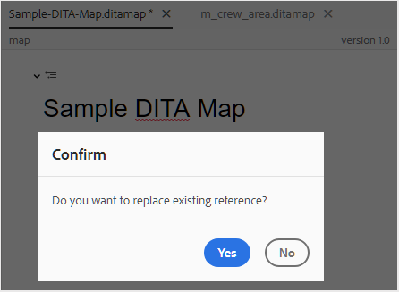
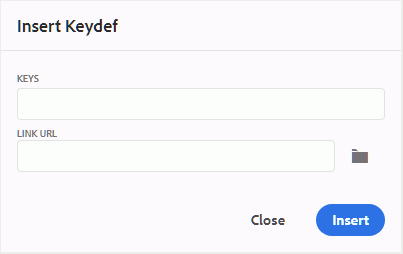
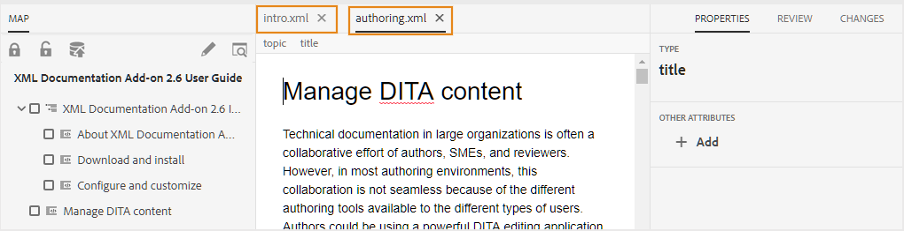

# 高度なマップエディターの操作 {#id1942D0S0IHS}

高度なマップ エディタは直感的なユーザ インタフェースを備えており、Web エディタに似ています。 Web エディタでマップ ファイルを開くと、高度なマップ エディタ インタフェースを使用してマップ ファイルを編集するオプションが表示されます。 高度なマップエディターを使用すると、トピック参照、キー参照を追加し、コンテンツを構造化できます。

Web エディタから直接マップ ファイルを編集する以外に、マップでトピック ファイルを開いて Web エディタを編集することもできます。 このトピックでは、高度なマップエディタの機能と、Web エディタで DITA マップのファイルを開いて編集する方法について説明します。

## マップ ファイルにトピックを追加する

高度なマップエディタを使用してマップファイルを構築するには、次の手順を実行します。

1. Assets UI で、編集するマップファイルに移動します。

   >[!NOTE]
   >
   > アセット選択モードが有効になっていないことを確認してください。

1. マップ ファイルに対して排他的なロックを取得するには、マップ ファイルを選択し、[**チェックアウト**] をクリックします。

   >[!NOTE]
   >
   > マップ ファイルに排他ロックを設定すると、他のユーザはマップを編集できなくなります。 ただし、マップ ファイル内のトピックは作業できます。 管理者が編集前にファイルをチェックアウトするように web エディターを設定している場合、チェックアウトするまでファイルを編集できません。 同様に、設定すると、ファイルを閉じる前に、チェックアウト済みのファイルをチェックインするように求められます

1. マップ ファイルを選択した状態で、[**トピックを編集**] をクリックします。

   {width="800" align="left"}

   または、マップ ファイルのアクション メニューから [**トピックを編集**] オプションを選択することもできます。

   {width="800" align="left"}

   マップ ファイルが開き、Web エディタでで編集できます。

1. **編集**&#x200B;アイコンをクリックします。

   {width="550" align="left"}

   高度なマップエディターインターフェイスでマップが開きます。 新しいマップ ファイルを開いた場合は、マップのタイトルのみがエディタに表示されます。

   {width="800" align="left"}

   - **A** - \（*メインツールバー*\）：これは Web エディターのメインツールバーに似ています。 詳しくは、Web エディターの [ メインツールバー ](web-editor-features.md#id2051EA0G05Z) を参照してください。

   - **B** - \（*セカンダリツールバー*\）これは、マップ ファイルを操作するためのセカンダリツールバーです。 セカンダリツールバーで使用できる機能の詳細については、[ 高度なマップ エディタのツールバーで使用できる機能 ](#id205DEC0005Z) を参照してください。

   - **C** - \（*Map views*\）: マップ エディタをレイアウト、オーサー、Source、プレビューの間で切り替えることができます。 **レイアウト** ビューを使用すると、DITA マップ内のトピックを整理できます。 これにより、マップのツリー表示または階層表示が行われます。 **オーサー** ビューを使用すると、マップ エディタでトピックを編集できます。 これにより、マップファイルのWYSIWYGビューも表示されます。 **Source** ビューを使用すると、マップファイルの基になる XML を操作できます。 プレビューでは、マップ ファイル内のすべてのトピックとサブマップの統合ビューが表示されます。 **閉じる** リンクをクリックすると、マップ ファイルが閉じます。

   - **D** - \（*左パネル*\）：左パネルにアクセスできます。このパネルからは、お気に入り、リポジトリ、マップ、アウトラインなどの機能にアクセスできます。 サイドバーを展開アイコン \（\）をクリックすると、展開または折りたたむことができます。 左側のパネルで使用できる機能について詳しくは、Web エディターの [ 左側のパネル ](web-editor-features.md#id2051EA0M0HS) を参照してください。

   - **E** - \（*中央領域*\）: コンテンツ編集領域をマップします。

   - **F** - \（*Right Panel*\）: プロパティ パネルへのアクセス権を付与します。 選択したトピックまたはマップのコンテンツ プロパティおよびマップ プロパティを表示できます。 このパネルで使用できる機能について詳しくは、web エディターの [ 右のパネル ](web-editor-features.md#id2051EB003YK) を参照してください。

1. 左側のパネルで、「リポジトリ表示 **に切り替え** す。

1. AEM リポジトリで、追加するトピックまたはサブマップを含むフォルダーに移動します。

1. **リポジトリ表示** でトピックまたはマップファイルを選択して、\（中央\） マップコンテンツ編集領域にドラッグ&amp;ドロップします。

   トピックがマップに追加されます。

   {width="800" align="left"}

1. 後続のトピックまたはサブマップを追加するには、トピックまたはサブマップをマップ内の必要な場所にドラッグ アンド ドロップします。

   マップ ファイルを作成する際は、次の点を考慮してください。

   - ファイルは、マップ編集領域で水平バーが表示される場所に追加されます。 次のスクリーンショットでは、*概要* トピックが *概要* トピックと *ローンチとランディングサイト* トピックの間に追加されています。

     {width="350" align="left"}

   - トピックを置き換えるには、置き換えるトピックの上、左、または右にトピックを置きます。 トピックの左または右にある縦棒は、トピックがドロップされて置き換えられることを示します。

     {width="550" align="left"}

     ただし、トピックを置換する前に、確認プロンプトが表示されます。 トピックは、確認を行った後にのみ置き換えられます。

     {width="300" align="left"}

   - サブマップを DITA マップに追加すると、そのサブマップは DITA マップ内のリンクとして表示されます。 サブマップのすべてのトピックを表示するには、サブマップリンクを Ctrl キーを押しながらクリックします。 サブマップのコンテンツが新しいタブに表示されます。 同様に、DITA マップからトピックを開くには、トピックリンクを Ctrl キーを押しながらクリックすると、新しいタブでトピックが開きます。

   - ショートカット キーの Ctrl+Z と Ctrl+Y、またはツールバーの各アイコンを使用して、マップの変更を取り消したり、やり直すことができます。

   - トピックの位置を変更するには、トピック \（トピック アイコン\をクリック）を選択し、マップ ファイル内の目的の場所にドラッグ アンド ドロップします。 トピックを配置する場所に水平バーが表示されていることを確認します。 次のスクリーンショットでは、トピック *ローンチとランディングサイト* を *概要* トピックの後に移動しています。

     {width="350" align="left"}

   - マップ ファイルのプロパティを確認するには、マップ編集領域の任意の場所を右クリックし、コンテキスト メニューから **プロパティ** を選択します。 AEMのバージョンに応じて、メタデータ、\（de\）アクティベーションのスケジュール、参照、ドキュメントの状態などのプロパティが表示されます。

1. 「**保存**」をクリックします。

## 高度なマップ エディタのツールバーで使用できる機能 {#id205DEC0005Z}

高度なマップ エディタのツールバーは、トピック Web エディタに似ています。 左側のパネルの切り替え、マップの保存、新しいバージョンのマップの作成、最後の操作の取り消しとやり直し、選択した要素の削除などの基本的な操作は、両方のエディターで共通です。 これらの操作の仕組みについて詳しくは、[Web エディターの機能について ](web-editor-features.md#) を参照してください。

次のマップ固有の操作は、レイアウト ビューとオーサービューのツールバーでも使用できます。

## レイアウトビュー {#id205DEC0005Z_layout_view}

編集のためにマップを開くと、マップ エディタのレイアウト ビューが開きます。レイアウト ビューでは、マップ階層がツリービューに表示され、マップ内のトピックを整理できます。

>[!NOTE]
>
> レイアウト ビューには、マップ内に存在する参照のみが表示されます。 参照が壊れている場合は、参照の左側に小さな十字記号が表示されます

レイアウト ビューでは、次のタスクを実行できます。

**トピック参照の挿入** - 

トピック検索ダイアログを表示します。 挿入するトピック/マップ ファイルに移動し、[ 選択 ] をクリックしてマップに追加します。
{width="800" align="left"}

**トピック グループの挿入** - 

`topicgroup` 要素を挿入します。 トピックのグループ化の詳細については、OASIS DITA Language Specification の [topicgroup](https://docs.oasis-open.org/dita/v1.0/langspec/topicgroup.html) ドキュメントを参照してください。

**キー定義の挿入** - 

[ キー定義を挿入 ] ダイアログ ボックスを表示します。 このダイアログを使用して、マップで使用するキー定義を定義します。

{width="300" align="left"}

**前に挿入/後に挿入** -  / 

[ 要素を挿入 ] ダイアログ ボックスが表示されます。 マップに挿入する要素を選択します。 操作に応じて、新しい要素がマップ内の現在の要素の前または後に挿入されます。

**前面の問題を挿入** - 

このアイコンは、編集用にブックマップを開いたときに表示されます。 目次、索引、表リストなど、ブックの先頭にコンポーネントを挿入できます。

**バックマターの挿入** - 

このアイコンは、編集用にブックマップを開いたときに表示されます。 索引、用語集、図表一覧など、ブックの末尾のコンポーネントを挿入できます。

**選択した項目を左/右に移動** - /

左矢印をクリックして、トピックを階層の左側に移動します。 これにより、基本的に階層内の各トピックが 1 つ上のレベルに昇格します。 例えば、子トピックが選択されているときに左矢印をクリックすると、その子トピックがその上にあるトピックの兄弟になります。 同様に、右矢印をクリックすると、トピックが右側に押され、その上にあるトピックの子になります。

**選択した項目を上下に移動** - / 

階層内でトピックを上下に移動するには、上下の矢印アイコンをクリックします。

>[!NOTE]
>
> 参照をドラッグ&amp;ドロップして、マップ内で移動することもできます。

**ロック/ロック解除** -  / 

マップ ファイルのロックを取得し、ロックを解除します。 マップ ファイルに未保存の変更がある場合、ロックを解除すると、マップ ファイルを保存するよう求められます。 変更内容は、マップ ファイルの現在のバージョンに保存されます。

**結合** - 

同じファイルまたは別のファイルの別のバージョンからのコンテンツの結合について詳しくは、Web エディターの [ 結合 ](web-editor-features.md#id205DF04E0HS) を参照してください。

**バージョン履歴** - 

アクティブなトピックで使用可能なバージョンとラベルを確認し、エディター自体から任意のバージョンに戻します。

**バージョンラベル** - 

バージョン ラベル管理ダイアログを表示します。 ドロップダウンリストからバージョンを選択します。 選択したバージョンに適用するラベルを選択し、「**ラベルを追加**」をクリックして追加します。

**表示オプション** - 

行番号の表示、チェック ボックスの表示、およびファイル名の表示を選択できるドロップダウンを表示します。

- **行番号を表示**

各トピックの行番号を表示または非表示にします。 行番号は、階層のレベルに応じて表示されます。

- **チェックボックスを表示**

各トピックのチェックボックスの表示/非表示を切り替えます。 チェックボックスを使用してトピック\（s\）を選択し、オプション メニューを使用して様々なタスクを実行できます。 詳しくは、[ オプション ](#id228ID8006H8) メニューを参照してください。

- **ファイル名を表示**

トピックのタイトルのファイル名を表示します。

>[!NOTE]
>
> トピックのタイトルの上にポインタを合わせると、ファイルパスが表示されます。

**条件付きフィルターに基づいてトピックを表示** トピックに条件を適用した場合は、トピックの右側にフィルターアイコンが表示されます。 フィルターアイコンの上にポインターを置くと、適用された条件と属性値が表示されます。

**レイアウトビューのオプションメニュー**

マップ ファイル内のトピックを整理する以外に、レイアウト ビューで要素に使用できるオプション メニューを使用して、次の操作を実行することもできます。

{width="650" align="left"}

- **追加**：マップエディタから新しいトピックまたは空の参照を追加するように選択できます。
   - **空の参照**：このオプションを使用すると、DITA マップに空の参照を追加できます。 挿入した空の参照を後でダブルクリックして、トピックの詳細を追加できます。 詳細については、Web エディタの [ トピックの作成 ](web-editor-features.md#id228ICI0105U) を参照してください。
   - **新規トピック**：メニューから新しいトピックの作成を選択すると、「新しいトピックの作成」ダイアログが表示されます。 新規トピックを作成ダイアログで、必要な詳細を入力して「作成」をクリックします。 詳細については、Web エディタの [ トピックの作成 ](web-editor-features.md#id228ICI0105U) を参照してください。
- **移動**：階層内でトピックを上下/左右に移動できます。また、リポジトリ・パネルからマップ・エディタで開いたマップにトピックまたはマップをドラッグ・アンド・ドロップすることもできます。
- **取り消し**：レイアウトビューの最後の操作を取り消します。
- **やり直し**：レイアウトビューの最後の操作をやり直します。
- **コピー**：選択した参照をマップファイルからコピーします。

  >[!NOTE]
  >
  > チェックボックスを表示して選択し、複数の参照をコピーできます。

- **貼り付け**：コピーした参照を、階層内の現在の場所に貼り付けます。
- **削除**：選択した参照をマップファイルから削除します。

  >[!NOTE]
  >
  > チェックボックスを表示して選択すると、複数の参照を削除できます。

## マップエディタの右パネル

右側のパネルには、マップ エディタのレイアウト ビューにコンテンツ プロパティとマップ プロパティが表示されます。

**コンテンツのプロパティ**

コンテンツのプロパティパネルには、マップ内で現在選択されているトピックのタイプ、リンク URL およびその属性に関する情報が含まれています。 詳しくは、Web エディターの [ コンテンツのプロパティ ](web-editor-features.md#id228IDB00HMM) を参照してください。

- **その他の属性** 管理者が属性用のプロファイルを作成している場合は、これらの属性と、設定済みの値が取得されます。 コンテンツのプロパティパネルを使用して、これらの属性を選択し、トピック内の関連するコンテンツに割り当てることができます。 また、エディター設定の「**属性を表示**」タブで、管理者が設定した属性を割り当てることもできます。 要素に定義されている属性は、レイアウトビューとアウトラインビューに表示されます。 これにより、特定の属性が定義されているマップ内のすべてのトピックをすばやく確認できます。 例えば、platform 属性が「Android」として定義されているすべてのトピックです。

  {width="650" align="left"}

  詳しくは、*左パネル* セクションの *エディター設定* 機能説明にある [ 表示属性 ](web-editor-features.md#id2051EA0M0HS) を参照してください。

- **メタデータ** メタデータを使用すると、メタデータ情報を設定できます。 ナビゲーションタイトル、リンクテキスト、短い説明およびキーワードを定義できます。

標準トピックの属性とメタデータの詳細は、OASIS DITA 言語仕様の [topicref](https://docs.oasis-open.org/dita/v1.2/os/spec/langref/topicref.html) のマニュアルを参照してください。

**マップのプロパティ**

[ マップ プロパティ ] ダイアログ ボックスが表示され、マップの属性とメタデータ情報を設定できます。

## 作成者ビュー {#id205DEC0005Z_author_view}

**オーサー** ビューを使用すると、Web エディタで DITA マップを編集できます。 これにより、マップエディタのWYSIWYG ビューが表示され、オーサービューに表示されるアイコンの一部がレイアウトビューと同じになります。 詳しくは、[ レイアウトビュー ](#id205DEC0005Z_layout_view) を参照してください。 また、以下のアイコンを参照し、オーサービューで関連タスクを実行することができます。

**前に挿入/後に挿入** -  / 

[ 要素を挿入 ] ダイアログ ボックスが表示されます。 マップに挿入する要素を選択します。 操作に応じて、新しい要素がマップ内の現在の要素の前または後に挿入されます。

**要素を挿入** - 

[ 要素を挿入 ] ダイアログ ボックスが表示されます。 挿入する要素を選択します。 キーボードを使用して要素のリストをスクロールし、Enter キーを押して必要な要素を挿入できます。 または、要素を直接クリックして、マップに挿入することもできます。

**関係テーブルの挿入** - 

マップに関係テーブルを挿入します。 リレーションシップ テーブルの操作の概念は、基本マップ エディタの項で説明した概念と同じです。詳細は、[ 基本マップ エディタでリレーションシップ テーブルを操作する ](map-editor-basic-map-editor.md#id1944B0I0COB) を参照してください。

**再利用可能なコンテンツを挿入** - 

[ コンテンツを再利用 ] ダイアログが表示されます。 このダイアログを使用して、マップで再利用するコンテンツを挿入します。

**ナビゲーションタイトル属性を更新** - 

マップ内の参照ファイルの `title` 要素を、その `@navtitle` 属性で指定された値と同期します。 トピック、参照、タスク、\（sub\） マップなど、マップには異なるタイプの参照ファイルを追加できます。 これらのファイルのほとんどは、`@navtitle` 属性をサポートしています。 ファイルに `@navtitle` 属性が含まれている場合、マップ内の同じファイルの `@navtitle` 属性が更新されます。 `@navtitle` 属性が存在しない場合は、`@navtitle` 属性がその参照ファイルに追加され、その `title` も更新されて `@navtitle` が表示されます。

>[!NOTE]
>
> 管理者は、マップに追加するすべての参照ファイルに `@navtitle` 属性の自動追加を設定できます。 `@navtitle` 属性の自動追加の設定について詳しくは、「Adobe Experience Manager Guidesのas a Cloud Serviceのインストールと設定」の *@navtitle 属性をデフォルトで含める* を参照してください。

ナビゲーションタイトル属性を更新アイコンをクリックして、`title` 要素と `@navtitle` 属性の値を同期します。

**タグ表示の切り替え** - 

XML タグの表示/非表示を切り替えます。 タグは、要素の境界を示す視覚的なキューとして機能します。 このモードでトピック/マップ参照を挿入する場合は、タグの前後に目的のファイルをドラッグ&amp;ドロップします。 水平バーは、タグビューモードでは表示されません。

**変更の追跡を有効/無効にする** - 

[ 変更を追跡 ] モードを有効にすると、マップ ファイルに加えられたすべての更新を追跡できます。 トラックの変更を有効にすると、すべての挿入と削除がドキュメントに取り込まれます。 詳しくは、Web エディターでの [ トラックの変更を有効/無効にする ](web-editor-features.md#id205DF0203Y4) を参照してください。

**レビュータスクを作成** - 

Web エディタから直接、現在のトピックまたはマップ ファイルのレビュータスクを作成できます。 レビュータスクを作成するファイルを開き、「レビュータスクを作成」をクリックしてレビュー作成プロセスを開始します。 詳細については、[ トピックまたはマップのレビュー ](review.md#) に記載されている手順に従ってください。

## DITA マップによるトピックの編集 {#id17ACJ0F0FHS}

個々のトピックを編集しても、作成者に完全なコンテキストは提供されません。 作成者は、トピックが DITA マップ内のどこにあるかに関する情報を持ちません。 このコンテキスト情報がないと、作成者がコンテンツを作成するのが少し難しくなります。

AEM Guidesを使用すると、作成者は Web エディタで DITA マップを開き、マップ内のトピックの配置を確認できます。 これにより、作成者は、トピックがマップ内のどこに配置されているかを把握し、より関連性の高いコンテンツを作成できます。 また、1 つのプロジェクトで複数の作成者が作業している場合、すべてのトピックがマップで使用可能であるかを把握し、必要に応じてコンテンツを再利用できます。

DITA マップを使用してトピックを編集するには、次の手順を実行します。

1. Assets UI で、編集するトピックを含む DITA マップに移動します。
1. DITA マップをクリックして、DITA マップコンソールで開きます。
1. 「**トピック**」タブを選択して、DITA マップで使用可能なトピックのリストを表示します。

   >[!TIP]
   >
   > [ トピック ] タブでは、マップ ファイルとその従属ファイルをダウンロードするオプションが表示されます。 詳細については、「[DITA マップファイルのエクスポート ](authoring-download-assets.md#id218UBA00IXA)」を参照してください。

1. メイン ツールバーで、[**トピックを編集**] をクリックします。

   Web エディタで DITA マップが開きます。

   >[!NOTE]
   >
   > Assets UI で DITA マップファイルを選択し、メインツールバーの「**トピックを編集**」をクリックして Web エディタを起動することもできます。

   {width="350" align="left"}

1. \（*オプション*\） マップからトピックを選択し、編集前にファイルをチェックアウトすることもできます。 ファイル\（s\）をチェックアウトするには、左側のペインから 1 つ以上のファイルを選択し、「**チェックアウト**」をクリックします。 チェックアウトされたファイルを選択し、マップビューの「**チェックアウトをキャンセルしてロック解除**」アイコンをクリックして、ファイルのロックを解除することもできます。

   >[!IMPORTANT]
   >
   > 管理者が「**チェックアウトせずに編集を無効にする** オプションを設定した場合、編集する前にファイルをチェックアウトする必要があります。 ファイルをチェックアウトしない場合、ドキュメントはエディターで読み取り専用モードで開きます。

   次のスクリーンショットは、チェックアウトとロック \（A\）、チェックアウトのキャンセルとロック解除\（B\）、新規バージョンとして保存とロック解除\（C\）、編集\（D\）、プレビュー\（E\）、異なる DITA ファイルタイプを示す異なるアイコン \（F\）、チェックアウトされたファイル \（G\）を示しています。

   {width="550" align="left"}

1. 任意のトピックリンクをクリックして、web エディターで開いて編集します。

   エディターで複数のトピックを開くことができ、各トピックはエディターの新しいタブで開きます。 DITA マップにサブマップが含まれている場合でも、サブマップのトピックは新しいタブで開いて編集できます。 サブマップの下のトピックを表示する場合は、サブマップをクリックして展開します。

   {width="800" align="left"}

   マップ ファイルをクリックすると、マップは Web ブラウザの新しいタブで開きます。

1. トピックの編集が完了したら、次の操作を実行できます。

   - 個別に保存できます。 トピックの「**保存せずに閉じる**」をクリックすると、未保存のトピックを保存するように求めるダイアログが表示されます。

     {width="550" align="left"}

     選択したすべてのトピックを保存するか、保存しないトピックの選択を解除するかを選択できます。

   - 「**新しいバージョンとして保存してロックを解除** ボタンを使用して、トピックをチェックインできます。 トピックのバージョンを保存すると、新しいバージョンが作成され、ロックも解除されます。

     ファイルをチェックインする前に、変更を保存することをお勧めします。  変更を保存すると、XML ファイルが検証されます。

   - 「**新しいバージョンとして保存してロックを解除** ボタンを使用して、複数のトピックを選択してチェックインすることもできます。 トピックのバージョンを保存すると、トピックごとに新しいバージョンが作成され、ロックも解除されます。 トピックのチェックインの進行状況は、「新規バージョンとして保存 **およびロック解除** ダイアログボックスからも確認できます。 ファイルがチェックインされると、成功メッセージが表示されます。

   - 管理者がファイルを閉じるときにチェックインするオプションを有効にしている場合、チェックアウトしたファイルを閉じるたびに、ファイルを保存するかどうかを確認するメッセージが表示されます。 このオプションを有効にすると、変更したファイルでエディタを閉じるときに、保存する必要のあるチェックアウト済みファイルの一覧が表示されます。 チェックアウトされたファイルには、鍵のアイコンが付きます。

     {width="550" align="left"}

      - 「**保存せずに閉じる**」ボタンをクリックすると、変更を保存せずにファイルが閉じます。

      - 「**保存**」ボタンをクリックすると、変更は保存されますが、ファイルはチェックインされません。

      - 「**ファイルのチェック**」オプションを選択して「**保存**」ボタンをクリックすると、ファイルがチェックインされ、\（別のバージョンが作成されます\）ファイルも保存されます。

## マップをプレビューする

マップ内の各トピック ファイルの位置を確認できることに加えて、マップ コンテンツを 1 つの連続したフローで確認することをお勧めします。 マップのプレビュー機能を使用すると、マップ ファイルのコンテンツ全体をワンクリックで表示できます。 マップ ファイルの出力を生成して、パブリッシュ後にマップ全体がどのように表示されるかを確認する必要はありません。 マップのプレビューにアクセスするだけで、すべてのトピックとサブマップがブックの形式でレンダリングされます。

マップのプレビューには、次の場所からアクセスできます。

- **Assets UI**: Assets UI で、マップの場所に移動して、マップ ファイルを選択し、ツールバーの **マップをプレビュー** を選択します。 マップのプレビューが新しいタブに表示されます。 すべてのトピックのコンテンツは、プレビューモードで表示できます。 このビューでは、トピックを編集できません。

  >[!NOTE]
  >
  > 「*マップをプレビュー*」オプションがメインツールバーに表示されない場合は、「その他 **ツールバーメニューの下に移動してい** 可能性があります。

- **高度なマップエディター**：高度なマップエディターで、「プレビュー」アイコンをクリックして、現在のマップのプレビューを表示します。

  {width="350" align="left"}

  プレビューモードでは、次の追加タスクを実行できます。

   - トピックを右クリックし、「**編集**」を選択して新しいタブで編集用のトピックを開きます。

     >[!NOTE]
     >
     > 編集権限がない場合、トピックは読み取り専用モードで開きます。

   - マップ ツリーのトピック タイトル \（左のパネル\）をクリックして、目的のトピックにジャンプします。

   - マップのプレビューの現在のトピックは、マップ ツリーでもハイライト表示されます。

**親トピック：**[ マップ エディタの操作 ](map-editor.md)
