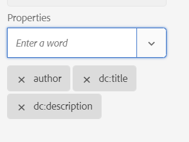

# DITA-OTを使用してメタデータを出力に渡します {#id21BJ00QD0XA}

メタデータは、出力に関する追加情報です。 AEM Guidesでは、既存のメタデータを渡したり、カスタムメタデータタグを作成したりできます。 DITA-OT パブリッシングを使用して、メタデータをAEM、PDF、HTML5、EPUB、カスタム形式の出力に渡すことができます。

DITA-OT パブリッシングを使用してメタデータを出力に渡すには、次の手順を実行します。

1. **Assets UI**&#x200B;で、メタデータをDITA-OTに渡すDITA マップファイルに移動してクリックします。
1. メタデータフィールドを渡す出力プリセットを選択して編集します。 例えば、「PDF出力プリセット」を選択します。
1. 選択した出力プリセットの「&lt;output\>を使用して生成」オプションで「**DITA-OT**」を選択します。

   {width="800"}

1. 「プロパティ」ドロップダウンから、DITA-OT パブリッシングに渡すメタデータを選択します。

   プロパティ ドロップダウンには、カスタムプロパティとデフォルトのプロパティの両方が一覧表示されます。 例えば、上記のスクリーンショットでは、作成者はカスタムプロパティですが、`dc:description`、`dc:language`、`dc:title`、`docstate`はデフォルトのプロパティです。

   >[!NOTE]
   >
   > これらのプロパティは、次の場所にあるmetadataList ファイルから選択されます：`/libs/fmdita/config/metadataList`。 デフォルトでは、このファイルには4つのプロパティ（`dc:description`、`dc:language`、`dc:title`、および`docstate`）が一覧表示されます。

   このファイルは`/apps/fmdita/config/metadataList`でオーバーレイできます。

   既に値を定義したカスタムプロパティを渡すには、[DITA-OT PDF出力でのAEM メタデータの使用](https://experienceleaguecommunities.adobe.com/t5/xml-documentation-discussions/use-aem-metadata-in-dita-ot-pdf-output/td-p/411880)を参照してください。

1. **プロパティ** ドロップダウンから、必要なカスタムプロパティとデフォルトプロパティを選択します。 例えば、`author`、`dc:title`、`dc:description`を選択します。 これらは、ファイルを作成すると作成される標準の`metadata/properties`です。 選択したプロパティはドロップボックスの下に表示されます。

   {width="300"}

1. 左上の&#x200B;**完了**&#x200B;をクリックして、変更を保存します。
1. 出力を生成します。

選択したメタデータプロパティは、DITA-OTを使用して生成された出力に渡されます。

**親トピック：**[&#x200B;出力生成](generate-output.md)
