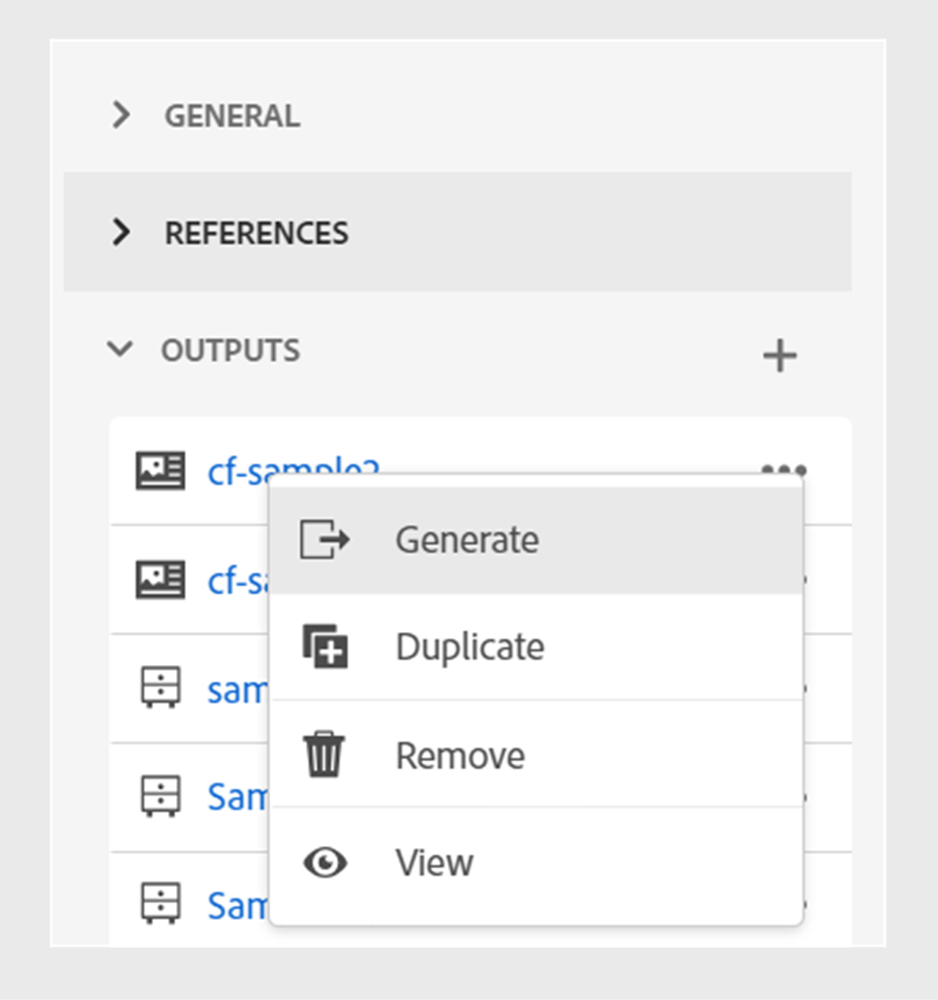

# コンテンツフラグメントの公開

コンテンツフラグメントは、Adobe Experience Managerの個別のコンテンツです。 コンテンツモデルに基づく構造化コンテンツです。 コンテンツフラグメントは、デザイン情報やレイアウト情報を含まない純粋なコンテンツです。 これらは、Adobe Experience Managerがサポートするチャネルとは独立して作成および管理できます。 コンテンツフラグメントはモジュール型で、コンテンツは小さなコンポーネントに分割されます。

Experience Manager Guidesでは、トピックやその要素をコンテンツフラグメントに公開できます。

>[!NOTE]
>
>選択できるのは、id 属性が定義されているトピック内の要素のみです。

コンテンツフラグメントを作成するには、次の手順を実行します。

1. Adobe Experience Manager Assetsで [ コンテンツフラグメントモデル ](https://experienceleague.adobe.com/docs/experience-manager-65/assets/content-fragments/content-fragments-models.html?lang=ja) を作成します。
1. コンテンツフラグメントモデルに基づいて作成するコンテンツフラグメントを保存するフォルダーを作成します。 例えば、「stock-content-fragments」と指定します。
1. フォルダーのプロパティ（「stock-content-fragments」など）を編集して、クラウド設定のコンテンツフラグメントモデルを含むフォルダーのパスを追加します。
例えば、クラウド設定に `/conf/we-retail` を追加します。 この設定により、すべてのコンテンツフラグメントモデルがフォルダーに接続されます。\
   {width="650" align="left"}
   *フォルダープロパティにクラウド設定を追加し、フラグメントモデルと接続します。*

1. コンテンツフラグメントを生成するには、トピックの **ファイルのプロパティ** にある **新しい出力アイコン** を選択します。
1. 「**コンテンツフラグメント**」を選択します。\
   ![[ ファイル プロパティ ] の [ オプション ] タブ ](./images/file-properties-outputs-tab.png) {width="300" align="left"}

   *トピックのファイルのプロパティから新しいコンテンツフラグメントを追加します*。

1. **コンテンツフラグメントを生成** ダイアログボックスの **一般** および **マッピング** タブで、次の詳細を入力します。

   **一般** タブ
   
   *パス、名前、タイトル、条件のフィルタリングを追加して、トピックまたはその要素をコンテンツフラグメントとして公開します*。

   * **パス**：コンテンツフラグメントを公開するフォルダーのパスを参照して選択します。 既存のコンテンツフラグメントを選択すると、マッピングされたフィールドのコンテンツが上書きされます。
   * **タイトル**：コンテンツフラグメントのタイトルを入力します。 デフォルトでは、タイトルにはトピックのタイトルが入力されています。 編集できます。 このタイトルは、コンテンツフラグメントの名前を生成するために使用されます。
   * **名前**：コンテンツフラグメントの名前を入力します。 デフォルトでは、名前にはトピックのタイトルが設定され、スペースは「_」に置き換えられます。 例えば、*sample_content_fragment* と指定します。 編集できます。  この名前は、コンテンツフラグメントの URL の生成に使用されます。

   * 様々な条件を選択して、コンテンツフラグメントのバリアントを作成できます。 次のいずれかのオプションを選択します。
     >[!NOTE]
     > 
     > 条件は、トピックで条件属性が定義されている場合にのみ有効になります。

      * **なし**：公開された出力に条件を適用しない場合は、このオプションを選択します。
      * **DITAVAL の使用**：生成された出力に特定のコンテンツを含めるか除外するかを選択する DITAVAL ファイルを選択します。 参照ダイアログを使用するか、ファイルパスを入力して、DITAVAL ファイルを選択できます。
      * **属性の使用**: DITA トピックで条件属性を定義できます。 次に、条件属性を選択して、関連するコンテンツを公開します。

   「**マッピング**」タブ

   

   *コンテンツフラグメントモデルを選択し、マッピングの詳細を追加して、トピックまたはその要素をコンテンツフラグメントとして公開します。*

   * **モデル**：コンテンツフラグメントの作成に使用するコンテンツフラグメントモデルを選択します。 モデルは、Experience Manager Guides サーバーに設定したフォルダーから選択されます。
   * **マッピング**:id 属性が適用されているトピック要素を表示できます。 トピック要素をコンテンツフラグメントモデル内のフィールドにドラッグします。
既存のコンテンツフラグメントの場合、右側には、公開済みのコンテンツフラグメントコンテンツが入力されます。 必要に応じて、トピックのコンテンツで上書きできます。 また、「**取り消し**」を選択して、マッピングの変更を元に戻すこともできます。

     >[!NOTE]
     >
     > 4.4 以前のバージョンを使用している場合は、ドロップダウンからマッピングを選択します。 *contentFragmentMapping.json* ファイルからマッピングを選択します。  管理者は、マッピングを *contentFragmentMapping.json* ファイルに追加できます。 [ トピックとコンテンツフラグメント間のマッピングを作成する ](/help/product-guide/cs-install-guide/conf-content-fragment-mapping-cs.md) 方法について詳しくは、インストールおよび設定ガイドを参照してください。

1. 「**生成**」をクリックして、コンテンツフラグメントを公開します。

1. **ファイルのプロパティ** の「**出力**」セクションで、トピックのコンテンツフラグメントを表示できます。

   {width="300" align="left"}

   *トピック用に存在するコンテンツフラグメントを表示し、再公開します*。

コンテンツフラグメントを公開すると、任意のAdobe Experience Manager サイトで使用することもできます。

## コンテンツフラグメントのオプションメニュー

**オプション** メニューから、コンテンツフラグメントに対して次のアクションを実行することもできます。

* **生成**：コンテンツフラグメントを再公開して、DITA トピックの最新のコンテンツで更新します。 出力を再生成する場合、コンテンツフラグメントのパス、名前、タイトル、モデルおよびマッピングを変更できます。 出力の再生時に別の条件を選択することもできます。

* **複製**：コンテンツフラグメントを複製します。 パス、名前、タイトル、モデルおよびマッピングを変更できます。 コンテンツフラグメントを複製してコンテンツフラグメントバリアントを作成する際に、異なる条件を選択することもできます。

* **削除**：出力リストからコンテンツフラグメントを削除します。 確認プロンプトが表示されます。 確認すると、コンテンツフラグメントが **出力** リストから削除されます。

  >[!NOTE]
  >
  > このアクションによってコンテンツフラグメントから削除されるコンテンツはありません。

* **表示**：コンテンツフラグメントエディターを表示します。 また、変更を加えて保存することもできます。

## 非 UUID から UUID へのコンテンツ移行の改善

新しい UUID コンテンツ移行スクリプトは、大幅に最適化され、非 UUID から UUID へのコンテンツの移行が、以前のスクリプトよりも 30 倍高速になりました。 チェックポイントからの再開、ライブインサイト、推定完了時間、詳細なレポートなどの機能が含まれ、調和のとれた移行プロセスを確保します。 特に、移行プロセスでは、アセットのメタデータが変更されずに保持されます。 このスクリプトは、300 万のアセットの大規模なデータセットでテストおよび検証され、大規模な移行に対する効率と信頼性が確認されています。

詳しくは、[UUID から UUID へのコンテンツの移行 ](/help/product-guide/install-guide/migrate-non-uuid-uuid.md) を参照してください。