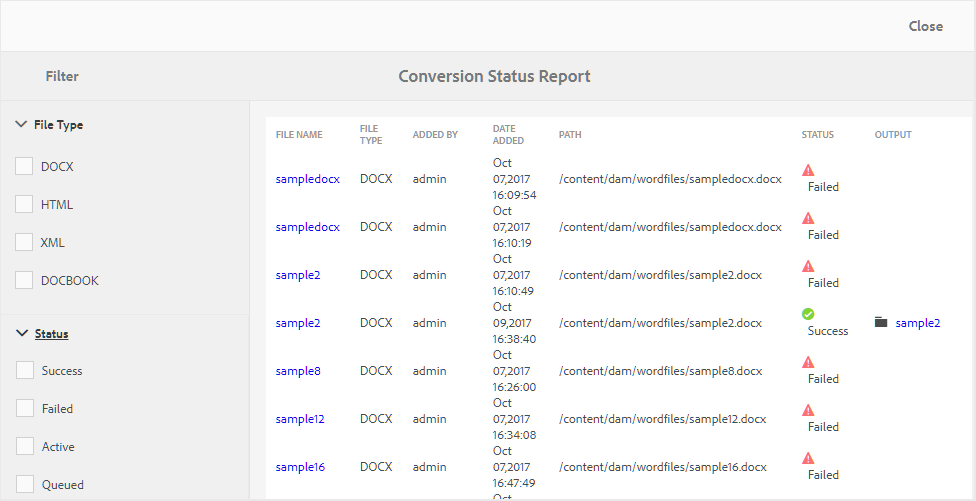
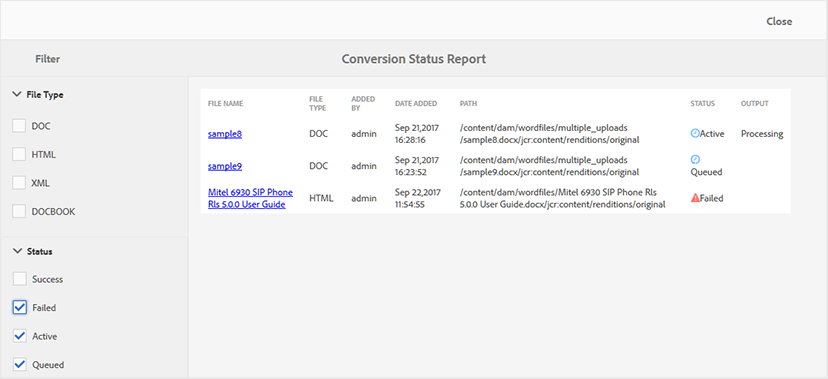

# コンバージョンステータスレポート {#id205BBA00WZZ}

AEM Guidesには、様々な形式のドキュメントをDITAに変換するための強力なコンバージョン機能が用意されています。 コンバージョンステータスレポートには、AEM Guidesで実行されたすべてのコンバージョンタスクが統合されたビューが表示されます。

コンバージョンステータスレポートを表示するには、次の手順を実行します。

1. 上部のAdobe Experience Manager リンクをクリックし、**ツール**&#x200B;を選択します。

1. ツールのリストから「**ガイド**」を選択します。

1. 「**コンバージョンステータスレポート**」タイルをクリックします。

   コンバージョンステータスレポートは、システムで実行されたすべてのコンバージョンタスクに対して表示されます。

   {width="800" align="left"}

1. このレポートページは、次の2つの部分に分かれています。

   - **フィルター：**

     ファイルタイプとコンバージョンステータスに基づいて、レポートデータをフィルタリングできます。 「ファイル形式」では、Word文書、構造化HTML、XMLおよびDocBook文書の種類のレポートデータを表示できます。 「ステータス」で、「正常」、「失敗」、「アクティブ」、「キューに入れた」を実行したタスクのレポートデータを表示するように選択できます。

     次のスクリーンショットは、失敗、アクティブ、キューに入ったコンバージョンタスクのレポートデータを示しています。

     {width="800" align="left"}

   - **レポートデータ：**

     レポートデータには、次の列が含まれます。

      - **ファイル名**：変換プロセスが実行されたソースファイルの名前。 「ファイル名」リンクをクリックすると、ソースドキュメントの場所に移動します。

      - **ファイルの種類**: Word、構造化HTML、XML、DocBookなどのソース文書の種類です。

      - **追加者**：変換タスクを実行したユーザーの名前。

      - **追加日**: タスクが実行された日付。 日付追加リンクをクリックすると、ログファイルがダウンロードされます。

      - **パス**: ソースドキュメントの完全なパス。

      - **ステータス**：コンバージョンタスクのステータス – 成功、失敗、アクティブ、またはキュー。

      - **Output**：正常に変換されたドキュメントのパス。 出力リンクをクリックすると、出力が保存される場所に移動します。

**親トピック：**&#x200B;[&#x200B; レポート &#x200B;](reports-intro.md)
