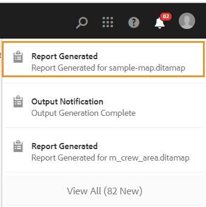

# DITA map report from the map dashboard {#id205BB800EEN}

AEM Guides provides your administrators the reporting capabilities to check the overall integrity of the documentation before it is pushed live or made available to end users. DITA map report from the map dashboard in AEM Guides provides valuable information such as the missing topics, topics with missing elements, UUID of referenced topics and media files,and review status of each topic. A detailed individual topic-level report also provides DITA content-related information such as content references and missing images or cross-references.

>[!NOTE]
>
> AEM Guides refreshes this report on every event that results in a change in your map file or when any reference within your topic file is updated.

Perform the following steps to view the DITA Map Report:

1. In the Assets UI, navigate to and click on the DITA map file for which you want to view the report.

1. Click **Reports**.

   {width="800" align="left"}

   The Reports page is divided into two parts:

   - **Topic Summary:**

     Lists the overall summary of the selected map file. By looking at the Summary, you can quickly know the total number of topics in the map, missing topics, number of topics that have missing elements, topics&#39; state — In Draft, In Review, or Reviewed state.

   - **詳細：**

     When you click on a topic, a detailed report of the selected topic is displayed.

     {width="800" align="left"}

     Items highlighted under **A**, **B**, **C** and **D** are described below:

      - **Topic**: The title of the topic specified in the DITA map. Hovering the mouse pointer over the topic&#39;s title displays the complete path of the topic. If there are issues in the topic, like missing references or images, then a red dot is shown before the topic&#39;s title.

      - **File Name**: Name of the file.

      - **UUID**: ファイルのユニバーサル一意の識別子\（UUID\）。

      - **Author**: User who worked last on this topic.

      - **Document State**: The current state of the document - Draft, In-Review or Reviewed.

      - **見つからないトピック \（B\）**：参照が壊れているトピックがある場合、それらのトピックは「見つからないトピック」リストの下にリストされます。

      - **不足している要素**：不足している画像または壊れている相互参照がある場合は、その数を一覧表示します。

      - **エディターで開く\（D\）**：このアイコンをクリックすると、Web エディターでトピックが開きます。

   **E**&#x200B;で強調表示されている項目は次のとおりです。

   - **マルチメディア**: トピックで使用される画像のパスが、そのUUIDと共に表示されます。 画像パスをクリックすると、対応する画像がポップアップウィンドウで開きます。 壊れた画像リンクは赤色で表示されます。

   - **コンテンツ参照**: トピックで参照されているコンテンツのパスが、そのUUIDと共に表示されます。 参照されているコンテンツのタイトルをクリックすると、対応するトピックがプレビューモードで開きます。

   - **相互参照**：相互参照されたコンテンツのパスが、そのUUIDと共に表示されます。 参照されているコンテンツのタイトルをクリックすると、対応するトピックがプレビューモードで開きます。 壊れた相互参照は赤色で表示されます。

   - **レビュー**: トピックのレビュータスクのステータスを表示します。 レビュー中のトピックのステータス \（開封日またはクローズ日）、期日、担当者を確認できます。 トピックリンクをクリックすると、レビューモードでトピックが開きます。

   - **使用済み**: トピックが使用されている他のトピックまたはマップのリストを表示します。 このようなトピックとマップのUUIDも一覧表示されます。

管理者は、個々のトピックのレポートだけでなく、DITA マップの公開履歴などの情報にもアクセスできます。 生成された出力の履歴について詳しくは、[出力生成タスクのステータスの表示](generate-output-for-a-dita-map.md#viewing_output_history)を参照してください。

## DITA マップレポートのCSVを生成

DITA マップレポートのCSVをダウンロードしてエクスポートできます。 CSVには、詳細なDITA マップレポートが含まれます。

DITA マップレポートのCSVを生成するには、次の手順を実行します。

1. 左上の「**レポートを生成**」をクリックして、DITA マップレポートを生成します。

   {width="800" align="left"}

1. レポートをダウンロードする準備ができたら、通知が届きます。 Click **Download** to download the CSV of the generated report.

   {width="550" align="left"}

   You can also download the CSV of the generated report later from the AEM notification Inbox.

   Click the generated report in the Inbox to download the report.

   {width="300" align="left"}

Once the report is downloaded in the Inbox you can also select the report and use the Open icon on the top to open the selected report.

**親トピック：**[ レポート ](reports-intro.md)
