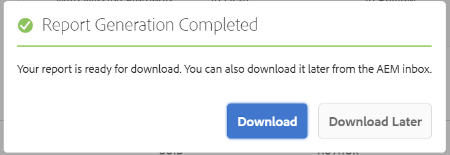

# マップダッシュボードからの DITA マップレポート {#id205BB800EEN}

AEM Guidesでは、ドキュメントがプッシュされてエンドユーザーに公開される前にドキュメントの全体的な整合性をチェックするレポート機能を管理者に提供しています。 AEM Guidesのマップダッシュボードの DITA マップレポートには、不足しているトピック、不足している要素を含むトピック、参照されているトピックとメディアファイルの UUID、各トピックのレビューステータスなどの重要な情報が提供されます。 詳細な個々のトピックレベルのレポートでは、コンテンツ参照、画像の欠落、相互参照など、DITA コンテンツ関連の情報も提供されます。

>[!NOTE]
>
> AEM Guidesは、マップファイルに変更が生じるすべてのイベント、またはトピックファイル内の参照が更新されるたびに、このレポートを更新します。

次の手順を実行して、DITA マップレポートを表示します。

1. Assets UI で、レポートを表示する DITA マップファイルに移動し、そのファイルをクリックします。

1. **レポート** をクリックします。

   {width="800" align="left"}

   レポートページは次の 2 つの部分に分かれています。

   - **トピックの概要：**

     選択したマップ ファイルの全体的な概要が一覧表示されます。 概要を見ると、マップ内のトピックの総数、見つからないトピック、要素が見つからないトピックの数、トピックの状態（下書き、レビュー中、レビュー済みの状態）をすばやく把握できます。

   - **詳細：**

     トピックをクリックすると、選択したトピックの詳細レポートが表示されます。

     {width="800" align="left"}

     **A**、**B**、**C** および **D** の下でハイライト表示された項目は次のとおりです。

      - **トピック**: DITA マップで指定されたトピックのタイトル。 トピックのタイトルの上にマウスポインターを置くと、トピックの完全なパスが表示されます。 参照や画像の欠落など、トピックに問題がある場合、トピックのタイトルの前に赤い点が表示されます。

      - **ファイル名**: ファイルの名前です。

      - **UUID**: ファイルのユニバーサル固有識別子\（UUID\）。

      - **作成者**：このトピックを最後に作業したユーザー。

      - **ドキュメントの状態**：ドキュメントの現在の状態（ドラフト、レビュー中またはレビュー済み）。

      - **見つからないトピック \（B\）**：参照が壊れているトピックがある場合、それらのトピックは「見つからないトピック」リストに表示されます。

      - **見つからない要素**：見つからない画像または壊れた相互参照の数がリストされます（存在する場合）。

      - **エディターで開く\（D\）**：このアイコンをクリックすると、web エディターでトピックが開きます。

   **E** の下で強調表示されている項目は次のとおりです。

   - **マルチメディア**：トピックで使用されている画像のパスが UUID と共に表示されます。 画像のパスをクリックすると、対応する画像がポップアップウィンドウで開きます。 壊れた画像のリンクは赤色で表示されます。

   - **コンテンツ参照**：トピックで参照されているコンテンツのパスが、UUID と共に表示されます。 参照されているコンテンツのタイトルをクリックすると、対応するトピックがプレビューモードで開きます。

   - **相互参照**：相互参照されるコンテンツのパスが、UUID と共に表示されます。 参照されているコンテンツのタイトルをクリックすると、対応するトピックがプレビューモードで開きます。 壊れたクロスリファレンスは赤色で表示されます。

   - **レビュー**：トピックのレビュータスクのステータスを表示します。 レビュー中のトピックのステータス \（オープンまたはクローズ\）、期限、担当者を確認できます。 トピックのリンクをクリックすると、トピックがレビューモードで開きます。

   - **使用されている場所**：トピックが使用されている他のトピックまたはマップのリストを表示します。 これらすべてのトピックおよびマップの UUID も表示されます。

管理者は、個々のトピックのレポート以外に、DITA マップの発行履歴などの情報にもアクセスできます。 生成された出力の履歴について詳しくは、[&#x200B; 出力生成タスクのステータスの表示 &#x200B;](generate-output-for-a-dita-map.md#viewing_output_history) を参照してください。

## DITA マップレポートの CSV の生成

DITA マップレポートの CSV をダウンロードしてエクスポートできます。 CSV には詳細な DITA マップレポートが含まれています。

次の手順を実行して、DITA マップレポートの CSV を生成します。

1. 左上の「**レポートを生成**」をクリックして、DITA マップレポートを生成します。

   {width="800" align="left"}

1. レポートのダウンロード準備が整うと、通知が届きます。 **ダウンロード** をクリックして、生成されたレポートの CSV をダウンロードします。

   {width="550" align="left"}

   また、後でAEM通知インボックスから生成されたレポートの CSV をダウンロードすることもできます。

   インボックスで生成されたレポートをクリックして、レポートをダウンロードします。

   {width="300" align="left"}

インボックスにレポートがダウンロードされたら、レポートを選択し、上部の「開く」アイコンを使用して、選択したレポートを開くこともできます。

**親トピック：**&#x200B;[&#x200B; Reports](reports-intro.md)
