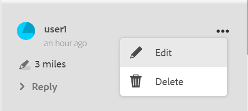
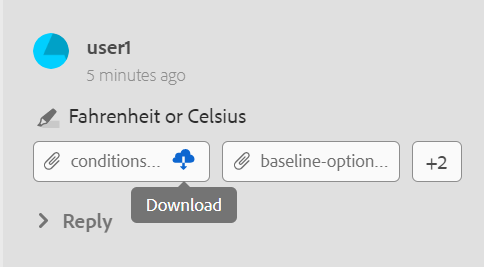
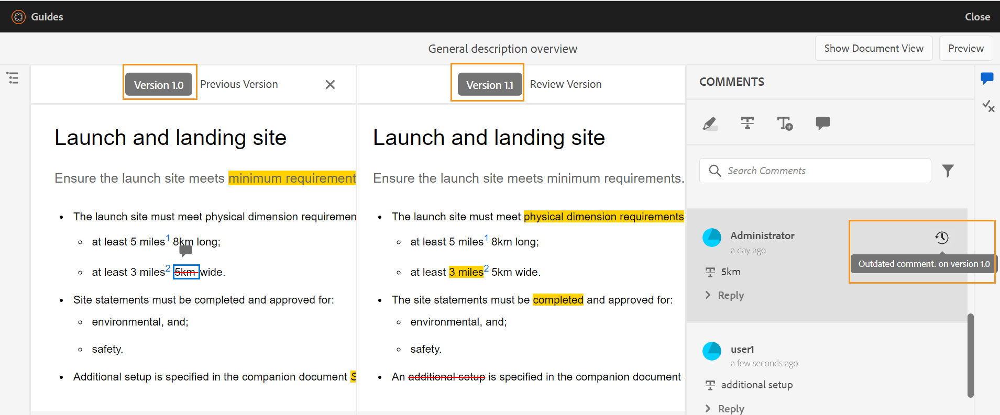

# トピックを見る {#id2056B0W0FBI}

レビュー担当者の場合は、レビュートピックへのリンクが記載されたレビューリクエストメールが届きます。 リンクをクリックすると、レビューページに移動し、共有トピックに関するフィードバックを追加できます。

トピックをレビューするには、次の手順を実行します。

1. レビューリクエストメールに記載されている直接リンクをクリックします。

   トピックまたはマップリンクがブラウザーで開きます。

   >[!NOTE]
   >
   > AEM ユーザーインターフェイスのインボックス通知領域からトピックレビューリンクにアクセスすることもできます。

1. トピックのレビューの開始方法に応じて、次の2つの画面のいずれかを表示できます。

   >[!NOTE]
   >
   > でレビューを作成した場合、UIが異なる場合があります。
   >
   > - AEM Guides as a Cloud Service 2022年11月リリース以前
   > - AEM Guides バージョン 4.1以前

   DITA マップを使用してレビューワークフローを開始すると、次の画面が表示されます。

   {width="800"}

   この画面では、次のオプションを使用できます。

   - **A**: レビュータスクの名前。
   - **B**: トピック表示アイコンをクリックして、トピックパネルを表示または非表示にします。

   - **C**：検索バーにタイトルまたはファイルパスのテキストの一部を入力して、必要なトピックを検索できます。

     検索バーの近くのを選択して、すべてのトピックを表示するか、コメント付きのトピックを表示するかを選択します。 デフォルトでは、レビュータスクに存在するすべてのトピックを表示できます。

   - **D**: ***F***&#x200B;によって強調表示された数値は、ここから目的のフィルターオプションを選択してフィルタリングできます。 コメントは、タイプ、ステータス、レビュアーまたはバージョンによってフィルタリングできます。 例えば、レビュー中の各トピックで取り消し線のコメントが何件行われたかを確認する場合は、フィルターアイコンをクリックし、「**レビュータイプ** \> **削除**」を選択します。

     >[!NOTE]
     >
     > フィルターを適用すると、選択したフィルターに一致するコメントのみがコメントパネルに表示されます。 フィルターされたコメントの数は、トピックパネルの左側に表示されます。

   - **E**：現在のレビュー担当者にレビュー用に割り当てられたトピックは黒で表示され、クリック可能です。 レビュー担当者がトピックリンクをクリックすると、そのトピックが画面の上部に表示されます。
   - **F**：レビュー用に使用できないトピックがグレー表示されています。 トピックは読み取り専用モードで表示され、そのようなトピックにレビューコメントを追加することはできません。

   - **G**: トピックで受信したコメントの数。 この数値は、適用するフィルターに基づいて変更されます。

   マップ内のすべてのトピックは、単一の複合ドキュメントとして表示されます。 レビュー担当者がレビューできるトピックは通常どおり表示されます。 レビューでレビューできないトピックは表示されません。

   {width="800"}

   上記のスクリーンショットでは、「一般的な説明」トピックが現在のレビュー担当者のレビュー用に共有されています。これは通常どおり表示されます。 ただし、次のトピック「フライトのコンテンツの履歴」はレビュー用に共有されず、読み取り専用モードで表示されます。 現在注目されているトピックは、目次でも強調表示されます。

   トピックまたは複数のトピックを選択してレビュー用に共有すると、次の画面が表示されます。

   {width="800"}

   >[!NOTE]
   >
   > 複数のトピックの場合、これらのトピックはドキュメントビューで1つの複合ドキュメントとして表示されます。 上のスクリーンショットは、1つのビューで次から次へと表示される2つの異なるトピックを示しています。

1. ツールバーの右上隅にある「**コメント**」アイコンをクリックして、コメントパネルを開きます。

   ツールバーから適切なコメントタイプを選択してレビューコメントを入力し、Enter キーを押してコメントを送信します。

   >[!NOTE]
   >
   > コメントパネルには、現在のトピックに対してのみ指定されたコメントが表示されます。 フォーカスを他のトピックに移動すると、他のトピックに対するコメントが表示されます。

1. トピックのレビューが完了したら、「**閉じる**」ボタンをクリックします。 **閉じる** ボタンをクリックすると、レビュートピックにアクセスしたページにリダイレクトされます。

## レビュー画面で利用可能な追加機能

**ドキュメント ビューとトピック ビュー** – 既定では、複数のトピックがレビュー用に共有されている場合、トピックの複合ドキュメント ビューがレビュー担当者に表示されます。 DITA マップレビューの場合、マップ内のすべてのトピックは、ブックビューに似た単一のドキュメントの形式で表示されます。 必要に応じて、特定のトピックをクリックして、そのトピックのみをレビュー画面に表示することもできます。

単一のトピックを表示すると、ドキュメント表示に戻すための追加オプションが表示されます。 次のスクリーンショットでは、マップファイルの特定のトピックがレビュー用に開かれています。 ハイライト表示されたオプション「**ドキュメント表示を表示**」を使用すると、ユーザーはマップファイルのドキュメントビューに戻ることができます。

{width="800"}

**様々な種類のコメントツールを使用する** - テキストを強調表示、テキストを強調表示、テキストを挿入、またはコメントノートを追加して、インラインコメントを追加できます。 コメントツールバーに用意されている様々な種類のコメントツールについては、以下で説明します。

{width="350"}

- **ハイライト** \（\）: ハイライトコメントを追加するには、テキストを選択してハイライトアイコンをクリックします。 または、ハイライトアイコンをクリックして、目的のテキストを選択します。

  {width="650"}

  注釈パネルにポップアップが表示され、ハイライト表示されたコンテンツに注釈を追加できます。

- **取り消し線** \（\）: コンテンツの削除を提案する場合は、コンテンツを選択して取り消し線アイコンをクリックします。 または、目的のテキストを選択し、削除キーをクリックします。

  コメント パネルにポップアップが表示され、削除したコンテンツにコメントを追加できます。

- **テキストを挿入** \（\）: テキストを挿入する場合は、テキストを挿入アイコンをクリックし、テキストを挿入する場所にカーソルを置いて、情報を入力します。 または、テキストを挿入する場所にカーソルを置き、入力を開始します。 追加された情報は、緑色のフォントで表示されます。

- **コメントを追加**\（\）：注釈タイプの注釈を追加する場合は、「注釈を追加」アイコンをクリックし、ポップアップに注釈を入力します。

**コンテキストツールバー**

コンテキストツールバーを使用して、テキストをすばやくハイライト表示または取り消し線で表示することもできます。 コンテキストツールバーを使用してコメントするには、次の手順を実行します。

1. ハイライトまたは取り消すテキストを選択します。 コンテキストツールバーが表示されます。

   {width="550"}

1. **ハイライト**&#x200B;または&#x200B;**取り消し線** アイコンをクリックします。
1. ハイライトまたは取り消し線アクションのコメントパネルにコメントを追加できます。

**コメントパネルを使用したレビュー** - コメントパネルには、現在のトピックに対して与えられたコメントのリストが表示されます。 このパネルには、トピックが複数のレビュー担当者に送信された場合の、他のレビュー担当者からのコメントも一覧表示されます。 コメントパネルの各コメントは、現在のトピック内の対応するテキストにリンクされます。 コメント付きテキストを識別するのに役立ちます。 各コメントには、タイムスタンプとともにコメントを追加したレビュー担当者の名前が表示されます。

注釈は、文書内の注釈テキストの順序で表示されます。 例えば、最初の文にハイライトコメントがあり、最初の段落の2番目の文にテキストコメントを挿入すると、挿入されたテキストコメントの前にハイライトテキストコメントが表示されます。

コメントパネルを使用して実行できるタスクについては、以下で説明します。

- コメントをクリックすると、ドキュメント内の対応するコメントの場所がハイライト表示されます。
- コメントに返信を追加できます。
- コメント パネルでコメントを付けたテキストをクリックし、オプション メニューから「**編集**」を選択すると、独自のコメントを編集できます。
- 独自のコメントを削除するには、コメントパネルのコメントをクリックし、オプションメニューから「**削除**」オプションを選択します。

  {width="300"}

  >[!NOTE]
  >
  > オプションメニューは、自分のコメントにカーソルを合わせたときにのみ表示されます。 他のレビュー担当者のコメントに対しては表示されません。

- すべての参加ユーザーは、他のユーザーから送信されたコメントに返信できます。 コメントで「**返信**」をクリックし、Enter キーを押して応答を送信します。

**プレビューモード**

- プレビューモードでトピックを開くと、すべての変更を適用した後に作成者がトピックを表示したときに、そのトピックがどのように表示されるかを示します。 例えば、挿入されたテキストはすべて通常のテキストとして表示され、削除された\（deleted\）テキストはすべてコンテンツから削除されます。

- 次のスクリーンショットは、*レビュー* モードのコンテンツを示しています。

{width="550"}

次のスクリーンショットは、*プレビュー* モードのコンテンツを示しています。

{width="550"}

**コメントに添付ファイルを追加** – 他のファイルで使用可能な追加情報を提供してコメントを補足する場合は、コメントに添付して追加できます。 レビュアーは、ローカルシステムから1つまたは複数のファイルをコメントに簡単に追加できます。 サポートされているすべてのコメント形式（ハイライト、取り消し線、テキストの挿入、コメント）にファイルを追加できます。

コメントを挿入すると、コメントのポップアップが表示されます。 ポップアップに追加のコメントや情報を入力したら、Enter キーを押して送信します。 コメントが追加されると、そのコメントに添付ファイルを追加するオプションが表示されます。

{width="800"}

上のスクリーンショットでは、ドキュメントにハイライトコメントのポップアップが含まれており、コメントもコメントパネルに追加されています。 添付ファイル アイコン は、コメントと共に両方の場所で使用できます。

コメントに添付ファイルを追加するには、次の手順を実行します。

1. 添付ファイルを追加するコメントの&#x200B;*添付ファイルを追加* アイコン をクリックします。

   ファイル開くダイアログが表示されます。

1. 添付する1つまたは複数のファイルを選択します。

   選択したファイルは、コメント パネルにコメントとともに表示されます。

   コメント パネルで、ファイル名とそのサイズを確認できます。 ファイル名に関連付けられている削除アイコン をクリックして、ファイルを削除するオプションもあります。

1. 「**送信**」をクリックします。

   添付ファイルがアップロードされ、コメントに追加されます。

**添付ファイルの操作に関するその他の注意事項：**

- デフォルトでは、コメントが添付された2つのファイルのみが表示されます。 ファイルが多い場合、右側の&#x200B;**添付ファイルを表示** ボタンには、コメントに関連付けられているすべての添付ファイルの数\（2つ以上\）が表示されます。 番号をクリックすると、すべての添付ファイルを表示できます。 例えば、コメント付きの添付ファイルが4つある場合、ボタンに+2が表示されます。

{width="550"}

- 添付ファイルの上にマウスポインターを置くと、添付ファイルをダウンロードまたは削除するオプションが表示されます。 添付ファイルの削除は、次のスクリーンショットに示すように、現在のレビュー担当者がそのコメントを追加した場合にのみ使用できます。

{width="550"}

他のレビュー担当者または作成者には、添付ファイルのダウンロード オプションのみが表示されます。

{width="550"}

- コメントに関連付けられたすべての添付ファイルは、**添付ファイルを表示** ダイアログからダウンロードできます。 添付ファイルを選択し、コメントレベルの&#x200B;**ダウンロード** アイコンをクリックします。

- コメントに関連付けられている添付ファイルは、**添付ファイルを表示** ダイアログから削除することもできます。 添付ファイルを選択し、**削除** アイコンをクリックします。

{width="550"}

**条件パネル** - トピックに条件付きコンテンツがある場合、右側に&#x200B;**条件** \（\）アイコンが表示されます。 **条件** アイコンをクリックすると、条件パネルが開き、トピックで使用可能な条件に従ってコンテンツを強調表示できます。

：デフォルトでは、「**すべての条件を強調表示**」オプションが有効になっており、すべての条件が選択され、コンテンツ全体が表示され、条件付きコンテンツがレビューモードとプレビューモードの両方で強調表示されます。

:「**すべての条件を強調表示**」オプションを無効にし、トピックに含まれるすべてのコンテンツをハイライトなしで通常のテキストとして表示できます。

{width="350"}

特定の条件を表示または非表示に選択できます。

- 条件を非表示にした場合、その条件を持つコンテンツはレビューモードでハイライト表示されません。
- 条件付きコンテンツがレビューモードで強調表示されている場合。 例えば、次のスクリーンショットでは、コンテンツのみが2つの条件を使用します – `win`と`mac`が強調表示されます。

{width="650"}

プレビューモードでは、表示された2つの条件（`win`と`mac`）を使用する条件付きコンテンツと条件付きコンテンツが表示されます。 条件が非表示になっている残りの条件付きコンテンツは表示されません。

**リアルタイムのレビュー** - コメント パネルは、コメントと、コメントに対する作成者のフィードバックまたはアクションによってリアルタイムに更新されます。

- 複数のレビュー担当者が、同じドキュメントにコメントを残したり、コメントに同時に返信したりできます。 画面の右上隅にあるユーザーアイコンの上にマウスを置くと、現在ドキュメントをレビューしているユーザーを確認できます。

- トピックが複数のレビュータスクの一部である場合、一方のタスクで行われたコメントは、もう一方のタスクには表示されません。

- 古いコメントアイコン \（\）をクリックすると、ドキュメントの最新バージョンとコメント済みバージョンの違いが表示されます。 バージョン番号\（比較するバージョンの\）がドキュメントの上部に表示されます。

  {width="800"}

  >[!NOTE]
  >
  > 「古いコメント」アイコンにカーソルを合わせると、コメントが追加されたトピックのバージョン番号が表示されます。 例えば、バージョン 1.0でコメントが付けられた場合は、同じことが表示されます。

- 古いコメントをクリックすると、そのコメントのバージョンが左側のパネルに表示されます。 前のバージョンは左側のパネルに表示され、現在のバージョンは右側のパネルに表示されます。 古いバージョンに関するすべてのコメントは、左側に読み込まれます。 以前のバージョンと現在のバージョンを比較できます。

**コメントをフィルター** – 文書内のコメントをフィルターして、必要に応じて特定のコメントを表示できます。 コメントをフィルタリングするには、コメントパネルの「コメントを検索」テキストボックスの右側にあるメニューに表示される&#x200B;**フィルター** アイコン \（\）をクリックします。

**フィルタータイプ** ダイアログから次のフィルターオプションを1つ以上選択し、**適用**&#x200B;をクリックします。

- **種類を確認** - コメントの種類に基づいてフィルター – ハイライト、削除、挿入、またはコメント。
- **ステータスのレビュー** - コメントのステータス（「承認済み」、「却下」、「なし」など）に基づいてフィルタリングします。
- **レビュー担当者** – レビュー担当者の名前に基づいてフィルターを実行します。

- **バージョン** - トピックの特定のバージョンで受信したコメントに基づいてフィルタリングします。

  フィルターを使用すると、右側のパネルのコメントが選択内容に応じてフィルタリングされ、左側のパネルのコメント数が適宜更新されます。

フィルターを削除してすべてのコメントを表示するには、**フィルタータイプ** ダイアログからすべてのフィルターの選択を解除し、**適用**&#x200B;をクリックします。

**親トピック：**&#x200B;[&#x200B; トピックまたはマップのレビュー](review.md)
