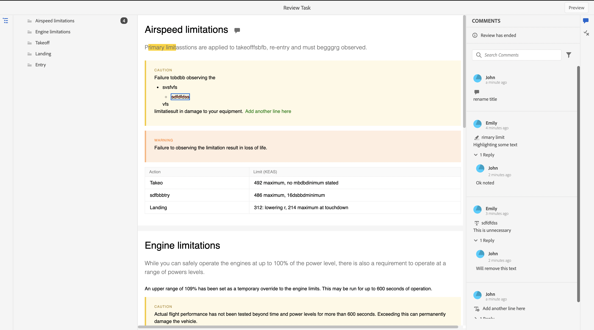

# 完了したレビュータスクの表示

自分が作成者（またはイニシエーター）であるプロジェクトのレビュータスクを完了できます。 レビュータスクは、完了すると、すべてのレビュー担当者が読み取り専用モードでアクセスできるようになります。

## レビュアーとして

レビュー担当者には、レビューが終了したことを示すインジケーターがコメントパネルに表示されます。 コメント ツールバーは表示されないので、ハイライト表示、取り消し線の引き込み、テキストの挿入、コメントの追加はできません。 コメントを読み取ることはできますが、コメントを編集または削除することはできません。 また、コメントに返信を追加することもできません。 コンテキストツールバー（テキストのハイライト表示や取り消し線の設定に使用する）は表示されません。 また、期限切れのコメントアイコンは、完了したレビュータスクには表示されません。

ただし、コメントを検索またはフィルタリングすることはできます。 また、条件の表示/非表示を選択し、それに応じて条件付きコンテンツを表示することもできます。 添付ファイルはダウンロードできますが、コメントの添付ファイルをアップロードまたは削除することはできません。

{width="800" align="left"}

## 作成者として

作成者は、レビューパネルでステータスをクローズドと表示できます。 コメントを読み取ることはできますが、コメントを許可または却下することはできません。 コメントを編集または削除することはできません。 また、コメントの返信を追加することはできません。 期限切れのコメント アイコンとコメントを作成者ビューに読み込みアイコンが、完了したレビュータスクに表示されません。

ただし、コメントを検索またはフィルタリングすることはできます。 添付ファイルはダウンロードできますが、コメントの添付ファイルをアップロードまたは削除することはできません。

{width="800" align="left"}

そのため、レビュー担当者と作成者のどちらも、レビュー済みコンテンツをコメントと共に表示できますが、完了したレビュータスクで変更を加えることはできません。
