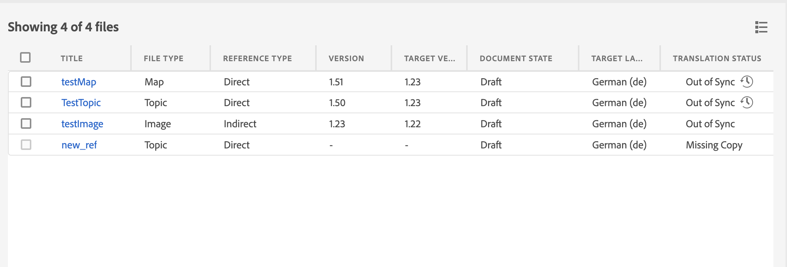
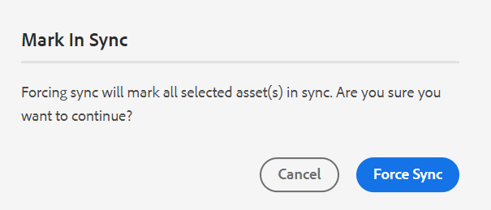

# Web エディターからのドキュメントの翻訳 {#id21BKF0Z0YZF}

>[!TIP]
>
> 2022 年 2 月リリース以降のAEM Guides as a Cloud Serviceにアップグレードした場合は、web エディターからこの翻訳機能を使用することをお勧めします。

AEM Guidesには、コンテンツを複数の言語に翻訳できる Web エディターの強力な機能が付属しています。 新しい翻訳プロジェクトを作成し、後で既存の翻訳プロジェクトに翻訳ジョブを追加できます。 また、選択したすべての言語の翻訳ジョブを含む多言語翻訳プロジェクトを作成することもできます。

>[!NOTE]
>
> 管理者は、Web エディターで「管理」タブ \（翻訳に使用\）を設定できます。 詳しくは、Adobe Experience Manager Guides as a Cloud Serviceのインストールと設定の *Web エディターでの翻訳機能の設定* 節を参照してください。

## 始める前に

この手順を実行する前に、必要な言語ルートおよびターゲットフォルダーを作成したことを確認してください

1. ソースコンテンツを格納するルートフォルダーを作成します。 ルートフォルダーは、言語名\（例：English\）または言語コード \（en\）で作成する必要があります。
1. コンテンツの翻訳先となる宛先フォルダーを作成します。 例えば、コンテンツをドイツ語またはフランス語に翻訳する場合は、-de \（ドイツ語の場合）または – fr \（フランス語の場合）という名前のフォルダーを作成する必要があります。

>[!NOTE]
>
> ルートフォルダーと保存先フォルダーは同じレベルに作成する必要があります。

## 翻訳プロジェクトを作成

1. **リポジトリ** パネルで、DITA マップファイルをマップビューで開きます。
1. 「**管理** タブをクリックします。 **翻訳パネル** に、使用可能な言語グループが表示されます。

1. ユーザーは、フォルダープロファイルに設定されている言語グループを表示できます。 言語グループには、言語フォルダーと言語コードが表示されます。 例えば、G1 という名前の言語グループにはイタリア語の\（it\）、ドイツ語の\（de\）、フランス語の\（fr\）、英語の\（en\）言語フォルダーが含まれています。

   {width="300" align="left"}

   *ドキュメントを翻訳する言語グループまたは言語を選択します。*

   >[!IMPORTANT]
   >
   > ソース言語と並行してターゲットフォルダーを作成した言語のみを選択して翻訳できます。 ソース言語フォルダーから 1 レベル下など、他のレベルで作成された言語フォルダーも表示されません。 すべてのターゲット言語フォルダーを、ソース言語フォルダーと同じレベルに作成してください。

1. 翻訳のターゲットとして任意の言語グループを選択できます。 **すべてを選択** すると、選択したファイルは既存の言語グループ内で使用可能なすべての言語に翻訳されます。

   言語フォルダーオプションがグレー表示され、次の警告記号が表示されます。

   - 言語のターゲットフォルダーがない場合。
   - ターゲット言語がソースと同じ場合。

   >[!NOTE]
   >
   > 言語グループを作成した後で言語のターゲットフォルダーを作成した場合は、ブラウザーを更新して言語グループで言語を有効にします。

1. 特定の言語を選択すると、選択したすべての言語グループで、選択した言語として表示されます。 したがって、任意の言語に翻訳すると、すべての言語グループに対して一度に翻訳されます。 例えば、ドイツ語が G1 と G2 の両方の言語グループに存在する場合、両方に対して選択されます。

1. **その他の言語** から、ターゲットフォルダーを作成したが、言語グループに含まれていない任意の言語を選択できます。

1. また、次のいずれかのオプションを選択してプロジェクトを翻訳することもできます。

   **なし** ファイルのデフォルトバージョンを翻訳する場合は、このオプションを選択します。 このオプションはデフォルトで選択されています。

   **ベースラインの使用：** ベースラインを選択して、プロジェクトを翻訳できます。 「ベースラインの使用」をクリックし、マップに作成されたベースラインを選択します。 選択したベースラインに含まれるすべてのファイルが翻訳ページに表示されます。 コンテンツが翻訳されたら、翻訳済みベースラインを書き出すことができます。 翻訳済みベースラインのエクスポートについて詳しくは、「[&#x200B; 翻訳済みベースラインのエクスポート &#x200B;](generate-output-use-baseline-for-publishing.md#id196SE600GHS)」を参照してください。

   **最新バージョンをそのまま使用**：作成日時に基づいてトピックのバージョンをフィルタリングする場合に選択します。 日時を選択すると、選択した日時以前に作成されたファイルの最新バージョンのみが表示されます。

1. **適用** をクリックします。 トピックと関連アセットの詳細を含むリストが表示されます。
1. 翻訳のために送信するトピックを選択します。 次の列に対して、トピックのフィルタリングオプションを使用することもできます。

   - **タイトル**：ソースファイルのタイトル。  ソースファイルのタイトルにポインタを合わせると、ターゲットまたは翻訳済みファイルのタイトルが表示されます。
   - **ファイル名**：ソースファイルの名前
   - **ファイルタイプ**：ソースファイルの種類 使用できるオプションは、マップ、トピック、画像です。
   - **参照タイプ**：直接参照または間接参照
   - **バージョン**：ソースファイルのバージョン番号
   - **バージョンラベル**：ソースファイルの選択したバージョンのラベル
   - **ターゲットバージョン**：ターゲットファイルのバージョン番号
   - **ドキュメントの状態**：ソースファイルの状態。 使用可能なオプションは、「ドラフト」、「レビュー中」、「レビュー済み」です。
   - **ターゲット言語**：ソースファイルの翻訳先の言語
   - **翻訳ステータス**：使用可能なオプションは、「同期されていません」、「コピーがありません」、「処理中」および「同期中」です。
   - **ターゲットラベル**：ターゲットファイルの選択されたバージョンのラベル
1. 右上隅の **翻訳用に送信** をクリックします。

   {width="800" align="left"}

1. ドロップダウンから「**新しい翻訳プロジェクトを作成**」を選択します。

   {width="350" align="left"}

   新しい翻訳プロジェクトに加えて、次のオプションも選択できます。

   - 翻訳プロジェクトの場合にのみ **構造を作成** を選択できます。
   - **新しい XLIFF 翻訳プロジェクトを作成** を選択して、XML コンテンツを XML Localization Interchange File Format （XLIFF）に変換できます。 XLIFF は、コンテンツ翻訳プロセスで使用される様々なツール間のデータ転送を標準化するために使用される、オープン XML ベースの形式です。 AEM Guidesは、XLIFF バージョン 1.2 をサポートしています。
XLIFF プロジェクトでは、コンテンツは業界標準の XLIFF 形式で書き出され、翻訳ベンダーに提供できます。 XLIFF 形式を使用すると、翻訳段階で既に翻訳したセグメントを再利用できる可能性があります。\
     XLIFF コンテンツを翻訳した後は、そのコンテンツをAEM Guidesにインポートして、オリジナルの DITA プロジェクトの翻訳済みバージョンを作成できます。

     >[!NOTE]
     >
     > XLIFF 書き出しは、人間による翻訳の設定でのみ機能します。

   - **新しい多言語翻訳プロジェクトを作成** を選択できます。このプロジェクトには、翻訳用に選択したすべての言語の翻訳ジョブが含まれます。 例えば、「フランス語」、「ドイツ語」、「スペイン語」を選択した場合、3 つの言語すべての翻訳ジョブを含むプロジェクトが作成されます。
   - 既に翻訳プロジェクトがある場合、そのプロジェクトにトピックを追加できます。 「プロジェクト」リストから「**既存の翻訳プロジェクト** に追加」オプションを選択し、「既存の翻訳プロジェクト」リストからプロジェクトを選択します。 これらのプロジェクトは、最新の順序、昇順または降順で並べ替えることができます。

- **既存の翻訳プロジェクト** を選択した場合、アセットが既に追加されており、関連する翻訳ジョブの状態が *ドラフト* 状態であれば、この操作はプロジェクト内の既存のアセットエントリを更新します。
   - 宛先言語がプロジェクトに存在しない場合は、単一言語の翻訳プロジェクト用の新しいプロジェクトが作成され、多言語翻訳プロジェクト用の新しいジョブが作成されます。
   - 宛先言語のジョブが既に存在し、ジョブステータスが *ドラフト* 状態でない場合は、同じプロジェクト内で新しいジョブが作成され、翻訳用のアセットが追加されます。

  >[!NOTE]
  >
  > 既存のプロジェクトがスコーピングプロジェクトの場合は、名前に「\（Scoping\）」が追加されます。

- 翻訳するプロジェクトの範囲を作成する必要がある場合は、「**新しいスコーピング翻訳プロジェクトを作成**」を選択します。 これにより翻訳用のコピーが送信されることはなく、ファイルの元の翻訳ステータスが維持されます。 スコーピング用に送信される参照トピックの宛先言語コピーへの影響はありません。
1. 「**プロジェクトタイトル**」フィールドに、プロジェクトのタイトルを入力します。
1. **作成** をクリックして、新しい翻訳プロジェクトを作成します。

   選択したバージョンのトピックを使用して新しい翻訳プロジェクトが作成されます。 この時点で、翻訳プロジェクトが作成されたことを確認するポップアップメッセージが表示されます。 すべてのターゲット言語コピーが翻訳プロジェクトで使用できるようになると、インボックスに通知が届きます。 翻訳プロジェクトにターゲット言語コピーが使用可能になったら、翻訳ジョブを開始できます。 詳しくは、[&#x200B; 翻訳ジョブの開始 &#x200B;](translation-first-time.md#id225IK030OE8) を参照してください。

   >[!NOTE]
   >
   > 翻訳ジョブの 1 つ以上のトピックの翻訳を拒否すると、拒否されたすべてのトピックの翻訳ステータス **処理中** が元のステータスに戻ります。 参照されたトピックのステータスは、最新の翻訳状態に従ってチェックされ、元に戻されます。 また、宛先プロジェクトで作成された翻訳ファイルは、翻訳が拒否されても削除されません。

## 翻訳ルールの追加

AEM Guidesでは、管理者が翻訳ルールを設定できます。 SRX （Segmentation Rules eXchange）形式は、異なるユーザーや翻訳環境の間でセグメント化ルールを交換するための標準です。 フォルダーを作成し、それにカスタム SRX ファイルを追加できます。

SRX ファイルの名前は `<language-code>.srx` にする必要があります。 例えば、en-US や ar-AE などです。

>[!NOTE]
>タイトルでは大文字と小文字が区別されないので、「en-US」、「en-us」、「EN-us」を指定できます。 また、AEM ガイドでは「–」（ハイフン）や「_」（アンダースコア）を解決できます。 そのため、「en-US」または「en_US」を使用できます。

また、これらのファイルは、`./content/dam` しいAEM assets ルートの下の任意のフォルダー内に配置できます。

SRX ファイルを含むフォルダーを作成したら、フォルダープロファイル内の「翻訳 SRX の場所」設定にフォルダーパスを追加できます。

パフォーマンスを向上させるために、フォルダープロファイルで設定されたフォルダーには SRX ファイルのみを保持することをお勧めします。

AEM Guidesでは、翻訳プロジェクトのソース言語に従って SRX ルールが選択されます。 言語のカスタム SRX ファイルを探し、カスタム SRX ファイルを定義しない場合は、標準の翻訳ルールに従ってルールが選択されます。

グローバルプロファイルおよびフォルダーレベルのプロファイルの設定について詳しくは、「Adobe Experience Manager Guides as a Cloud Serviceのインストールと設定」の *オーサリングテンプレートの設定* を参照してください。

## バージョンラベルをターゲットバージョンに渡します

AEM Guidesでは、ソースファイルのラベルをターゲットファイルに渡すことができます。 これにより、翻訳済みファイルのソースバージョンを簡単に識別できます。

ターゲットコピーにソースバージョンラベルを追加するには、システム管理者が **エディター設定** の「**翻訳**」タブで **ソースバージョンラベルをターゲットバージョンに反映** オプションを選択する必要があります。

例えば、バージョンラベル `Release 1.0` が適用されたソースファイルがある場合は、ソースラベル \（`Release 1.0`\）を翻訳済みファイルに渡すこともできます。

{width="650" align="left"}

>[!NOTE]
>
> ソースラベルは、1 つのターゲットバージョンにのみ添付されます。 ソースラベルを別のバージョンに移動すると、最新のターゲットラベルに自動的に反映されます。

## 非同期ファイルのバージョンの違いを表示 

AEM Guidesには、選択したバージョンとトピックの最新の翻訳済みソースバージョンの違いを確認する機能が用意されています。 加えられた変更に基づいて **非同期** ファイルを翻訳するように選択できます。

{width="650" align="left"}

トピックの **差分を表示** アイコン \（\）を選択すると、選択したファイルの最終翻訳バージョンと現在のバージョンの差分が表示されます。

>[!NOTE]
>
> **差分を表示** アイコン \（\）は、翻訳ステータスが **同期外** の DITA ファイルにのみ表示されます。

**バージョンの違い** ダイアログが表示されます。 **最後に翻訳されたバージョン** と **選択したバージョン** の番号が左側に表示されます。 プレビューウィンドウに、最後に翻訳されたバージョンと選択したトピックのバージョンの違いが表示されます。

{width="650" align="left"}

## 非同期アセットの解除

一部のアセットで変更を加えると、それらのアセットは非同期になります。 変更したアセットを再翻訳するか、非同期ステータスを解除するかを選択できます。 例えば、非常に小さな変更を加え、翻訳が不要な場合は、そのステータスを「同期中」にマークできます。

非同期ステータスを解除するには、次の手順に従います。

1. ステータスを変更する非同期アセットを選択します。
1. 上部の **同期でマーク** ボタン \（\）を選択します。 **同期中にマーク** ダイアログが表示されます。

   {width="550" align="left"}

1. **同期を強制** をクリックします。 選択した非同期アセットのステータスを同期中に設定します。

>[!NOTE]
>
> **同期中にマーク** ボタン \（\）は、翻訳ステータスが同期外であるアセットに対してのみ表示されます。

## マップまたはトピックの進行中の翻訳プロジェクトの表示

翻訳ダッシュボードの一部の参照が「進行中」ステータスになっている可能性があります。 これらの参照には、「翻訳ステータス **列の下に** 進行中 **リンクが** ります。 リンクをクリックすると、「**進行中のプロジェクト** ダイアログが開きます。 ダイアログには、選択した参照を含むすべての進行中の翻訳プロジェクト \（ターゲット言語と共に）のリストが表示されます。

>[!NOTE]
>
> 2023 年 2 月リリース以降にAEM Guides as a Cloud Serviceで作成された翻訳済みプロジェクトの進行中リンクを確認できます。

ダイアログで参照の名前をクリックして、プレビューモードで開きます。 また、翻訳プロジェクトをクリックして翻訳を開始することもできます。

{width="550" align="left"}

## 完了した翻訳プロジェクトの自動的な削除または無効化

>[!NOTE]
> 
>この機能は、Experience Manager Guides 2404 リリース以降を使用して作成した新しい翻訳プロジェクトで使用できます。  既存のプロジェクトには影響しません。

管理者は、**エディターの設定** にある **翻訳** タブの「完了後の翻訳プロジェクトのクリーンアップ **オプションを設定して、翻訳プロジェクトを自動的に無効または削除** ることができます。

ドキュメント管理に役立つように、Experience Manager Guidesでは、翻訳が完了した後に翻訳プロジェクトを削除する機能を提供しています。

また、後で使用する場合は、翻訳プロジェクトを無効にすることもできます。 プロジェクトを削除すると、そのプロジェクトに存在するすべてのファイルとフォルダが削除されます。 プロジェクトを無効にしても削除されませんが、リポジトリ内に保持されます。 ただし、無効なプロジェクトを更新または編集することはできません。  プロジェクトを削除または無効にしても、参照の翻訳ステータスには影響しません。

**親トピック：**&#x200B;[&#x200B; Web エディタの操作 &#x200B;](web-editor.md)
