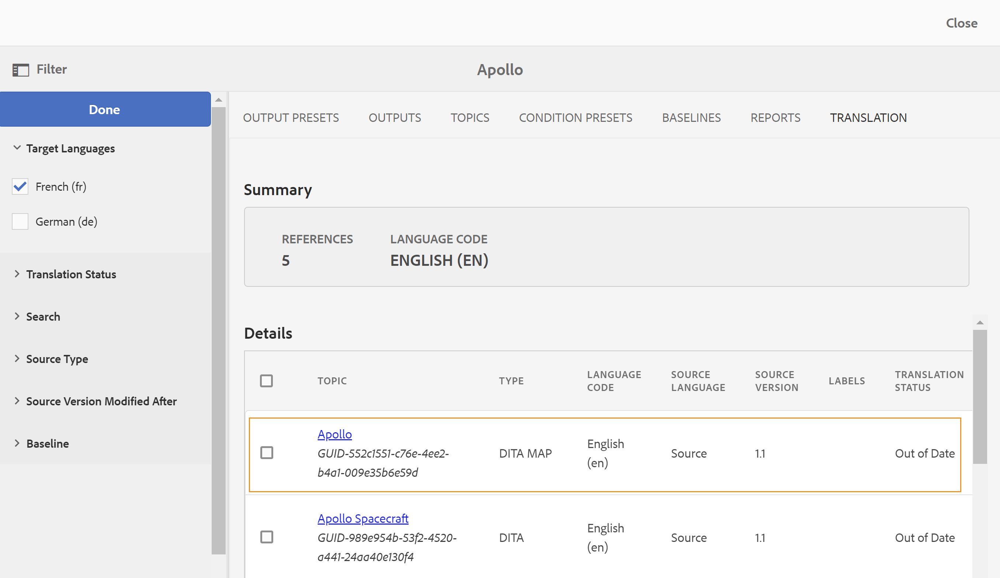
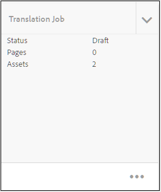

# 変更したトピックの翻訳 {#id16A5A0B6072}

一部のトピックで変更を加えた場合、それらのトピックは再翻訳が必要になります。 DITA マップから変更されたトピックを追跡できます。 ソース言語コピーフォルダーで、DITA マップファイルをクリックし、「翻訳」タブをクリックします。 再翻訳が必要かどうかを問わず、各トピックのステータスを確認できます。

変更したトピックを再翻訳のために送信するには、次の手順を実行します。

1. ソース言語コピーフォルダーからDITA マップファイルをクリックします。

1. 「**翻訳**」タブをクリックします。

1. 左側の&#x200B;**フィルター** パネルで、ステータスを確認する&#x200B;**言語の翻訳**&#x200B;を選択し、**完了**&#x200B;をクリックします。

   各トピックの翻訳ステータスを確認できます。 翻訳用に送信されたものよりも別のリビジョンのトピックが利用可能な場合は、**古い** ステータスが表示されます。

   >[!NOTE]
   >
   > 翻訳ワークフローは、ソース言語フォルダーに保存されたトピックファイルの最後に保存されたリビジョンと、翻訳されたバージョンを比較します。

   矢印をクリックすると、詳細が表示されます。 特定の言語コピーが古くなっているのを確認できます。

   {width="800"}

1. チェックボックスをクリックして、再翻訳のために送信するトピックを選択します。

   非同期日を選択すると、**言語コピーを作成/更新** オプションが参照パネルに表示され、**フィルター** アイコンの上にある&#x200B;**非同期状態を解除** ボタンが表示されます。

   **同期を解除** ボタンを使用して、DITA マップ内のトピックの期限切れステータスを上書きできます。 例えば、翻訳が不要な英語版のトピックに変更を加えた場合は、このボタンを使用して、選択したトピックの「期限切れ」ステータスを変更できます。

   >[!NOTE]
   >
   > **同期の取り消しステータス** ボタンをクリックすると、選択した古いトピックのトピックステータスが最新に設定されます。

1. 「**言語コピーを更新**」をクリックし、翻訳ジョブを設定します。

1. 新しい翻訳プロジェクトを作成するか、既存の翻訳プロジェクトにトピックを追加するかを選択できます。 翻訳プロジェクトを設定するために必要な詳細を指定します。

1. 「**開始**」をクリックします。

   トピックが翻訳用に送信されたことを示す確認メッセージが表示されます。

1. プロジェクトコンソールで翻訳プロジェクトに移動します。 新しい翻訳ジョブ カードがフォルダーに作成されます。 省略記号をクリックして、フォルダーのアセットを表示します。

   {width="300"}

1. 翻訳を開始するには、翻訳ジョブ カードの矢印をクリックし、リストから&#x200B;**開始**&#x200B;を選択します。 ジョブが開始されたことを知らせるメッセージが表示されます。

   翻訳ジョブ カードの下部にある省略記号をクリックすると、翻訳されるトピックのステータスを表示することもできます。

   >[!NOTE]
   >
   > 人間による翻訳サービスを使用している場合は、翻訳用にコンテンツを書き出す必要があります。 翻訳されたコンテンツが完成したら、それを翻訳プロジェクトに読み込む必要があります。

1. 翻訳が完了すると、ステータスは&#x200B;**レビューの準備完了**&#x200B;に変わります。 省略記号をクリックしてトピックの詳細を表示し、ツールバーから次のいずれかの操作を行います。

   - 「**Assetsで表示**」をクリックして、翻訳を確認します。

   - 変更が正しく翻訳されたと思われる場合は、**翻訳を受け入れる**&#x200B;をクリックします。 確認メッセージが表示されます。

   - ジョブを再実行する必要があると思われる場合は、**翻訳を拒否**&#x200B;をクリックします。 拒否メッセージが表示されます。

   >[!NOTE]
   >
   > 翻訳されたアセットを承認または却下することが重要です。そうしないと、ファイルは一時的な場所にとどまり、DAMにコピーされません。

1. Assets UIのソース言語フォルダーにあるDITA マップファイルに戻ります。 再翻訳されたトピックが同期されます。

**親トピック：**&#x200B;[&#x200B; コンテンツを翻訳](translation.md)
