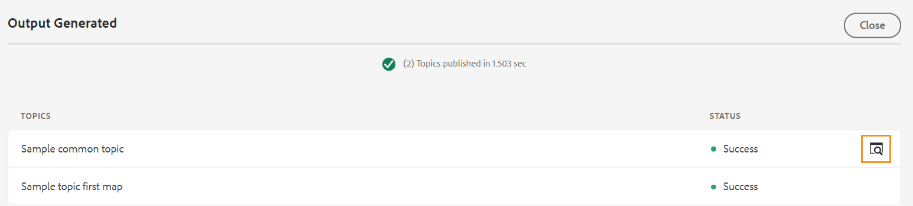

# Web エディターからの出力プリセットの作成 {#id218CL400JW3}

DITA マップの出力プリセットを作成するには、次の手順を実行します。

1. Assets UIで、編集するマップファイルに移動します。

1. マップファイルの排他的ロックを取得するには、マップファイルを選択し、**チェックアウト**&#x200B;をクリックします。

1. マップファイルのアクションメニューから「**トピックを編集**」オプションを選択します。

   マップファイルは、Web エディターで編集するために開きます。

   >[!NOTE]
   >
   > 高度なマップエディターを使用して、マップから任意のトピックを追加または削除できます。 詳しくは、[高度なマップエディターの操作](map-editor-advanced-map-editor.md#)を参照してください。

1. 「**出力**」タブで、「+」アイコンを選択して、DITA マップの出力プリセットを作成します。

   {width="350"}

1. プリセットを追加ダイアログにプリセットの名前を入力し、**追加**&#x200B;をクリックします。

1. 次の設定の詳細を入力します。

   1. 「**一般**」タブで必要なオプションを選択します。 出力プリセットは、条件の有無を問わず作成できます。 DITVAL ファイルを使用することもできます。 AEM Guidesでは、特定のバージョンのDITA マップを公開するためのベースラインを選択することもできます。
   1. 「**AEM**」タブにAEM サイトの詳細を入力します。 **サイト**&#x200B;には、AEM リポジトリで使用可能なAEM Sitesのリストが表示されます。 **カテゴリ**、**セクションテンプレート**&#x200B;および&#x200B;**記事テンプレート**&#x200B;は、出力のルックアンドフィールを整理するために使用される構造的コンポーネントです。 これらは、AEM サイトテンプレートで事前定義されています。

      >[!NOTE]
      >
      > 各ドロップダウンを更新して、次のドロップダウンでさらに分類を取得します。

   1. 「**記事**」タブから、出力を生成するトピックを選択します。
1. 上部の「**プリセットを生成**」アイコンを選択して、出力を生成します。

   {width="800"}

1. 出力生成プロセスのステータスが表示されます。 **トピック**&#x200B;列には、出力が生成されるトピックが一覧表示され、**ステータス**&#x200B;列には各トピックの公開ステータスが表示されます。

   出力を表示するには、トピックの上にマウスポインターを置き、「出力を表示」をクリックします。

   {width="800"}

>[!NOTE]
>
> オプションメニューから、既存の出力プリセットを編集、名前変更、複製、または削除することもできます。

{width="550"}

**親トピック：**[ Web エディターからの記事ベースの公開](web-editor-article-publishing.md)
