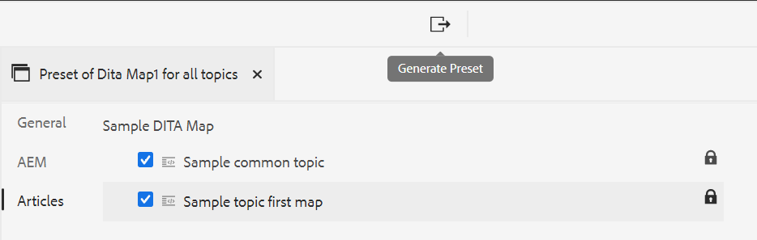
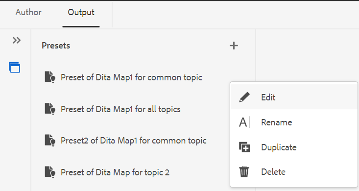

# Web エディターからの出力プリセットの作成 {#id218CL400JW3}

次の手順を実行して、DITA マップの出力プリセットを作成します。

1. Assets UI で、編集するマップファイルに移動します。

1. マップ ファイルに対して排他的なロックを取得するには、マップ ファイルを選択し、[**チェックアウト**] をクリックします。

1. マップ ファイルのアクション メニューから [**トピックを編集**] オプションを選択します。

   マップ ファイルが開き、Web エディタで編集できます。

   >[!NOTE]
   >
   > 高度なマップ エディタを使用して、マップから任意のトピックを追加または削除できます。 詳細については、[&#x200B; 詳細マップ エディタを使用する &#x200B;](map-editor-advanced-map-editor.md#) を参照してください。

1. 「**出力**」タブで「+」アイコンを選択して、DITA マップの出力プリセットを作成します。

   {width="350" align="left"}

1. プリセットを追加ダイアログでプリセットの名前を入力し、「**追加**」をクリックします。

1. 次の設定詳細を入力します。

   1. 「**一般**」タブで必要なオプションを選択します。 条件の有無にかかわらず出力プリセットを作成するように選択できます。 DITVAL ファイルを使用することもできます。 AEM Guidesでは、特定のバージョンの DITA マップを公開するためのベースラインを選択することもできます。
   1. 「**AEM**」タブに、AEM サイトの詳細を入力します。 **サイト** には、AEM リポジトリで使用可能なAEM Sitesのリストが表示されます。 **カテゴリ**、**セクションテンプレート** および **記事テンプレート** は、出力のルックアンドフィールを整理するために使用される構造コンポーネントです。 これらは、AEM サイトテンプレートで事前に定義されています。

      >[!NOTE]
      >
      > 各ドロップダウンを更新すると、次のドロップダウンでさらに分類が表示されます。

   1. 「**記事**」タブから、出力を生成するトピックを選択します。
1. 上部の **プリセットを生成** アイコンを選択して、出力を生成します。

   {width="800" align="left"}

1. 出力生成プロセスのステータスが表示されます。 **トピック** 列には、出力が生成されているトピックがリストされ、**ステータス** 列には、各トピックの公開ステータスが表示されます。

   出力を表示するには、トピックの上にマウスポインターを置き、「出力を表示」をクリックします。

   {width="800" align="left"}

>[!NOTE]
>
> また、オプション メニューから既存の出力プリセットの編集、名前変更、複製、削除を行うこともできます。

{width="550" align="left"}

**親トピック：**&#x200B;[&#x200B; Web エディターからの記事ベースの公開 &#x200B;](web-editor-article-publishing.md)
