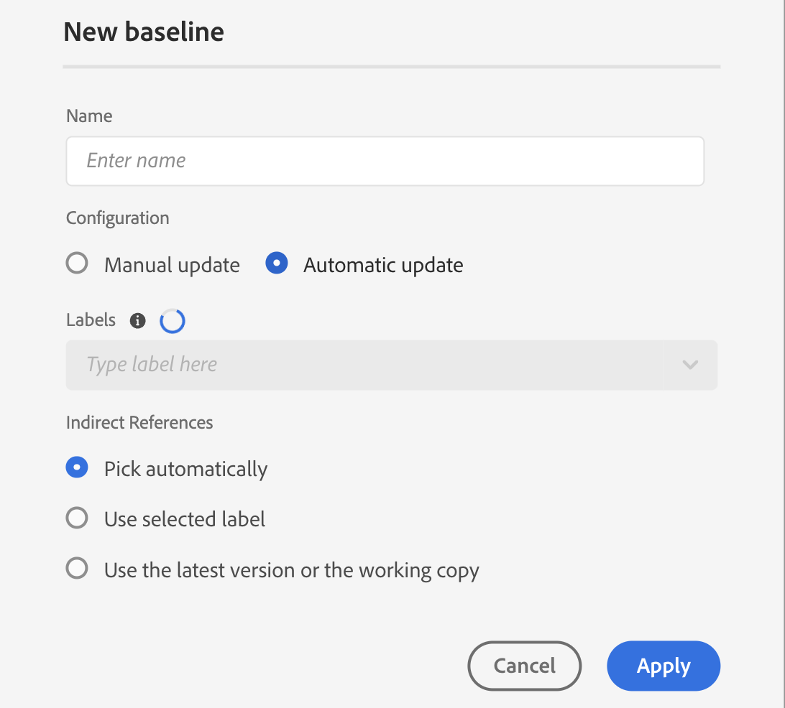

# Web エディターからのベースラインの作成と管理 {#id223MB0ZF043}

>[!TIP]
>
> AEM Guides as a Cloud Service 3 月リリース以降にアップグレードした場合は、web エディターからこのベースライン機能を使用することをお勧めします。

AEM Guidesは、Web エディター内で統合されたベースライン機能を提供し、ユーザーがベースラインを作成して、それを使用して様々なバージョンのトピックを公開または翻訳できるようにします。 また、同じ DITA マップの複数の出力プリセットを並行して公開することもできます。

## ベースラインの作成

次の手順を実行して、Web エディターからベースラインを作成できます。

1. リポジトリパネルで、マップビューで DITA マップファイルを開きます。
1. 「**管理** タブをクリックします。 **ベースライン** パネルには、DITA マップのベースラインが表示されます。

   {width="800" align="left"}

1. **ベースライン** パネルで、右上の「+」アイコンを選択して、ベースラインの作成を開始します。
1. ベースラインの名前を **名前** に入力します。
1. **設定** では、「**手動更新**」オプションまたは「**自動更新**」オプションのいずれかを選択できます。

   **手動更新**：特定の日時に使用可能なトピックと参照コンテンツの特定のバージョン、またはトピックのバージョン用に定義されたラベルを使用して、静的ベースラインを手動で作成できます。

   - **ベースとなるバージョンを選択** で、次のいずれかのオプションを選択します。

      1. **日付** &lt; タイムスタンプ\>：指定された日時にトピックのバージョンを選択します。
      1. **ラベル**：適用されるラベルに従ってトピックを選択するには、このオプションを選択します。 トピックにラベルが指定されている場合、ドロップダウンにラベルが表示されます。 リストからラベルを選択できます。 テキストボックスにラベルを追加することもできます。

         静的ベースライン内の直接参照の場合、ラベルはマップの最新の保存済みバージョンから取得されます。 たとえば、トピック A のバージョン 1.0 と 1.1 のラベル `Label Release 1.0` と `Label Release 1.1` を作成した場合、バージョン 1.0 として保存されたマップにトピック A を追加します。この場合、静的ベースラインラベルのドロップダウンでラベル `Label Release 1.0` と `Label Release 1.1` を表示できます。

         **ラベル** を選択すると、直接参照と間接参照を選択できます。
         - DITA マップ内の直接参照の場合、指定したラベルが適用されていない最新バージョンのトピックを使用するオプションが提供されます。

           >[!NOTE]
           >
           > 存在しないラベルを入力し、「ベースラインを作成しない **オプションを選択すると** ベースラインの作成は失敗し、「ベースライン」パネルのベースライン名の近くにエラーメッセージが表示されます。

         - DITA マップ内の間接参照の場合は、指定したラベルが適用されていない最新バージョンのトピックを使用するオプションが追加で提供されます。 また、参照されるコンテンツに対して **自動的に選択** を選択することもできます。システムは、参照されるコンテンツのバージョンに対応する、参照されるコンテンツのバージョンを自動的に選択します。

         日付としてラベルまたはバージョンを選択すると、マップ内の参照されるトピックおよびメディア ファイルがすべて選択されます。 この選択したトピックは、ユーザーインターフェイスには表示されませんが、バックエンドで保存されます。

   **自動更新**：ベースラインを作成する場合は、このオプションを選択すると、適用されたラベルに従ってトピックが自動的に選択されます。

   自動更新の構成を使用して作成されたベースラインは、動的に更新されます。 ベースラインの生成、ベースラインのダウンロード、またはベースラインを使用した翻訳プロジェクトの作成を行うと、更新されたラベルに基づいてファイルが動的に選択されます。 例えば、ベースラインにラベルリリース 1.0 のトピックのバージョン 1.2 を使用し、その後でラベルリリース 1.0 のバージョン 1.5 を更新した場合、ベースラインは動的に更新され、バージョン 1.5 が使用されます。

   {width="300" align="left"}

   - **ラベル**：トピックにラベルが指定されている場合は、「**ラベル**」ドロップダウンを使用して [ リストに表示されたラベル ](#labels-list) から選択します。
最初に選択したラベルは、後で選択したラベルよりも優先されます。

     >[!NOTE]
     >
     >ラベルが取り込まれている間、ローダーが表示され、ドロップダウンが無効になります。

     動的ベースラインの場合、ラベルは最新の保存バージョンとマップの現在の作業コピーから取得されます。 例えば、ラベルを作成したとします   トピック A のバージョン 1.0 および 1.1 の場合は `Label Release A.1.0 ` と `Label Release A.1.1`、トピック B のバージョン 1.0 および 1.1 の場合は `Label Release B.1.0` と `Label Release B.1.1` のラベル。 次に、トピック A をバージョン 1.0 のマップ A に追加し、トピック B を 1.0*のマップ A に追加します（作業用コピー）。 この場合、動的ベースラインラベルのドロップダウンで、`Label Release A.1.0 `、`Label Release A.1.1`、`Label Release B.1.0` および `Label Release B.1.1` を表示できます。

1. **間接参照**: DITA マップ内の間接参照には、次のオプションがあります。

   - **自動的に選択**：参照コンテンツに対して **自動的に選択** を選択できます。また、システムは、参照先のコンテンツのバージョンに対応する参照コンテンツのバージョンを自動的に選択します。

   - **選択したラベルを使用**：トピックのバージョンに対して定義された選択したラベルを使用して、ベースラインを作成できます。
   - **最新バージョンまたは作業コピーを使用**：指定したラベルが適用されていないトピックの最新バージョンを使用します。バージョンが作成されていない場合は、トピックの作業コピーを使用してベースラインを作成します。
1. 「**適用**」をクリックします。

ベースラインが作成されます。 ベースラインの作成は非同期で行われるので、Web エディターで他のファイルの作業を続行できます。 ベースラインが作成されると、ベースラインが作成されたことを確認するポップアップメッセージが表示され、そのインボックス通知も届きます。

## ベースラインの管理

ベースラインダッシュボードの様々な機能を使用して、既存のベースラインを管理できます。

- ベースラインパネルのテキストボックスを使用して、既存のベースラインを検索できます。 **フィルターを適用** アイコンを使用して、すべてのベースラインを表示するか、作成ステータスが成功、処理中または失敗のベースラインをリストします。
- ベースラインパネルの「**更新**」アイコンを使用して、すべてのベースラインを再確認し、マップビューで開いた DITA マップのベースラインの新しいリストを表示します。
- **ベースライン** パネルのリストでベースラインをダブルクリックすると、既存の静的ベースラインの内容を表示または編集できます。 中央のベースライン編集ウィンドウには、DITA マップファイル、マップのコンテンツまたはトピック、および参照コンテンツが表示されます。

  >[!NOTE]
  >
  >静的ベースラインの編集操作は、少数の参照変更に対してのみ推奨されます。 編集操作は、すべての参照を再計算する必要があるため、メインの DITA マップのバージョンを変更することはお勧めしません。 これにより、大きな DITA マップのベースライン更新が失敗する場合があります。 大きな DITA マップの場合は、新しいベースラインを作成するか、ベースラインのプロパティを編集できます。
  >
  >動的ベースラインの場合の編集操作では、動的ベースラインの参照が実行時にラベルを使用して生成されるので、ベースラインのプロパティを編集できます。

  {width="800" align="left"}

  「オプション」 メニューからベースラインに対して次の操作を実行することもできます。

### ベースラインの複製

ベースラインを複製し、必要に応じて変更できます。
{width="300" align="left"}
*ラベルに基づいてベースラインを複製するか、正確なコピーを作成します。*

1. ベースラインのオプションメニューから「**複製**」を選択します。 **ベースラインを複製** ダイアログボックスが開きます。
>[!NOTE]
>
> ベースラインのデフォルト名は `<selected baseline name>`_suffix です（sample-baseline_1 と同様）。 必要に応じて名前を変更できます。

   **基準とするバージョンを選択** で、「**正確なコピー**」オプションまたは「**ラベル**」オプションのいずれかを選択できます。

   - **正確なコピー**:Experience Manager Guidesでは、すべてのトピックの同じバージョンを選択し、複製されたベースラインの正確なコピーを作成します。
   - **ラベル**：ドロップダウンを使用して、[ リストに表示されたラベル ](#labels-list) の 1 つを選択できます。 Experience Manager Guidesは、選択したラベルが定義されているトピックのバージョンを選択し、残りのトピックのバージョンは、複製されたベースラインからバージョンを選択します。 例えば、ドロップダウンからラベル「`Release 1.0`」を選択すると、このラベルを定義したトピックのバージョンが選択されます。 その他のすべてのトピックでは、複製されたベースラインからバージョンが選択されます。
1. **複製** をクリックします。

- 既存のベースラインを **名前変更** または **削除** します。
- 静的ベースラインの **ラベルを管理** オプションから、既存のラベルを追加、削除、変更します。 管理者が事前定義済みのラベルを設定している場合は、ラベルを追加ドロップダウンリストにこれらのラベルが表示されます。 ラベルの追加について詳しくは、[ ラベルの使用 ](web-editor-use-label.md#) を参照してください。

  >[!NOTE]
  >
  > ラベルの追加や削除のプロセスは非同期で行われるので、Web エディターで他のファイルの作業を続行できます。 ラベルが追加または削除されると、ラベルが追加または削除されたことを確認するポップアップメッセージが表示され、そのインボックス通知も受信されます。

- ベースラインの作成時に設定した既存の静的ベースラインの **プロパティの編集**。
- 「ベースラインのエクスポート **オプションを使用して、Microsoft Excel ファイルのベースラインのスナップショットをエクスポー** します。

### ラベルのリスト {#labels-list}

ドロップダウンにリストされるラベルは、次の条件に基づいています。
- ラベルは、（ベースラインが作成される） DITA マップ内のトピックのバージョンの 1 つに追加する必要があります。
- また、ラベルの選択時には、DITA マップの第 1 レベルの参照（トピックまたはサブマップ）のみが考慮されます。

## ベースラインフィルター

**ベースラインフィルター** パネルのフィルターアイコンを使用すると、ベースライン編集ウィンドウで開いたベースラインにフィルターを適用できます。

{width="300" align="left"}

- ファイル名またはファイルの場所に基づいてファイルをフィルタリングします。
- ファイルタイプ、参照タイプなど、様々な列の値に基づいてファイルをフィルタリングします。
- ベースライン編集ウィンドウに表示する列を選択します。

>[!NOTE]
>
> 列見出しをクリックすると、ベースライン編集ウィンドウの列に基づいてファイルを並べ替えることができます。

**ベースラインの保存またはリセット**

ベースラインを編集したら、上部の「**保存**」ボタンをクリックして、ベースラインの変更を保存します。 変更を保存せずにベースラインをリセットする場合は、「**リセット**」ボタンをクリックします。 **リセット** ボタンをクリックすると、保存されていない変更が失われることを示す警告が表示されます。

**親トピック：**[ Web エディタの操作 ](web-editor.md)
