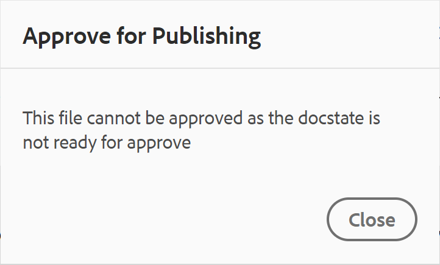

# ドキュメントの状態 {#id1821HC00URO}

ドキュメントの準備状況を管理するために、AEM Guidesには、ドキュメントの現在の状態を示すドキュメントステートプロパティが用意されています。 ドキュメントの状態を使用すると、ドキュメントが新規、レビュー中、またはレビュー完了済みかどうかを素早く確認できます。

## 文書状態の種類

ドキュメントには、ドキュメント状態プロファイルで定義されたドキュメント状態を含めることができます。 例えば、文書には、次のいずれかの文書状態が含まれる場合があります。

- ドラフト – ドキュメントが作成され、新しい変更とともに保存されていることを示します。
- レビュー中 – ドキュメントのレビューワークフローが開始されていることを示します。
- レビュー済み – ドキュメントが目的のユーザーによってレビューされたことを示します。

これらの状態は、文書の状態プロファイル設定に従って、手動または自動で設定されます。 例えば、ドキュメントの状態プロファイルが開始状態をドラフトとして設定され、レビュー中のドキュメントにレビュー中の状態が定義されている場合などです。 次に、ドキュメントを作成すると、ドキュメントの状態は&#x200B;*ドラフト*&#x200B;に設定されます。 レビュータスクを開始すると、ドキュメントの状態が「レビュー中」に変更されます。

1つまたは複数のドキュメントのドキュメント状態を手動で変更することもできます。 ただし、複数のドキュメントのドキュメント状態を変更する場合、許可される状態は、選択したドキュメントに許可される一般的な状態によって決まります。 例えば、ドキュメントの状態を「ドラフト」、「レビュー中」、「レビュー済み」、「公開準備完了」と同じ順序で定義したとします。 文書1.ditaでは、状態は&#x200B;*ドラフト*&#x200B;に設定され、文書2.ditaでは、状態はレビュー済みに設定されます。 one.ditaと2.ditaの両方を選択すると、許可されるドキュメント状態は&#x200B;*公開準備完了*&#x200B;になります。 two.ditaは&#x200B;*レビュー済み*&#x200B;状態であるため、two.ditaの次に可能な状態は&#x200B;*公開の準備完了*&#x200B;のみです。これは、両方のドキュメントが選択されている場合に表示されます。

>[!NOTE]
>
> ドキュメントは一度に1つの状態にのみ存在できます。

## ドキュメントの状態を変更

文書の状態を変更するには、次の手順を実行します。

1. Assets UIで、ドキュメントの状態を変更する1つ以上のドキュメントを選択します。
1. メインツールバーで、**プロパティ**&#x200B;をクリックします。
1. 「**ドキュメントの状態**」ドロップダウンから新しい状態を選択します。 ドキュメント状態プロファイルの状態遷移セクションで許可されているドキュメント状態のみを選択できます。

   >[!NOTE]
   >
   >管理者は、すべてのドキュメントの状態を表示し、ドキュメントを任意の状態に変更できます。

1. 「**保存して閉じる**」をクリックします。

## ドキュメントの状態を表示

Assets UIのカードビューには、それぞれのDITA トピックまたはDITA マップの作成日とサイズと共に現在のステートが表示されます。

{width="800"}

## DDLCでドキュメントの状態を使用する

ドキュメントの状態は、DDLCのドキュメントのライフサイクルを管理する上で重要な役割を果たします。 組織がDDLCに厳密に従っている場合、状態に基づいてドキュメントの編集を制御するメカニズムを持つことが不可欠な機能になります。 例えば、*ドラフト*&#x200B;または&#x200B;*レビュー中*&#x200B;の状態にあるドキュメントの編集を許可できます。 ただし、文書をレビューして公開する準備ができたら、文書のさらなる変更を防ぐ方法が必要です。

AEM Guidesには、ドキュメントの承認ワークフローが用意されています。このワークフローを使用すると、ドキュメント開発プロセスのライフサイクルを管理できます。 ドキュメントを公開する準備ができた後、または最終状態に達した後は、承認済みとしてマークできます。 文書が承認されると、AEM Guidesは新しいバージョンの文書を作成し、読み取り専用にします。 次に、ドキュメントを公開用に移動したり、さらに処理するためのベースラインを作成したりできます。

承認済みとしてマークされたドキュメントから新しいリリースを開始するには、作成者が新しいリリースを開始する必要があります。 新しいリリースを開始すると、ドキュメントの状態が&#x200B;*ドラフト*&#x200B;に変更されます。 ドキュメントの状態を&#x200B;*ドラフト*&#x200B;に変更すると、ドキュメントは再び編集可能になり、次のリリースで作業を続行できます。

ドキュメント承認機能を使用するには、次の手順を実行します。

>[!NOTE]
>
> 承認ワークフロー機能は、管理者が有効にする必要があります。 詳しくは、「Adobe Experience Manager Guides as a Cloud Serviceのインストールと設定」の「*承認ワークフローを有効にする*」セクションを参照してください。

1. Web エディターで、承認用にマークする文書を開きます。

1. 「**承認済みをマーク**」アイコンをクリックします。

1. 文書が承認済みとしてマークされている場合は、次のダイアログが表示されます。

   {width="300"}

   文書を承認済みとしてマークできない場合は、次のメッセージが表示されます。

   {width="300"}

1. 文書を承認済みとしてマークする準備ができたら、ドロップダウンリストからラベルを選択し、**承認**&#x200B;をクリックします。

   >[!NOTE]
   >
   > 管理者がラベルの事前定義済みリストを設定していない場合は、ラベルを入力するための自由形式テキストフィールドが表示されます。

1. ドキュメントが承認済みとして正常にマークされると、ドキュメントの&#x200B;**プレビュー**&#x200B;が読み取り専用モードで表示されます。

   {width="650"}

   >[!NOTE]
   >
   > プレビューモードでは、すべての編集オプションがツールバーから削除されます。 さらに、ドキュメントの作成者ビューとSource ビューも上部ナビゲーションから削除されます。

文書が承認済みとしてマークされると、その文書は編集できなくなります。 次のリリースでドキュメントを使用する場合は、*ドラフト*&#x200B;状態に戻す必要があります。 承認済みドキュメントのドキュメント状態を&#x200B;*ドラフト* モードに戻すには、次の手順を実行します。

1. 承認済みドキュメントで、**新しいリリースの開始** アイコン をクリックします。

   「新規リリースを開始」メッセージが表示されます。

1. 「**確認**」をクリックします。

   ドキュメントの状態が「ドラフト」に変更され、ドキュメントが編集モードでWeb エディターで開かれます。

**親トピック：**&#x200B;[&#x200B; Web エディターの操作](web-editor.md)
