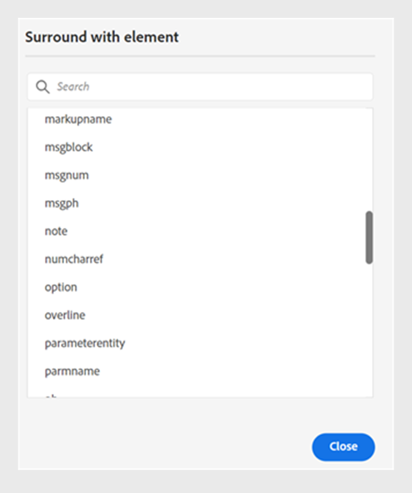

# Web エディターでのトピックの編集 {#id2056B040VUI}

Web エディタには、トピック ファイルを簡単に作成または変更できる様々な編集機能が用意されています。 大まかに言えば、次の手順を実行して web エディターでトピックを編集します。

>[!IMPORTANT]
>
> Web エディターの操作中にアプリケーションエラーが発生した場合は、ページを更新して作業を続行します。

1. トピックを変更するには、必要な要素のテキスト境界内をクリックし、編集を開始します。

1. 特定の要素を挿入するには、新しい要素を挿入する要素の最後のをクリックし、ツールバーの必要な要素アイコンをクリックします。 キーボードショートカット `Alt+Enter` を使用して、「要素を挿入 **ポップアップを呼び出すこともでき** す。

   トピックで使用できる要素のリストが表示されます。 AEM Guidesは、トピック内の有効な場所に従って、要素のインテリジェントな配置を実行します。

   >[!NOTE]
   >
   > - `/etc/designs/fmdita/clientlibs/xmleditor/` にある `ui_config.json` ファイルを設定することで、ツールバーに表示するアイコンを選択することもできます。 機能のカスタマイズについて詳しくは、システム管理者にお問い合わせください。

1. ドキュメントの編集が完了したら、「**保存**」をクリックします。

   >[!NOTE]
   >
   > 変更内容をAEM リポジトリにコミットしない場合は、「未保存の変更内容」ダイアログで、「**閉じる**」をクリックしたあと、「**保存せずに閉じる**」をクリックします。

## 要素間でのコンテンツの部分選択

また、Experience Manager Guidesでは、複数の要素のコンテンツを選択することもできます。 コンテンツを選択したら、次の操作を実行できます。

- 書式設定と削除：選択したコンテンツを太字、斜体、下線にしたり、削除したりします。 有効なオープンタグのコンテンツが結合され、1 つの要素の下に表示されます。 例えば、段落内のコンテンツを選択して、選択範囲を別の段落に拡張できます。 次に、選択したコンテンツを太字にすると、開いているタグのすべての太字のコンテンツが結合され、1 つの段落要素の下に表示されます。

同様に、選択したコンテンツを削除すると、開いているタグで削除後に残っているコンテンツが結合されます。

- コンテンツを有効な要素で囲む：次の手順を実行して、コンテンツを有効な要素で囲みます。

   - 要素内のコンテンツを選択します。
   - 上部の 2 番目のツールバーから「」アイコンを選択し、「**要素で囲む** ダイアログボックスを表示します。 ダイアログボックスには、選択したコンテンツの有効な要素が一覧表示されます。

     >[!NOTE]
     >
     > 選択したコンテンツのコンテキストメニューを選択して、「要素で囲む」 ダイアログボックスを表示することもできます。

   - ダイアログボックスから要素を選択します。 選択したコンテンツはその要素の下にラップされます。 例えば、段落内のコンテンツを選択し、**要素で囲む** ダイアログボックスで `<note>` 要素を選択すると、選択したコンテンツがメモの下に表示されます。\
      {width="300" align="left"}

## ファイルの編集中にブラウザーを更新

Experience Manager Guidesでは、web エディターでコンテンツを編集している間にブラウザーを更新することができます。 この機能は、作業中にアプリケーションエラーが発生した場合にコンテンツの編集を続行するのに役立ちます。 変更が保存されていない 1 つ以上のファイルを編集用に開いているときにブラウザーの更新をクリックすると、保存されていない変更が失われる可能性があることを示す警告が表示されます。 更新操作をキャンセルし、ファイルを保存して変更を保存するオプションが表示されます。

ブラウザーを更新しても、左右のパネルのビューは web エディターに保持されます。 Experience Manager Guidesでは、ブラウザーを更新したときに、Web エディターで開いたファイルを最後に保存した状態に戻します。 例えば、リポジトリーパネルで開いたファイルは、再び開かれます。 マップ パネルは、以前に開いたマップとともに保持されます。

アクティブなトピックまたは DITA マップがコンテンツ編集領域で再び開きます。

右側のパネルも再び開き、更新前と同じビューが表示されます。

## 作業コピーインジケーター

AEM Guidesには、ファイルの現在の\（作業用コピー\）が保存済みのバージョンと同期しているかどうかを示す作業用コピーインジケーターが用意されています。 現在のコピーに変更を加え、ファイルを保存していない場合は、トピックの [ ファイル ] タブにタイトルと共に\* マークが表示されます。 このインジケーターは、変更を保存するためのリマインダーとして機能し、ファイルを保存すると消えます。

{width="550" align="left"}

AEM Guidesは、ファイルの最後に保存された\（working\） コピーが、保存されたバージョンと同期しているかどうかも示します。 作業用コピーと最後に保存したバージョンの間に未保存の変更がある場合は、トピックの [ ファイル ] タブの右上隅にバージョン情報と共に\* マークが表示されます。 このインジケータは、ファイルの現在の\（作業中\） コピーからバージョンを保存して作成するためのリマインダとして機能します。

{width="550" align="left"}

## ロックされているファイルをオーサーモードとSource モードで開く

DITA または Markdown ファイルが別のユーザーによってロックまたはチェックアウトされている場合、コンテンツを編集または修正することはできません。 ただし、**プレビュー** モードに加えて、**オーサー** モードと **Source** モードの両方で、読み取り専用形式でファイルを表示できます。

読み取り専用モードでは、{Author **モードまたは** 2}Source **モード内でコンテンツ、タグ、属性を表示できます。**&#x200B;また、ファイルのプロパティを変更することもできます。

ツールバーには、読み取り専用アクセス用に次のアイコンが表示されます。

- タグビューを切り替え
- バージョン履歴
- バージョンラベル

Experience Manager Guidesでは、バージョン番号の近くに **読み取り専用アクセス** インジケーターも表示されます。

読み取り専用 DITA マップの **レイアウト** ビューにアクセスできます。 このビューでは、DITA マップとそのプロパティを表示できますが、編集はできません。

>[!NOTE]
>
> フォルダーレベルの管理者ユーザーは、*ui_config.json* を更新して、オーサーモード、Source モード、レイアウトモードの読み取り専用ファイルに調和してアクセスできるようにする必要があります。

## リポジトリ表示で開いているファイルを見つけます。

Web エディターでファイルを開いている間、Experience Manager Guidesはリポジトリビューでファイルを見つけるための機能を提供します。 例えば、編集中に現在のトピックを検索します。

この機能をオフにすると、**ユーザー環境設定** の **外観** タブにある **リポジトリ内のファイルを常に見つける** オプションでファイルを検索できます。

**親トピック：**&#x200B;[ Web エディタの操作 ](web-editor.md)
