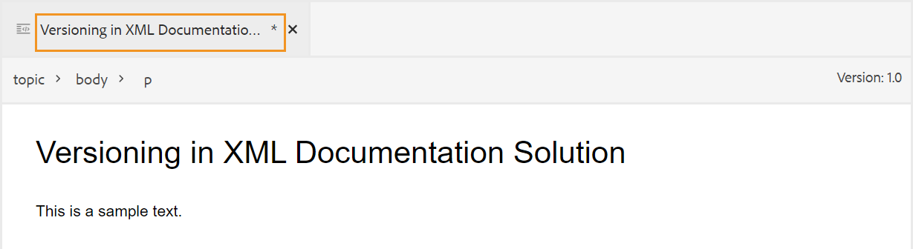
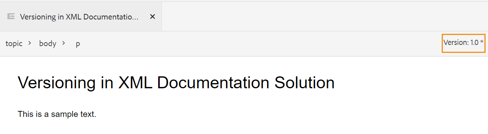

# Edit topics in the Web Editor {#id2056B040VUI}

The Web Editor comes with a range of editing features that let you easily create or modify your topic files. Broadly, you would perform the following steps to edit a topic in the Web Editor.

>[!IMPORTANT]
>
> If you encounter an application error while working on the Web Editor, refresh the page to continue working.

1. To make changes in your topic, click within the text boundary of the required element and start making edits.

1. To insert a specific element, click at the end of the element after which you want to insert the new element and click the required element icon in the toolbar. You can also use the keyboard shortcut `Alt+Enter` to invoke the **Insert Element** popup.

   A list of element appears that can be used in the topic. AEM Guides does an intelligent placing of elements as per their valid location in the topic.

   >[!NOTE]
   >
   > You can also choose which icon to be displayed in the toolbar by configuring the `ui_config.json` file located at - `/etc/designs/fmdita/clientlibs/xmleditor/`. For more information about customizing features, contact your system administrator.

1. Once you have finished editing your document, click **Save**.

   >[!NOTE]
   >
   > If you do not wish to commit changes into AEM repository, click **Close**, and then click **Close Without Saving** in the Unsaved Changes dialog.

## Partial selection of content across elements

Experience Manager Guides also allows you to select content across elements. After selecting the content, you can perform the following operations:

- Formatting and deletion: Make the selected content bold, italics, underline, or even delete the selected content. The content from the valid open tags is then merged and appears under a single element. For example, you can select the content within a paragraph and extend the selection to another paragraph. Then, if you make the selected content bold, all the bold content from the open tags is merged and appears under a single paragraph element.

Similarly, if you delete the selected content, the remaining content after the deletion in the open tags is merged.

- Surround the content with a valid element: Perform the following steps to wrap the content with a valid element:

   - エレメント内のコンテンツを選択します。
   - 上部のセカンダリツールバーから「」アイコンを選択して、「**要素で囲む**」ダイアログボックスを表示します。 ダイアログボックスには、選択したコンテンツの有効な要素が一覧表示されます。
     >[!NOTE]
     >
     > また、選択したコンテンツのコンテキストメニューを選択して、「エレメントで囲む」ダイアログボックスを表示することもできます。

   - ダイアログボックスからエレメントを選択します。 選択したコンテンツはその要素の下にラップされます。 例えば、段落内のコンテンツを選択した後、**要素で囲む** ダイアログボックスから`<note>`要素を選択すると、選択したコンテンツがメモの下に表示されます。\
      {width="300" align="left"}

## ファイルの編集中にブラウザーを更新する

Experience Manager Guidesでは、Web エディターでコンテンツを編集する際にブラウザーを更新するサポートが提供されています。 この機能は、作業中にアプリケーションエラーが発生した場合に備えて、コンテンツの編集を続行するのに役立ちます。 未保存の変更を含む1つ以上のファイルを編集用に開いている間にブラウザーの更新を押すと、未保存の変更が失われる可能性があると警告されます。 更新操作をキャンセルし、ファイルを保存して変更を保持するオプションが表示されます。

ブラウザーを更新しても、左パネルと右パネルのビューはWeb エディターに保持されます。 Experience Manager Guidesは、ブラウザーを更新したときにWeb エディターで開いたファイルの最後に保存された状態を復元します。 例えば、リポジトリパネルで開いたファイルが再度開かれます。 マップパネルは、以前に開いたマップと一緒に保持されます。

アクティブなトピックまたはDITA マップがコンテンツ編集領域で再度開きます。

右側のパネルも再び開かれ、更新前と同じビューが表示されます。

## 作業用コピーインジケーター

AEM Guidesには、ファイルの現在の\（作業コピー\）が保存済みバージョンと同期しているかどうかを示す作業コピーインジケーターが表示されます。 現在のコピーに変更を加え、ファイルを保存していない場合は、トピックの「ファイル」タブにタイトルと共に「*」マークが表示されます。 このインジケーターは、変更を保存するためのリマインダーとして機能し、ファイルを保存すると消えます。

{width="550" align="left"}

AEM Guidesは、ファイルの最後に保存された\（working\）コピーが保存済みのバージョンと同期しているかどうかも示します。 作業コピーと最後に保存されたバージョンの間に保存されていない変更がある場合は、「\*」マークが表示され、トピックの「ファイル」タブの右上隅に表示されるバージョン情報が表示されます。 このインジケーターは、ファイルの現在の\（working\）コピーからバージョンを保存して作成するためのリマインダーとして機能します。

{width="550" align="left"}

## ロックされたファイルを作成者モードとSource モードで開く

DITAまたはMarkdown ファイルが他のユーザーによってロックまたはチェックアウトされている場合、コンテンツの編集または変更はできません。 ただし、**Preview** モードに加えて、**Author**&#x200B;と&#x200B;**Source** モードの両方で、読み取り専用フォーマットでファイルを表示できます。

読み取り専用モードでは、**作成者**&#x200B;または&#x200B;**Source** モード内のコンテンツ、タグ、属性を表示できます。 ファイルのプロパティを変更することもできます。

ツールバーには、読み取り専用アクセス用の次のアイコンが表示されます。

- タグビューを切り替え
- バージョン履歴
- バージョンラベル

Experience Manager Guidesでは、バージョン番号の近くに&#x200B;**読み取り専用アクセス** インジケーターも表示されます。

読み取り専用DITA マップの&#x200B;**レイアウト** ビューにアクセスできます。 このビューでは、DITA マップとそのプロパティを表示できますが、編集は行われません。

>[!NOTE]
>
> フォルダーレベルの管理ユーザーは、*ui_config.json*&#x200B;を更新して、オーサーモード、Source モード、レイアウトモードの読み取り専用ファイルに調和してアクセスできるようにする必要があります。

## リポジトリビューで開いているファイルを探します

Web エディターでファイルを開くと、Experience Manager Guidesには、リポジトリビューでファイルを検索する機能が用意されています。 例えば、編集中に現在のトピックが検索されます。

この機能をオフにすると、**ユーザー設定**&#x200B;の「**アピアランス**」タブから「**常にリポジトリ内のファイルを探す**」オプションでファイルを検索できます。

**親トピック：**[ Web エディターの操作](web-editor.md)
