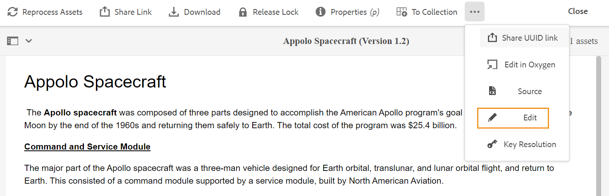
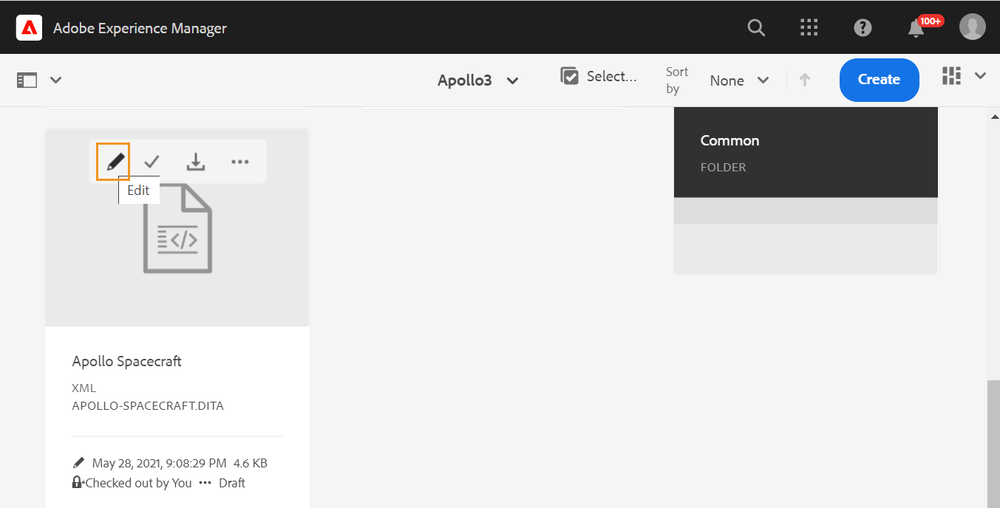

# Web エディターの起動 {#id2056B0140HS}

次の場所から Web エディタを起動できます。

- [AEMのナビゲーションページ](#id2056BG00RZJ)
- [AEM ASSETS UI](#id2056BG0307U)
- [DITA マップコンソール](#id2056BG090BF)

以下の節では、様々な場所から web エディターにアクセスして起動する方法について詳しく説明します。

## AEMのナビゲーションページ {#id2056BG00RZJ}

AEMにログインすると、ナビゲーション ページが表示されます。

{width="800" align="left"}

**ガイド** リンクをクリックすると、web エディターに直接移動します。

{width="800" align="left"}

ファイルを選択せずに Web エディタを起動すると、空白の Web エディタ画面が表示されます。 AEMのリポジトリまたはお気に入りコレクションから、ファイルを開いて編集できます。

- **ガイド** アイコン（）をクリックして、AEMのナビゲーションページに戻ります。

- 「**閉じる** ボタンをクリックすると、設定に応じた宛先に移動します。

  

  
 クラウドサービス 

  Cloud Services を使用している場合は、「**閉じる**」ボタンをクリックしてAEMのナビゲーションページに戻ります。
  

  

  
 オンプレミスソフトウェア

  AEM Guides オンプレミスソフトウェア（4.2.1 以降）を使用している場合は、右側の **閉じる** ボタンをクリックして、Assets UI の現在のファイルパスに戻ります。

  

## AEM ASSETS UI {#id2056BG0307U}

Web エディターを起動できる別の場所は、AEM Assets UI にあります。 1 つ以上のトピックを選択して、Web エディターで直接開くことができます。 Web エディターでトピックを開くには、次の手順に従います。

1. Assets UI で、編集するトピックに移動します。

   >[!NOTE]
   >
   > また、トピックの UUID も確認できます。

   。

   {width="800" align="left"}

   >[!IMPORTANT]
   >
   > 編集するトピックを含むフォルダーに対する読み取りおよび書き込み権限があることを確認します。

1. トピックに対して排他的なロックを取得するには、トピックを選択して **チェックアウト** をクリックします。

   >[!IMPORTANT]
   >
   > 管理者が「**チェックアウトせずに編集を無効にする** オプションを設定した場合、編集する前にファイルをチェックアウトする必要があります。 ファイルをチェックアウトしない場合、編集オプションは表示されません。

1. アセット選択モードを閉じ、編集するトピックをクリックします。

   トピックのプレビューが表示されます。

   リスト表示、カード表示、プレビューモードから Web エディターを開くことができます。

   >[!IMPORTANT]
   >
   > 複数のトピックを開いて編集する場合は、目的のトピックをアセット UI から選択し、「編集」をクリックします。 ブラウザーでポップアップブロッカーが有効になっていないことを確認してください。有効になっていない場合は、選択したリストの最初のトピックのみが編集用に開かれます。

   {width="800" align="left"}

   トピックをプレビューせずに Web エディターで直接開く場合は、カード表示からクイックアクションメニューの編集アイコンをクリックします。

   {width="800" align="left"}

1. **編集** をクリックして、トピックを Web エディターで開きます。

   {width="800" align="left"}

## DITA マップコンソール {#id2056BG090BF}

DITA マップコンソールから Web エディタを開くには、次の手順に従います。

1. Assets UI で、編集するトピックを含む DITA マップファイルに移動してクリックします。

   DITA マップコンソールが表示されます。

1. **トピック** をクリックします。

   マップ ファイル内のトピックのリストが表示されます。 トピックの UUID は、トピックのタイトルの下に表示されます。

1. 編集するトピック ファイルを選択します。

1. **トピックを編集** をクリックします。

   {width="800" align="left"}

1. トピックが Web エディターで開きます。

   >[!IMPORTANT]
   >
   > 管理者が「**チェックアウトせずに編集を無効にする** オプションを設定した場合、編集する前にファイルをチェックアウトする必要があります。 ファイルをチェックアウトしない場合、ドキュメントはエディターで読み取り専用モードで開きます。

**親トピック：**[ Web エディタの操作 ](web-editor.md)
