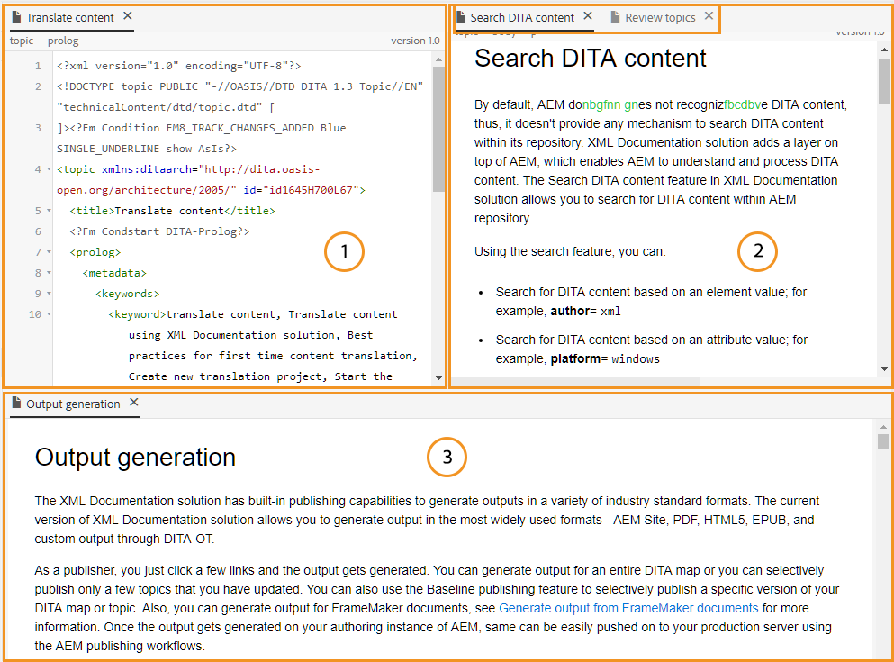
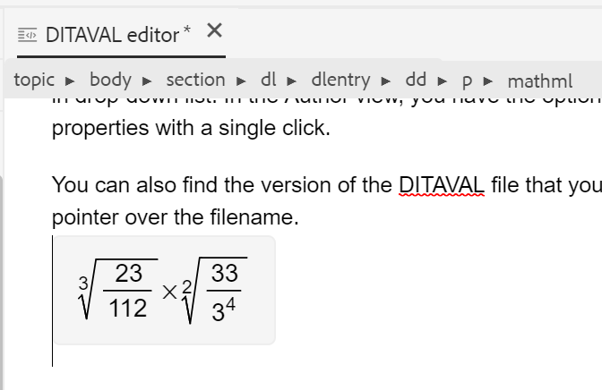
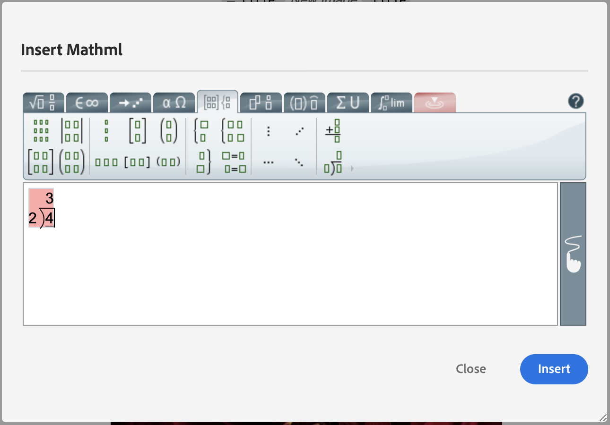

# Web エディターのその他の機能 {#id2056B0B0YPF}

Web エディターには、次の便利な機能があります。

**ファイルのタブのコンテキストメニュー関数**

Web エディターでファイルを開くと、コンテキストメニューからさまざまなアクションを実行できます。 メディアファイル、単一のDITA ファイル、または複数のファイルを開くかどうかに応じて、異なるオプションが表示される場合があります。

**メディアファイル**

開いているメディアファイルのタブのコンテキストメニューには、次の機能があります。

{width="300"}

**単一のDITA ファイル**

開いているファイルのタブのコンテキストメニューには、次の機能があります。

:   {width="300"}

**複数のファイル**

複数のファイルを開いている場合、コンテキストメニューに次のオプションが表示されます。

{width="550"}

コンテキストメニューの様々なオプションについて説明します。

***保存***：次のオプションから選択できます。

- **保存**：新しいバージョンを作成せずにファイルを保存するには、**保存**&#x200B;を選択します。 新しいトピックを作成するたびに、そのトピックのバージョン不要の作業コピーがDAMで作成されます。 ドキュメントを保存すると、DAMでドキュメントの作業コピーが更新されます。 このバージョンを簡単に保存しても、トピックの新しいバージョンは作成されません。 トピックがレビュー中の場合、トピックを保存しても、レビュー担当者は変更されたトピックコンテンツにアクセスできません。

- **すべてを保存**: Web エディターで開いている複数のドキュメントがある場合は、**すべてのドキュメントを保存**&#x200B;するオプションも表示されます。

***新しいバージョンとして保存***

ファイルの新しいバージョンを作成するには、**新しいバージョンとして保存**&#x200B;を選択します。 **保存**&#x200B;および&#x200B;**新しいバージョンとして保存**&#x200B;について詳しくは、[Web エディター機能の詳細](web-editor-features.md#)を参照してください。

***コピー***：次のオプションから選択できます。

- **UUIDをコピー**：現在アクティブなファイルのUUIDをクリップボードにコピーするには、**コピー\> UUIDをコピー**&#x200B;を選択します。
- **パスをコピー**：現在アクティブなファイルの完全なパスをクリップボードにコピーするには、**コピー\> パスをコピー**&#x200B;を選択します。

***場所***：次のオプションから選択できます。

- **マップ**：大きなDITA マップを開き、マップ内のファイルの正確な場所を見つけたい場合は、「**マップ内を検索\>**」を選択します。 「マップ内で検索」オプションを選択すると、ファイル \（オプションの呼び出し元\）がマップ階層に配置され、ハイライト表示されます。 この機能を使用するには、Web エディターでマップファイルを開く必要があります。 マップビューが非表示の場合、この機能を呼び出すとマップビューが表示され、ファイルがマップ階層でハイライト表示されます。

- **リポジトリ**: マップ内の検索と同様に、**リポジトリ内の検索**&#x200B;には、リポジトリ \（またはDAM\）内のファイルの場所が表示されます。 リポジトリビューが開き、選択したファイルがリポジトリ内でハイライト表示されます。 ファイルがフォルダー内にある場合、そのフォルダーが展開され、選択したファイルのリポジトリー内の場所が表示されます。

***追加先***：次のオプションから選択できます。

- **お気に入り**：選択したファイルをお気に入りコレクションに追加するには、「**お気に入りリストに追加**」を選択します。 詳しくは、[左パネル &#x200B;](web-editor-features.md#id2051EA0M0HS) セクションの「**お気に入り**」機能の説明を参照してください。

- **再利用可能なコンテンツ**：選択したファイルを再利用可能なコンテンツリストにコピーするには、**再利用可能なコンテンツを\>追加**&#x200B;を選択します。 詳しくは、[左パネル &#x200B;](web-editor-features.md#id2051EA0M0HS) セクションの&#x200B;**再利用可能なコンテンツ**&#x200B;機能の説明を参照してください。

***プロパティ***

選択したファイルのAEM プロパティ ページを表示するには、**プロパティ**&#x200B;を選択します。

***分割***：次のオプションから選択できます。

**上、下、左、右**

デフォルトでは、Web エディターでは、一度に1つのトピックを表示できます。 2つ以上のトピックを同時に表示したい場合があります。 エディターの画面を分割すると、複数のトピックを同時に表示できます。 例えば、AとBの2つのトピックがエディターで開かれている場合です。 トピック Bを右クリックし、**分割\>上**&#x200B;を選択すると、エディターウィンドウが2つの部分に分割されます。 上半分にトピック B、下半分にトピック Aが表示されます。 同様に、**分割\>左**&#x200B;または&#x200B;**分割\>右**&#x200B;を選択して、画面を水平に分割することもできます。 Web エディターの次のスクリーンショットは、トピックを水平方向および垂直方向に分割しています。 分割ごとに異なるビューを設定できます。 例えば、次のスクリーンショットでは、画面1はSource ビューモードで、画面2は作成者モードで2つのドキュメントが開き、画面3はプレビューモードです。 「ファイル」タブをドラッグして、配置する画面にドロップすることで、ある画面から別の画面にドキュメントを移動できます。 同様に、ファイルのタブを好みに応じてドラッグ&amp;移動して、並べ替えることもできます。

{width="800"}

***クイック生成***

選択したファイルの出力を生成します。 出力は、出力プリセットの一部であるファイルに対してのみ生成できます。 詳しくは、[Web エディターからの記事ベースの公開](web-editor-article-publishing.md#id218CK0U019I)を参照してください。

***閉じる***：次のオプションから選択できます。

**閉じる**、**他のユーザーを閉じる**、または&#x200B;**すべてを閉じる**

コンテキストメニューを呼び出したファイルを閉じる場合は、「**閉じる\>閉じる**」を選択します。 現在アクティブなファイルを除く他のすべての開いているファイルを閉じるには、**閉じる\>他のファイルを閉じる**&#x200B;を使用します。 開いているすべてのファイルを閉じるには、コンテキストメニューから&#x200B;**閉じる\>すべてを閉じる** オプションを選択するか、Web エディターを閉じることもできます。 セッションに保存されていないファイルがある場合は、それらのファイルを保存するように求められます。

**ファイルを閉じてシナリオを保存**

Web エディターで開いているファイルを、ファイルのタブの「**閉じる**」ボタンまたはオプションメニューの「**閉じる**」オプションを使用して閉じようとすると、AEM Guidesは、編集内容を保存してロックされたファイルのロックを解除するよう求めるメッセージを表示します。

プロンプトは、管理者が選択した次の設定に基づいています。

- **クローズ時にチェックインを依頼：** エディターを閉じると、\（チェックアウトした\）ファイルをチェックインするオプションが表示されます。
- **クローズ時に新しいバージョンを要求**: エディターを閉じると、（編集した\）ファイルを新しいバージョンとして保存するオプションが表示されます。

ファイル保存のエクスペリエンスは、次の3つのシナリオによって異なります。

- コンテンツには何も変更を加えていません。
- コンテンツを編集し、変更を保存しました。
- コンテンツを編集しましたが、変更は保存されませんでした。

ファイルがロックまたはロック解除されているか、変更が保存されているか保存されていないかによって、次のオプションが表示される場合があります。

- **ロックを解除して閉じる**: ファイルのロックが解除され、ファイルが閉じられます。

  {width="400"}

- **新しいバージョンとして保存**：これにより、コンテンツで行った変更が保存され、ファイルの新しいバージョンが作成されます。 新しく保存したバージョンのラベルやコメントを追加することもできます。 新しいバージョンの保存について詳しくは、[新しいバージョンとして保存](web-editor-features.md#save-as-new-version-id209ME400GXA)を参照してください。

- **ファイルのロックを解除**: ファイルのロックを解除すると、ファイルのロックが解除され、変更は現在のバージョンのファイルに保存されます。

  >[!NOTE]
  >
  > ファイルのロックを解除するオプションの選択を解除すると、変更を保存せずにファイルを閉じるオプションも表示されます。

  例えば、次のスクリーンショットにプロンプトの1つが表示されます。

  {width="400"}

**壊れた参照の視覚的なキュー**

- トピックに壊れた相互参照またはコンテンツ参照が含まれている場合は、赤いテキストで表示されます。

**スマートなコピー&amp;ペースト**

- トピック内およびトピック間でコンテンツを簡単にコピーして貼り付けることができます。 ソース要素の構造は宛先に保持されます。 また、コピーされたコンテンツにコンテンツ参照が含まれている場合は、それらのコンテンツもコピーされます。

**最後に閲覧した場所を記憶**

- Web エディターには、スマートファイル参照ダイアログが表示されます。 エディターは、参照またはコンテンツの挿入時に最後に使用された場所を記憶します。 ファイル参照ダイアログを初めて呼び出す際に（参照を挿入またはコンテンツを挿入\）、現在の文書が保存されている場所に移動します。 同じセッションで、別の参照を挿入しようとすると、ファイル参照ダイアログは、最後の参照を挿入した場所に自動的に移動します。

>[!NOTE]
>
> 画像、オーディオまたはビデオファイルの場合、ファイル参照ダイアログは、最後に使用した場所ではなく、ファイルの場所にデフォルトで設定されます。

**記事ベースの公開のサポート**

- Web エディターから、1つ以上のトピックまたはDITA マップ全体の出力を生成できます。 DITA マップの出力プリセットを作成する必要があります。その後、1つ以上のトピックの出力を簡単に生成できます。 マップ内のいくつかのトピックを更新した場合は、Web エディターからそれらのトピックに対してのみ出力を生成することもできます。 詳しくは、[Web エディターからの記事ベースの公開](web-editor-article-publishing.md#id218CK0U019I)を参照してください。

**Markdown ドキュメントのサポート**

- Web エディターでは、DITA ドキュメントと共にMarkdown ドキュメント \（.md\）を使用できます。 Web エディターでMarkdown ドキュメントを簡単に作成およびプレビューし、DITA マップエディターを使用してマップファイルに追加できます。 詳しくは、「[Web エディターからのMarkdown ドキュメントの作成](web-editor-markdown-topic.md#)」を参照してください。

**DITA用語集の用語トピックのサポート**

- Web エディターは、`term`または`abbreviated-form`要素を追加して挿入できるDITA用語集の用語をサポートしています。

**MathML数式を挿入**

- Experience Manager Guidesは、[MathType Web](https://docs.wiris.com/en/mathtype/mathtype_web/intro) アプリケーションと統合してMathML数式を挿入するための標準サポートを提供します。 MathML数式を挿入するには、**Insert Element** アイコンを選択し、mathmlと入力します。 リストからmathml要素を選択すると、**MathMLを挿入** ダイアログが表示されます。

{width="550"}

MathML数式ツールを使用して、数式を作成し、**挿入**&#x200B;をクリックして文書に追加します。 次に示すように、数式は薄いグレーの背景で挿入されます。

{width="400"}

既存の数式を右クリックし、コンテキストメニューから「**MathMLを編集**」を選択して、いつでも数式を更新できます。

- **MathML エディターでの数式の検証**

  Experience Manager Guidesでは、MathML数式を含むトピックを保存すると、数式が検証されます。
MathML エディターを使用して数式を挿入すると、構文に問題がある場合は、Experience Manager Guidesで数式が赤で強調表示されます。 挿入する前に修正することができます。 変更を加えずに&#x200B;**挿入**&#x200B;を選択すると、警告が表示されます。

  {width="400"}

  構文エラーを含むMathML数式を挿入すると、トピックを保存しようとすると検証エラーが発生します。

**脚注を挿入**

- `fn`要素を使用して、コンテンツに脚注を挿入します。 オーサリングモードでは、脚注値がコンテンツとインラインで表示されます。 ただし、プレビューモードを切り替えたり、ドキュメントを公開したりすると、脚注がトピックの最後に表示されます。

**要素の名前を変更または置換**

- Web エディターは、エレメントのパンくずリストをトピックの上部に表示します。 エレメントを別のエレメントに置き換える場合は、パンくずリストのコンテキストメニューから行うことができます。 例えば、コンテキストで`p`要素を`note`またはその他の有効な要素とスワップできます。

{width="400"}

パンくずリストで、置換するエレメント名を右クリックし、コンテキストメニューから「エレメント名を変更」を選択します。 エレメント名を変更ダイアログには、現在の場所で許可されているすべての有効なエレメントが表示されます。 エレメント名を変更ダイアログで、使用するエレメントを選択します。 元のエレメントは、新しいエレメントに置き換えられます。

パンくずリストのコンテキストメニューに加えて、「エレメント名を変更」ダイアログには、他の場所からもアクセスできます。

- パンくずリストのエレメント名をクリックしてエレメントのコンテンツを選択し、選択したコンテンツを右クリックしてコンテキストメニューを表示します。

- タグビューを有効にし、任意の要素の開始タグをクリックし、選択したコンテンツを右クリックしてコンテキストメニューを表示します。

- アウトライン パネルのエレメントのオプションメニューを呼び出して、エレメント名を変更ダイアログにアクセスできます。

**要素を折り返す**

- エレメントを折り返すと、選択したテキストにエレメントタグを追加できます。 DITA標準に従って、テキストを任意の子要素にラップできます。 例えば、`note`要素の下にテキストがある場合、そのテキストを`p`要素にラップできます。

  「**エレメントをラップ**」オプションは、トピックのパンくずリストのコンテキストメニューで使用できます。 エレメントをラップするには、エレメントを右クリックしてコンテキストメニューを開きます。 「**エレメントを折り返し**」ダイアログからエレメントを選択します。 テキストが新しいエレメントに表示されます。

  コンテンツ内のテキストまたはエレメントを選択し、コンテキストメニューから「**エレメントを折り返し**」オプションを選択することもできます。

**要素のラップ解除**

- エレメントをラップ解除すると、選択したテキストからエレメントタグを削除し、親エレメントと結合できます。 例えば、`note`要素内に`p`要素がある場合、`p`要素のラップを解除して、`note`要素内で直接テキストを結合できます。 「**エレメントのラップ解除**」オプションは、トピックのパンくずリストのコンテキストメニューで使用できます。 エレメントのラップを解除するには、エレメントを右クリックしてコンテキストメニューを開き、最後に&#x200B;**エレメントのラップを解除**&#x200B;を選択してエレメントを削除し、エレメントのテキストを親エレメントと結合します。

**DITA要素の空白の処理**

- XMLでは、空白には、スペース、タブ、改行、空白行が含まれます。 Experience Manager Guidesは、複数の結果的な空白を1つのスペースに変換します。 これにより、Web エディターのWYSIWYG ビューを保持できます。

  >[!NOTE]
  >
  >DITA ルールに従ってホワイトスペースを保持する必要がある一部の要素では、複数の結果として生じるホワイトスペースが保持されます。 例えば、`<pre>`要素と`<codeblock>`要素です。

**改行とインデントの保持**

- 改行とスペースを含むDITA エレメントは、オーサーモード、Source モード、プレビューモードおよび最終的に公開された出力の定義に従ってサポートされ、レンダリングされます。 次のスクリーンショットは、改行とスペース \（インデント\）が保持された`msgblock`要素内のコンテンツを示しています。

{width="500"}

**Web エディターでの区切り以外のスペースの処理**

- 文書に改行しないスペースを挿入するには、**特殊文字の挿入**  アイコンまたは&#x200B;**Alt** + **スペース** ショートカットキーを使用します。  Web エディターでトピックを編集する際に、これらの区切り以外のスペースがインジケーターとして表示されます。 **ユーザー環境設定** の「**アピアランス**」タブから、「作成者モード **」オプションで**&#x200B;改行しないスペースインジケーターを表示すると、改行しないスペースの表示をオフにすることができます。

- 外部ソースから改行しないスペースを含むコンテンツを&#x200B;**作成者** ビューにコピー&amp;ペーストすると、改行しないスペースはスペースに変換されます。
ただし、**作成者** ビューから改行しないスペースを含むコンテンツをコピーして貼り付けると、そのコンテンツは保持されます。

**要素IDを自動生成**

- DITA トピック内のエレメントのIDを自動的に生成できます。 これらのIDは、DITA トピック内で一意です。 例えば、段落要素のIDを生成する場合、IDはp\_1、p2、p\_3になります。 複数の要素を選択し、選択した各要素に対してIDを生成できます。

1つまたは複数の要素のIDを自動的に生成するには、次の手順を実行します。

1. Web エディターでトピックを開きます。
1. IDを割り当てるコンテンツを選択します。
1. 右クリックし、コンテキストメニューから「**IDを生成」を選択します。**

   または、パンくずリストで右クリックし、**IDを生成**&#x200B;を選択することもできます。

**親トピック：**&#x200B;[&#x200B; Web エディターの操作](web-editor.md)
