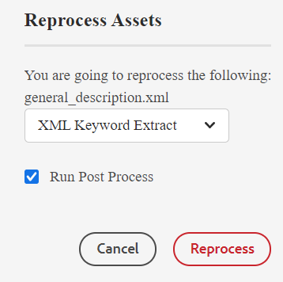

# スマートタグ付け {#id216KH0ID0Y8}

>[!IMPORTANT]
>
> スマートタグ付け機能は初期設定では使用できず、システム管理者に相談する必要があるカスタム実装が必要になります。

AEM Guidesには、スマートタグを追加する機能が付属しています。 XML キーワード抽出ツールを使用して、スマートタグを抽出できます。 このツールは、人工知能を使用してコンテンツを理解し、関連するキーワードを提供します。 スマートタグを使用すると、検索エンジンの最適化\（SEO\）を改善し、ユーザーが関連コンテンツを見つけやすくなります。

スマートタグを作成するには、次の手順を実行します。

1. Assets UI で、スマートタグを作成するトピックに移動します。
1. トピックをプレビューモードで開き、メインツールバーから **Assetsを再処理** アイコンを選択します。
1. 「XML キーワード抽出」を選択して、関連するキーワードを抽出します。

   {width="300" align="left"}

1. 「後処理の実行」オプションを選択します。 ツールが正常に開始すると、メッセージが表示されます。
1. タグが自動的に抽出され、選択したトピックのプロパティページに表示されます。

   {width="800" align="left"}

   >[!NOTE]
   >
   > XML キーワード抽出ツールを使用してキーワードを抽出するほかに、プロパティページでスマートタグを追加、削除、カスタマイズすることもできます。

*環境内でこの機能を有効にするには、カスタマーサクセスチームにお問い合わせください。 これは、標準のサポートの一部として有効になっていません。*

**親トピック：**&#x200B;[ メタデータを管理 ](manage-metadata.md)
