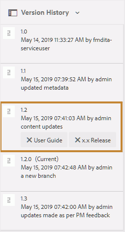
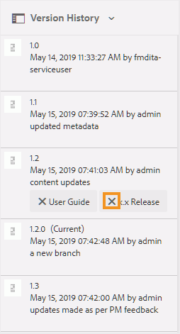

# ラベルを使用 {#id164JBG0M0T1}

AEM Guidesでは、ファイルの様々なバージョンにラベルを追加できます。 これらのラベルを使用して、公開用のベースラインに含めるバージョンを指定できます。 ラベルを使用してベースラインを作成する方法について詳しくは、[ ベースラインの操作](generate-output-use-baseline-for-publishing.md#)を参照してください。

例えば、*リリース 2.0*&#x200B;の&#x200B;*リリース 1.0*&#x200B;のトピックの&#x200B;*バージョン 1.0*&#x200B;と同じトピックの&#x200B;*バージョン 1.1*&#x200B;を使用する場合、*バージョン 1.1*&#x200B;の&#x200B;*バージョン 1.0*&#x200B;と&#x200B;*リリース 2.0*&#x200B;のラベルに&#x200B;*リリース 1.0*&#x200B;のラベルを追加できます。

ラベルを追加したら、ベースラインを作成し、そのベースラインを使用して公開するトピックのバージョンを指定できます。 ベースラインに含めるバージョンまたは除外するバージョンを確認するには、「バージョン履歴」オプションを使用できます。

## ラベルを追加

トピックにラベルを追加するには、次の手順を実行します。

1. Assets UIで、トピックを選択
1. 左側のレールセレクターアイコンをクリックし、**バージョン履歴**&#x200B;を選択します。
1. バージョン履歴で、ラベルを追加するバージョンをクリックします。

1. 選択したバージョンのラベルを入力し、Enter キーを押します。 例：*2.6 リリース*&#x200B;です。

   >[!NOTE]
   >
   > トピックの異なるバージョンに同じラベルを追加することはできません。 ただし、同じバージョンのトピックに複数のラベルを追加することができます。

   ラベルは、選択したトピックのバージョン履歴に表示されます。 次のスクリーンショットは、ハイライト表示されたバージョンのトピックに追加されたラベル *x.x リリース*&#x200B;と&#x200B;*ユーザーガイド*&#x200B;を示しています。

   {width="300"}

>[!NOTE]
>
> ベースラインを使用して、複数のトピックにラベルを追加できます。 ベースラインを使用したラベルの追加について詳しくは、[ ベースラインへのラベルの追加](generate-output-use-baseline-for-publishing.md#id184KD0T305Z)を参照してください。

## ラベルの削除

ラベルを削除するには、次の手順を実行します。

1. Assets UIで、ラベルが追加されたトピックを選択します。
1. 左側のレールセレクターアイコンをクリックし、**バージョン履歴**&#x200B;を選択します。

   バージョン履歴では、トピックのすべてのバージョンとそれらに添付されたラベルが表示されます。 次の画像は、トピックの異なるバージョンの例を示しており、1つのバージョンにラベルが追加されています。

   {width="300"}

1. ラベルを削除するには、削除ボタン \（**X**\）をクリックします。

   {width="300"}

**親トピック：**[ Web エディターの操作](web-editor.md)
