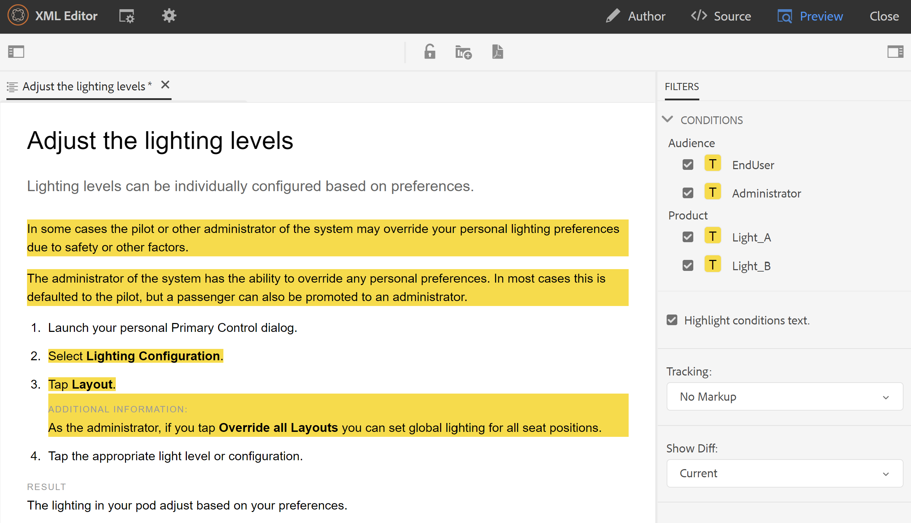
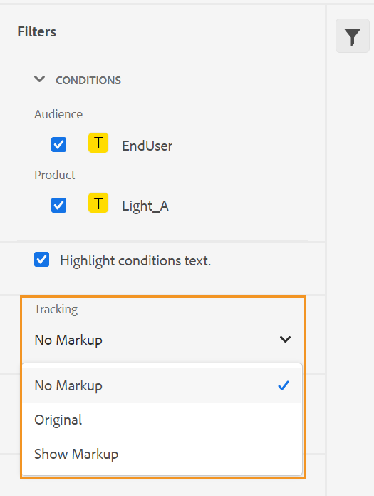

# Web エディタービュー {#id204GK0D0V5Z}

AEM Guidesの web エディターでは、次の 3 つの異なるモードまたはビューでドキュメントを表示できます。

## 作成者

これは、Web エディタの What You Get \（WYSISYG\） ビューを表示する典型的なものです。 通常のリッチテキストエディターで行うように、トピックを編集できます。 オーサービューには、ドキュメントのリビジョンの保存、コンテンツの検索と置換、要素の挿入、ハイパーリンクの挿入、コンテンツ参照の挿入などのオプションがあります。

>[!NOTE]
>
> コンテンツ参照を使用すると、参照されているコンテンツもオーサービューに青色で表示されます。 参照されたコンテンツは編集できません。

## ソース

Source ビューには、トピックを構成する基になる XML が表示されます。 XML を直接操作することに慣れている場合は、Source ビューを使用する必要があります。 このビューで通常のテキスト編集を行うだけでなく、スマートカタログを使用して要素と属性を追加したり、テキスト、要素、属性を検索して置換したりすることもできます。

- スマートカタログを呼び出すには、新しい要素を挿入する要素タグの末尾にカーソルを置いて、「&lt;」と入力します。 エディターには、その場所に挿入できるすべての有効な XML 要素のリストが表示されます。 矢印キーを使用して挿入する要素を選択し、Enter キーを押します。 閉じ括弧「\>」を入力すると、要素の閉じタグが自動的に追加されます。

  {width="400" align="left"}

- また、Source ビューから要素を簡単に変更することもできます。 例えば、`p` 要素の開始タグを `note` に変更すると、終了 `p` タグは自動的に `/note` に変更されます。 要素を間違った要素で置き換えると、すぐに検証エラーが表示されます。

- 要素に属性を追加する場合は、要素タグの内側にカーソルを置き、スペースバーを押します。 その要素の有効な属性のリストは、スマートカタログに表示されます。 矢印キーを使用して目的の要素を選択し、Enter キーを押して要素を挿入します。 属性の値を指定するには、等号\（=\）を入力します。エディターが自動的に開始および終了の引用符「」を入力します。ここで、属性の値を指定できます。

  {width="350" align="left"}

- Source ビューには、「自動インデント」オプションがあり、XML コードを提示可能で読みやすい形式に再編成します。 また、任意のテキストを選択し、オーサーからSourceに、またはSourceからオーサービューに切り替えた場合、選択したテキストは他のビューでもハイライト表示されます。
- Source ビューのもう 1 つの強力な機能は、文書内の XML 検証です。 無効な XML を含む文書を開くと、その文書はSource ビューで開かれ、無効な XML の情報が表示されます。 例えば、次のスクリーンショットでは、エラーのある XML に関する正確な情報がエラーの解析ポップアップに表示されます。

  {width="650" align="left"}

  上のスクリーンショットでは、クロスハイライトは、エラーのある XML を含む行を指すために使用されています。

- 「検索と置換」機能により、Source ビューで任意のテキスト、要素、属性を検索できます。
詳しくは、「メインのツールバー **セクションにある** 検索と置換 [ 機能の説明を参照してくだ ](web-editor-features.md#id#id2051EA0G05Z) い。

- Source ビューには、ドキュメントをすばやく移動して作業するのに役立つ、多くのショートカットが用意されています。 次の表に、サポートされるアクションとそのショートカットキーを示します。

  | 手順 | このショートカットを使用 |
  |----------|-----------------|
  | 複数のカーソルの追加 | **Ctrl**+左クリック |
  | 連続していない複数のテキスト選択 | **Ctrl**+左クリックでテキストをドラッグして選択 |
  | 行と行の間のテキストを選択 | **Alt**+左クリックでテキストをドラッグして選択 |
  | 複数の選択を取り消すか、フルスクリーンモードを終了する | **Esc** |
  | オートコンプリートを表示 | **Ctrl**+**スペース** |
  | 現在のタグの開始タグまたは終了タグに移動します | **Ctrl**+**J** |
  | 現在のタグとそのコンテンツを展開または折りたたむ | **Ctrl**+**Q** |
  | 現在の要素とそのコンテンツを選択 | **Ctrl**+**L** |
  | 現在の要素のアウトデント | **Shift**+**Tab** |
  | 現在の要素とそのコンテンツを削除 | **Shift**+**Ctrl**+**K** |
  | カーソルを 1 単語左に移動する | **Alt**+**左向き矢印** |
  | カーソルを 1 単語右に移動する | **Alt**+**右矢印** |
  | カーソル位置を変更せずに 1 行上にスクロールする | **Ctrl**+**上向き矢印** |
  | カーソル位置を変更せずに 1 行下にスクロールする | **Ctrl**+**下矢印** |
  | 全画面表示を切り替え | **F11** |
  | 現在の要素の後に改行を挿入します | **Ctrl**+**Enter** |
  | 現在の要素の前に改行を挿入 | **Shift**+**Ctrl**+**Enter** |
  | 現在の単語の次の出現箇所を検索して選択する | **Ctrl**+**D** |
  | 現在の要素とそのコンテンツを 1 つ上に移動 | **Shift**+**Ctrl**+**上矢印** |
  | 現在の要素とそのコンテンツを 1 つ下に移動 | **Shift**+**Ctrl**+**下矢印** |
  | 現在の要素をコメントタグで囲む | **Ctrl**+**/** |
  | 現在の要素とそのコンテンツを複製 | **Shift**+**Ctrl**+**D** |
  | カーソルの後のテキストを削除します。 カーソルが開いている要素の前にある場合は、要素全体が削除されます。 | **Ctrl**+**K**+**K** |
  | 現在の行のカーソルの左側のテキストを削除します。 カーソルが要素の終了タグの後にある場合は、要素全体が削除されます。 | **Ctrl**+**K**+**Backspace** |
  | 現在のテキストを大文字に変換します | **Ctrl**+**K**+**U** |
  | 現在のテキストを小文字に変換します | **Ctrl**+**K**+**L** |
  | 現在の要素をエディターの中央にスクロールします | **Ctrl**+**K**+**C** |
  | 現在位置の上にカーソルを追加する | **Ctrl**+**Alt**+**上矢印** |
  | 現在位置の下にカーソルを追加する | **Ctrl**+**Alt**+**下矢印** |
  | 現在の単語を再帰的に検索します\（順方向） | **Ctrl**+**F3** |
  | 現在の単語を再帰的に検索する（逆方向） | **Shift**+**Ctrl**+**F3** |

## プレビュー

プレビューモードでトピックを開くと、ブラウザーでユーザーが表示したときにトピックがどのように表示されるかを示します。 DITA マップの場合、マップ内のすべてのトピックの単一の複合文書が表示されるマップのプレビューが表示されます。

プレビューモードには、次の機能があります。

- [条件付きフィルターに基づくコンテンツの表示](#id2114BI00VXA)
- [トラック変更マークアップを表示する](#id2114BJ00CE8)
- [トピックをPDFとしてエクスポート](#id2114BL00B5U)

### 条件付きフィルターに基づくコンテンツの表示 {#id2114BI00VXA}

トピックまたはマップで条件を使用した場合、それらの条件がフィルターパネルに表示されます。 デフォルトでは、すべての条件が選択され、コンテンツ全体が表示されます。 条件の選択を解除すると、その条件を持つコンテンツはビューから削除されます。 条件付きコンテンツをハイライト表示することもできます。

次の画像は、`Audience` と `Product` の 2 つの条件を使用するトピックを示しています。 条件付きコンテンツは、黄色の背景でハイライト表示されます。

{width="800" align="left"}

### トラック変更マークアップを表示する {#id2114BJ00CE8}

文書に変更履歴\（または視覚的な手がかり\）が含まれている場合、それらのマークアップを含む文書または含まない文書をプレビューすることもできます。 ドキュメントをプレビューする際、右側のパネルには「フィルター」オプションと「トラッキング」オプションが含まれます。

{width="400" align="left"}

次の 3 つの **トラッキング** オプションから選択できます。

- **マークアップなし**：このビューでは、すべての挿入と削除が受け入れられ、ドキュメントの簡単なビューが表示されます。 このビューには、トラック変更マークアップは表示されません。
- **オリジナル**：この表示では、すべての挿入が却下され、すべての削除が復元されて、プレビューが表示されます。 変更のトラックモードを有効にする前に、ドキュメントの元のフォームを取得するだけです。
- **マークアップを表示**：この表示では、挿入および削除されたコンテンツに対するすべてのマークアップを取得します。

  次のイメージは、マークアップを含むマップ ファイルのプレビューを示しています。

  {width="800" align="left"}

### トピックをPDFとしてエクスポート {#id2114BL00B5U}

PDFは、ドキュメント開発サイクルの可能な限りの段階で使用される、最も一般的な出力形式の 1 つです。 AEM Guidesでは、個々のトピックまたはマップファイル全体のPDFを柔軟に生成できます。 PDFとして書き出し機能を使用すると、作成者、発行者または管理者は、個々のトピックに対してPDF出力を簡単に生成できます。 フォルダーレベルのプロファイルに保存された DITA-OT 構成を使用して、PDFを生成します。

この機能は、次の機能をサポートしています。

- トピックの現在アクティブな作業コピーのPDFを生成します。
- DITA-OT 変換名とコマンドライン引数を受け入れて、PDFを生成します。
- 生成した出力をローカルシステムに保存します。
- 出力を生成する前に、トピックで使用されているキー参照とコンテンツ参照を解決してください。

トピックをPDFとしてエクスポートするには、次の手順に従います。

1. トピックをプレビューモードで開きます。

1. **PDFとして書き出し** \（\）アイコンをクリックします。

   PDFとして書き出しダイアログが表示されます。

   {width="350" align="left"}

1. *\（オプション\）* 使用する DITA-OT 変換名とコマンドライン引数を指定します。

1. 「**ダウンロード**」をクリックします。

   >[!NOTE]
   >
   > ブラウザー設定でポップアップウィンドウを有効にしていることを確認してください。そうしないと、PDFはダウンロードされません。

   PDFが生成され、新しいタブで開きます。または、ローカルシステムにPDFを保存するためのダイアログが表示されます。

**親トピック：**&#x200B;[ Web エディタの操作 ](web-editor.md)
