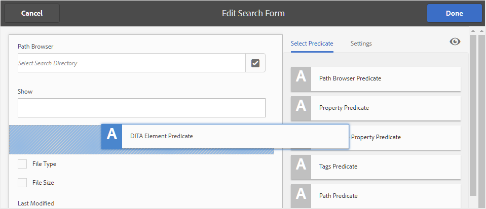
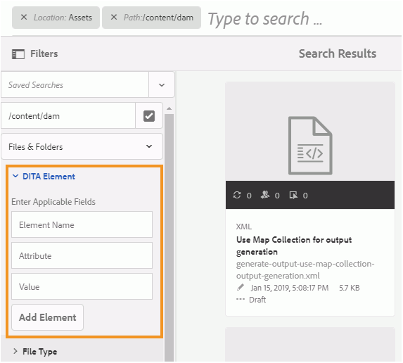
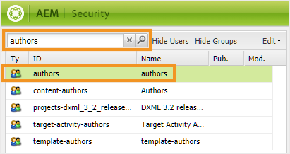
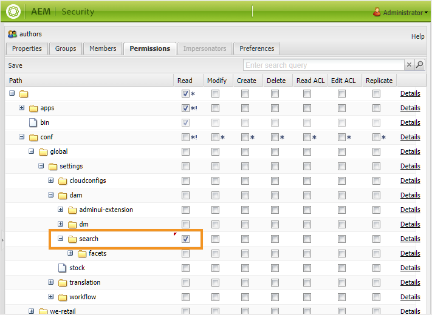

# AEM Assets UIの検索の設定 {#id192SC800MY4}

デフォルトでは、AEMはDITA コンテンツを認識しないため、リポジトリ内のDITA コンテンツを検索する仕組みは提供されません。 また、UUIDにもとづいてコンテンツを検索するOOTB機能はありません。 AEM Guidesでは、DITA コンテンツ検索機能とUUID ベースの検索機能をAEM リポジトリに追加できます。

DITA コンテンツ検索の設定には、次のタスクが必要です。

1. [Assets UIでのDITA エレメント検索コンポーネントの追加](#id192SF0F50HS)
1. [Assets UIにUUID ベースの検索コンポーネントを追加する](#id2034F04K05Z)
1. [ユーザーに権限を提供](#id192SF0G0RUI)
1. [検索時にカスタム要素または属性を追加](#id192SF0G10YK)
1. [既存のコンテンツからメタデータを抽出](#id192SF0GA0HT)

検索機能を追加することに加えて、検索に含めないフォルダーを設定することもできます。 詳しくは、[検索結果から一時ファイルを除外](#id197AHI0035Z)を参照してください。

## Assets UIでのDITA エレメント検索コンポーネントの追加 {#id192SF0F50HS}

AEM Assets UIにDITA コンテンツ検索コンポーネントを追加するには、次の手順を実行します。

1. Adobe Experience Managerに管理者としてログインします。

1. 上部の&#x200B;**Adobe Experience Manager** リンクをクリックし、**ツール**&#x200B;を選択します。

1. ツールのリストから「**一般**」を選択し、**Formsを検索** タイルをクリックします。

1. **Formsを検索** リストで、**Assets管理者検索レール**&#x200B;を選択します。

1. 「**編集**」をクリックします。
1. 「**述語を選択**」タブで、リストの最後までスクロールします。

1. 検索フォームの必要な場所に&#x200B;**DITA Element Predicate**&#x200B;をドラッグ&amp;ドロップします。

   

1. **完了**&#x200B;をクリックして変更を保存します。

   Assets UIの「フィルター」オプションにアクセスすると、DITA エレメント検索フィルターオプションが表示されます。

   


## Assets UIにUUID ベースの検索コンポーネントを追加する {#id2034F04K05Z}

AEM Assets UIにUUID ベースの検索コンポーネントを追加するには、次の手順を実行します。

1. Adobe Experience Managerに管理者としてログインします。

1. 上部の&#x200B;**Adobe Experience Manager** リンクをクリックし、**ツール**&#x200B;を選択します。

1. ツールのリストから「**一般**」を選択し、**Formsを検索** タイルをクリックします。

1. **Formsを検索** リストで、**Assets管理者検索レール**&#x200B;を選択します。

1. 「**編集**」をクリックします。
1. 「**述語を選択**」タブで、**プロパティ述語**&#x200B;を選択し、検索フォームの必要な場所にドラッグ&amp;ドロップします。

1. **設定** タブで、新しく追加された&#x200B;**プロパティ述語** コンポーネントについて、次の詳細を指定します。

   - **フィールドラベル**: UUID
   - **プロパティ名**: jcr:content/fmUuid
1. **完了**&#x200B;をクリックして変更を保存します。

   Assets UIの「フィルター」オプションにアクセスすると、UUIS ベースの検索フィルターオプションが表示されます。


## ユーザーに権限を提供 {#id192SF0G0RUI}

Assets UIから検索機能にアクセスするには、作成者とパブリッシャーに明示的な権限を付与する必要があります。 これらの権限を付与しない場合、ユーザーは要素/属性値またはUUIDに基づいてDITA コンテンツを検索できなくなります。

DITA検索機能にアクセスするには、次の手順を実行します。

1. ユーザーとグループの権限ページにアクセスします。

1. アクセス権を付与するユーザーグループまたは個々のユーザーを検索します。 例えば、作成者グループのすべてのユーザーにアクセス権を付与するには、**フィルタークエリ** フィールドに作成者を入力し、**Enter**&#x200B;を押します。

   

1. **作成者** グループを選択します。

1. 右側のペインで、「**権限**」タブを選択します。

1. 次のフォルダーの場所に移動します。

   /conf/global/settings/dam/search

1. 検索フォルダーに&#x200B;**読み取り**&#x200B;権限を付与します。

   

1. 「**保存**」をクリックします。


選択したユーザーまたはユーザーグループは、Assets UIのDITA コンテンツ検索機能にアクセスできるようになります。

## 検索時にカスタム要素または属性を追加 {#id192SF0G10YK}

DITA検索を機能させるには、DITA コンテンツの一部の前処理が必要です。 この前処理ステップでは、個々のDITA マップとトピックから選択的なコンテンツを抽出して、より迅速に検索できるようにインデックスを作成します。 内部では、このプロセスは&#x200B;*シリアル化*&#x200B;と呼ばれます。 DITA ファイルのシリアル化は、コンテンツのアップロード中に行われますが、オンデマンドで実行することもできます。 設定ファイルを使用して、各DITA ファイルのコンテンツのインデックスを作成する必要がある量を決定します。 シリアル化ファイルのデフォルトの場所は次のとおりです。

/libs/fmdita/config/serializationconfig.xml

デフォルトの検索設定では、DITA `prolog`要素内のすべての要素と属性を検索できます。 他の要素または属性に基づいて検索する場合は、検索シリアル化ファイルを設定する必要があります。

>[!NOTE]
>
> `prolog`要素内のデフォルトの検索設定を使用する場合は、このプロセスをスキップできます。

このファイルには、属性セットとルールセットという2つの主要セクションが含まれています。 ルールセットセクションのスニペットを以下に示します。

```
<ruleset filetypes="xml dita"><!-- Element rules --><rule xpath="//[contains(@class, 'topic/topic')]/[contains(@class, 'topic/prolog')]//*[not(*)]" text="yes" attributeset="all-attrs" /><!-- Attribute rules --><rule xpath="//[contains(@class, 'topic/topic')]/[contains(@class, 'topic/prolog')]///@[local-name() != 'class']" /></ruleset>
```

ルールセットセクションでは、次の項目を指定できます。

- 要素を抽出するルール

- 属性を抽出するルール


ルールは次の要素で構成されます。

**xpath** – これは、DITA ファイルから要素または属性を取得するXPath クエリです。 要素ルールの既定の設定では、すべての`prolog`要素が取得されます。 また、属性ルールのデフォルト設定では、`prolog`要素のすべての属性が取得されます。 検索する要素または属性をシリアライズするXPath クエリを指定できます。

XPath クエリには、ドキュメントタイプのクラス名が含まれます。 `topic/topic` クラスは、トピックタイプ DITA ドキュメントに使用されます。 他のDITA ドキュメントのルールを作成する場合は、次のクラス名を使用する必要があります。

| ドキュメントタイプ | クラス名 |
|-------------|----------|
| トピック | - トピック/トピック |
| タスク | - トピック/トピックタスク/タスク |
| コンセプト | - トピック/トピックコンセプト/コンセプト |
| 参照 | - トピック/トピック参照/参照 |
| Map | - マップ/マップ |

**text** – 指定した要素内のテキストを検索する場合は、yes値を指定します。 値としてnoを指定すると、要素内の属性のみがシリアル化されます。 検索する属性は、属性セットセクションで指定する必要があります。

**属性セット** – このルールに関連付ける属性セットのIDを指定します。 値all-attrsは、このルールのすべての属性をシリアル化する必要があることを示す特殊なケースです。

属性セットには、DITA コンテンツ内で検索する属性のリストが含まれます。 属性セットには、次の情報が含まれます。

**id** – 属性セットの一意のID。 このIDは、ルールセットの属性セットパラメーターで指定します。

**属性** – 検索する属性のリスト。 属性ごとに、`attribute`要素に個別のエントリを作成する必要があります。

次の手順を実行して、検索シリアル化ファイルにカスタム DITA要素または属性を追加します。

1. パッケージマネージャーを使用して、/libs/fmdita/config/serializationconfig.xml ファイルをダウンロードします。

1. `config` ノード内に`apps` フォルダーのオーバーレイノードを作成します。

1. `apps` ノードで使用可能な設定ファイルに移動します。

   `/apps/fmdita/config/serializationconfig.xml`

1. 必要な要素または属性のルールセットを追加します。

1. 変更を確定し、Cloud Manager \（CI/CD\） パイプラインを実行して、設定変更をデプロイします。


新しいシリアル化情報が保存され、検索用にアクティブ化されます。 ただし、検索できるように、既存のDITA コンテンツからメタデータを抽出する必要があります。

## 既存のコンテンツからメタデータを抽出 {#id192SF0GA0HT}

デフォルトの検索シリアル化ファイルに変更を加えたら、*com.adobe.fmdita.config.ConfigManager* バンドルでDITA メタデータ抽出オプションを有効にし、ワークフローを実行してメタデータを抽出する必要があります。 これにより、既存のDITA ファイルから必要なメタデータが抽出され、同じメタデータが検索で使用できるようになります。

シリアル化ファイルを更新した後に新しいファイルを作成したり、ファイルを編集したりする場合、そのようなファイルからメタデータが自動的に抽出されます。 メタデータの抽出プロセスは、AEM リポジトリに既に存在するファイルにのみ必要です。

既存のDITA ファイルからメタデータを抽出するには、次の2つのタスクを実行します。

1. configMgrでのメタデータ抽出オプションの有効化
1. メタデータ抽出ワークフローの実行

設定ファイルを作成するには、[設定の上書き](download-install-additional-config-override.md#)の手順を使用します。 設定ファイルで、メタデータ抽出オプションを設定するために次の\（property\）詳細を指定します。

| PID | プロパティキー | プロパティの値 |
|---|------------|--------------|
| `com.adobe.fmdita.config.ConfigManager` | `dita.serialization` | ブール値\（true/false\）。<br> **デフォルト値**: `false` |

メタデータ抽出ワークフローを実行するには、次の手順を実行します。

1. Adobe Experience Managerに管理者としてログインします。

1. 上部の&#x200B;**Adobe Experience Manager** リンクをクリックし、**ツール**&#x200B;を選択します。

1. ツールのリストから「**ガイド**」を選択し、**DITA メタデータ抽出** タイルをクリックします。

1. 1つのファイルとその依存関係からメタデータを抽出する場合は、「**ファイルを選択**」リンクをクリックし、ファイルを参照します。

1. フォルダー内の複数のファイルからメタデータを抽出する場合は、「**フォルダーを選択\（s\）**」リンクをクリックし、必要なフォルダーを参照して選択します。 「**追加**」ボタンをクリックして、フォルダーをシリアル化タスクリストに追加します。

   >[!NOTE]
   >
   > シリアル化タスクに複数のフォルダーを選択して追加できます。

1. 「**開始**」をクリックします。

1. メタデータ抽出を確認ダイアログで、**OK**&#x200B;をクリックします。


## 検索結果から一時ファイルを除外 {#id197AHI0035Z}

デフォルトでは、検索はAEMのリポジトリ全体で実行されます。 検索から除外する場所がいくつか存在する可能性があります。 例えば、コンテンツ翻訳ワークフローを開始すると、未承認のファイルは一時フォルダーの場所に残ります。 検索を実行すると、この一時的な場所のファイルも検索結果に返されます。

AEM Guidesが一時的な翻訳フォルダーの場所を検索できないようにするには、除外リストに一時的なフォルダーの場所を追加する必要があります。

次の手順を実行して、一時的な翻訳フォルダーを検索から除外します。

>[!NOTE]
>
> この手順を使用して、除外リストに他のフォルダーの場所を追加できます。 インデックスの操作について詳しくは、[&#x200B; コンテンツ検索とインデックス作成](https://experienceleague.adobe.com/docs/experience-manager-cloud-service/operations/indexing.html?lang=ja)を参照してください。

1. カスタム damAssetLucene インデックスに次のプロパティを追加します。

   | プロパティ名 | タイプ | 値 |
   |-------------|----|-----|
   | excludedPaths | String\[\] | 次の値をこのプロパティに追加します：<br> `/content/dam/projects/translation\_output` |

1. 次の場所にあるlucene ノードに移動します。

   /oak:index/lucene

1. lucene ノードに次のプロパティを追加します。

   | プロパティ名 | タイプ | 値 |
   |-------------|----|-----|
   | excludedPaths | String\[\] | 次の値をこのプロパティに追加します：<br> `/content/dam/projects/translation\_output` |
