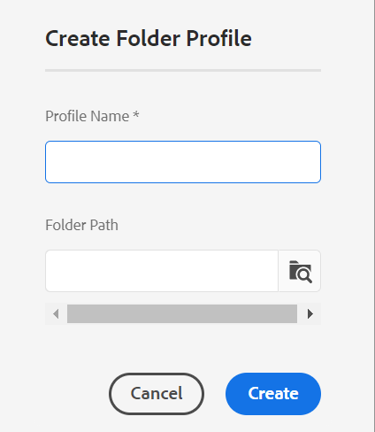

# グローバルプロファイルまたはフォルダーレベルのプロファイルの設定 {#id181AH2003PF}

エンタープライズでは、異なるグループや製品が、異なるオーサリングテンプレート、出力テンプレート、条件付き属性プロファイル\（またはサブジェクト設定\）、および web エディター設定を使用する場合があります。 これらをエンタープライズ\（またはグローバル\） レベルでのみ設定すると、作成者に関係のないテンプレートやプロファイルが表示されるので、作成者のエクスペリエンスが難しくなる可能性があります。

AEM Guidesでは、エンタープライズ \（global\） レベルおよびフォルダーレベルでオーサリング \（topic or map\） テンプレート、出力テンプレート、条件属性、web エディター設定を設定できます。 この方法により、企業内の異なる部門や製品に対して設定を分離できます。

また、フォルダー固有の設定を部門または製品管理者に委任して、管理を分散させることもできます。

ガイド設定のフォルダープロファイルタイルを使用すると、次のタブで設定を指定できます。

{width="800" align="left"}

- **一般**:「一般」タブは、フォルダーレベルの\（またはプロジェクト/製品\）設定を指定する場合にのみ使用できます。 設定を適用できるフォルダーパスや、設定の作成または更新を行う管理者権限を持つユーザーなどを設定できます。

- **条件属性**：グローバルまたはフォルダーレベルで条件属性を設定する場合に使用します。 条件付き属性は、属性名と値の組み合わせです。また、そのラベルを定義することもできます。 標準の DITA 属性または独自のカスタム属性を使用できます。 グローバルレベルで定義する条件属性は、プロジェクトをまたいですべてのユーザーが使用できます。 フォルダーレベルの条件属性を定義した場合は、グローバルに定義された条件属性と結合されます。

- **テンプレート**：このタブを使用して、作成者が DITA コンテンツの作成または公開に使用するテンプレートを設定します。 次のトピックテンプレートが標準で用意されています。

   - 用語集

   - 参照

   - トピック

   - 概念

   - タスク

   - トラブルシューティング

   - 空白

   - ディタバール

  >[!NOTE]
  >
  > 既存のテンプレートをベースとして使用して、新しいテンプレートを作成できます。 空白 DITA テンプレートには、ほかのテンプレートのような構造や要素は含まれません。 任意の OOTB DITA テンプレートをベースとして使用し、それに変更を加えて、別の名前で保存できます。 必要な変更を加えた後、更新されたテンプレートをグローバルレベルまたはフォルダーレベルのオーサリングテンプレート設定に追加すると、オーサリングできるようになります。

  作成者が使用できるようにするマップ テンプレートを、トピック テンプレートと共に定義することもできます。 次のマップ テンプレートが標準搭載されています。

   - Map

   - Bookmap

- **出力プリセット**：テンプレートと同様に、次の 5 つの事前設定済み出力プリセットがあります。

   - AEM サイト

   - PDF

   - HTML5

   - EPUB

   - カスタム

  公開者は、これらの標準提供の出力プリセットを使用してコンテンツを公開できます。 これらのプリセットは、グローバルプロファイルまたはフォルダーレベルのプロファイルの管理者が設定できます。 設定すると、新しく作成した DITA マップの公開者が公開プリセットを使用できるようになります。 既存の DITA マップに公開プリセットを適用することもできます。詳しくは、[ プリセットの変更の適用 ](#id18AGD0K0OHS) を参照してください。

- **XML エディター設定**：このタブを使用して、ルックアンドフィールや web エディターの様々な機能をカスタマイズします。 Web エディターでは、以下の設定可能な設定を使用できます。

   - XML エディターの UI 設定
   - XML エディタのページ レイアウト
   - XML エディターの設定
   - CSS テンプレートレイアウト
   - XML エディタースニペット
   - XML コンテンツバージョンラベル
   - ルートマップ \（フォルダーレベルのみ\）

グローバルプロファイルとフォルダーレベルのプロファイルの両方を設定できます。 フォルダーレベルのプロファイルでは、設定を適用するフォルダーを定義できます。 これらの設定には、条件属性、テンプレート、出力プリセット、XML エディター設定が含まれます。 その後、設定済みのフォルダーを操作する作成者は、条件付きプリセット、テンプレート、XML エディターの設定を使用できるようになります。 同様に、公開者は設定済みフォルダー内で定義された設定済み出力プリセットにアクセスできます。

フォルダーレベルのプロファイルは、グローバルプロファイルで設定された設定よりも優先されます。 つまり、フォルダーにフォルダーレベルのプロファイルがある場合、対応するフォルダープロファイルに設定されたテンプレート、出力テンプレートおよび XML エディター設定が表示されます。 グローバルプロファイルで設定された設定は表示されません。 ただし、これは条件属性には適用されません。 条件属性の場合、条件属性はグローバルレベルとフォルダーレベルで結合されます。

次の節では、グローバルプロファイルおよびフォルダーレベルのプロファイルを設定するプロセスについて説明します。

## グローバルプロファイルの設定

グローバルプロファイルを設定するには、次の手順を実行します。

1. Adobe Experience Managerに管理者としてログインします。

1. 上部の「Adobe Experience Manager」リンクをクリックし、「**ツール**」を選択します。

1. ツールのリストから「**ガイド**」を選択し、「**フォルダープロファイル**」タイルをクリックします。

   初めて、フォルダープロファイルページがグローバルプロファイルタイルのみで表示されます。

   {width="800" align="left"}

1. **グローバルプロファイル** タイルをクリックします。

1. **条件属性** を設定するには、[ グローバルプロファイルまたはフォルダーレベルのプロファイルの条件属性の設定 ](#id1889D0I305Z) を参照してください。

1. **テンプレート** を設定するには、[ オーサリングテンプレートの設定 ](#id1889D0IL0Y4) を参照してください。

1. **出力プリセット** を設定するには、[ 出力プリセットの設定 ](#id18AGD0IH0Y4) を参照してください。

1. XML エディター設定を設定するには、[XML エディターの設定とカスタマイズ ](#id2065G300O5Z) を参照してください。

1. 必要な更新をすべて行ったら、**グローバルプロファイル** を保存して閉じます。


## フォルダーレベルのプロファイルの作成と設定

フォルダーレベルのプロファイルを設定するには、次の手順を実行します。

1. Adobe Experience Managerに管理者としてログインします。

1. 上部の「Adobe Experience Manager」リンクをクリックし、「**ツール**」を選択します。

1. ツールのリストから **ガイド** を選択し、**フォルダープロファイル** タイルをクリックします。

   初めて使用する場合、フォルダープロファイルページにはデフォルトのグローバルプロファイルタイルのみが表示されます。

1. 「**作成**」をクリックします。

   {width="300" align="left"}

1. **フォルダープロファイルを作成** ダイアログに、次の詳細を入力します。
   - フォルダープロファイルの名前。
   - プロファイルが適用されるフォルダーのパス。

     >[!NOTE]
     >
     > 1 つのフォルダーに複数のフォルダープロファイルを適用することはできません。 ここで選択しているフォルダーには、他のプロファイルが適用されていないことを確認してください。 親子フォルダーに独自の特定プロファイルがある場合、子フォルダーはその独自のプロファイルの設定を使用します。 親フォルダーの設定は、子フォルダーの設定を上書きしません。

1. 「**作成**」をクリックします。

   フォルダープロファイルという名前の新しいタイルがフォルダープロファイル ページに作成されます

1. 編集するフォルダープロファイルタイルをクリックします。

   フォルダープロファイルの名前と設定済みのフォルダー情報を含む「一般」タブが表示されます。

1. 複数のフォルダーと、フォルダープロファイルを変更するための管理アクセス権を持つユーザーを追加するには、「**編集**」をクリックします。

   >[!NOTE]
   >
   > ここに追加するユーザーには、このフォルダープロファイルに設定された条件属性、テンプレートおよび出力プリセットを更新するための管理者権限が与えられます。

1. フォルダーを追加するには、フォルダーパスの「参照」アイコンをクリックし、フォルダーに移動して選択します。次に、「追加」をクリックし、フォルダーをこのプロファイルに追加します。

   >[!NOTE]
   >
   > ここで選択したフォルダーには、他のフォルダーレベルのプロファイルが関連付けられていないことを確認してください。

1. ユーザーを追加するには、「**管理者ユーザー**」ドロップダウンからユーザーを選択し、「**追加**」をクリックします。

   >[!NOTE]
   >
   > ドロップダウンリストからフォルダープロファイルに複数のユーザーを追加できます。 ユーザー ID の横にある削除アイコンをクリックして、リストから既存の管理者ユーザーを削除することもできます。

1. 必要なフォルダーとユーザーをすべてフォルダープロファイルに追加したら、「**保存**」をクリックします。


これで、条件付き属性、テンプレート、出力プリセットおよび XML エディターを設定する準備が整いました。

>[!IMPORTANT]
>
> フォルダープロファイルを作成すると、デフォルトではテンプレートは含まれません。 作成者が使用できるように、必要なテンプレートをフォルダープロファイルに追加する必要があります。

## グローバルプロファイルまたはフォルダーレベルのプロファイルの条件属性の設定 {#id1889D0I305Z}

次の手順を実行して、グローバルまたはフォルダーレベルで標準の DITA サポート条件付き属性を設定します。

1. フォルダーレベルのプロファイルで、管理者または管理者権限を持つユーザーとしてAdobe Experience Managerにログインします。

1. 上部の「Adobe Experience Manager」リンクをクリックし、「**ツール**」を選択します。

1. ツールのリストから **ガイド** を選択し、**フォルダープロファイル** タイルをクリックします。

1. 設定するプロファイルタイルをクリックします。

   >[!NOTE]
   >
   > 条件付き属性は、グローバルプロファイルまたはフォルダーレベルのプロファイルで設定するように選択できます。

1. プロファイルページで、「**条件付き属性** タブをクリックします。

1. 「**編集**」をクリックします。

1. 「**追加**」をクリックします。

1. 条件属性の **名前**、**値**、**ラベル** を入力します。

   属性名のみを持つプロファイルを保存できます。 ただし、属性は、値が指定されている場合にのみ使用できます。 属性に – 値とラベルの両方を指定した場合、Web エディタには条件付き属性のラベルが表示されます。 また、条件付きプリセットの作成時に、ラベルが公開管理者に表示されます。

   次のスクリーンショットは、可能な値とラベルを含んだ `platform` 属性の定義を示しています。

   

1. 同じ属性に対してさらに値を追加する場合は、**+** アイコンをクリックし、追加の値とラベルを入力します。

1. さらに属性を追加する場合は、「**追加**」をクリックします。

1. 「**保存**」をクリックします。


カスタム属性を使用する場合は、DTD でサポートされている有効な DITA 属性である必要があります。 標準の DITA 属性ではない任意の属性を使用する場合は、次の追加手順を実行します。

1. カスタム属性を DTD ファイルに追加します。 たとえば、DTD ファイルが commonElements.mod の場合、このファイルを DTD ディレクトリ内に配置する必要があります。 システム DTD ファイルのデフォルトパスは次のとおりです。

   /libs/fmdita/dita\_resources/DITA-1.3/dtd/base/dtd/commonElements.mod

   >[!IMPORTANT]
   >
   > 専用の DTD ファイルは、カスタムコード配置の一部である必要があります。 /apps の下の DTD は製品デプロイメントの一部なので、新しいリリースのインストールで上書きされます。 特殊な DTD を/var/dxml/dita\_resources の下にプロジェクトフォルダ内に追加し、DTD/カタログパスを DITA プロファイルに含めることをお勧めします。詳しくは、[DITA 特殊化の統合 ](dita-ot-specialization.md#id211MB0E00XA) を参照してください。

1. パッケージマネージャーを使用して/libs/fmdita/config/condAttrList.xml ファイルをダウンロードします。

1. condAttrList.xml ファイルのコピーを、Cloud Manager Git リポジトリ内の次の場所に作成します。

   `/apps/fmdfmdita/config/condAttrList.xml`

1. ファイルを保存します。

1. グローバルまたはフォルダーレベルのプロファイルにカスタム属性を追加します。


## テンプレートの設定 {#id1889D0IL0Y4}

AEM Guidesには、7 つの標準トピックテンプレート、2 つの DITA マップテンプレート、3 つのPDF テンプレートが付属しています。 作成者と公開者が使用できるテンプレートはほんの数個にできます。 カスタムテンプレートを使用している場合は、これと同じテンプレートを設定して、オーサリングと公開に使用できます。 フォルダープロファイル設定の「**テンプレート**」タブを使用して、グローバルプロファイルまたはフォルダーレベルのプロファイルに対して、トピック、マップまたはPDFのテンプレートの追加や削除を行います。

グローバルレベルまたはフォルダーレベルでトピック、マップまたはPDFのテンプレートを設定する前でも、カスタムテンプレートを保存する場所を定義できます。 テンプレートを保存するカスタムの場所を設定するには、[ カスタム DITA テンプレート フォルダ パスを設定 ](conf-template-tags-custom-dita-topic-template.md#id191LCF0095Z) を参照してください。

次の手順を実行して、トピック、マップまたはPDFのテンプレートをフォルダープロファイルに追加します。

1. フォルダーレベルのプロファイルで、管理者または管理者権限を持つユーザーとしてAdobe Experience Managerにログインします。

1. 上部の「Adobe Experience Manager」リンクをクリックし、「**ツール**」を選択します。

1. ツールのリストから **ガイド** を選択し、**フォルダープロファイル** タイルをクリックします。

1. 設定するプロファイルタイルをクリックします。

   >[!NOTE]
   >
   > グローバルプロファイルまたはフォルダーレベルのプロファイルでテンプレートの設定を選択できます。

1. プロファイルページで、「**テンプレート**」タブをクリックします。
1. 「**編集**」をクリックします。

   トピック、マップ、PDFの各テンプレートを追加するオプションを使用するには、デフォルトの場所から検索するか、テンプレートを参照します。

   >[!NOTE]
   >
   > デフォルトでは、すべてのテンプレートが/content/dam/dita-templates フォルダに保存されます。 `dita-templates` フォルダーには、トピック、マップ、PDFのテンプレートを格納する `topics`、`maps`、`PDF` のサブフォルダーが含まれています。 カスタムテンプレート \（.dita,.xml, or .ditamapfiles\）をデフォルトテンプレートフォルダに追加できます。 デフォルトフォルダーにテンプレートを追加すると、それらをグローバルプロファイルまたはフォルダープロファイルに追加できるようになります。 Web エディターを使用してカスタムテンプレートを作成する方法について詳しくは、「[ カスタムオーサリングテンプレートの作成 ](#id1917D0EG0HJ)」を参照してください。

   {width="800" align="left"}

1. 必要なトピック、マップおよびPDF テンプレートをプロファイルに追加します。

   テンプレートを追加するには、次のいずれかの操作を行います。

   - **検索またはタイプ** を選択して、ドロップダウンリストからテンプレートの名前を入力または選択します。 ドロップダウンリストは、すべてのデフォルトテンプレートと、作成した新しいテンプレートで構成されます。

     {width="800" align="left"}

   - **参照** をクリックし、DAM からテンプレートを選択します。

1. 「**追加**」をクリックします。

   選択したテンプレートがテンプレートリストに追加されます。

   {width="800" align="left"}

   >[!NOTE]
   >
   > テンプレートの順序を変更するには、リストの目的の位置にテンプレートをドラッグ&amp;ドロップします。 テンプレートの位置は、トピックまたはマップ作成ワークフローでのブループリントページに表示される順序を制御します。

1. 翻訳ルールを設定するには、SRX の場所を参照し、SRX ファイルを含むフォルダーを見つけます。 SRX \（Segmentation Rules eXchange\）形式は、異なるユーザーや翻訳環境の間でセグメント化ルールを交換するための標準です。 フォルダーを作成し、それにカスタム SRX ファイルを追加できます。

   SRX ファイルを含むフォルダーを作成したら、フォルダープロファイル内の **翻訳 SRX の場所** 設定にフォルダーパスを追加できます。

   AEM Guidesでは、翻訳プロジェクトのソース言語に従って SRX ルールが選択されます。 言語のカスタム SRX ファイルを探し、カスタム SRX ファイルを定義しない場合は、標準の翻訳ルールに従ってルールが選択されます。

1. 「**保存**」をクリックします。


フォルダーレベルのプロファイルでテンプレートを設定した場合、設定済みのテンプレートは、設定済みのフォルダーに関連付けられます。 設定済みフォルダーの下に作成されたすべてのプロジェクトは、フォルダーレベルのプロファイルの下に設定されたテンプレートにのみアクセスできます。

## カスタムオーサリングテンプレートの作成 {#id1917D0EG0HJ}

AEM Guidesでは、オーサリングテンプレートを簡単に作成できます。 システム管理者は、web エディターを使用してオーサリングテンプレートを最初から作成できます。 その後、グローバルプロファイルに新しいテンプレートを追加するか、フォルダー固有のプロファイルを使用して特定のフォルダーに割り当てることができます。

カスタムオーサリングテンプレートを作成するには、次の手順を実行します。

1. Adobe Experience Managerに管理者としてログインします。

1. Assets UI で、テンプレートファイルを格納するように設定されたフォルダーに移動します。 デフォルトでは、すべてのトピックテンプレートは/content/dam/dita-templates/topics フォルダーに保存されます。

   >[!NOTE]
   >
   > トピックまたはマップ テンプレートを保存するカスタムの場所を設定するには、[ カスタム DITA テンプレート フォルダ パスの設定 ](conf-template-tags-custom-dita-topic-template.md#id191LCF0095Z) を参照してください。

1. **作成** \> **DITA テンプレート** をクリックします。

1. 「ブループリント」ページで、作成する DITA トピックテンプレートのタイプを選択します。

   >[!NOTE]
   >
   > 空白テンプレートを使用してゼロから開始できます。 空白テンプレートには構造も要素も含まれていません。

1. 「**次へ**」をクリックします。

1. 新しいテンプレートのプロパティページで、テンプレートの **タイトル**、**名前** および **説明** を入力します。

   >[!NOTE]
   >
   > テンプレートのタイトルに基づいて、名前が自動的に提案されます。 名前を手動で指定する場合は、「名前」にスペース、アポストロフィ、または中括弧が含まれず、.dita で終わっていることを確認してください。

1. *\（オプション\）* テンプレートのブラウザーに関連付ける **サムネールを追加** ボタンをクリックし、テンプレートに関連付けるサムネールを選択します。

1. 「**作成**」をクリックします。

   「トピックを作成しました」のメッセージが表示されます。

   編集するテンプレートを Web エディターで開くか、テンプレートの保存場所にテンプレート ファイルを保存するかを選択できます。 テンプレートを作成したら、web エディターを使用して、オーサリングのニーズに合わせてテンプレートをカスタマイズできます。 テンプレートを配置したら、必ずグローバルプロファイルまたはフォルダーレベルのプロファイルに関連付けます。


## 出力プリセットの設定 {#id18AGD0IH0Y4}

一般的なエンタープライズ設定では、異なる製品やユーザーガイドに異なる出力テンプレートを使用できます。 また、すべてのパブリッシャーが使用する共通の出力生成プロセスと、特定のパブリッシャーまたはプロジェクトのグループに対する特定の出力生成プロセスのセットが存在する場合もあります。

AEM Guidesでは、管理者は、特定の設定を使用して出力プリセットを作成し、それをすべてまたは特定のパブリッシャーが使用して出力を生成できます。 例えば、管理者は 1 つの出力プリセットを作成して、すべての公開者に共通のユーザーガイドを生成できます。 もう 1 つは、パブリッシャーのセットに固有のプログラミングユーザーマニュアルを作成することです。 これらのプリセットは両方とも、異なる出力テンプレートを使用するように設定できます。 この例では、ユーザーガイドを生成するための一般的な公開プリセットをグローバルレベルで設定できます。 また、プログラミングユーザマニュアルを生成するための出力プリセットは、フォルダレベルで設定することができる。

システムにデフォルトの出力プリセットが作成されると、それ以降に作成されたすべての DITA マップはデフォルトのプリセットを使用して出力を生成します。 ただし、既存のすべての DITA マップは、以前に設定された出力プリセットを引き続き使用します。 既存のすべての DITA マップに新しい出力プリセットを適用する場合は、「プリセット変更の適用」ワークフローを実行する必要があります。

パブリッシャーには、グローバルレベルまたはエンタープライズレベルで設定されるプリセットに加えて、さらに出力プリセットを作成する権限も残ります。 ただし、これらのプリセットは、作成対象の DITA マップに関連付けられています。 DITA マップの通常の出力プリセットの作成について詳しくは、『Adobe Experience Manager Guides as a Cloud Serviceの使用 *ガイド』の「出力プリセットの作成、編集、複製、削除* を参照してください。

グローバルまたはフォルダー固有の出力プリセットを設定するには、次の手順を実行します。

1. フォルダー固有のプロファイルに対する管理者権限を持つユーザーまたは管理者としてAdobe Experience Managerにログインします。

1. 上部の「Adobe Experience Manager」リンクをクリックし、「**ツール**」を選択します。

1. ツールのリストから **ガイド** を選択し、**フォルダープロファイル** タイルをクリックします。

1. 設定するプロファイルタイルをクリックします。

   >[!NOTE]
   >
   > 出力プリセットは、グローバルプロファイルまたはフォルダー固有のプロファイルで設定できます。

1. プロファイルページ。 「**出力プリセット**」タブをクリックします。

   標準提供の出力プリセット（AEM Site、PDF、HTML5、EPUB、CUSTOM など）のリストが表示されます。

1. 出力プリセットを作成または編集するには、以下のいずれかの操作を行います。

   - 「**作成**」をクリックして、新しい出力プリセットを最初から作成します。
   - 「複製」をクリックして、選択した出力プリセットのコピーを作成します。 複製したプリセットに変更を加えて保存することができます。

   - **編集** をクリックして、選択したプリセットの設定を編集用に開きます。

     出力プリセットの設定については、『Adobe Experience Manager Guides as a Cloud Serviceの使用 *ガイドの「出力プリセットについて* を参照してください。

1. **保存** をクリックして、プリセット設定を保存します。


この後に作成またはアップロードされたすべての DITA マップには、新しい出力プリセットまたは更新された出力プリセットが設定されます。

## プリセットの変更の適用 {#id18AGD0K0OHS}

グローバルレベルで作成された新しい出力プリセットは、今後作成するすべての新しい DITA マップで使用できます。 同様に、新しい出力プリセットがフォルダーレベルで作成された場合、そのプリセットは、設定済みのフォルダーに作成されるすべてのマップで使用できるようになります。 デフォルトでは、新しい出力プリセットは既存の DITA マップでは使用できません。

既存の出力プリセットを更新した場合、または既存の DITA マップで新しい出力プリセットを使用できるようにする場合は、次の手順を実行します。

1. フォルダー固有のプロファイルに対する管理者権限を持つユーザーまたは管理者としてAdobe Experience Managerにログインします。

1. 上部の「Adobe Experience Manager」リンクをクリックし、「**ツール**」を選択します。

1. ツールのリストから **ガイド** を選択し、**フォルダープロファイル** タイルをクリックします。

1. 設定するプロファイルタイルをクリックします。

   >[!NOTE]
   >
   > 出力プリセットは、グローバルプロファイルまたはフォルダー固有のプロファイルで設定できます。

1. プロファイルページ。 「**出力プリセット**」タブをクリックします。

   標準提供の出力プリセット（AEM Site、PDF、HTML5、EPUB、CUSTOM など）のリストが表示されます。

1. 既存の DITA マップに適用する出力プリセットを選択します。

1. メインツールバーの「**プリセットの変更を適用**」をクリックします。

1. プリセットの変更を適用ダイアログでは、次の中から選択できます。

   - **「既存のプリセットを上書き」オプションの選択**：このオプションを選択すると、既存の出力プリセットで行った更新によって、そのプリセットが使用されている既存のすべての DITA マップの設定が上書きされます。 ただし、その場合、マップに関連付けられた既存の条件付きプリセットおよびベースライン情報は失われます。

   - **「既存のプリセットを上書き」オプションを選択しない**：このオプションを選択しない場合、既存の出力プリセットで行った更新は、既存の DITA マップには影響しません。 新しく追加されたプリセットのみが既存の DITA マップに追加されます。 新しく作成された DITA マップには、更新された出力プリセットと新しく追加されたプリセットの両方が取り込まれます。

1. **OK** をクリックして、選択した出力プリセットからの変更を既存のすべての DITA マップに適用します。


## スマートヘルプとオーサリングのための AI アシスタントの設定

Experience Manager Guides as a Cloud Service （）の場合。

Adobe Experience Manager Guidesの AI アシスタントは、スマートオーサリングとコンテンツ再利用エクスペリエンスを通じてコンテンツを強化するように設計された、強力な AI 駆動ツールです。 Experience Manager Guides インターフェイスに **オーサリング** および **ヘルプ** の 2 つの堅牢な AI 機能が組み込まれているため、ドキュメントのオーサリングや、より迅速かつ効率的な情報へのアクセスが可能になります。

設定の詳細については、[AI Assistant configuration](./conf-smart-suggestions.md) を参照してください。

**AI を活用してスマートな提案を設定**

AI を利用したスマートな提案を設定し、作成者が既存のコンテンツを再利用して、正しく一貫性のあるコンテンツ参照を簡単に作成できるようにします。 「**AI 設定**」タブを使用すると、エディターの AI アシスタントパネルから **再利用可能なコンテンツを提案** の設定を制御できます。

グローバルレベルまたはフォルダーレベルのプロファイルで標準 AI 設定を設定するには、次の手順を実行します。
1. フォルダーレベルのプロファイルの管理者または管理者権限を持つユーザーとしてAdobe Experience Managerにログインします。
1. 上部の **Adobe Experience Manager** リンクを選択し、「**ツール**」を選択します。
1. ツールのリストから **ガイド** を選択し、**フォルダープロファイル** タイルを選択します。
1. 設定するプロファイルタイルを選択します。

   >[!NOTE]
   >
   >グローバルプロファイルまたはフォルダーレベルのプロファイルに対して、AI ベースのスマートな提案を設定できます。

1. プロファイルページで、「**AI 設定**」タブを選択します。

    {width="800" align="left"}

1. 「**編集**」を選択します。
1. 管理者は、次の設定を行うことができます。

   **最小文字数**：作成者が候補を取得するために選択する必要がある最小文字数を入力します。 例えば、この数値が 40 の場合、作成者がスマート提案を表示するには、40 文字以上選択する必要があります。

   選択項目が最小文字数の要件を満たさない場合、[AI アシスタント ] パネルに次のメッセージが表示されます。

   

   ただし、候補が表示されない一般的な選択内容の場合は、次のメッセージが表示されます。

   

   これは、文字の選択が不十分であるか、一致するコンテンツが本当にないために、提案が利用できないかどうかを作成者が理解するのに役立ちます。

   **最大候補**：作成者がコンテンツのオーサリング中に取得できる候補の最大数を入力します。 例えば、この数値が 5 の場合、作成者は 5 つ以下のスマート候補を表示できます。

   **ファイルとフォルダー**：スマート候補を表示するフォルダーを選択します。 フォルダープロファイルで指定したフォルダーパスの子フォルダーのみを選択できます。 詳しくは、[ フォルダープロファイルの制限 ](#folder-profile-restrictions) を参照してください。

   *コンテンツの一貫性を維持するために、リスト内の 2 つのエントリ間で共通のファイルを持つことはできません*。 ファイルとフォルダーを選択すると、一覧表示されます。

1. 「**保存**」をクリックします。

   >[!NOTE]
   >
   > ファイルを保存すると、フォルダープロファイルの最新のインデックス付きステータスが上部に表示されます。

Web エディターでのオーサリング中にコンテンツ参照を追加する [AI ベースのスマート候補 ](../user-guide/authoring-ai-based-smart-suggestions.md) を表示および追加する方法について説明します。

### フォルダープロファイルの制限

スマート提案が効果的に機能するように、フォルダーのインデックスを作成する際は次の点に注意してください。

1. AI アシスタントが作成者に賢明な提案を提供するために、コンテンツにはフォルダープロファイルを使用したインデックスを付ける必要があります。
2. インデックス作成用のフォルダーを指定する場合、現在のフォルダープロファイルの下にあるフォルダーのみを追加できます。 このフォルダープロファイル以外の場所にフォルダーを追加しようとすると、トリガーが表示されます。

   

   この制限は、フォルダーレベルのプロファイルにのみ適用されます。 グローバルプロファイルは、パスの制限を強制せず、他のフォルダープロファイルの下にないフォルダーのインデックスを作成できます。
3. インデックス作成用に親フォルダーを追加すると、重複を避けるために、既にリストされている子フォルダーが自動的に削除されます。 既にインデックス化された親の子フォルダーを追加すると、警告もトリガーされます。

   
4. インデックス付きフォルダ内のファイルを更新、移動、または削除すると、インデックスの自動的な再インデックスまたは削除がトリガーします。
5. インデックス作成を試行するたびに、次のインデックス作成ステータスが表示されます。

   - 処理中：インデックス作成が進行中であることを示します。
   - インデックス作成完了：インデックス作成が正常に完了したことを示します。
   - インデックス作成に失敗しました：インデックス作成が失敗したことを示します。
   - 非同期：インデックス作成が同期されていないことを示します。通常、アップグレードまたは移行後、現在のインデックス作成ステータスを検証できなかった場合に発生します。 インデックス作成を再試行して、ステータスを更新できます。

   インデックス作成に失敗した場合は、問題のトラブルシューティングと解決を行うための **エラーログを表示** オプションと **インデックス作成を再試行** オプションが提供されます。

   

   エラーログが次のように表示されます。

   

6. 最後のインデックス時間のタイムスタンプが各フォルダープロファイルに表示されます。

**スマートヘルプのデフォルトの質問のカスタマイズ**

Experience Manager Guides as a Cloud Service （）の場合。

AI を活用したスマートな **ヘルプ** を設定すると、作成者が質問したり、[Experience Manager Guides ドキュメント ](https://experienceleague.adobe.com/en/docs/experience-manager-guides/using/overview) から必要なコンテンツを簡単に見つけたりするのに役立ちます。

「**XML エディター設定**」タブでは、「**ヘルプ** パネルのデフォルトの質問を設定できます。

>[!NOTE]
>
>デフォルトの質問は最大 10 個まで設定できます。

デフォルトの質問を設定するには、次の手順を実行します。

1. フォルダーレベルのプロファイルの管理者または管理者権限を持つユーザーとしてAdobe Experience Managerにログインします。
1. 上部の **Adobe Experience Manager** リンクを選択し、「**ツール**」を選択します。
1. ツールのリストから **ガイド** を選択し、**フォルダープロファイル** タイルを選択します。
1. 設定するプロファイルタイルを選択します。

   >[!NOTE]
   >
   >**スマートヘルプパネル** のデフォルトの質問を、グローバルプロファイルまたはフォルダーレベルのプロファイルに設定できます。

1. 「**XML エディター設定**」タブを選択します。

1. 上部の **編集** アイコンをクリックします。
1. 「**XML エディターの UI 設定**」セクションで「**ダウンロード**」アイコンを選択して、`ui_config.json` ファイルをローカルシステムにダウンロードします。
1. `ui_config.json` ファイルに、サンプルの質問を追加します。

   **サンプル質問の例**:

   ```json
   "assistantSampleQuestions": [
   "How to create a new topic",
   "How to create a new map",
   "What is a baseline" ]
   ```

1. ファイルを保存してアップロードします。

   >[!NOTE]
   >
   > ファイルを保存すると、デフォルトの質問が **スマートヘルプ** パネルに表示されます。


[AI を利用したスマートヘルプ ](../user-guide/ai-based-smart-help.md) を使用して、必要なコンテンツを見つける方法について詳しくは、Experience Manager Guides ドキュメントを参照してください。


## XML エディターの設定とカスタマイズ {#id2065G300O5Z}

デフォルトでは、XML エディタには、作成者が DITA 文書を作成するのに役立つ多くの機能が付属しています。 制限的な環境で作業する場合は、作成者に公開する機能を選択できます。 「XML エディター設定」タブを使用すると、機能を簡単に制御し、エディターのルックアンドフィールを変更することもできます。 管理者は、エディターの次のコンポーネントをカスタマイズできます。

**XML エディター UI 設定**

この設定を使用すると、`ui_config.json` ファイルに加えられた変更を反映する JSON 拡張子を作成できます。 これらの拡張機能は、フォルダープロファイルレベルで個別にアップロードできるので、柔軟性とカスタマイズが向上しています。 例えば、ボタンを更新するなど、**XML エディター設定** に変更を加えると、システムによって違いが自動的に識別されます。 これらの変更を **XML エディターの UI 設定にアップロードし** 「**UI 設定を JSON に変換**」ボタンを使用して JSON 拡張機能に変換すると、システムは新しい機能を組み込む拡張機能を生成します。

詳しくは、[JSON 設定のカスタマイズと、新しいAEM Guides エディター用の UI 設定の変換 ](https://experienceleague.adobe.com/en/docs/experience-manager-guides-learn/videos/advanced-user-guide/conver-ui-config) を参照してください。

>[!NOTE]
>
> 拡張機能フレームワークを使用してアプリをカスタマイズする場合は、デプロイメント中の問題を回避するために、サポートされている基本的な React スペクトル コンポーネント（ツリー、テーブル、チェックボックス、ラジオボタン、ラジオグループなど）のみを使用することをお勧めします。

**XML エディターのページレイアウト**

この機能を使用すると、CSS ファイルをアップロードして、**XML エディター UI 設定** の下にアップロードされた新しい拡張機能のスタイルを設定できます。 アップロードされた CSS は、関連するすべてのアプリケーションに一貫して適用され、UI のカスタマイズに対して統一された洗練された外観を確保します。

**XML エディターの設定**

この設定は、ツールバーおよびエディターの他のユーザーインターフェイス要素を制御します。 **ダウンロード** アイコンを選択して、ローカルシステムに `ui\_config.json` ファイルをダウンロードします。 その後、ファイルに変更を加えて、同じものをアップロードできます。 グローバルプロファイルまたはフォルダーレベルのプロファイルでファイルをアップロードする場所に応じて、変更内容が適用されます。 `ui\_config.json file` を使用して XML エディタをカスタマイズする方法の詳細については、[ ツールバーのカスタマイズ ](conf-web-editor-customize-toolbar.md#) を参照してください。

>[!NOTE]
>
> AEM Guides 2502 リリース以降のバージョンでは、カスタマイズに `ui_config.json` の代わりに拡張機能 JSON を使用することをお勧めします。 詳しくは、前述の **XML エディター UI 設定** の節を参照してください。

**CSS テンプレートレイアウト**

このセクションで入手可能なファイルをダウンロードして、Web エディターでプレビューしたり編集用に開いたりする際のドキュメントのルックアンドフィールをカスタマイズします。 ダウンロード可能なデフォルトの CSS ファイルはテストファイルであるため、カスタマイズに使用しないでください。 Web エディター用のカスタマイズを含んだ CSS ファイルを作成してアップロードできます。 例えば、次のコードを使用して.css ファイルを作成できます。

```
.title {    font-size: 9em;}
```

このファイルを保存し、「CSS テンプレートレイアウト」セクションにアップロードします。 次回このファイルをダウンロードすると、web エディターで使用されている最新の CSS ファイルが表示されます。

**XML エディタースニペット**

この節で示す設定ファイルを使用すると、デフォルトのスニペットをいくつか作成して、作成者と共有できます。 ファイルのデフォルトの構造を以下に示します。

```
{
   "snippetID": {
      "name": "snippet Name",
      "description": "snippet Description",
      "value": "<i>this is snippet value</i>"
  }
}
```

スニペットを作成するには、次の詳細が必要です。

**snippetID** - スニペットの一意の ID。 英数字の値を取ることができます。

**name** - スニペットを識別するわかりやすい名前。 この名前はスニペットパネルに表示されます。

**説明** - スニペットの説明情報を追加します。

**value** - スニペットの XML コードを指定します。

>[!NOTE]
>
> スニペット定義の最後にコンマ \（,\）を追加し、次のスニペットで同じ構造を繰り返すことで、スニペットをさらに追加できます。

**XML コンテンツバージョンラベル**

デフォルトでは、作成者は任意のラベルを作成し、それらをトピックファイルに関連付けることができます。 ただし、これにより、同じラベルの多くのバリエーションが生じる可能性があります。例えば、トピックの同じステージを識別するための「リリース 1.0」、「リリース 1.0」、「リリース 1」のラベルを設定できます。 システム内でこのような一貫性のないラベル付けを回避するには、作成者が選択できるラベルの定義済みリストを作成します。 一貫したラベル付けを使用すると、システム内のファイルをより適切に管理できます。

バージョンラベル設定を使用して、組織で有効なラベルのリストをアップロードできます。 デフォルトの label.json ファイルをダウンロードし、次のように変更します。

```
{
"label1":"Draft",
"label2":"PM-Review",
"label3":"Engg-Review",
"label4":"QE-Review",
"label5":"Ready for Loc",
"label6":"Ready for Publish"
}
```

上記の例では、「label1」はラベルシーケンスの識別子で、ラベルが必要な場合に作成者に表示されるラベルが付加されます。 このファイルを保存し、「XML コンテンツバージョンラベル」セクションにアップロードします。

>[!IMPORTANT]
>
> フォルダーレベルの設定を有効にするには、ユーザーが web エディターでユーザー環境設定の下のプロファイルを選択する必要があります。

**ルートマップ**

作成者が特定のルートマップで作業する場合は、そのルートマップをここで参照して選択できます。 ルートマップは、フォルダーレベルのプロファイルに対してのみ定義できます。
