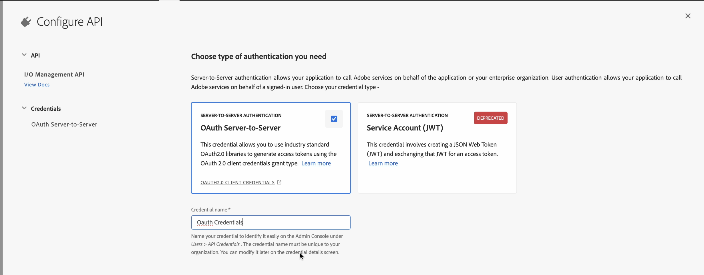
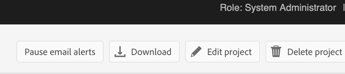
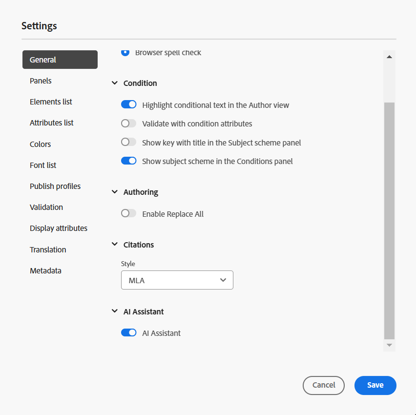

# AI アシスタントの設定

管理者は、Experience Manager GuidesのAI アシスタント機能を設定できます。 AI アシスタントは、Adobe IMS認証ベースの認証によって保護されています。 セキュアなトークンベースの認証ワークフローを使用して、Adobe Adobeと自社の環境を統合し、AI アシスタント機能を利用できるようになります。 次の設定により、**AI設定** タブをフォルダープロファイルに追加できます。 追加したら、Experience Manager GuidesのAI アシスタント機能を使用できます。

AI アシスタントを設定するには、次の手順を実行します。

1. [Adobe Developer Console](#create-ims-configurations-in-adobe-developer-console)でIMS設定を作成します。
2. [環境へのIMS設定の追加](#add-ims-configuration-to-the-environment)
3. [環境でAI フラグを有効にする](#enable-ai-flag-in-the-environment)
4. [環境にGUIDES_AI_SITE_ID変数を追加します](#add-the-guides_ai_site_id-variable-in-the-environment)
5. [環境への変更の適用](#apply-changes-to-the-environment)
6. [フォルダープロファイルでAI アシスタントを有効にする](#enable-ai-assistant-in-folder-profile)
7. [フォルダープロファイルでのスマート提案の設定](./conf-folder-level.md#configure-ai-assistant-for-smart-help-and-authoring)

## Adobe Developer ConsoleでのIMS設定の作成

Adobe Developer ConsoleでIMS設定を作成するには、次の手順を実行します。

>[!NOTE]
>
>既にOAuth プロジェクトを作成してマイクロサービスベースの公開を設定している場合は、次の手順をスキップしてプロジェクトを作成できます。

1. [Adobe Developer Console](https://developer.adobe.com/console)を起動します。
1. Developer Consoleに正常にログインすると、**Home**&#x200B;画面が表示されます。 **ホーム**&#x200B;画面では、プロジェクトやダウンロードへのトップナビゲーションリンクなど、情報やクイックリンクを簡単に見つけることができます。
1. 新しい空のプロジェクトを作成するには、**クイックスタート** リンクから「**新しいプロジェクトを作成**」を選択します。
    {width="550" align="left"}
   *新しいプロジェクトを作成します。*

1. **プロジェクト**&#x200B;画面から「**API**&#x200B;を追加」を選択します。  「**API**&#x200B;を追加」画面が表示されます。 この画面には、アプリケーションの開発に使用できるAdobe製品およびテクノロジに使用できるすべてのAPI、イベント、サービスが表示されます。

1. **I/O Management API**&#x200B;を選択して、プロジェクトに追加します。
   
   *I/O Management APIをプロジェクトに追加します。*

1. 新しい&#x200B;**OAuth資格情報**&#x200B;を作成して保存します。

   configure APIOAuth資格情報タイル

   *APIにOAuth資格情報を設定します。*

1. 「**プロジェクト**」タブで、「**OAuth サーバーからサーバー**」オプションを選択し、新しく作成した資格情報を選択します。

1. 「**OAuth サーバー間**」リンクを選択して、プロジェクトの資格情報の詳細を表示します。

    {width="800" align="left"}

   *プロジェクトに接続して、資格情報の詳細を表示します。*

1. **プロジェクト** タブに戻り、左側の&#x200B;**プロジェクト概要**&#x200B;を選択します。

   

   *新しいプロジェクトを開始します。*

1. 上部の「**ダウンロード**」ボタンを選択して、サービス JSONをダウンロードします。

   

   *JSON サービスの詳細をダウンロードします。*

OAuth認証の詳細を設定し、JSON サービスの詳細をダウンロードしました。 次のセクションで必要となるので、このファイルを便利に使用できます。

## 環境へのIMS設定の追加

環境にIMS設定を追加するには、次の手順を実行します。

1. Experience Managerを開き、設定する環境を含むプログラムを選択します。
1. 「**環境**」タブに切り替えます。
1. 設定する環境名を選択します。 これにより、**環境情報** ページに移動します。
1. 「**設定**」タブに切り替えます。
1. JSON サービスの詳細（前のセクションでダウンロードした）を、**に対応する**&#x200B;値`SERVICE_ACCOUNT_DETAILS` フィールドに貼り付けます。 次のスクリーンショットに示すように、同じ名前と設定を使用してください。

   {width="800" align="left"}

## 環境でAI フラグを有効にする

Experience Manager Guides UIでAI アシスタント機能を有効にするには、環境に`ENABLE_GUIDES_AI` フラグを追加します。

次のスクリーンショットに示すように、同じ名前と設定を使用していることを確認します。

{width="800" align="left"}

フラグを&#x200B;**true**&#x200B;に設定すると機能が有効になり、フラグを&#x200B;**false**&#x200B;に設定すると機能が無効になります。

## 環境にGUIDES_AI_SITE_ID変数を追加します

環境（Cloud Manager）に`GUIDES_AI_SITE_ID`変数を追加し、値を`id_f651abc807c84f52b425737bb93f87ba`に設定して有効にします。

次のスクリーンショットに示すように、同じ名前と設定を使用していることを確認します。

{width="800" align="left"}

## 環境への変更の適用

IMS設定を追加し、AI アシスタントフラグを有効にしたら、次の手順を実行して、これらのプロパティをOSGiを使用してAEM Guidesにリンクします。

1. Cloud ManagerのGit プロジェクトコードで、次の2つのファイルを追加します（ファイルの内容については、[付録](#appendix)を参照）。

   * `com.adobe.aem.guides.eventing.ImsConfiguratorService.cfg.json`
   * `com.adobe.guides.ai.config.service.AiConfigImpl.cfg.json`
1. 新しく追加されたファイルが`filter.xml`でカバーされていることを確認します。
1. Gitの変更をコミットしてプッシュします。
1. パイプラインを実行して、環境に変更を適用します。

## フォルダープロファイルでAI アシスタントを有効にする

設定の変更が適用されたら、目的のフォルダープロファイルのAI アシスタント機能を有効にします。

詳細については、[&#x200B; エディター機能について](../user-guide/web-editor-features.md)を参照してください。

{width="300" align="left"}

## フォルダープロファイルでのスマート提案の設定

AI アシスタント機能を有効にした後、フォルダープロファイルでスマート提案の機能を設定します。

詳しくは、[&#x200B; フォルダープロファイルでのスマート提案の設定](./conf-folder-level.md#configure-ai-assistant-for-smart-help-and-authoring)を参照してください。


## 付録 {#appendix}

**ファイル**:
`com.adobe.aem.guides.eventing.ImsConfiguratorService.cfg.json`

**コンテンツ**:

```
{
 "service.account.details": "$[secret:SERVICE_ACCOUNT_DETAILS]"
}
```

**ファイル**: `com.adobe.guides.ai.config.service.AiConfigImpl.cfg.json`

**コンテンツ**:

```
{
  "conref.inline.threshold":0.6,
  "conref.block.threshold":0.7,
  "related.link.threshold":0.5,
  "emerald.url":"https://adobeioruntime.net/apis/543112-smartsuggest/emerald/v1",
  "instance.type":"prod",
  "chat.url":"https://aem-guides-ai-v2.adobe.io"
  }
```

## AI アシスタント設定の詳細

| キー | 説明 | 許可される値 | デフォルト値 |
|---|---|---|---|
| conref.inline.threshold | ユーザーが現在入力しているタグに対して取得された提案の精度/呼び出しを制御するしきい値。 | -1.0から1.0までの任意の値。 | 0.6 |
| conref.block.threshold | ファイル全体でタグに対して取得された提案の精度/呼び出しを制御するしきい値。 | -1.0から1.0までの任意の値。 | 0.7 |
| emerald.url | スマート提案ベクターデータベースのエンドポイント | [https://adobeioruntime.net/apis/543112-smartsuggest/emerald/v1](https://adobeioruntime.net/apis/543112-smartsuggest/emerald/v1) | [https://adobeioruntime.net/apis/543112-smartsuggest/emerald/v1](https://adobeioruntime.net/apis/543112-smartsuggest/emerald/v1) |
| chat.url | AI アシスタントサービスのエンドポイント | [https://aem-guides-ai-v2.adobe.io](https://aem-guides-ai-v2.adobe.io) | [https://aem-guides-ai-v2.adobe.io](https://aem-guides-ai-v2.adobe.io) |
| instance.type | AEM インスタンスのタイプ。 スマート提案が設定されているAEM インスタンスごとに一意であることを確認します。 ユースケースとしては、「instance.type」 = 「stage」を使用してステージ環境で機能をテストすると同時に、「prod」でも機能が設定されます。 | 環境を識別する一意のキー。 *英数字*&#x200B;個の値のみ使用できます。 &quot;dev&quot;/&quot;stage&quot;/&quot;prod&quot;/&quot;test1&quot;/&quot;stage2&quot; | 「prod」 |

設定が完了すると、Experience Manager GuidesのホームページとエディターにAI アシスタントアイコンが表示されます。 詳しくは、Experience Manager ユーザーガイドの[AI アシスタント &#x200B;](../user-guide/ai-assistant.md) セクションを参照してください。
