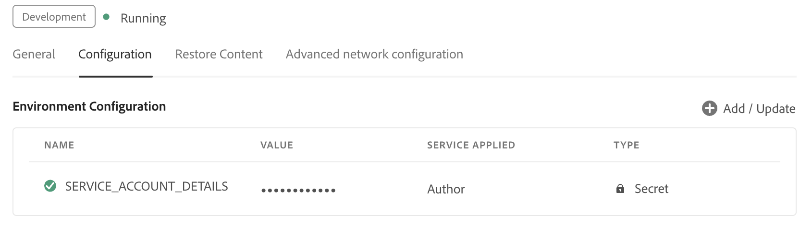

# オーサリング用に AI を活用してスマートな候補を設定

管理者は、作成者向けにスマート提案機能を設定できます。 スマート提案サービスは、Adobe IMS認証ベースの認証で保護されています。 お使いの環境をAdobeのセキュアトークンベースの認証ワークフローと統合し、新しいスマート提案機能の使用を開始します。 以下の設定は、 **AI 設定** tab キーを押すとフォルダープロファイルに移動します。 追加したら、web エディターでスマート提案機能を使用できます。

## Adobe Developer コンソールでの IMS 設定の作成

Adobe Developer コンソールで IMS 設定を作成するには、次の手順を実行します。

>[!NOTE]
>
>マイクロサービスベースの公開を設定する OAuth プロジェクトを既に作成している場合は、次の手順をスキップしてプロジェクトを作成できます。

1. ローンチ [Adobe Developer コンソール](https://developer.adobe.com/console).
1. Developer Console に正常にログインしたら、 **ホーム** 画面。 この **ホーム** 画面では、情報や、プロジェクトおよびダウンロードへのトップナビゲーションリンクなどのクイックリンクを簡単に見つけることができます。
1. 新しい空のプロジェクトを作成するには、を選択します。  **新規プロジェクトを作成** から  **クイックスタート** リンク。
    {width="550" align="left"}
   *新しいプロジェクトを作成します。*

1. を選択  **API を追加**  から  **プロジェクト** 画面。  この **API を追加** 画面が表示されます。 この画面には、アプリケーションの開発に使用できるAdobe製品およびテクノロジに対して使用可能なすべての API、イベント、およびサービスが表示されます。

1. 「」を選択します **I/O Management API** をクリックして、プロジェクトに追加します。
   
   *I/O Management API をプロジェクトに追加します。*

1. 新しいを作成 **OAuth 認証情報** 保存します。
    {width="3000" align="left"}
   *API に OAuth 認証情報を設定します。*

1. が含まれる  **プロジェクト** タブ、を選択 **OAuth サーバーからサーバーへ** をオプションとして選択し、新しく作成した資格情報を選択します。

1. 「」を選択します **OAuth サーバー間** リンクして、プロジェクトの資格情報の詳細を表示します。

    {width="800" align="left"}

   *プロジェクトに接続して、資格情報の詳細を表示します。*

1. に戻る **プロジェクト** tab キーを押して選択 **プロジェクトの概要** 左側。

   

   *新しいプロジェクトの基本を学びます。*

1. 「」をクリックします **Download** 上部のボタンをクリックして、サービス JSON をダウンロードします。

   

   *JSON サービスの詳細をダウンロードします。*

OAuth 認証の詳細を設定し、JSON サービスの詳細をダウンロードしました。 次の節で必要になるので、このファイルは手元に置いておいてください。

### 環境への IMS 設定の追加

次の手順を実行して、環境に IMS 設定を追加します。

1. Experience Managerを開き、設定する環境が含まれているプログラムを選択します。
1. に切り替え **環境** タブ。
1. 設定する環境名を選択します。 これで、 **環境情報** ページ。
1. に切り替え **設定** タブ。
1. SERVICE_ACCOUNT_DETAILS JSON フィールドを更新します。 次のスクリーンショットで示したのと同じ名前と設定を使用していることを確認してください。

{width="800" align="left"}


*環境設定の詳細を追加します。*


IMS 設定を環境に追加したら、次の手順を実行して、OSGi を使用してこれらのプロパティをAEM Guides にリンクします。

1. Cloud Manager Git プロジェクトコードで、以下の 2 つのファイルを指定して追加します（ファイルの内容については、 [付録](#appendix)）に設定します。

   * `com.adobe.aem.guides.eventing.ImsConfiguratorService.cfg.json`
   * `com.adobe.fmdita.smartsuggest.service.SmartSuggestConfigurationConsumer.cfg.json`
1. 新しく追加したファイルがによってカバーされていることを確認します。 `filter.xml`.
1. Git の変更をコミットし、プッシュします。
1. パイプラインを実行して変更を環境に適用します。

この操作が完了すると、スマート提案機能を使用できるようになります。


## 付録 {#appendix}

**ファイル**:
`com.adobe.aem.guides.eventing.ImsConfiguratorService.cfg.json`

**コンテンツ**:

```
{
 "service.account.details": "$[secret:SERVICE_ACCOUNT_DETAILS]",
}
```

**ファイル**: `com.adobe.fmdita.smartsuggest.service.SmartSuggestConfigurationConsumer.cfg.json`

**コンテンツ**:

```
{
  "smart.suggestion.flag":true,
  "conref.inline.threshold":0.6,
  "conref.block.threshold":0.7,
  "emerald.url":"https://adobeioruntime.net/apis/543112-smartsuggest/emerald/v1",
  "instance.type":"prod"
}
```

## スマート候補の設定の詳細

| キー | 説明 | 使用できる値 | デフォルト値 |
|---|---|---|---|
| smart.suggestion.flag | スマート候補を有効にするかどうかを制御します | true/false | false |
| conref.inline.threshold | ユーザーが現在入力しているタグに対して取得した候補の精度/呼び出しを制御するしきい値。 | -1.0 から 1.0 までの任意の値。 | 0.6 |
| conref.block.threshold | ファイル全体でタグに対して取得された候補の精度/呼び出しを制御するしきい値。 | -1.0 から 1.0 までの任意の値。 | 0.7 |
| emerald.url | エメラルドベクターデータベースのエンドポイント | [https://adobeioruntime.net/apis/543112-smartsuggest/emerald/v1](https://adobeioruntime.net/apis/543112-smartsuggest/emerald/v1) | [https://adobeioruntime.net/apis/543112-smartsuggest/emerald/v1](https://adobeioruntime.net/apis/543112-smartsuggest/emerald/v1) |
| instance.type | AEMインスタンスのタイプ。 スマート候補が設定されているAEM インスタンスごとに一意であることを確認してください。 ユースケースは、「instance.type」=「stage」を使用してステージング環境で機能をテストすると同時に、「prod」でも機能を設定することです。 | 環境を識別する一意のキー。 のみ *英数字* 値を使用できます。 &quot;dev&quot;/&quot;stage&quot;/&quot;prod&quot;/&quot;test1&quot;/&quot;stage2&quot; | 「prod」 |

設定すると、スマート候補アイコンが web エディターの右側のパネルに表示されます。 トピックを編集する際に、スマート候補のリストを表示できます。 詳しくは、次を参照してください [オーサリングのための AI ベースのスマートな提案](../user-guide/authoring-ai-based-smart-suggestions.md) の節（Experience Managerユーザーガイド）を参照してください。
