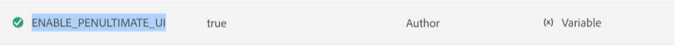

# 設定の上書き {#id216IFC003XA}

設定を更新する場合は、次の汎用アプローチを使用する必要があります。

1. Cloud ManagerのGit リポジトリにアクセスします。

1. 次の場所に新しいJSON ファイルを作成します。

   src/main/content/jcr\_root/apps/fmditaCustom/config/

1. 次の形式でファイルに名前を付けます。

   $\{PID\}.cfg.json

   ここでは、PIDは設定のプロセス IDです。

1. 次の形式を使用して、JSON ファイルにプロパティを追加します。

   ```
   {
      "aem.adminuname": "updatedUserjson",
      "valid.characters": "[-a-zA-Z0-9_@$]",
      "dita.serialization": true
   }
   ```

1. 変更を確定し、Cloud Manager パイプラインを実行して、更新された設定をデプロイします。

## Experience Manager Guides UIの設定

Adobe Experience Manager Guides 2025.02.0 リリースでは、UIが刷新され、機能が強化され、これまで以上に迅速かつ効率的に作業できるようになりました。 これには、まったく新しいホームページ、よりクリーンで整理されたエディターツールバー、専用のマップコンソール、および強化された機能が含まれます。

スムーズな移行を実現し、中断を最小限に抑えるために、Experience Manager Guidesには、必要に応じて古いUIに切り替えることができる設定オプションが用意されています（逆も同様です）。

>[!IMPORTANT]
>
> 新しいUIと古いUIを切り替えるこの設定オプションは、2025.4.0 リリースまでサポートされていました。 2025.6.0 リリースでは、この設定は廃止され、古いUIに戻すために使用できなくなります。

Experience Manager Guides UIを設定するには、次の手順を実行します。

1. Adobe Experience Managerを開き、設定する環境を含むプログラムを選択します。
2. 「**環境**」タブに切り替えます。
3. 設定する環境名を選択します。 これにより、**環境情報** ページに移動します。
4. 「**設定**」タブに切り替えます。
5. 「**追加/更新**」を選択します。
6. UI設定の詳細を追加します。 次のスクリーンショットに示すように、同じ名前と設定を使用していることを確認します。

   {width="800" align="left"}

   値を&#x200B;**true**&#x200B;に設定すると、古いUIが保持され、**false**&#x200B;は新しいUIをアクティブにします。


**親トピック：**&#x200B;[&#x200B; ダウンロードしてインストール &#x200B;](download-install.md)
