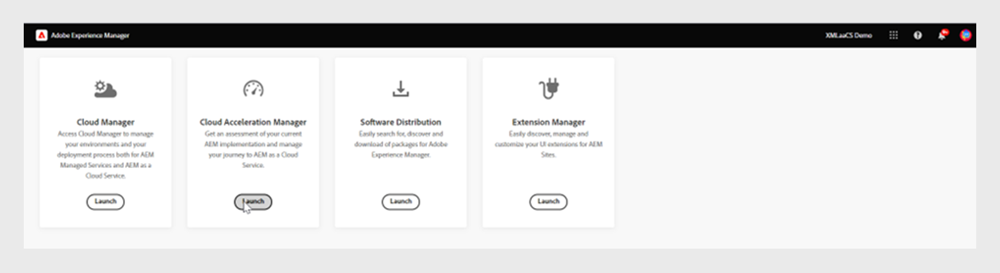
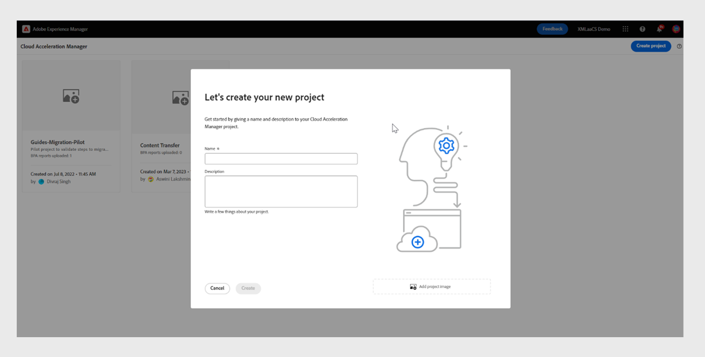
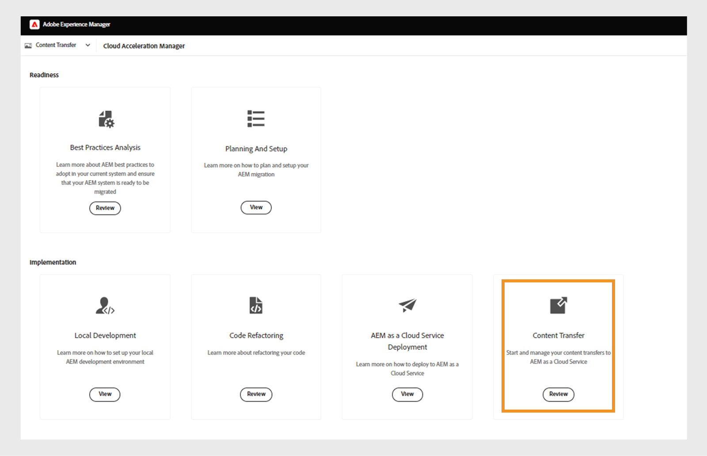
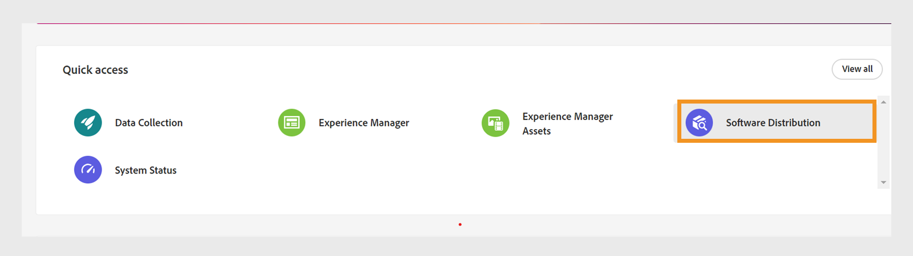
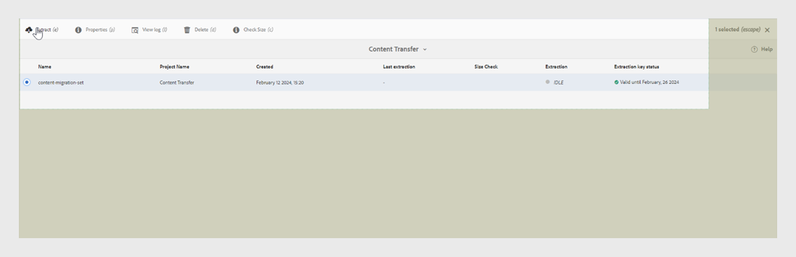
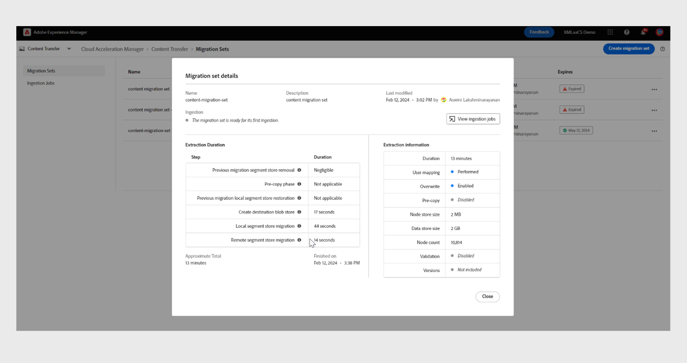
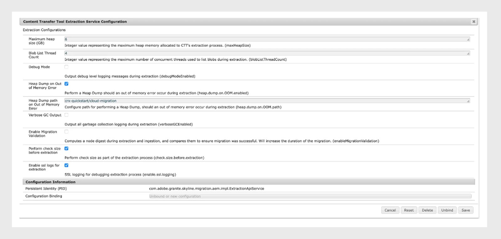

# オンプレミスからCloud Serviceへのコンテンツの移行

Experience Manager as a Cloud Serviceは、Experience Manager Guides、Assets、Forms、Screens向けに、拡張性、安全性、俊敏性の高いテクノロジー基盤を提供します。 これにより、マーケターやIT担当者は、インパクトのあるエクスペリエンスを大規模に提供することに注力できます。
Experience Manager as a Cloud Service を使用すると、チームは製品アップグレード計画ではなく技術革新に専念できます。新機能は徹底的にテストされ、チームに中断されることなく提供されるので、チームは常に最新バージョンのAdobe Experience Managerにアクセスできます。

この記事では、オンプレミスまたはManaged Services Experience Manager GuidesのコンテンツをCloud Servicesに移行するための詳細な手順を説明し、クラウドベースのプラットフォームへのスムーズな移行を実現します。

## 前提条件

* Adobe Experience Manager 6.4以降のバージョン
* Experience Manager GuidesはUUID バージョンである必要があります。 UUID以外のバージョンのAdobe Experience Manager Guidesを使用している場合は、まず[DITA以外のコンテンツの移行](../install-guide/migrate-uuid-non-uuid.md)の手順を使用してUUIDに移行します。
* コンテンツを移行するクラウドインスタンスの&#x200B;**Cloud Acceleration Manager**&#x200B;へのアクセス
* 最大20 TBのリポジトリサイズがサポートされています
* Lucene インデックスの合計サイズ 25 GB
* ノード名の長さは150 バイト未満である必要があります

## 移行プロセス

**コンテンツ転送ツール**&#x200B;は、Adobeによって開発されたツールで、ソース Adobe Experience Manager オンプレミスまたはManaged Services インスタンスからターゲット Experience Manager Cloud Service インスタンスへの既存のコンテンツの移行を開始するために使用できます。
プリンシパル（ユーザーやグループ）も自動的に転送されます。

**コンテンツ転送ツール**&#x200B;をZIP ファイルとして&#x200B;**ソフトウェア配布** ポータルからダウンロードできます。

1. **ソフトウェア配布** ポータルの「**AEM as a Cloud Service**」タブを選択します。
1. **コンテンツ転送ツール**&#x200B;を検索します。
1. リストから&#x200B;**コンテンツ転送ツール**&#x200B;を選択してダウンロードします。

次に、**Package Manager**&#x200B;を介してパッケージをソース Adobe Experience Manager インスタンスにインストールします。 必ず最新バージョンをダウンロードしてください。
最新バージョンについて詳しくは、[&#x200B; リリースノート &#x200B;](https://experienceleague.adobe.com/docs/experience-manager-cloud-service/content/release-notes/release-notes/release-notes-current.html?lang=en)を参照してください。

>[!NOTE]
> 
> バージョン 2.0.0以降のみがサポートされており、最新バージョンを使用することをお勧めします。

Experience Manager Guides コンテンツをExperience Manager as a Cloud Serviceに移行するには、次の手順を実行します。

1. [experience.adobe.com](https://experience.adobe.com/)にログインし、**Experience Manager**&#x200B;を選択します。

   

1. **Cloud Acceleration Manager** タイルの&#x200B;**Launch**&#x200B;をクリックします。
   

1. 最初のプロジェクトを作成します。
   

1. 名前と説明を追加し、**作成**&#x200B;をクリックします。 プロジェクトが作成されます。
1. 作成したプロジェクトを選択し、プロジェクト画面を開きます。
1. 「**コンテンツ転送**」タイルの「**レビュー**」をクリックします。

   

1. **移行セットの作成**&#x200B;をクリックします。

1. 移行セットの名前と説明を入力します。

   

1. 作成後、3つのドットを選択し、**抽出キーをコピー**&#x200B;を選択します。

1. 「**クリップボードにコピー**」をクリックします。 最初のプロジェクトを作成します。
   

1. 上部の&#x200B;**Adobe Experience Manager**&#x200B;を選択し、**ソフトウェア配布** タイルを選択します。
   

1. **Software Distribution** ポータルで、「**Adobe Experience Manager as the Cloud Service**」タブを選択し、「content transfer tool」を検索して、content transfer tool パッケージをダウンロードします。

   >[!NOTE]
   >
   >  必ず最新バージョンをダウンロードしてください。

1. オンプレミスインスタンスの`content-transfer.all-3.0.10.zip` パッケージマネージャー&#x200B;**にパッケージ**&#x200B;をアップロードしてインストールします。
   

1. オンプレミスインスタンスで、**ツール** > **操作** > **コンテンツ移行** > **コンテンツ転送**&#x200B;を選択します。

1. **コンテンツ転送**&#x200B;を選択し、移行セットを作成して、Cloud Acceleration Managerからコピーした抽出キーを貼り付けます。 これにより、ソースとターゲット間の接続が確立されます。 次に、キーを検証し、値を入力した後に有効性を示します。

1. 「**バージョンを含める**」オプションを有効にして、ファイルバージョンを含めます。
   

1. 移行するパスを指定し、**保存**&#x200B;をクリックします。
例：`/content/sites`
または
   `/content/dam/tech-docs`
   

   >[!NOTE]
   >
   > **Experience Manager Guides** コンテンツでは、次のパスを必須で移行する必要があります。

   * `/content/dam`
   * `/var/dxml`

   移行セットの作成中は、次のパスが制限されます。
   * `/apps`
   * `/libs`
   * `/home`
   * `/etc` CTTで`/etc`個のパスを選択できます。

1. 「**保存**」をクリックします。
1. **移行セット**&#x200B;を選択し、上部の&#x200B;**抽出**&#x200B;を選択します。
   

1. 選択したパスと設定の&#x200B;**移行セット抽出** ポップアップで詳細を確認し、**抽出**&#x200B;をクリックします。 抽出には数分かかり、ステータスが更新済みとして表示されます。
   

1. 抽出が完了し、ステータス `finished`が表示されたら、Cloud Acceleration Managerに移動し、手順18で作成したプロジェクトを選択します。
詳細については、3つのドットを選択し、**詳細を表示**&#x200B;を選択してください。

1. 移行セットの詳細ポップアップで、移行セットの設定を確認し、ポップアップを閉じます。 次のスクリーンショットに示すように、パスおよびその他の設定を表示できます。
   

1. **取り込みジョブ** > **新しい取り込み**&#x200B;をクリックします。
1. 必要なチェックマーク値を確認し、**作成**&#x200B;をクリックします。
   

1. 移行セットを選択し、環境に必要なサーバーを選択して、**Ingest**&#x200B;をクリックします。

   

## パブリッシュインスタンスでのコンテンツ転送ツールの実行

ソース公開インスタンスにコンテンツ転送ツールをインストールして、コンテンツをターゲット公開インスタンスに移動します。
コンテンツ転送ツールは、公開環境にコンテンツを取り込む際に、公開コンテンツと非公開コンテンツを区別しません。 移行セットで指定されたコンテンツは、選択したターゲットインスタンスに取り込まれます。 ユーザーは、移行セットをオーサーインスタンス、パブリッシュインスタンス、またはその両方に取り込むことができます。

### 推奨アプローチ

次のような推奨事項を検討します。

* 作成者インスタンスで使用されていた&#x200B;**コンテンツ転送ツール**&#x200B;と同じバージョンを使用します。
* パブリッシュへの取り込み中に、パブリッシュ層は（オーサーとは異なり）スケールダウンされません。
* 1つのパブリッシュノードのみを移行します。 抽出を開始する前に、それをロードバランサーから削除します。

>[!NOTE]
>
> 予防策として、次のようなユーザーが開始するアクションを含め、パブリッシュインスタンスで書き込み操作が行われないことを確認します。
> * AEM as a Cloud Service 環境のオーサーからパブリッシュへのコンテンツ配布
> * パブリッシュインスタンス間のユーザー同期

## トラブルシューティング

次のエラーが原因で抽出が失敗した場合は、関連するCA証明書を読み込むことで解決できます。

`javax.net.ssl.SSLHandshakeException: sun.security.validator.ValidatorException: PKIX path building failed: sun.security.provider.certpath.SunCertPathBuilderException: unable to find valid certification path to requested target`

**理由**: Adobe Experience Manager サーバーにファイアウォールの制限があるため、次のエンドポイントを許可リストに追加してください。

`casstorageprod.blob.core.windows.net`

*SSL ログを有効にします。*
