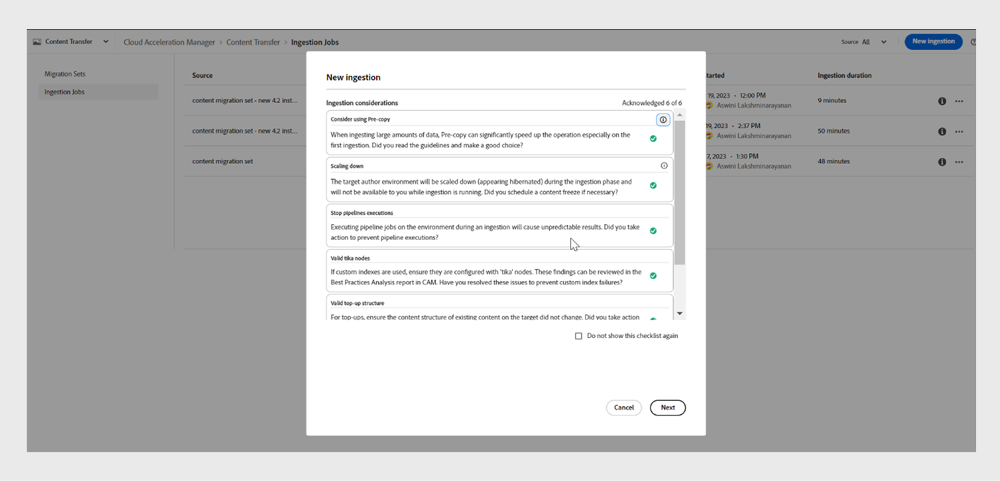

# オンプレミスからCloud Serviceへのコンテンツの移行

Experience Managerのas a Cloud Service性は、Experience Manager Assets、Forms、Screensに対して、拡張性、安全性、機敏性の高いテクノロジー基盤を提供します。 これにより、マーケターや IT 担当者は、インパクトのあるエクスペリエンスの大規模な提供に専念できます。
Experience Manager as a Cloud Service を使用すると、チームは製品アップグレード計画ではなく技術革新に専念できます。新しい製品機能は徹底的にテストされ、中断することなくチームに提供されるので、チームは常に最新バージョンのAdobe Experience Managerにアクセスできます。
この記事では、オンプレミスプラットフォームまたはManaged Services Experience Manager GuidesのコンテンツをCloud Serviceに移行し、クラウドベースのプラットフォームにスムーズに移行するための詳細な手順を説明します。

## 移行プロセス

**コンテンツ転送ツール** は、Adobeが開発したツールで、ソース Adobe Experience Manager オンプレミスまたはManaged Services インスタンスからターゲットExperience Manager Cloud Serviceインスタンスへの既存のコンテンツの移行を開始する際に使用できます。
プリンシパル（ユーザーやグループ）も自動的に転送されます。

**コンテンツ転送ツール** は、**ソフトウェア配布** ポータルから ZIP ファイルとしてダウンロードできます。

1. **ソフトウェア配布** ポータルの「**AEM as a Cloud Service**」タブを選択します。
1. **コンテンツ転送ツール** を検索します。
1. リストから **コンテンツ転送ツール** を選択してダウンロードします。

**パッケージマネージャー** を使用して、このパッケージをソース Adobe Experience Manager インスタンスにインストールします。 必ず最新バージョンをダウンロードしてください。
最新バージョンについて詳しくは、[ リリースノート ](https://experienceleague.adobe.com/docs/experience-manager-cloud-service/content/release-notes/release-notes/release-notes-current.html?lang=en) を参照してください。

>[!NOTE]
> 
> サポートされているのはバージョン 2.0.0 以降のみで、最新バージョンを使用することをお勧めします。

### 前提条件

* Adobe Experience Manager 6.4 以降のバージョン
* 最大 20 TB のリポジトリサイズがサポートされます
* 25 GB の Lucene インデックスの合計サイズ
* ノード名の長さは 150 バイト未満にする必要があります

Experience Manager GuidesのコンテンツをExperience Manager as a cloud service に移行するには、次の手順を実行します。

1. [experience.adobe.com](https://experience.adobe.com/) にログインし、「**Experience Manager**」を選択します。

   

1. **2}Cloud Acceleration Manager** タイルの「{ ローンチ **」をクリックします。**
   

1. 最初のプロジェクトを作成します。
   

1. 名前と説明を追加し、「**作成**」をクリックします。 プロジェクトが作成されました。
1. 作成したプロジェクトを選択し、プロジェクト画面を開きます。
1. **コンテンツ転送** タイルの **レビュー** をクリックします。

   

1. **移行セットを作成** をクリックします。

1. 移行セットの名前と説明を入力します。

   

1. 作成後、3 つのドットを選択し、「**抽出キーをコピー**」を選択します。

1. **クリップボードにコピー** をクリックします。 最初のプロジェクトを作成します。
   

1. 上部の **0}Adobe Experience Manager} を選択し、「ソフトウェア配布**」タイルを選択し **す。**
   

1. **ソフトウェア配布** ポータルで、「**Cloud ServiceとしてAdobe Experience Manager**」タブを選択し、「コンテンツ転送ツール」を検索して、コンテンツ転送ツールパッケージをダウンロードします。

   >[!NOTE]
   >
   >  必ず最新バージョンをダウンロードしてください。

1. オンプレミスインスタンスの **パッケージマネージャー** にパッケージ `content-transfer.all-3.0.10.zip` をアップロードしてインストールします。
   

1. オンプレミスインスタンスで、**ツール**/**運用**/**コンテンツ移行**/**コンテンツ転送** を選択します。

1. **コンテンツ転送** を選択し、移行セットを作成して、Cloud Acceleration Manager からコピーした抽出キーを貼り付けます。 これにより、ソースとターゲットの間の接続が確立されます。 次に、キーを検証し、値を入力した後に有効性を示します。

1. ファイルのバージョンを含めるには、「**バージョンを含める**」オプションを有効にします。
   

1. 移行するパスを指定し、「**保存**」をクリックします。
例：`/content/we-retail`
または
   `/content/dam/wknd-events`
   

   >[!NOTE]
   >
   > **Experience Manager Guides** のコンテンツには、次のパスを強制的に移行する必要があります。

   * `/content/dam`
   * `/var/dxml`

   移行セットの作成時には、次のパスは制限されます。
   * `/apps`
   * `/libs`
   * `/home`
   * `/etc` CTT で一部の `/etc` パスを選択できます。

1. 「**保存**」をクリックします。
1. **移行セット** を選択し、上部の **抽出** を選択します。
   

1. 選択したパスと設定の **移行セットの抽出** ポップアップで詳細を確認し、「**抽出**」をクリックします。 抽出には数分かかり、ステータスが更新済みとして表示されます。
   

1. 抽出が完了し、ステータス `finished` に示されたら、Cloud Acceleration Managerに移動し、手順 18 で作成したプロジェクトを選択します。
詳細については、3 つのドットを選択し、「**詳細を表示**」を選択してください。

1. 移行セットの詳細ポップアップで、移行セットの設定を確認し、ポップアップを閉じます。 次のスクリーンショットに示すように、パスおよびその他の設定を確認できます。
   

1. **取り込みジョブ**/**新しい取り込み** をクリックします。
1. 必要なチェックマーク値を確認し、「**作成**」をクリックします。
   

1. 移行セットを選択し、環境で必要なサーバーを選択して、「**取り込み**」をクリックします。

   

## Publish インスタンスでのコンテンツ転送ツールの実行

コンテンツ転送ツールをソース Publish インスタンスにインストールして、コンテンツをターゲット Publish インスタンスに移動します。
コンテンツ転送ツールでは、コンテンツをPublish環境に取り込む際に、公開済みコンテンツと非公開コンテンツを区別しません。 移行セットで指定されたコンテンツは、選択したターゲットインスタンスに取り込まれます。 ユーザーは、オーサーインスタンス、Publish インスタンス、またはその両方に移行セットを取り込むことができます。

### 推奨アプローチ

次の推奨事項を考慮してください。

* オーサーインスタンスで使用したバージョンと同じバージョンの **コンテンツ転送ツール** を使用します。
* Publishへの取り込み時に、Publish層は（オーサー層とは異なり）スケールダウンされません。
* 1 つのPublish ノードのみを移行します。 抽出を開始する前に、ロードバランサーから削除します。

>[!NOTE]
>
> 予防措置として、次のようなユーザーが開始したアクションを含め、Publish インスタンスで書き込み操作が行われないようにしてください。
> * AEM as a Cloud Service 環境のオーサーからパブリッシュへのコンテンツ配布
> * Publish インスタンス間のユーザー同期

## トラブルシューティング

次のエラーが原因で抽出が失敗した場合は、関連する CA 証明書を読み込むことで、この問題を解決できます。

`javax.net.ssl.SSLHandshakeException: sun.security.validator.ValidatorException: PKIX path building failed: sun.security.provider.certpath.SunCertPathBuilderException: unable to find valid certification path to requested target`

**原因**:Adobe Experience Manager 許可リストにはファイアウォール制限があるので、サーバーに次のエンドポイントを追加します。

`casstorageprod.blob.core.windows.net`

*SSL ログを有効にする*

