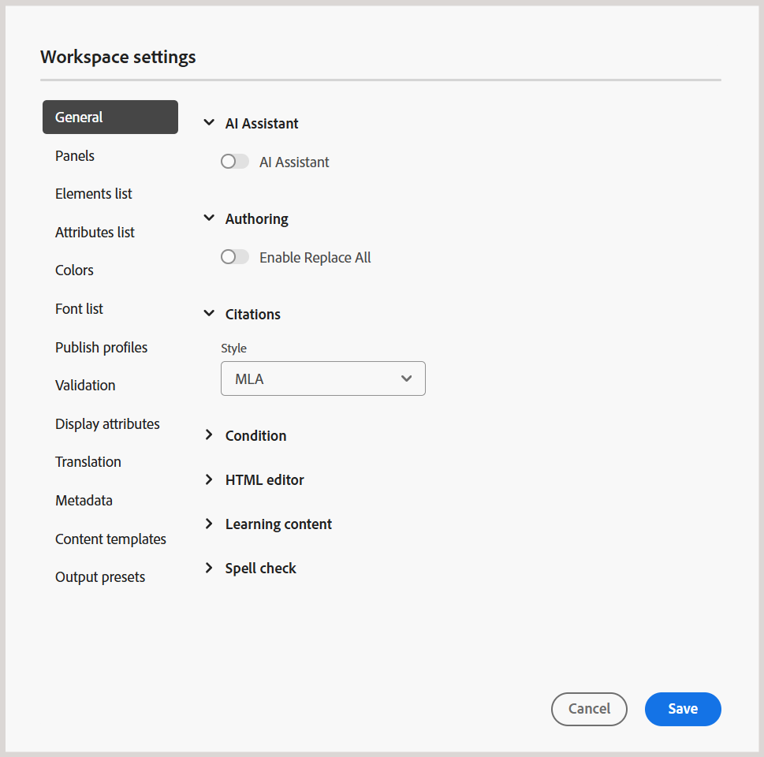
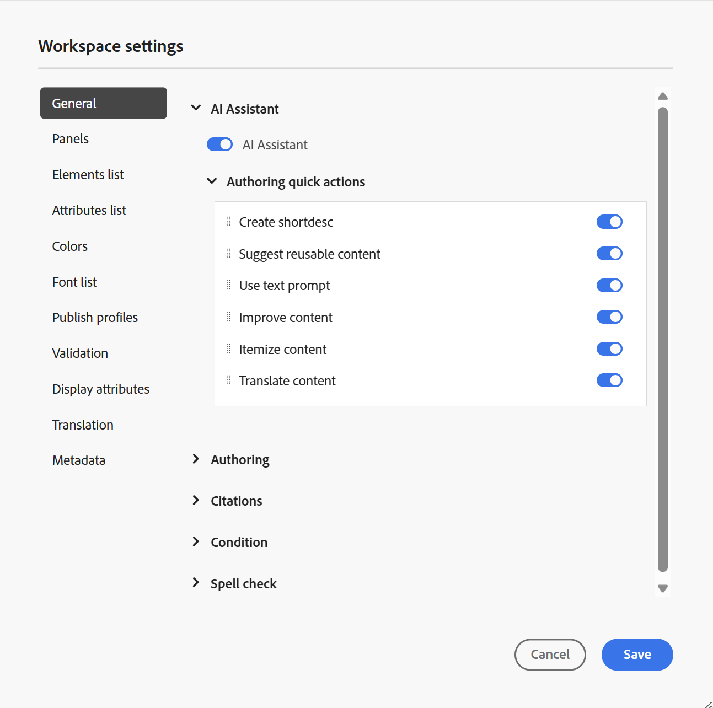
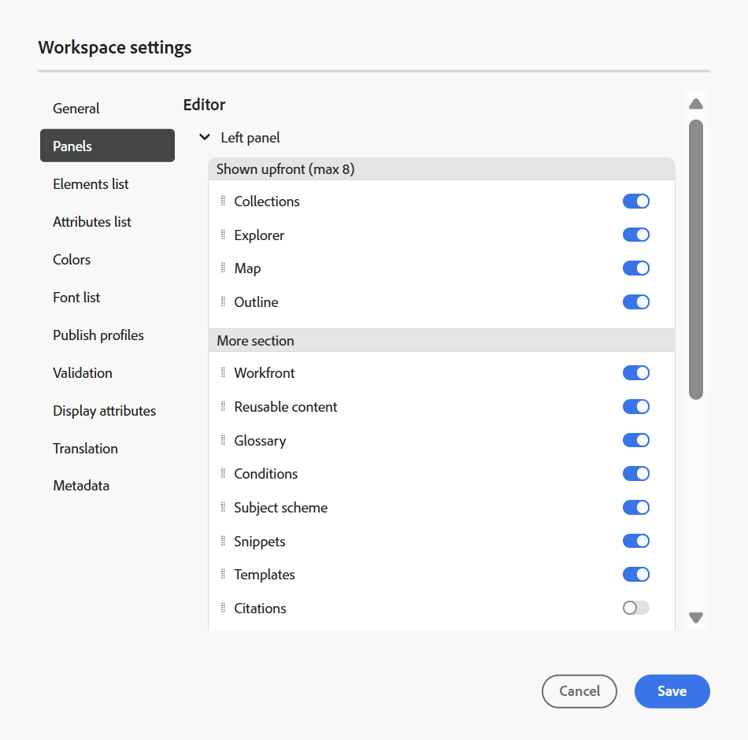
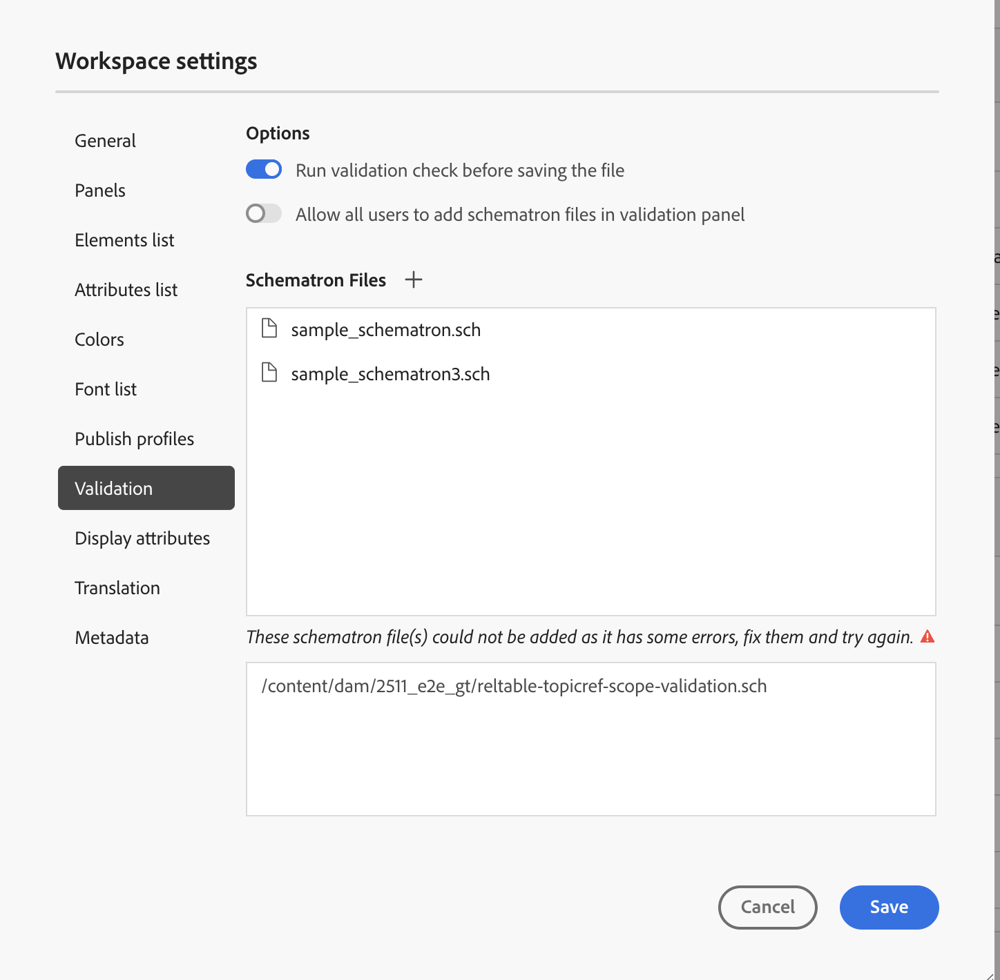

# Workspaceの設定

エディターの[ タブバー](../user-guide/web-editor-tab-bar.md)にある&#x200B;**Workspace settings** オプションは、管理者およびフォルダープロファイル管理者のみが使用でき、次の設定を行うことができます。

- [一般](#general)
- [パネル](#panels)
- [要素リスト](#elements-list)
- [属性リスト](#attributes-list)
- [カラー](#colors)
- [プロファイルの公開](#publish-profiles)
- [検証](#validation)
- [表示属性](#display-attributes)
- [翻訳](#translation)
- [メタデータ](#metadata)

>[!NOTE]
>
> - オンプレミス設定でAdobe Experience Manager Guidesを使用している場合、Workspace設定オプションは、その他のアクション メニューの下に&#x200B;**Settings**&#x200B;として引き続き表示されます。
> - デフォルト設定を更新する場合は、変更を有効にするためにドキュメントを再度開く必要があります。

## 一般

一般設定では、エディターを使用する設定を設定できます。 このタブには、7つのセクションが含まれています：**AI アシスタント**、**オーサリング**、**引用**、**条件**、**HTML エディター**、**学習コンテンツ**、および&#x200B;**スペルチェック**。

{width="350"}

- **AI アシスタント**
これを選択して、Experience Manager Guidesの[AI アシスタント ](../user-guide/ai-assistant.md)機能を有効にします。 この機能を無効にするには、選択を解除します。

  **AI アシスタント**&#x200B;切り替えスイッチを有効にした後、次に示すように、**オーサリングクイックアクション** メニューを使用して、作成者の&#x200B;**オーサリングタブ**&#x200B;に表示されるオプションを設定できます。\
  これらの変更は、作業中の特定のフォルダープロファイルに適用されます。 新しいフォルダープロファイルを作成すると、デフォルトで&#x200B;**Global** フォルダープロファイルで定義されているWorkspace設定が継承されます。 これらの設定は、**Workspace設定**&#x200B;を使用して必要に応じて変更し、更新された設定を保存できます。\
  AI アシスタントを使用したオーサリングで利用できるオプションの詳細な概要については、[AI アシスタントを使用してドキュメントをスマートに作成する](../user-guide/ai-assistant-right-panel.md)を参照してください。

  **オーサリングクイックアクション** メニューから、次の操作を実行できます。

   - 切り替えスイッチを使用して、作成者がAI アシスタントを操作する際にアクセスできる特定のオプションを有効または無効にします。

   - オプションが表示される順序を変更し、必要に応じてドラッグ&amp;ドロップします。

  {width="350"}

- **オーサリング**

   - **すべてを置換を有効にする**：これを選択すると、**検索と置換** パネルに&#x200B;**すべてを置換** アイコンが表示されます。

- **引用**

  引用のスタイルを変更します。 プロジェクトで使用するドロップダウンから引用スタイルを選択します。 詳細については、[引用スタイルの変更](../user-guide/web-editor-apply-citations.md#change-citation-style)を参照してください。

- **条件**

   - **作成者ビューでコンディショナルテキストを強調表示**：作成者ビューでコンディショナルテキストを強調表示するには、これを選択します。 条件コンテンツは、条件に定義された色を使用してハイライト表示されます。

   - **条件属性で検証**：属性に対して定義された値の検証を許可するには、これを選択します。 これにより、誤った値を追加しないようにします。

   - **件名パネルでタイトル付きのキーを表示**：これを選択すると、件名スキームのタイトルと共にキーが表示されます。 このオプションを選択しない場合は、タイトルのみが表示されます。 例えば、ここではキー「os」、「audience」、「other」もタイトルと共に表示されます。

     {width="550"}

   - **条件パネルで件名スキームを表示**：条件パネルで件名スキームを表示するには、これを選択します。 これを選択解除すると、定義された条件が条件パネルに表示されます。

- **スペルチェック**
選択肢は2つあります。**AEM スペルチェック**&#x200B;と&#x200B;**ブラウザーのスペルチェック**。 デフォルトでは、エディターはブラウザーのスペルチェック機能を使用します。スペルチェックは、ブラウザーの組み込み辞書を使用して実行されます。 AEM スペルチェックに切り替えて、Adobe Experience Managerの辞書を使用できます。また、カスタム単語リストを追加するようにカスタマイズすることもできます。 AEM ディクショナリのカスタマイズについて詳しくは、「AEM as a Cloud Serviceのインストールと設定」の「[Adobe Experience Manager Guidesのデフォルトディクショナリをカスタマイズ ](../cs-install-guide/customize-aem-custom-dictionary.md)」セクションを参照してください。

- **学習コンテンツ**：この設定を使用すると、Experience Manager Guides インスタンスの製品トレーニングおよび学習コンテンツ機能を有効または無効にできます。 フォルダープロファイルレベルで機能を有効または無効にするには、**学習コンテンツを有効にする** トグルを使用します。 デフォルトでは、この機能はすべてのインスタンスで無効のままです。

  [製品トレーニングと学習コンテンツ ](../learning-content/intro.md)機能について詳しく説明します。

  次の機能/オプションは、学習コンテンツ設定が有効になっている場合にのみ使用できます。

   - **コースのオーサリング**: エディターとホームページの両方からコースを作成および管理するオプションを有効にします。
   - **SCORM テンプレート**: エディターの&#x200B;*出力テンプレート*&#x200B;の下にSCORM テンプレートを作成するオプションを有効にします。
   - **コンテンツテンプレートと出力プリセット**: Workspace設定ダイアログのコンテンツテンプレートと出力プリセット設定オプションを有効にします。

学習コンテンツが無効になっている場合、上記のオプションはすべてExperience Manager Guides インターフェイスで使用できなくなります。

詳しくは、[ フォルダープロファイルの設定](../lc-config-guide/lc-folder-profile.md)を参照してください。

- **HTML エディター**：学習コンテンツの場合、この設定を使用すると、HTML ベースのオーサリング用にエディターを設定できます。 この設定に含まれる主な設定オプションは次のとおりです。

   - **インラインスタイル設定を非表示**：作成者がコースコンテンツにインラインフォーマットを適用できないようにするには、このオプションを有効にします。 このオプションを有効にすると、エディターの右側のパネルにあるフォント、境界線、レイアウト、背景、列などのインラインスタイル設定オプションが作成者に対して非表示のままになります。 ただし、作成者は、**スタイル** パネルで使用できるグローバルクラスベースのスタイルオプションを引き続き使用できます。 これにより、組織のスタイルガイドラインとの一貫性を維持できます。
   - **作成者のSource ビューを非表示**:HTML ソースコードへのアクセスを制限するには、このオプションを有効にします。 これは、編集エクスペリエンスを簡素化したり、基礎となるコードを誤って変更しないようにしたりする場合に便利です。

  詳しくは、[学習コンテンツの作成とカスタマイズ ](../learning-content/lc-overview.md)を参照してください。

## パネル

この設定は、エディターとマップコンソールの左右のパネルに表示されるパネルを制御します。 ボタンを切り替えて、目的のパネルを表示または非表示にすることができます。

{width="650"}

パネルに表示されるフィーチャの表示順序を定義することもできます。 パネルで使用可能な機能のデフォルトの順序を変更するには、点線の棒を選択して、機能タブを目的の場所にドラッグ&amp;ドロップします。 機能は、**More** セクションからパネルのメインセクションに移動したり、その逆も必要に応じて移動したりできます。 並べ替えると、機能は左右のパネルに同じ順序で表示されます。

{width="650"}

一度に最大8つのパネルを表示できます。 パネル設定に加えられた変更は、すぐに適用されます。

>[!NOTE]
>
> カスタムパネルが設定されている場合、パネルのリストにも表示されます。 カスタムパネルの表示と非表示を切り替えることができます。

## 要素リスト

管理者は、作成者がファイルに挿入できる要素のリストを制御し、要素の表示名を定義することもできます。 エレメントのリスト設定では、DITAの仕様に従ってエレメントの名前を指定し、DITAで定義されたエレメント名の代わりに使用するラベルを指定できます。

{width="650"}

上のスクリーンショットでは、`p`要素に段落のラベルが付けられ、`codeblock`には他の要素と共にコードブロックのラベルが付けられています。**上記のエレメントのみを使用** オプションを選択すると、このリストの有効なエレメント \（現在の挿入ポイント\）のみが&#x200B;**エレメントを挿入** ダイアログボックスに表示されます。

次のスクリーンショットでは、前のスクリーンショットで設定した4つの要素のうち、現在のコンテキストに表示されているのは3つだけです。

{width="300"}

## 属性リスト

エレメント リストと同様に、エレメントの属性リストに表示される属性とその表示名のリストを制御できます。 次のスクリーンショットでは、要素の属性リストに表示するように設定されている属性は3つだけです。

{width="650"}

この設定では、要素に属性を追加しようとすると、リストに設定された属性のリストのみが表示されます。

{width="300"}

## カラー

**条件**&#x200B;の事前設定済みの背景色のリストを表示します。 ユーザーは、トピックに条件を適用する際に背景色を選択できます。 管理者は、リストにカスタム背景色を作成して追加することもできます。 新しいカラーを追加するには、**カラー名** フィールドに目的の名前を入力し、カスタムカラーを選択して、**+** アイコンを選択します。 カスタムカラーは、カラーリストの最後に表示されます。

## プロファイルの公開

これには、**ナレッジベース**&#x200B;出力の公開に使用できるプロファイルが含まれます。 ターゲット ナレッジベース用の新しいプロファイルを作成できます。 例えば、SalesforceやServiceNowなどです。

**Salesforce プロファイルの作成**

**前提条件**

- Salesforce用に接続アプリを作成します。 詳しくは、[API統合のOAuth設定を有効にする](https://help.salesforce.com/s/articleView?id=sf.connected_app_create_api_integration.htm&type=5)を参照してください。

- 接続されたアプリを設定する際は、次のことを確認します。

   - コールバックを指定します。

     `URL: http://<server name>:<port>/bin/dxml/thirdparty/callback/salesforce`

   - 次のOAuth スコープを選択します。
      - フルアクセス （フル）
      - 「APIを介してユーザーデータを管理」（API）を選択します

     アプリが設定されると、Salesforceは&#x200B;**Consumer Key**&#x200B;と&#x200B;**Consumer Secret**&#x200B;を提供します。 これらは、Salesforce プロファイルの作成に使用できます。

   - Salesforce プロファイルを作成するには、**Server type** ドロップダウンから&#x200B;**Salesforce** Knowledge Baseを選択します。 プロファイル名を入力します。 **サイト URL**&#x200B;に、出力の公開に使用するコンシューマーサイトを入力し、Salesforce コンシューマーサイトから提供された&#x200B;**Consumer Key**&#x200B;および&#x200B;**Consumer Secret**&#x200B;を追加します。 次に、**新しく作成したプロファイルを**&#x200B;検証し、**保存**&#x200B;します。

     {width="550"}

     >[!NOTE]
     >
     >AEMでSalesforceのプロキシを設定するには、Experience Manager GuidesでApache HTTP Components Proxy Configurationを使用します。 AEM Link Checker](https://helpx.adobe.com/experience-manager/kb/How-to-configure-proxy-for-the-AEM-Link-Checker-AEM.html)のプロキシを[設定する方法について説明します。

**ServiceNow プロファイルの作成**

**前提条件**

アセットをアップロードするようにServiceNow サーバーを設定します。

- **ServiceNow** サーバーに接続します。
- **システムのプロパティ** > **セキュリティ**&#x200B;に移動します。
- 次のオプションのチェックを外します。

  **このプロパティは、アップロードのMIME タイプのチェックをアクティブ化するように設定する必要があります（すべてのバージョン Eureka以降）。 添付ファイルのMIME タイプ検証を有効（true）または無効（false）にします。 glide.attachment.extensionsで設定されたファイル拡張子は、アップロード時にMIME タイプがチェックされます。**

- 「**保存**」を選択します。

  アプリを設定したら、**ServiceNow** プロファイルを作成します。

- プロファイルを作成するには、**Server type** ドロップダウンからServiceNow Knowledge Baseを選択します。 プロファイル **名前**&#x200B;を入力します。 **ServiceNow URL**&#x200B;に、出力の公開に使用するコンシューマーサイトを入力し、ServiceNow コンシューマーサイトから提供される&#x200B;**ユーザー名**&#x200B;と&#x200B;**パスワード**&#x200B;を追加します。 次に、**新しく作成したプロファイルを**&#x200B;検証し、**保存**&#x200B;します。

  {width="550"}

  検証後、DITA マップの出力プリセットで公開プロファイルを選択し、それを使用して、選択した&#x200B;**Salesforce**&#x200B;または&#x200B;**ServiceNow** サーバーに出力を生成できます。

  [ ナレッジベース ](../user-guide/generate-output-knowledge-base.md)出力プリセットについて詳しく説明します。

## 検証

このタブには、エディターでSchematron検証を設定するオプションが含まれています。 次の機能を有効にできます。

- **ファイルを保存する前に検証チェックを実行する**：選択したSchematron ファイルを使用してSchematron検証を実行するには、保存操作の前に、これを選択します。 「+」アイコンを選択して、Schematron ファイルを追加できます。 選択したSchematron ファイルが一覧表示されます。

  >[!NOTE]
  >
  >- 選択したSchematron ファイルは、選択したフォルダープロファイルに対して保持されます。
  >- 無効なSchematron ファイルが追加されると、次に示すように、エラーメッセージが表示されます。

  {width="550"}

  これにより、選択したSchematron ファイルで定義されたルールを破るファイルをユーザーが保存できなくなります。 これが選択されていない場合、変更を保存する前にファイルが検証されません。

- **すべてのユーザーが検証パネルにスキーマトロンファイルを追加することを許可する**：これを選択すると、ユーザーはエディターの検証パネルにスキーマトロンファイルを追加できます。 これにより、ユーザーはSchematron ファイルを追加し、Schematron ファイルに対してトピックを検証できます。 これを選択しない場合、エディターの&#x200B;**検証パネル**&#x200B;のユーザーは、スキーマトロンファイル **スキーマトロンファイル**&#x200B;を追加するオプションを利用できません。

  {width="550"}

## 表示属性

属性リストと同様に、要素の属性リストに表示する属性のリストを制御できます。 デフォルトでは、4つの&#x200B;**表示属性** — オーディエンス、プラットフォーム、製品、およびpropが、要素の属性リストに表示されるように設定されています。 上部の&#x200B;**追加** アイコンを使用して、表示属性を追加することもできます。 **削除** アイコンを使用して、表示属性のいずれかを削除することもできます。

エレメントに対して定義された属性は、レイアウトおよびアウトライン表示に表示されます。

{width="550"}

## 翻訳

このタブには、言語グループの作成、ソースラベルのターゲットバージョンへの反映、翻訳プロジェクトのクリーンアップを行うためのオプションが含まれています。

{width="550"}

- **言語グループ**：管理者は、言語のグループを作成し、それらをセットとして使用してコンテンツを翻訳できます。

  新しい言語グループを作成するには、次の手順を実行します。

   1. 「**追加**」を選択します。
   1. 言語グループ名を入力します。 各言語には一意の名前を付ける必要があります。 名前フィールドが空の場合、または名前が一意でない場合は、エラーを表示できます。
   1. ドロップダウンから言語を選択します。 複数の言語を選択できます。

      言語の最初の数文字、または言語コードを入力して、目的の言語をフィルタリングします。 例えば、名前またはコードの先頭に「en」が含まれているすべての言語をフィルタリングするには、「en」と入力します。

   1. 「完了」アイコンを選択して、選択した言語をグループに追加します。 言語が表示されます。 3つ以上の言語を追加すると、「**さらに表示**」オプションが表示されます。 **詳細を表示**&#x200B;を選択して、グループに存在するすべての言語を表示できます。

      >[!TIP]
      >
      > **表示の切り替え**&#x200B;から&#x200B;**表示の切り替え**&#x200B;の切り替え。一部の言語のみを表示します。

   1. グループ内の言語にカーソルを合わせてを編集するか、言語グループをします。
   1. **設定**&#x200B;を保存します。

      >[!NOTE]
      >
      >ユーザーは、フォルダープロファイルに設定された言語グループを表示できます。

- **ソースバージョンラベルをターゲットバージョンに反映**：このオプションを選択すると、ソースファイルバージョンのラベルが翻訳ファイルに渡されます。 デフォルトでは、これは無効になっています。
- **完了後の翻訳プロジェクトのクリーンアップ**：翻訳後に翻訳プロジェクトを自動的に無効または削除するように設定するには、このオプションを選択します。 デフォルトでは、**なし**&#x200B;が選択されているため、翻訳後にプロジェクトが存在します。

  翻訳プロジェクトを後で使用する場合は、翻訳プロジェクトを無効にできます。 プロジェクトを削除すると、プロジェクトに存在するすべてのファイルとフォルダーが完全に削除されます。

## メタデータ

**バージョン履歴** ダイアログボックスに表示されるトピックとその値のバージョンのメタデータを制御できます。  メタデータパスで、メタデータを選択するノードの場所を指定します。 メタデータのカスタム名をラベルとして定義することもできます。 デフォルトのプロパティは、タイトル、ドキュメント状態、タグです。

メタデータは、アセットの`/jcr:content` ノードの下にある任意のプロパティから選択できるため、プロパティのパスをメタデータパスとして追加できます。

メタデータパスが空白の場合は、エラーが表示されます。 ラベルを空白のままにすると、最後の要素がラベルとして選択されます。

ワークスペース設定の「{width="550"}

*バージョン履歴&#x200B;**ダイアログボックスのメタデータを設定します。***

これらのメタデータタグを表示する順序を定義することもできます。これらのタグのデフォルトの順序を変更するには、点線バーを選択して、タグを目的の場所にドラッグ&amp;ドロップします。
メタデータラベルは、エディターの**バージョン履歴** ダイアログボックスに同じ順序で表示されます。
