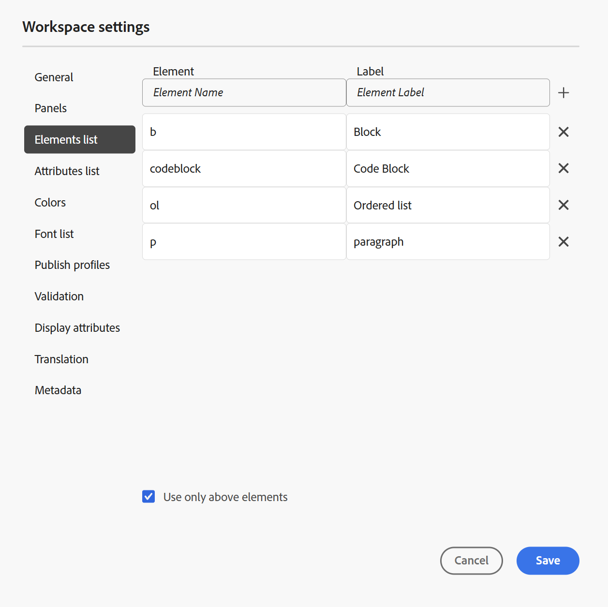

# Workspace設定

エディターの **タブバー** にある [Workspace設定 &#x200B;](../user-guide/web-editor-tab-bar.md) オプションは、管理者およびフォルダープロファイル管理者のみが使用でき、次の設定を行うことができます。

- [一般](#general)
- [パネル](#panels)
- [要素リスト](#elements-list)
- [属性リスト](#attributes-list)
- [カラー](#colors)
- [プロファイルの公開](#publish-profiles)
- [検証](#validation)
- [属性を表示](#display-attributes)
- [翻訳](#translation)
- [メタデータ](#metadata)

>[!NOTE]
>
> - オンプレミス設定でAdobe Experience Manager Guidesを使用している場合、「Workspace設定」オプションは「その他のアクション」メニューの下に **設定** として引き続き表示されます。
> - デフォルトの設定を更新する場合は、変更を有効にするためにドキュメントを再度開く必要があります。

## 一般

一般設定では、エディターを使用するための設定を指定できます。 このタブには、[**AI アシスタント**]、[**オーサリング**]、[**引用文献**]、[**条件**]、&lbrack;**スペル チェック** の 5 つのセクションがあります。

{width="350" align="left"}

- **AI アシスタント**
これを選択して、Experience Manager Guidesで [AI アシスタント &#x200B;](../user-guide/ai-assistant.md) 機能を有効にします。 この機能を無効にするには、選択を解除します。

  **AI アシスタント** 切り替えスイッチを有効にした後、以下に示すように、**クイックアクションのオーサリング** メニューを使用して、作成者に **「オーサリング」タブ** に表示するオプションを設定できます。\
  これらの変更は、使用している特定のフォルダープロファイルに適用されます。 新しいフォルダープロファイルを作成すると、デフォルトで **グローバル** フォルダープロファイルで定義されたWorkspace設定が継承されます。 必要に応じて、**Workspace設定を使用してこれらの設定を変更し** 更新された設定を保存できます。\
  AI アシスタントを使用したオーサリングで利用可能なオプションの詳細な概要については、[AI アシスタントでスマートにドキュメントを作成する &#x200B;](../user-guide/ai-assistant-right-panel.md) を参照してください。

  **クイックアクションのオーサリング** メニューから、次の操作を実行できます。

   - 切り替えを使用して、AI アシスタントで作業する際に作成者がアクセスできる特定のオプションを有効または無効にします。

   - オプションの表示順序を変更し、必要に応じてドラッグ&amp;ドロップします。

  {width="350" align="left"}

- **オーサリング**

   - **すべてを置換を有効にする**：このオプションを選択して、**検索と置換** パネルに **すべてを置換** アイコンを表示します。

- **引用**

  引用のスタイルを変更します。 プロジェクトで使用する引用スタイルをドロップダウンから選択します。 詳細については、[&#x200B; 引用スタイルの変更 &#x200B;](../user-guide/web-editor-apply-citations.md#change-citation-style) を参照してください。

- **条件**

   - **オーサービューで条件付きテキストをハイライト表示**：オーサービューで条件付きテキストをハイライト表示するには、これを選択します。 条件付きコンテンツは、条件用に定義されたカラーを使用してハイライト表示されます。

   - **条件属性を使用して検証**：属性に定義された値の検証を許可する場合に選択します。 これにより、誤った値を追加するのを防ぐことができます。

   - **件名スキーム パネルにタイトルと共にキーを表示**：件名スキームのタイトルと共にキーを表示するには、これを選択します。 このオプションを選択しない場合は、タイトルのみが表示されます。 例えば、ここでは「os」、「audience」、「other」のキーもタイトルと共に表示されます。

     {width="550" align="left"}

   - **条件パネルに件名スキームを表示**：条件パネルに件名スキームを表示するには、これを選択します。 選択を解除すると、定義された条件が条件パネルに表示されます。

- **スペルチェック**
**AEMのスペルチェック** と **ブラウザーのスペルチェック** の 2 つのオプションがあります。 デフォルトでは、エディターはブラウザーのスペルチェック機能を使用し、スペルチェックはブラウザーの組み込み辞書を使用して実行されます。 AEMのスペルチェック機能に切り替えて、Adobe Experience Managerの辞書を使用することができます。また、この辞書をカスタマイズして、カスタムの単語リストを追加することもできます。 Adobe Experience Manager Guides辞書のカスタマイズについて詳しくは、AEM as a Cloud Serviceのインストールと設定の [AEMのデフォルト辞書のカスタマイズ &#x200B;](../cs-install-guide/customize-aem-custom-dictionary.md) 節を参照してください。

## パネル

この設定は、エディターコンソールとマップコンソールの左右のパネルに表示されるパネルを制御します。 ボタンを切り替えて、目的のパネルの表示と非表示を切り替えることができます。

{width="650" align="left"}

また、パネル内に存在するフィーチャの表示順序を定義することもできます。 パネル内の使用可能なフィーチャの既定の順序を変更するには、点線のバーを選択して、フィーチャ タブを目的の位置にドラッグ アンド ドロップします。 機能は、要件に応じて、**その他** セクションからパネルのメインセクションに、またはその逆に移動することもできます。 並べ替え後、各左右のパネルで同じ順序で機能が表示されます。

{width="650" align="left"}

一度に最大 8 つのパネルを表示できます。 パネル設定に加えられた変更は、すぐに適用されます。

>[!NOTE]
>
> カスタムパネルが設定されている場合は、パネルのリストにも表示されます。 スイッチを切り替えて、カスタムパネルの表示と非表示を切り替えることができます。

## 要素リスト

管理者は、作成者がファイルに挿入できる要素のリストを制御したり、要素の表示名を定義したりできます。 「エレメント」 リスト設定では、DITA 仕様に従ってエレメントの名前を指定し、DITA 定義のエレメント名の代わりに使用するラベルを指定できます。

{width="650" align="left"}

上のスクリーンショットでは、`p` 要素には Paragraph というラベルが付けられ、`codeblock` には他の要素と共に Code Block というラベルが付けられています。 「**上の要素のみを使用**」オプションを選択すると、このリストの有効な要素\（現在の挿入ポイント\）のみが **要素を挿入** ダイアログボックスに表示されます。

次のスクリーンショットでは、以前のスクリーンショットで設定された 4 つの要素のうち、現在のコンテキストで 3 つの要素のみが表示されます。

{width="300" align="left"}

## 属性リスト

要素リストと同様に、要素の属性リストに表示する属性とその表示名のリストを制御できます。 次のスクリーンショットでは、要素の属性リストに表示されるように設定されている属性は 3 つだけです。

{width="650" align="left"}

この設定では、要素に属性を追加しようとすると、リストで設定された属性のリストのみが表示されます。

{width="300" align="left"}

## カラー

**条件** の事前設定済みの背景色のリストを表示します。 ユーザーは、条件をトピックに適用する際に背景色を選択できます。 また、管理者は、カスタムの背景色を作成してリストに追加することもできます。 新しいカラーを追加するには、「**カラー名**」フィールドに目的の名前を入力し、カスタムのカラーを選択して、「**+**」アイコンを選択します。 カスタムカラーは、カラーリストの最後に表示されます。

## プロファイルの公開

これには、**ナレッジベース** 出力の公開に使用できるプロファイルが含まれています。 ターゲットのナレッジベース用に新しいプロファイルを作成できます。 例えば、Salesforceや ServiceNow などです。

**Salesforce プロファイルの作成**

**前提条件**

- Salesforce用に接続アプリケーションを作成します。 詳しくは、[API 統合のための OAuth 設定の有効化 &#x200B;](https://help.salesforce.com/s/articleView?id=sf.connected_app_create_api_integration.htm&type=5) を参照してください。

- 接続アプリケーションを設定する際は、次の点を確認します。

   - コールバックを指定します。

     `URL: http://<server name>:<port>/bin/dxml/thirdparty/callback/salesforce`

   - 次の OAuth 範囲を選択します。
      - フルアクセス （フル）
      - 「API を使用してユーザーデータを管理」を選択します（api）

     アプリを設定すると、Salesforceは **Consumer Key** と **Consumer Secret** を提供します。 これらを使用して、Salesforce プロファイルを作成できます。

   - Salesforce プロファイルを作成するには、「{ サーバータイプ **」ドロップダウンから** 0}Salesforce **ナレッジベースを選択します。**&#x200B;プロファイル名を入力します。 **サイト URL** に、出力の公開に使用するコンシューマーサイトを入力し、Salesforce コンシューマーサイトから提供される **コンシューマーキー** と **コンシューマーシークレット** を追加します。 次に、新しく作成したプロファイルを **検証** および **保存** します。

     {width="550" align="left"}

     >[!NOTE]
     >
     >AEMでSalesforceのプロキシを設定するには、Experience Manager Guidesで Apache HTTP Components Proxy Configuration を使用します。 方法について説明します [AEM リンクチェッカーのプロキシを設定する &#x200B;](https://helpx.adobe.com/experience-manager/kb/How-to-configure-proxy-for-the-AEM-Link-Checker-AEM.html)。

**ServiceNow プロファイルの作成**

**前提条件**

アセットをアップロードするように ServiceNow サーバーを設定します。

- **ServiceNow** サーバーに接続します。
- **システムプロパティ**/**セキュリティ** に移動します。
- 次のオプションのチェックを外します。

  **このプロパティは、アップロード（すべてのバージョンの Eureka 以降）の MIME タイプチェックを有効にするように設定する必要があります。 添付ファイルの MIME タイプ検証を有効（true）または無効（false）にします。 glide.attachment.extensions で設定されたファイル拡張子は、アップロード中に MIME タイプがチェックされます。**

- 「**保存**」を選択します。

  アプリを設定したら、**ServiceNow** プロファイルを作成します。

- プロファイルを作成するには、「**サーバータイプ**」ドロップダウンから ServiceNow ナレッジベースを選択します。 プロファイル **名前** を入力します。 **ServiceNow URL** に、出力の公開に使用するコンシューマーサイトを入力し、ServiceNow コンシューマーサイトから提供される **ユーザー名** と **パスワード** を追加します。 次に、新しく作成したプロファイルを **検証** および **保存** します。

  {width="550" align="left"}

  検証後、DITA Map の出力プリセットで公開プロファイルを選択し、それを使用して、選択した **Salesforce** または **ServiceNow** サーバーへの出力を生成できます。

  [&#x200B; ナレッジベース &#x200B;](../user-guide/generate-output-knowledge-base.md) 出力プリセットの詳細情報。

## 検証

このタブには、エディターでスキーマトロン検証を設定するためのオプションが含まれています。 次の機能を有効にできます。

- **ファイルを保存する前に検証チェックを実行**：保存操作の前に、選択したスキーマトロンファイルを使用してスキーマトロン検証を実行する場合は、これを選択します。 「+」アイコンを選択して、スキーマトロンファイルを追加できます。 選択したスキーマトロンファイルが一覧表示されます。

  >[!NOTE]
  >
  >- 選択したスキーマトロンファイルは、選択したフォルダープロファイルに対して保持されます。
  >- 無効な Schematron ファイルが追加されると、次のようなエラーメッセージが表示されます。

  {width="550" align="left"}

  これにより、ユーザーは、選択されたスキーマトロンファイルで定義されたルールを破るファイルを保存できなくなります。 これを選択しない場合、ファイルは変更を保存する前に検証されません。

- **検証パネルですべてのユーザーがスキーマトロンファイルを追加できるようにする**：エディターの検証パネルでユーザーが任意のスキーマトロンファイルを追加できるようにするには、これを選択します。 これにより、ユーザーは Schematron ファイルを追加し、トピックを Schematron ファイルに対して検証できます。 これが選択されていない場合、スキーマトロンファイルを追加するオプション **スキーマトロンファイルを追加** ボタンは、エディターの **検証パネル** のユーザーには使用できません。

  {width="550" align="left"}

## 属性を表示

属性リストと同様に、要素の属性リストに表示する属性のリストを制御できます。 デフォルトでは、要素の属性リストに表示されるように、オーディエンス、プラットフォーム、製品、prop の 4 つの **表示属性** が設定されています。 上部の「**追加** アイコンを使用して、表示属性を追加することもできます。 「**削除** アイコンを使用して表示属性を削除することもできます。

要素に定義されている属性は、レイアウトビューとアウトラインビューに表示されます。

{width="550" align="left"}

## 翻訳

このタブには、言語グループの作成、ソースラベルのターゲットバージョンへの反映、翻訳プロジェクトのクリーンアップを行うためのオプションが含まれています。

{width="550" align="left"}

- **言語グループ**：管理者は、言語グループを作成し、それらをセットとして使用してコンテンツを翻訳できます。

  新しい言語グループを作成するには、次の手順を実行します。

   1. 「**追加**」を選択します。
   1. 言語グループ名を入力します。 各言語には、一意の名前を付ける必要があります。 名前フィールドが空の場合や、名前が一意でない場合は、エラーを表示できます。
   1. ドロップダウンから言語を選択します。 複数の言語を選択できます。

      言語の最初の数文字または言語コードを入力して、目的の言語をフィルタリングします。 例えば、名前またはコードの先頭に「en」が含まれるすべての言語をフィルタリングする場合は、「en」と入力します。

   1. 完了アイコンを選択して、選択した言語をグループに追加します。 言語が表示されます。 3 つ以上の言語を追加すると、「**さらに表示**」オプションが表示されます。 **さらに表示** を選択すると、グループに存在するすべての言語を表示できます。

      >[!TIP]
      >
      > **詳細を表示** を **表示を減らす** に切り替えて、いくつかの言語のみを表示します。

   1. グループ内の言語にポインタを合わせて、言語グループを編集  または削除  します。
   1. **設定** を保存します。

      >[!NOTE]
      >
      >ユーザーは、フォルダープロファイルに設定されている言語グループを表示できます。

- **ソースバージョンラベルをターゲットバージョンに反映**：ソースファイルバージョンのラベルを翻訳済みファイルに渡すには、このオプションを選択します。 デフォルトでは無効になっています。
- **完了後の翻訳プロジェクトのクリーンアップ**：翻訳後に翻訳プロジェクトが自動的に無効または削除されるように設定する場合は、このオプションを選択します。 デフォルトでは、**なし** が選択されているため、翻訳後もプロジェクトは存在します。

  翻訳プロジェクトは、後で使用する場合に無効にすることができます。 プロジェクトを削除すると、プロジェクト内のすべてのファイルとフォルダが完全に削除されます。

## メタデータ

**バージョン履歴** ダイアログボックスに表示されるトピックのバージョンメタデータとその値を制御できます。  メタデータパスで、メタデータを選択するノードの場所を指定します。 また、メタデータのカスタム名をラベルとして定義することもできます。 デフォルトのプロパティは、タイトル、ドキュメントの状態、タグです。

メタデータは、アセットの `/jcr:content` ノードの下の任意のプロパティから選択できるので、プロパティのパスをメタデータパスとして追加できます。

メタデータパスが空白の場合は、エラーが表示されます。 ラベルを空白のままにすると、最後の要素がラベルとして選択されます。

{width="550" align="left"}

*「バージョン履歴&#x200B;**ダイアログボックスのメタデータ**&#x200B;設定*

また、これらのメタデータタグの表示順序を定義することもできます。 これらのタグのデフォルトの順序を変更するには、点線のバーを選択して、目的の場所にタグをドラッグ&amp;ドロップします。
メタデータラベルは、エディターの **バージョン履歴** ダイアログボックスで同じ順序で表示されます。

