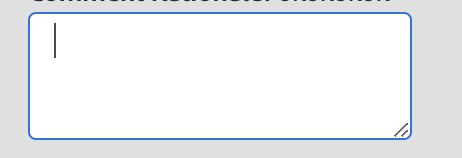

# テキストフィールドとテキスト領域

テキストを入力として取り込むには、コンポーネント、テキストフィールド、テキスト領域を使用します。
JUI のテキスト領域コンポーネントは HTML `<textarea/>` を表します。

```js title="textArea.js"
const textAreaJSON =  {
    "component": "textarea", //tells the component name
    "id": "input_name", // can be used to give a unique identifier to a component
    "data": "@name", // the variable storing the inputted text
    "on-keyup": {
        "name": "submitName",
        "eventArgs": {
            "keys": [
            "ENTER"
            ]
        }
    },
},
```

ここで、コントローラ内のコマンドを呼び出すための構文を `on-keyup` に示します。
Enter キーを押すとイベント `submitName` が呼び出される textArea が生成されます

レンダリングされたテキスト領域は次のようになります。


