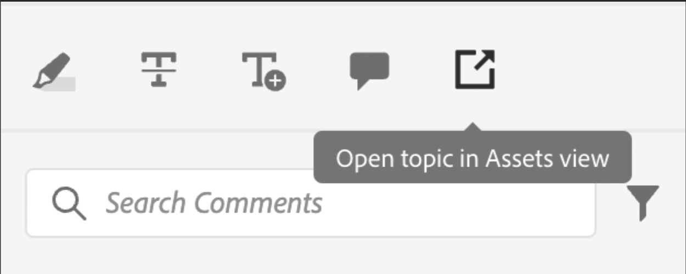

# シンプルなカスタマイズの例

次に、これらのカスタマイズをAEM Guides アプリに統合する方法を説明します。

例えば、このボタンをアプリの既存のビューに追加するとします。
これには、次の 3 つの基本的な事項が必要です。

1. コンポーネントを追加するビュー JSON の `id`。
2. `target` （新しいコンポーネントを追加する JSON 内の場所）。 `target` は、`key` および `value` を使用して定義されます。 キーと値のペアは、コンポーネントの一意の識別に役立つコンポーネントの定義に使用される任意の属性にできます。
インデックスを使用してターゲットを参照することもできます。
`APPEND`、`PREPEND`、`REPLACE` の 3 つの viewStates があります。
3. 新しく作成されたコンポーネントの JSON と対応するメソッド。

レビューで使用する注釈ツールボックスに、AEMでファイルを開くボタンを追加するとします。

```typescript
export default {
  id: 'annotation_toolbox', 
  view: {
    items: [
      {
        component: 'button',
        icon: 'linkOut',
        title: 'Open topic in Assets view',
        'on-click': 'openTopicInAEM',
        target: {
          key: 'value',
          value: 'addcomment',
          viewState: VIEW_STATE.APPEND

        },
      },
    ],
  },
  controller: {
    openTopicInAEM: function (args) {
        const topicIndex = tcx.model.getValue(tcx.model.KEYS.REVIEW_CURR_TOPIC)
        const {allTopics = {}} = tcx.model.getValue(tcx.model.KEYS.REVIEW_DATA) || {}
        tcx.appGet('util').openInAEM(allTopics[topicIndex])
    },
  },
}
```

上記の例では、以下を持っています。

1. コンポーネントの挿入先の JSON の `id`。例：`annotation_toolbox`
2. ターゲットは「`addcomment`」ボタンです。 viewState `append` を使用して、`addcomment` ボタンの後にボタンを追加します。
3. コントローラ内のボタンのオンクリックイベントを定義します。

「annotation_toolbox」 `.src/jsons/review_app/annotation_toolbox.json` ージの JSON

カスタマイズする前は、注釈ツールボックスは次のようになります。


カスタマイズが完了すると、注釈ツールボックスは次のようになります。



## CSS の追加

一貫性を保つため、既にスタイル設定されたコンポーネントを提供します。 挿入された JSON には、固有のスタイルが適用されます
CSS を管理する主な方法は、拡張機能の extraClass キーを使用することです。

```js
{    
    "view":{
        items:[
            {
                compoenent:"button",
                extraClass:"underline bg-red",
            }
        ]
    }
}
```

CSS ファイルを clientlibs に追加することで、CSS クラスを使用してカスタムスタイルを設定できます。 ビルド中に、tailwind のユーティリティクラス用に [Tailwind](https://tailwindcss.com/docs/utility-first) 出力も作成します。 同じの設定が、拡張機能の `tailwind.config.js` の `./tailwind.config.js` にあります
