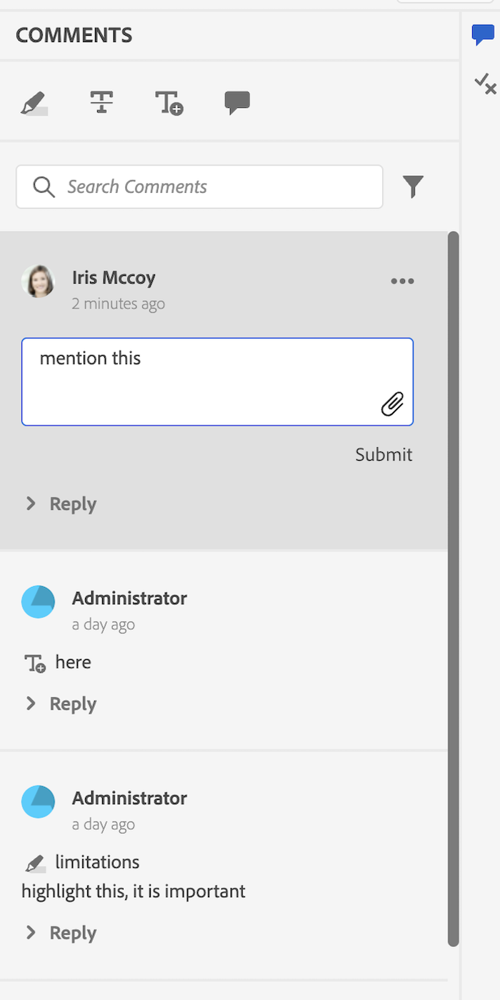

# 例

このパッケージでは、カスタマイズの例も提供しています（`guides_extension/src` で入手できます）。 以下に、それぞれの簡単な説明を示します。

1. [ コンテキストメニュー ](./examples/file_options.ts)
この例では、`file_options` コンテキストメニューをカスタマイズして、`Delete` および `Edit` オプションを削除し、`Duplicate` オプションを `Download` オプションに置き換えました。

2. [ 左パネル ](./examples/left_panel_container.ts)
この例では、「TEST EXTENSION」という名前の別の `left tab panel` を持つように `tab` 拡張機能をカスタマイズし、対応する `tab panel` に `Test Tab Panel` というラベルを付けました。

3. [ 右側のパネル ](./examples/right_panel_container.ts)
この例では、「TEST EXTENSION」という名前の別の `tab` ージと、対応するラベルが `New Tab Panel` の `tab panel` を持つように `right tab panel` をカスタマイズしました。

4. [リポジトリーパネル](./examples/repository_panel.ts)

5. [ ツールバー ](./examples/toolbar.ts)
この例では、`Insert Element`、`Insert Paragraph`、`Insert Numbered List`、`Insert Bulleted List` の各ボタンを、これらすべてを含む 1 つの `More Insert Options` ボタンに置き換えました。

[ アプリの例を確認 ]

1. [ 注釈ツールボックス ](./examples/review_app_examples/annotation_extension.ts)
この例では、AEMで現在のレビュートピックを開く別のボタンを注釈ツールボックスに追加しました。

2. [ レビューのコメント ](./examples/review_app_examples/review_comment.ts)
この例では、ユーザー名をユーザー情報（コメント担当者のフルネームとタイトルに一致）に置き換え、一意のコメント ID、mailTo アイコン、コメントの重要度と根拠を示す入力フィールドを追加しました。
また、ダイアログを開く XMLEditor 側のコメントに「`accept with modification`」ボタンを追加しました。

3. [ コメント返信 ](./examples/review_app_examples/comment_reply.ts)
この例では、ユーザー名をユーザー情報（コメント担当者のフルネームとタイトルで構成）に置き換え、コメントヘッダーに mailTo アイコンを追加しました。

4. [ インラインレビューパネル ](./examples/review_app_examples/inline_review_panel.ts)
このファイルでは、`Review Comment` と `Comment Reply` の例で示されているように、一意のコメント ID を計算して割り当てます。
   - `setCommentId` メソッドは、コメント数に応じて、各コメントに一意のコメント ID を設定します。

   - `setUserInfo` では、userInfo の値を、各コメントのフルネームとタイトルを使用して設定します。

   - `onNewCommentEvent` を使用すると、新しいコメントまたは返信ごとに `setUserInfo` メソッドが呼び出されます。

   - `updatedProcessComments` 関数は、新しいコメントイベントごとに実行され、新しいコメントイベントが取得された場合に `setCommentId` が呼び出されるようにします。

5. [ トピックレビューパネル ](./examples/review_app_examples/topic_reviews.ts)：このファイルは [ インラインレビューパネル ](./examples/review_app_examples/inline_review_panel.ts) を拡張したものなので、追加されたカスタマイズはレビューアプリ側でも機能します。

6. [ 変更を確定ダイアログ ](./examples/review_app_examples/accept_with_modification_dialog.ts)
これは、アプリに新しいウィジェットを追加する例です。 ここでは、`Revised Text` と `Adjudicator Comment Rationale` の 2 つの入力テキストフィールドを持つ新しいダイアログを作成しました。

カスタマイズの前後のレビューパネルは次のとおりです。

