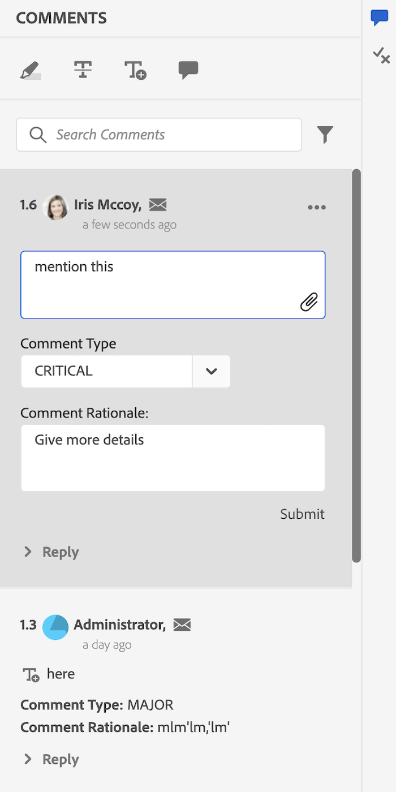

# 例

このパッケージでは、カスタマイズの例も提供しています（`guides_extension/src`で利用可能）。 以下は、それぞれの簡単な説明です。

1. [&#x200B; コンテキストメニュー](./examples/file_options.ts)
この例では、`file_options` コンテキストメニューをカスタマイズして、`Delete`および`Edit` オプションを削除し、`Duplicate` オプションを`Download` オプションに置き換えました。

2. [左パネル](./examples/left_panel_container.ts)
この例では、`left tab panel`をカスタマイズして、「TEST EXTENSION」というタイトルの別の`tab`と、ラベルが`Test Tab Panel`の対応する`tab panel`を作成しました

3. [右パネル](./examples/right_panel_container.ts)
この例では、`right tab panel`をカスタマイズして、「TEST EXTENSION」というタイトルの別の`tab`と、ラベルが`New Tab Panel`の対応する`tab panel`を作成しました

4. [リポジトリパネル](./examples/repository_panel.ts)

5. [&#x200B; ツールバー](./examples/toolbar.ts)
この例では、`Insert Element`、`Insert Paragraph`、`Insert Numbered List`、`Insert Bulleted List`のボタンを、これらすべてを含む1つの`More Insert Options` ボタンに置き換えました。

6. [&#x200B; メタデータパネルの「管理」ボタン](./examples/metadata_report_manage_button.ts)
この例では、選択したファイルが読み取り専用モードになっているときに無効になるように、**管理** ボタン（レポートページのメタデータパネルにある）をカスタマイズしました。 これにより、編集用ではないファイルのメタデータが誤って編集されるのを防ぐことができます。

[ アプリの例を確認]

1. [注釈ツールボックス](./examples/review_app_examples/annotation_extension.ts)
この例では、AEMで現在のレビュートピックを開く注釈ツールボックスに別のボタンを追加しました。

2. [&#x200B; コメントをレビュー](./examples/review_app_examples/review_comment.ts)
この例では、ユーザー名をユーザー情報（コメンターのフルネームとタイトルで構成）に置き換え、一意のコメント ID、mailTo アイコン、コメントの重大度と根拠を言及するための入力フィールドを追加しました。
また、ダイアログを開くXMLEditor側のコメントに`accept with modification` ボタンを追加しました。

3. [&#x200B; コメント返信](./examples/review_app_examples/comment_reply.ts)
この例では、ユーザー名をユーザー情報（コメンターのフルネームとタイトルで構成）に置き換え、コメントヘッダーにmailTo アイコンを追加しました。

4. [&#x200B; インラインレビューパネル](./examples/review_app_examples/inline_review_panel.ts)
このファイルでは、`Review Comment`と`Comment Reply`の例で言及されている一意のコメント IDを計算して割り当てます。
   - `setCommentId` メソッドは、コメント数に応じて、各コメントに一意のコメント IDを設定します。

   - `setUserInfo`は、各コメントにフルネームとタイトルを使用して、userInfoの値を設定します。

   - `onNewCommentEvent`は、新しいコメントまたは返信のたびに`setUserInfo` メソッドが呼び出されることを保証します。

   - `updatedProcessComments`関数は新しいコメントイベントごとに実行され、新しいコメントイベントを取得すると`setCommentId`が呼び出されます。

5. [&#x200B; トピックレビューパネル &#x200B;](./examples/review_app_examples/topic_reviews.ts)：このファイルは[&#x200B; インラインレビューパネル &#x200B;](./examples/review_app_examples/inline_review_panel.ts)を拡張しているため、追加されたカスタマイズはレビューアプリ側でも機能します。

6. [変更ダイアログで同意](./examples/review_app_examples/accept_with_modification_dialog.ts)
これは、アプリに新しいウィジェットを追加する例です。 ここでは、2つの入力テキストフィールド `Revised Text`と`Adjudicator Comment Rationale`を持つ新しいダイアログを作成しました

7. [&#x200B; リビジョンを保存](./examples/save_revision.ts)
これは、既存のダイアログを更新する方法の例です。 「公開」ボタンを追加します。 ダイアログのコンテンツを変更できます。 ここでjsonを参照してください：[`save_revision`](./jsons/dialogs/save_revision.json)

カスタマイズ前とカスタマイズ後のレビューパネルを次に示します。

